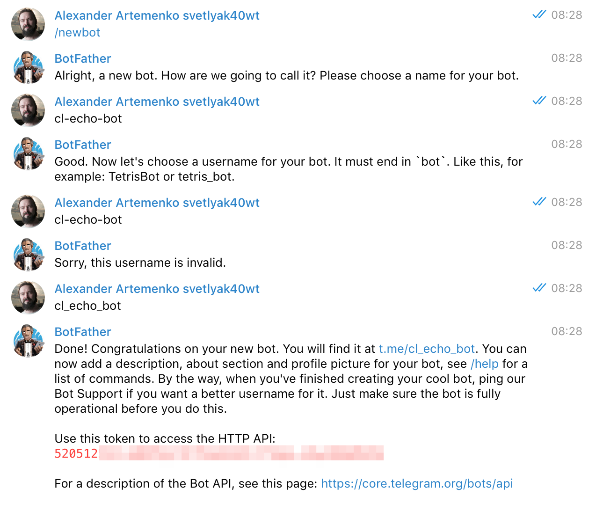
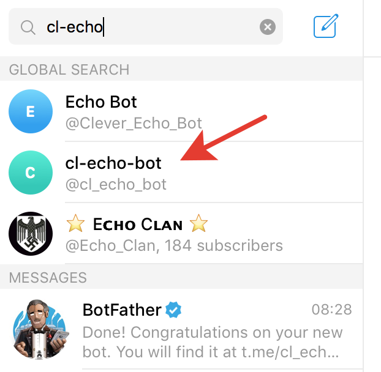
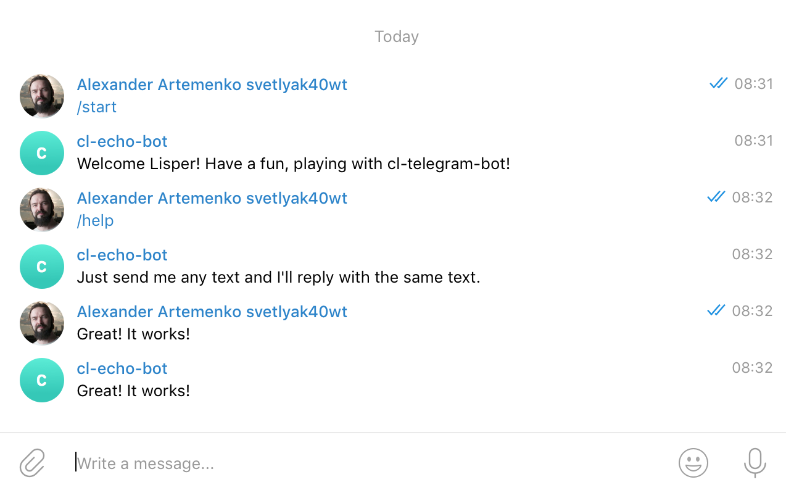

<a id="x-28CL-TELEGRAM-BOT-DOCS-2FINDEX-3A-40README-2040ANTS-DOC-2FLOCATIVES-3ASECTION-29"></a>

# cl-telegram-bot - Telegram Bot API

<a id="cl-telegram-bot-asdf-system-details"></a>

## CL-TELEGRAM-BOT ASDF System Details

* Description: Telegram Bot `API`, based on sovietspaceship's work but mostly rewritten.
* Licence: `MIT`
* Author: Alexander Artemenko <svetlyak.40wt@gmail.com>
* Homepage: [https://40ants.com/cl-telegram-bot/][6949]
* Bug tracker: [https://github.com/40ants/cl-telegram-bot/issues][5798]
* Source control: [GIT][53d1]
* Depends on: [alexandria][8236], [anaphora][c9ae], [arrows][b590], [bordeaux-threads][3dbf], [cl-ppcre][49b9], [cl-strings][2ecb], [closer-mop][61a4], [dexador][8347], [jonathan][6dd8], [kebab][5186], [log4cl][7f8b], [serapeum][c41d], [str][ef7f], [trivial-backtrace][fc0e], [yason][aba2]

[][7bb5]


<a id="x-28CL-TELEGRAM-BOT-DOCS-2FINDEX-3A-3A-40INSTALLATION-2040ANTS-DOC-2FLOCATIVES-3ASECTION-29"></a>

## Installation

You can install this library from Quicklisp, but you want to receive updates quickly, then install it from Ultralisp.org:

```
(ql-dist:install-dist "http://dist.ultralisp.org/"
                      :prompt nil)
(ql:quickload :cl-telegram-bot)
```
<a id="x-28CL-TELEGRAM-BOT-DOCS-2FINDEX-3A-3A-40V2-2040ANTS-DOC-2FLOCATIVES-3ASECTION-29"></a>

## v2

<a id="x-28CL-TELEGRAM-BOT-DOCS-2FSTATES-3A-3A-40STATES-AND-ACTIONS-2040ANTS-DOC-2FLOCATIVES-3ASECTION-29"></a>

### States and Actions

This framework makes it possible to define bot with all allowed state.

The state defines behaviour of the bot, the way it should respond to commands, updates and other events.

<a id="x-28CL-TELEGRAM-BOT-DOCS-2FSTATES-3A-3A-40STATES-2040ANTS-DOC-2FLOCATIVES-3ASECTION-29"></a>

#### States

There can be more than one handler for the event. We call these handlers "Actions".

An action should return a `NIL` or a new state. In latter case, the current bot's state will be changed to the new one and handlers for `on-activation` event will be called.

State is constructed using [`state`][03e8] function, which accepts handlers for different kinds of events. Here is simples state which greets a user when it start the chat and then reply with the same text:

```
(defun reply-with-same-text (update)
  (reply (message-text
          (update-message update)))
  (values))


(state (send-text "Hello, I'm the echo bot.")
       :on-update 'reply-with-same-text)
```
The first argument to [`state`][03e8] function is a handler for `on-activation` event. If you don't want to react on activation, you can pass `NIL` instead. The [`send-text`][5d6f] function returns an action instance. This way, we tell what bot should do, we use a declarative way to describe bot's behaviour.

The `:ON-UPDATE` argument specifies a handler for `on-update` event. This is the most generic event which occur when bot receives an update which wasn't processed by other event handlers. For this handler we are using a custom function bound to the symbol `reply-with-same-text`. The function accepts a single argument - update object. Use generic functions from `cl-telegram-bot2/api` package to work with this update object.

The reason why we only accept a special action object or a symbol but not a lambda function is because this way we'll be able to generate schemas of all states and transitions between them. Another reason is that it will be possible to redefine fbound function and use interactive approach to changing bot's behaviour.

See other support events in [`state`][03e8] function documentation.

<a id="x-28CL-TELEGRAM-BOT-DOCS-2FSTATES-3A-3A-40ACTIONS-2040ANTS-DOC-2FLOCATIVES-3ASECTION-29"></a>

#### Actions

Actions in cl-telegra-bot are small objects holding an information about what should be done on some event. Typically, you will want to reply with some text or send a photo.

Usually, actions are created using a function having the same name as action's class. Here are which actions are available:

* [`send-text`][5d6f]
* [`send-photo`][7c91]
* [`send-invoice`][d23c]
* [`edit-message-media`][46f2]

More actions will be added in future and you can create your own.

Also, a function bound symbol can be used instead an action object. Why do we require a symbol but not a function object? Because symbol has a name and it can be useful when we want to save bot's state or to render states graph.

<a id="x-28CL-TELEGRAM-BOT-DOCS-2FSTATES-3A-3A-40EVENT-PROCESSING-2040ANTS-DOC-2FLOCATIVES-3ASECTION-29"></a>

#### Event processing

When some event occur, a corresponding generic function is called first on state object then on an action specified for this kind.

For example, if new update was received, then [`cl-telegram-bot2/generics:process`][9647] generic-function will be called with current state as the first argument
and update object as the second argument. Then the method specified on state class will call the same [`cl-telegram-bot2/generics:process`][9647] generic-function
on the object specified as `:ON-UPDATE` argument for the action. If action is a symbol, then it's function will be called with update object as a single argument in case if this function accepts one argument and without any arguments otherwise.

Action's method should return should return a new state object if it wants to change the current bot's state or `NIL` otherwise. If new state was returned, then `on-activate` event will be processed afterwards.

Instead of one action a list of actions can be specified as an event handler. In this case processing will stop on an action which returns a new state.

<a id="x-28CL-TELEGRAM-BOT-DOCS-2FTUTORIAL-3A-3A-40FIRST-BOT-2040ANTS-DOC-2FLOCATIVES-3ASECTION-29"></a>

### Our Telegram First Bot (tutorial)

For the start, you need to create a bot and get it's token from the BotFather bot:



When you've got token, go to the `REPL` and define our bot:

```
CL-USER> (defvar *token* "52...")

CL-USER> (cl-telegram-bot2/bot:defbot test-bot ()
           ())

CL-USER> (cl-telegram-bot2/server:start-polling (make-test-bot *token*))
```
Last call will be interrupted with `Required argument "Initial state is required argument." missing.` error.
This is because in second version of cl-telegram-bot bot always should have some state. From the current state
depends bot's behaviour, commands which are available and a set of handlers for different events. Each chat
has it's own current state. This allows bot to keep context when working with each user.

When you are creating a bot instance, you should give at a state definition. Let's create a bot with simple state
which will great a new user:

```
CL-USER> (cl-telegram-bot2/server:start-polling
          (make-test-bot *token*
                         :initial-state
                         (cl-telegram-bot2/state:state
                          (cl-telegram-bot2/actions/send-text:send-text
                           "Hello from cl-telegram-bot!"))))
     
#<FUNCTION (FLET CL-TELEGRAM-BOT2/SERVER::STOP-BOT :IN CL-TELEGRAM-BOT2/SERVER:START-POLLING) {100B11524B}>

CL-USER> (defparameter *stop-func* *)
```
Note, the bot was started and a function which can stop it was returned from [`cl-telegram-bot2/server:start-polling`][1e62] function.

Now let's see how our bot will behave:


As you can see, our bot greets the user but does not respond ot it's message. What if we'll use [`send-text`][5d6f] function to create
an action for update event?

```
CL-USER> (funcall *stop-func*)

CL-USER> (setf *stop-func*
               (cl-telegram-bot2/server:start-polling
                (make-test-bot *token*
                               :initial-state
                               (cl-telegram-bot2/state:state
                                (cl-telegram-bot2/actions/send-text:send-text
                                 "Hello from cl-telegram-bot!")
                                :on-update (cl-telegram-bot2/actions/send-text:send-text
                                            "The response to the message")))))
```
Now our bot will respond to the message with a static message:


Good! But what if we want to execute some custom logic before reponse? The one way is to define your own action class, but the easiest way
is to use a function. For demonstration, we'll create a function which will reply with a reversed text:

```
CL-USER> (funcall *stop-func*)

CL-USER> (defun reply-with-reversed-text (update)
           (cl-telegram-bot2/high:reply
            (reverse (cl-telegram-bot2/api:message-text
                      (cl-telegram-bot2/api:update-message update))))
           ;; Return no values because we don't want to change
           ;; the state:
           (values))

CL-USER> (setf *stop-func*
               (cl-telegram-bot2/server:start-polling
                (make-test-bot *token*
                               :initial-state
                               (cl-telegram-bot2/state:state
                                (cl-telegram-bot2/actions/send-text:send-text
                                 "Hello from cl-telegram-bot!")
                                ;; Note, here we specify as a handler the fbound symbol:
                                :on-update 'reply-with-reversed-text))))
```


Now let's combine two actions together. First we'll send a static text, then call a function
and send the reversed user input:

```
CL-USER> (funcall *stop-func*)

CL-USER> (setf *stop-func*
               (cl-telegram-bot2/server:start-polling
                (make-test-bot *token*
                               :initial-state
                               (cl-telegram-bot2/state:state
                                (cl-telegram-bot2/actions/send-text:send-text
                                 "Hello from cl-telegram-bot!")
                                ;; Note, here we specify as a handler the list of an action
                                ;; and a fbound symbol:
                                :on-update (list (cl-telegram-bot2/actions/send-text:send-text
                                                  "Here how you text will look like when reversed:")
                                                 'reply-with-reversed-text)))))
```


As we said in the beginning of the tutorial, the real power of the second version of cl-telegram-bot is
it's ability to keep context as the current state. At the next step we'll create the second state at which
bot will calculate the number of symbols in the user input.

Here is how the workflow will work:

* On /start command the bot will switch to the first state and greet the user.
* On any message, the bot will repond with it's reversed version and then switch to the second state.
* In the second state the bot will respond with a number of symbols in user's input.

```
CL-USER> (defun reply-with-num-symbols (update)
           (let ((input-text
                   (cl-telegram-bot2/api:message-text
                      (cl-telegram-bot2/api:update-message update))))
             (cl-telegram-bot2/high:reply
              (format nil "Your input has ~A chars."
                      (length input-text)))
             ;; Return no values because we don't want to change
             ;; the state:
             (values)))

CL-USER> (funcall *stop-func*)

CL-USER> (setf *stop-func*
               (cl-telegram-bot2/server:start-polling
                (make-test-bot *token*
                               :initial-state
                               (cl-telegram-bot2/state:state
                                (cl-telegram-bot2/actions/send-text:send-text
                                 "Hello from cl-telegram-bot!")
                                ;; Note, here we specify as a handler the list of an action
                                ;; and a fbound symbol:
                                :on-update (list (cl-telegram-bot2/actions/send-text:send-text
                                                  "Here how you text will look like when reversed:")
                                                 'reply-with-reversed-text
                                                 ;; Now switch to the second state
                                                 (cl-telegram-bot2/state:state
                                                  (cl-telegram-bot2/actions/send-text:send-text
                                                   "Now bot is in the second state.")
                                                  ;; This is how we count the symbols in user input
                                                  :on-update 'reply-with-num-symbols))))))
```


As you can see, now our bot has stuck in the second state and there is no way to jump back to the first one.
How would we do this?

State change inside the bot creates a stack of states:

* Second state (current)
* First state

There are special actions which allows to unwind this stack to one of the previous states:

* [`cl-telegram-bot2/term/back:back`][31e3] - goes the previous state.
* [`cl-telegram-bot2/term/back:back-to`][85f6] - goes the previous state or given class.
* [`cl-telegram-bot2/term/back:back-to-nth-parent`][60c4] - just like [`cl-telegram-bot2/term/back:back`][31e3], but allows to jump a few levels higher.
* [`cl-telegram-bot2/term/back:back-to-id`][b721] - allows to go to the state with a given id (id is an optional state attribute and especially useful for returning  to the particular state).

Let's try to use the simplest form to return to the first state:

```
CL-USER> (funcall *stop-func*)

CL-USER> (setf *stop-func*
               (cl-telegram-bot2/server:start-polling
                (make-test-bot *token*
                               :initial-state
                               (cl-telegram-bot2/state:state
                                (cl-telegram-bot2/actions/send-text:send-text
                                 "Hello from cl-telegram-bot!")
                                ;; Note, here we specify as a handler the list of an action
                                ;; and a fbound symbol:
                                :on-update (list (cl-telegram-bot2/actions/send-text:send-text
                                                  "Here how you text will look like when reversed:")
                                                 'reply-with-reversed-text
                                                 ;; Now switch to the second state
                                                 (cl-telegram-bot2/state:state
                                                  (cl-telegram-bot2/actions/send-text:send-text
                                                   "Now bot is in the second state.")
                                                  ;; This is how we count the symbols in user input
                                                  ;; and return the the previous state:
                                                  :on-update (list 'reply-with-num-symbols
                                                                   (cl-telegram-bot2/term/back:back))))))))
```


As you can see, now bot switches between first and second states. But `back` function can do more, because
this kind of actions are special and is able not only to switch current bot's state, but also to return some
results to this parent state.

To return some result we should give it as an optional argument to the [`cl-telegram-bot2/term/back:back`][31e3] function:

```
(cl-telegram-bot2/term/back:back "Some result")
```
and to process this result, we have to specify `on-result` event handler on the first state.
Here is how complete example will look like:

```
CL-USER> (funcall *stop-func*)

CL-USER> (defun reply-with-num-symbols (update)
           (let* ((input-text
                    (cl-telegram-bot2/api:message-text
                     (cl-telegram-bot2/api:update-message update)))
                  (num-symbols
                    (length input-text)))
             (cl-telegram-bot2/high:reply
              (format nil "Your input has ~A chars."
                      num-symbols))
             ;; Return BACK action to return num symbols to the first state:
             (cl-telegram-bot2/term/back:back num-symbols)))

CL-USER> (defun process-result (num-symbols)
           (cl-telegram-bot2/high:reply
            (format nil "Now we are in the first state and the second state returned ~A chars."
                    num-symbols))
           (values))

CL-USER> (setf *stop-func*
               (cl-telegram-bot2/server:start-polling
                (make-test-bot *token*
                               :initial-state
                               (cl-telegram-bot2/state:state
                                (cl-telegram-bot2/actions/send-text:send-text
                                 "Hello from cl-telegram-bot!")
                                ;; Note, here we specify as a handler the list of an action
                                ;; and a fbound symbol:
                                :on-update (list (cl-telegram-bot2/actions/send-text:send-text
                                                  "Here how you text will look like when reversed:")
                                                 'reply-with-reversed-text
                                                 ;; Now switch to the second state
                                                 (cl-telegram-bot2/state:state
                                                  (cl-telegram-bot2/actions/send-text:send-text
                                                   "Now bot is in the second state.")
                                                  ;; This is how we count the symbols in user input
                                                  ;; and return it to the initial state:
                                                  :on-update 'reply-with-num-symbols))
                                :on-result 'process-result))))
```


This is all for now. In the next tutorial we'll see how to define a custom states to make some building blocks for our workflow.

<a id="x-28CL-TELEGRAM-BOT-DOCS-2FINDEX-3A-3A-40API-V2-2040ANTS-DOC-2FLOCATIVES-3ASECTION-29"></a>

### API

<a id="x-28CL-TELEGRAM-BOT-DOCS-2FINDEX-3A-3A-40CL-TELEGRAM-BOT2-2FACTION-3FPACKAGE-2040ANTS-DOC-2FLOCATIVES-3ASECTION-29"></a>

#### CL-TELEGRAM-BOT2/ACTION

<a id="x-28-23A-28-2823-29-20BASE-CHAR-20-2E-20-22CL-TELEGRAM-BOT2-2FACTION-22-29-20PACKAGE-29"></a>

##### [package] `cl-telegram-bot2/action`

<a id="x-28CL-TELEGRAM-BOT-DOCS-2FINDEX-3A-3A-7C-40CL-TELEGRAM-BOT2-2FACTION-3FClasses-SECTION-7C-2040ANTS-DOC-2FLOCATIVES-3ASECTION-29"></a>

##### Classes

<a id="x-28CL-TELEGRAM-BOT-DOCS-2FINDEX-3A-3A-40CL-TELEGRAM-BOT2-2FACTION-24ACTION-3FCLASS-2040ANTS-DOC-2FLOCATIVES-3ASECTION-29"></a>

###### ACTION

<a id="x-28CL-TELEGRAM-BOT2-2FACTION-3AACTION-20CLASS-29"></a>

####### [class](859a) `action` ()

<a id="x-28CL-TELEGRAM-BOT-DOCS-2FINDEX-3A-3A-7C-40CL-TELEGRAM-BOT2-2FACTION-3FFunctions-SECTION-7C-2040ANTS-DOC-2FLOCATIVES-3ASECTION-29"></a>

##### Functions

<a id="x-28CL-TELEGRAM-BOT2-2FACTION-3ACALL-IF-ACTION-20FUNCTION-29"></a>

###### [function](3694) `call-if-action` obj func &rest args

Useful in [`cl-telegram-bot2/generics:process`][9647] handlers in case if
state has additional handler stored in the slot and this
slot can be either state or action.

This function is recursive, because processing of an action
could return another action and we should call `FUNC` until
a new state or `NIL` will be returned.

<a id="x-28CL-TELEGRAM-BOT-DOCS-2FINDEX-3A-3A-40CL-TELEGRAM-BOT2-2FACTIONS-2FEDIT-MESSAGE-MEDIA-3FPACKAGE-2040ANTS-DOC-2FLOCATIVES-3ASECTION-29"></a>

#### CL-TELEGRAM-BOT2/ACTIONS/EDIT-MESSAGE-MEDIA

<a id="x-28-23A-28-2843-29-20BASE-CHAR-20-2E-20-22CL-TELEGRAM-BOT2-2FACTIONS-2FEDIT-MESSAGE-MEDIA-22-29-20PACKAGE-29"></a>

##### [package] `cl-telegram-bot2/actions/edit-message-media`

<a id="x-28CL-TELEGRAM-BOT-DOCS-2FINDEX-3A-3A-7C-40CL-TELEGRAM-BOT2-2FACTIONS-2FEDIT-MESSAGE-MEDIA-3FClasses-SECTION-7C-2040ANTS-DOC-2FLOCATIVES-3ASECTION-29"></a>

##### Classes

<a id="x-28CL-TELEGRAM-BOT-DOCS-2FINDEX-3A-3A-40CL-TELEGRAM-BOT2-2FACTIONS-2FEDIT-MESSAGE-MEDIA-24EDIT-MESSAGE-MEDIA-3FCLASS-2040ANTS-DOC-2FLOCATIVES-3ASECTION-29"></a>

###### EDIT-MESSAGE-MEDIA

<a id="x-28CL-TELEGRAM-BOT2-2FACTIONS-2FEDIT-MESSAGE-MEDIA-3AEDIT-MESSAGE-MEDIA-20CLASS-29"></a>

####### [class](693b) `edit-message-media` (action)

**Readers**

<a id="x-28CL-TELEGRAM-BOT2-2FACTIONS-2FEDIT-MESSAGE-MEDIA-3A-3ACAPTION-20-2840ANTS-DOC-2FLOCATIVES-3AREADER-20CL-TELEGRAM-BOT2-2FACTIONS-2FEDIT-MESSAGE-MEDIA-3AEDIT-MESSAGE-MEDIA-29-29"></a>

####### [reader](1e1a) `caption` (edit-message-media) (:caption)

<a id="x-28CL-TELEGRAM-BOT2-2FACTIONS-2FEDIT-MESSAGE-MEDIA-3A-3AINLINE-KEYBOARD-20-2840ANTS-DOC-2FLOCATIVES-3AREADER-20CL-TELEGRAM-BOT2-2FACTIONS-2FEDIT-MESSAGE-MEDIA-3AEDIT-MESSAGE-MEDIA-29-29"></a>

####### [reader](82d8) `inline-keyboard` (edit-message-media) (:inline-keyboard)

<a id="x-28CL-TELEGRAM-BOT2-2FACTIONS-2FEDIT-MESSAGE-MEDIA-3A-3AMEDIA-PATH-20-2840ANTS-DOC-2FLOCATIVES-3AREADER-20CL-TELEGRAM-BOT2-2FACTIONS-2FEDIT-MESSAGE-MEDIA-3AEDIT-MESSAGE-MEDIA-29-29"></a>

####### [reader](a325) `media-path` (edit-message-media) (:path)

<a id="x-28CL-TELEGRAM-BOT-DOCS-2FINDEX-3A-3A-7C-40CL-TELEGRAM-BOT2-2FACTIONS-2FEDIT-MESSAGE-MEDIA-3FFunctions-SECTION-7C-2040ANTS-DOC-2FLOCATIVES-3ASECTION-29"></a>

##### Functions

<a id="x-28CL-TELEGRAM-BOT2-2FACTIONS-2FEDIT-MESSAGE-MEDIA-3AEDIT-MESSAGE-MEDIA-20FUNCTION-29"></a>

###### [function](02a1) `edit-message-media` path-or-func-name &key caption inline-keyboard

<a id="x-28CL-TELEGRAM-BOT-DOCS-2FINDEX-3A-3A-40CL-TELEGRAM-BOT2-2FACTIONS-2FSEND-INVOICE-3FPACKAGE-2040ANTS-DOC-2FLOCATIVES-3ASECTION-29"></a>

#### CL-TELEGRAM-BOT2/ACTIONS/SEND-INVOICE

<a id="x-28-23A-28-2837-29-20BASE-CHAR-20-2E-20-22CL-TELEGRAM-BOT2-2FACTIONS-2FSEND-INVOICE-22-29-20PACKAGE-29"></a>

##### [package] `cl-telegram-bot2/actions/send-invoice`

<a id="x-28CL-TELEGRAM-BOT-DOCS-2FINDEX-3A-3A-7C-40CL-TELEGRAM-BOT2-2FACTIONS-2FSEND-INVOICE-3FClasses-SECTION-7C-2040ANTS-DOC-2FLOCATIVES-3ASECTION-29"></a>

##### Classes

<a id="x-28CL-TELEGRAM-BOT-DOCS-2FINDEX-3A-3A-40CL-TELEGRAM-BOT2-2FACTIONS-2FSEND-INVOICE-24SEND-INVOICE-3FCLASS-2040ANTS-DOC-2FLOCATIVES-3ASECTION-29"></a>

###### SEND-INVOICE

<a id="x-28CL-TELEGRAM-BOT2-2FACTIONS-2FSEND-INVOICE-3ASEND-INVOICE-20CLASS-29"></a>

####### [class](9526) `send-invoice` (action)

**Readers**

<a id="x-28CL-TELEGRAM-BOT2-2FACTIONS-2FSEND-INVOICE-3A-3ACOMMANDS-20-2840ANTS-DOC-2FLOCATIVES-3AREADER-20CL-TELEGRAM-BOT2-2FACTIONS-2FSEND-INVOICE-3ASEND-INVOICE-29-29"></a>

####### [reader](e2ab) `commands` (send-invoice) (:commands = nil)

<a id="x-28CL-TELEGRAM-BOT2-2FACTIONS-2FSEND-INVOICE-3A-3ACURRENCY-20-2840ANTS-DOC-2FLOCATIVES-3AREADER-20CL-TELEGRAM-BOT2-2FACTIONS-2FSEND-INVOICE-3ASEND-INVOICE-29-29"></a>

####### [reader](2b16) `currency` (send-invoice) (:currency)

<a id="x-28CL-TELEGRAM-BOT2-2FACTIONS-2FSEND-INVOICE-3A-3ADESCRIPTION-20-2840ANTS-DOC-2FLOCATIVES-3AREADER-20CL-TELEGRAM-BOT2-2FACTIONS-2FSEND-INVOICE-3ASEND-INVOICE-29-29"></a>

####### [reader](4c39) `description` (send-invoice) (:description)

<a id="x-28CL-TELEGRAM-BOT2-2FACTIONS-2FSEND-INVOICE-3A-3AON-SUCCESS-20-2840ANTS-DOC-2FLOCATIVES-3AREADER-20CL-TELEGRAM-BOT2-2FACTIONS-2FSEND-INVOICE-3ASEND-INVOICE-29-29"></a>

####### [reader](3f27) `on-success` (send-invoice) (:on-success)

<a id="x-28CL-TELEGRAM-BOT2-2FACTIONS-2FSEND-INVOICE-3A-3APAYLOAD-20-2840ANTS-DOC-2FLOCATIVES-3AREADER-20CL-TELEGRAM-BOT2-2FACTIONS-2FSEND-INVOICE-3ASEND-INVOICE-29-29"></a>

####### [reader](7326) `payload` (send-invoice) (:payload)

<a id="x-28CL-TELEGRAM-BOT2-2FACTIONS-2FSEND-INVOICE-3A-3APRICES-20-2840ANTS-DOC-2FLOCATIVES-3AREADER-20CL-TELEGRAM-BOT2-2FACTIONS-2FSEND-INVOICE-3ASEND-INVOICE-29-29"></a>

####### [reader](1da8) `prices` (send-invoice) (:prices)

<a id="x-28CL-TELEGRAM-BOT2-2FACTIONS-2FSEND-INVOICE-3A-3APROVIDER-TOKEN-20-2840ANTS-DOC-2FLOCATIVES-3AREADER-20CL-TELEGRAM-BOT2-2FACTIONS-2FSEND-INVOICE-3ASEND-INVOICE-29-29"></a>

####### [reader](94a3) `provider-token` (send-invoice) (:provider-token)

<a id="x-28CL-TELEGRAM-BOT2-2FACTIONS-2FSEND-INVOICE-3A-3ATITLE-20-2840ANTS-DOC-2FLOCATIVES-3AREADER-20CL-TELEGRAM-BOT2-2FACTIONS-2FSEND-INVOICE-3ASEND-INVOICE-29-29"></a>

####### [reader](d603) `title` (send-invoice) (:title)

<a id="x-28CL-TELEGRAM-BOT-DOCS-2FINDEX-3A-3A-7C-40CL-TELEGRAM-BOT2-2FACTIONS-2FSEND-INVOICE-3FFunctions-SECTION-7C-2040ANTS-DOC-2FLOCATIVES-3ASECTION-29"></a>

##### Functions

<a id="x-28CL-TELEGRAM-BOT2-2FACTIONS-2FSEND-INVOICE-3ASEND-INVOICE-20FUNCTION-29"></a>

###### [function](9a0f) `send-invoice` title description payload provider-token currency prices &key on-success commands

<a id="x-28CL-TELEGRAM-BOT-DOCS-2FINDEX-3A-3A-40CL-TELEGRAM-BOT2-2FACTIONS-2FSEND-PHOTO-3FPACKAGE-2040ANTS-DOC-2FLOCATIVES-3ASECTION-29"></a>

#### CL-TELEGRAM-BOT2/ACTIONS/SEND-PHOTO

<a id="x-28-23A-28-2835-29-20BASE-CHAR-20-2E-20-22CL-TELEGRAM-BOT2-2FACTIONS-2FSEND-PHOTO-22-29-20PACKAGE-29"></a>

##### [package] `cl-telegram-bot2/actions/send-photo`

<a id="x-28CL-TELEGRAM-BOT-DOCS-2FINDEX-3A-3A-7C-40CL-TELEGRAM-BOT2-2FACTIONS-2FSEND-PHOTO-3FClasses-SECTION-7C-2040ANTS-DOC-2FLOCATIVES-3ASECTION-29"></a>

##### Classes

<a id="x-28CL-TELEGRAM-BOT-DOCS-2FINDEX-3A-3A-40CL-TELEGRAM-BOT2-2FACTIONS-2FSEND-PHOTO-24SEND-PHOTO-3FCLASS-2040ANTS-DOC-2FLOCATIVES-3ASECTION-29"></a>

###### SEND-PHOTO

<a id="x-28CL-TELEGRAM-BOT2-2FACTIONS-2FSEND-PHOTO-3ASEND-PHOTO-20CLASS-29"></a>

####### [class](e49b) `send-photo` (action)

**Readers**

<a id="x-28CL-TELEGRAM-BOT2-2FACTIONS-2FSEND-PHOTO-3A-3ACAPTION-20-2840ANTS-DOC-2FLOCATIVES-3AREADER-20CL-TELEGRAM-BOT2-2FACTIONS-2FSEND-PHOTO-3ASEND-PHOTO-29-29"></a>

####### [reader](9cc9) `caption` (send-photo) (:caption)

<a id="x-28CL-TELEGRAM-BOT2-2FACTIONS-2FSEND-PHOTO-3A-3AIMAGE-PATH-20-2840ANTS-DOC-2FLOCATIVES-3AREADER-20CL-TELEGRAM-BOT2-2FACTIONS-2FSEND-PHOTO-3ASEND-PHOTO-29-29"></a>

####### [reader](f339) `image-path` (send-photo) (:path)

<a id="x-28CL-TELEGRAM-BOT2-2FACTIONS-2FSEND-PHOTO-3A-3AINLINE-KEYBOARD-20-2840ANTS-DOC-2FLOCATIVES-3AREADER-20CL-TELEGRAM-BOT2-2FACTIONS-2FSEND-PHOTO-3ASEND-PHOTO-29-29"></a>

####### [reader](ff3d) `inline-keyboard` (send-photo) (:inline-keyboard)

<a id="x-28CL-TELEGRAM-BOT-DOCS-2FINDEX-3A-3A-7C-40CL-TELEGRAM-BOT2-2FACTIONS-2FSEND-PHOTO-3FFunctions-SECTION-7C-2040ANTS-DOC-2FLOCATIVES-3ASECTION-29"></a>

##### Functions

<a id="x-28CL-TELEGRAM-BOT2-2FACTIONS-2FSEND-PHOTO-3ASEND-PHOTO-20FUNCTION-29"></a>

###### [function](6e96) `send-photo` path-or-func-name &key caption inline-keyboard

<a id="x-28CL-TELEGRAM-BOT-DOCS-2FINDEX-3A-3A-40CL-TELEGRAM-BOT2-2FACTIONS-2FSEND-TEXT-3FPACKAGE-2040ANTS-DOC-2FLOCATIVES-3ASECTION-29"></a>

#### CL-TELEGRAM-BOT2/ACTIONS/SEND-TEXT

<a id="x-28-23A-28-2834-29-20BASE-CHAR-20-2E-20-22CL-TELEGRAM-BOT2-2FACTIONS-2FSEND-TEXT-22-29-20PACKAGE-29"></a>

##### [package] `cl-telegram-bot2/actions/send-text`

<a id="x-28CL-TELEGRAM-BOT-DOCS-2FINDEX-3A-3A-7C-40CL-TELEGRAM-BOT2-2FACTIONS-2FSEND-TEXT-3FClasses-SECTION-7C-2040ANTS-DOC-2FLOCATIVES-3ASECTION-29"></a>

##### Classes

<a id="x-28CL-TELEGRAM-BOT-DOCS-2FINDEX-3A-3A-40CL-TELEGRAM-BOT2-2FACTIONS-2FSEND-TEXT-24SEND-TEXT-3FCLASS-2040ANTS-DOC-2FLOCATIVES-3ASECTION-29"></a>

###### SEND-TEXT

<a id="x-28CL-TELEGRAM-BOT2-2FACTIONS-2FSEND-TEXT-3ASEND-TEXT-20CLASS-29"></a>

####### [class](9cfc) `send-text` (action)

**Readers**

<a id="x-28CL-TELEGRAM-BOT2-2FACTIONS-2FSEND-TEXT-3A-3APARSE-MODE-20-2840ANTS-DOC-2FLOCATIVES-3AREADER-20CL-TELEGRAM-BOT2-2FACTIONS-2FSEND-TEXT-3ASEND-TEXT-29-29"></a>

####### [reader](4260) `parse-mode` (send-text) (:parse-mode = nil)

Supported values are: `"Markdown"`, `"MarkdownV2"` or `"HTML"`. Read more about formatting options in the Telegram documentaion: https://core.telegram.org/bots/api#formatting-options

<a id="x-28CL-TELEGRAM-BOT2-2FACTIONS-2FSEND-TEXT-3A-3AREPLY-MARKUP-20-2840ANTS-DOC-2FLOCATIVES-3AREADER-20CL-TELEGRAM-BOT2-2FACTIONS-2FSEND-TEXT-3ASEND-TEXT-29-29"></a>

####### [reader](521b) `reply-markup` (send-text) (:reply-markup = nil)

<a id="x-28CL-TELEGRAM-BOT2-2FACTIONS-2FSEND-TEXT-3A-3ATEXT-20-2840ANTS-DOC-2FLOCATIVES-3AREADER-20CL-TELEGRAM-BOT2-2FACTIONS-2FSEND-TEXT-3ASEND-TEXT-29-29"></a>

####### [reader](b5a8) `text` (send-text) (:text)

<a id="x-28CL-TELEGRAM-BOT-DOCS-2FINDEX-3A-3A-7C-40CL-TELEGRAM-BOT2-2FACTIONS-2FSEND-TEXT-3FFunctions-SECTION-7C-2040ANTS-DOC-2FLOCATIVES-3ASECTION-29"></a>

##### Functions

<a id="x-28CL-TELEGRAM-BOT2-2FACTIONS-2FSEND-TEXT-3ASEND-TEXT-20FUNCTION-29"></a>

###### [function](6bb4) `send-text` text-or-func-name &key reply-markup parse-mode

<a id="x-28CL-TELEGRAM-BOT-DOCS-2FINDEX-3A-3A-40CL-TELEGRAM-BOT2-2FBOT-3FPACKAGE-2040ANTS-DOC-2FLOCATIVES-3ASECTION-29"></a>

#### CL-TELEGRAM-BOT2/BOT

<a id="x-28-23A-28-2820-29-20BASE-CHAR-20-2E-20-22CL-TELEGRAM-BOT2-2FBOT-22-29-20PACKAGE-29"></a>

##### [package] `cl-telegram-bot2/bot`

<a id="x-28CL-TELEGRAM-BOT-DOCS-2FINDEX-3A-3A-7C-40CL-TELEGRAM-BOT2-2FBOT-3FMacros-SECTION-7C-2040ANTS-DOC-2FLOCATIVES-3ASECTION-29"></a>

##### Macros

<a id="x-28CL-TELEGRAM-BOT2-2FBOT-3ADEFBOT-20-2840ANTS-DOC-2FLOCATIVES-3AMACRO-29-29"></a>

###### [macro](d38a) `defbot` name base-classes &optional slots &rest options

Use this macro to define a class of your Telegram bot.

Each bot has a state machine inside. The simplest bot has only one state:

```
(defbot test-bot ()
  ()
  (:initial-state
   (state (send-text "Hello world!"))))
```
This bot will green each who activates it.

To learn more about bot states and actions see [`States and Actions`][8e99] section.

<a id="x-28CL-TELEGRAM-BOT-DOCS-2FINDEX-3A-3A-40CL-TELEGRAM-BOT2-2FERRORS-3FPACKAGE-2040ANTS-DOC-2FLOCATIVES-3ASECTION-29"></a>

#### CL-TELEGRAM-BOT2/ERRORS

<a id="x-28-23A-28-2823-29-20BASE-CHAR-20-2E-20-22CL-TELEGRAM-BOT2-2FERRORS-22-29-20PACKAGE-29"></a>

##### [package] `cl-telegram-bot2/errors`

<a id="x-28CL-TELEGRAM-BOT-DOCS-2FINDEX-3A-3A-7C-40CL-TELEGRAM-BOT2-2FERRORS-3FClasses-SECTION-7C-2040ANTS-DOC-2FLOCATIVES-3ASECTION-29"></a>

##### Classes

<a id="x-28CL-TELEGRAM-BOT-DOCS-2FINDEX-3A-3A-40CL-TELEGRAM-BOT2-2FERRORS-24TELEGRAM-ERROR-3FCLASS-2040ANTS-DOC-2FLOCATIVES-3ASECTION-29"></a>

###### TELEGRAM-ERROR

<a id="x-28CL-TELEGRAM-BOT2-2FERRORS-3ATELEGRAM-ERROR-20CONDITION-29"></a>

####### [condition](94c1) `telegram-error` (error)

**Readers**

<a id="x-28CL-TELEGRAM-BOT2-2FERRORS-3AERROR-DESCRIPTION-20-2840ANTS-DOC-2FLOCATIVES-3AREADER-20CL-TELEGRAM-BOT2-2FERRORS-3ATELEGRAM-ERROR-29-29"></a>

####### [reader](94c1) `error-description` (telegram-error) (:DESCRIPTION = '(REQUIRED-ARGUMENT
  "DESCRIPTION is required argument for TELEGRAM-ERROR class."))

<a id="x-28CL-TELEGRAM-BOT-DOCS-2FINDEX-3A-3A-40CL-TELEGRAM-BOT2-2FGENERICS-3FPACKAGE-2040ANTS-DOC-2FLOCATIVES-3ASECTION-29"></a>

#### CL-TELEGRAM-BOT2/GENERICS

<a id="x-28-23A-28-2825-29-20BASE-CHAR-20-2E-20-22CL-TELEGRAM-BOT2-2FGENERICS-22-29-20PACKAGE-29"></a>

##### [package] `cl-telegram-bot2/generics`

<a id="x-28CL-TELEGRAM-BOT-DOCS-2FINDEX-3A-3A-7C-40CL-TELEGRAM-BOT2-2FGENERICS-3FGenerics-SECTION-7C-2040ANTS-DOC-2FLOCATIVES-3ASECTION-29"></a>

##### Generics

<a id="x-28CL-TELEGRAM-BOT2-2FGENERICS-3AON-PRE-CHECKOUT-QUERY-20GENERIC-FUNCTION-29"></a>

###### [generic-function](d6e4) `on-pre-checkout-query` bot query

Pre-checkout-query object will be passed as this single arguement and
function should return a boolean. When the function return True, user
may proceed to the payment.

Pre-checkout queries are not bound the the chat, so
current-chat and current-state are not available during processing.
This is why methods of this generic function should be defined on bot class.

You can use `CL-TELEGRAM-BOT2/API:PRE-CHECKOUT-QUERY-INVOICE-PAYLOAD` function
to extract payload from the query and find associated invoice.

<a id="x-28CL-TELEGRAM-BOT2-2FGENERICS-3AON-RESULT-20GENERIC-FUNCTION-29"></a>

###### [generic-function](eec4) `on-result` state result

This method is called when some state exits and returns a result using `BACK` function.

<a id="x-28CL-TELEGRAM-BOT2-2FGENERICS-3AON-STATE-ACTIVATION-20GENERIC-FUNCTION-29"></a>

###### [generic-function](3043) `on-state-activation` state

This method is called when chat actor's state is changed to a given `STATE`.

Such hook can be used to send some prompt to the user.

<a id="x-28CL-TELEGRAM-BOT2-2FGENERICS-3AON-STATE-DELETION-20GENERIC-FUNCTION-29"></a>

###### [generic-function](4da6) `on-state-deletion` state

This method is called when chat actor's state is returned from a given `STATE` back to the previous state.

The method is called only when state is removed from the stack. When a new state is added to the stack,
this method will not be called for a previous state.

Such hook can be used to hide a keyboard or to delete temporary messages.

<a id="x-28CL-TELEGRAM-BOT2-2FGENERICS-3APROCESS-20GENERIC-FUNCTION-29"></a>

###### [generic-function](be13) `process` bot-or-state object

This method is called by when processing a single update.
It is called multiple times on different parts of an update.
Whole pipeline looks like that:

For each update we call:
  process(bot, update)
  process(actor-state, update)

<a id="x-28CL-TELEGRAM-BOT-DOCS-2FINDEX-3A-3A-40CL-TELEGRAM-BOT2-2FHIGH-3FPACKAGE-2040ANTS-DOC-2FLOCATIVES-3ASECTION-29"></a>

#### CL-TELEGRAM-BOT2/HIGH

<a id="x-28-23A-28-2821-29-20BASE-CHAR-20-2E-20-22CL-TELEGRAM-BOT2-2FHIGH-22-29-20PACKAGE-29"></a>

##### [package] `cl-telegram-bot2/high`

High level `API` for implementing Telegram bots.

<a id="x-28CL-TELEGRAM-BOT-DOCS-2FINDEX-3A-3A-7C-40CL-TELEGRAM-BOT2-2FHIGH-3FClasses-SECTION-7C-2040ANTS-DOC-2FLOCATIVES-3ASECTION-29"></a>

##### Classes

<a id="x-28CL-TELEGRAM-BOT-DOCS-2FINDEX-3A-3A-40CL-TELEGRAM-BOT2-2FHIGH-24CHAT-STATE-3FCLASS-2040ANTS-DOC-2FLOCATIVES-3ASECTION-29"></a>

###### CHAT-STATE

<a id="x-28CL-TELEGRAM-BOT2-2FHIGH-3ACHAT-STATE-20CLASS-29"></a>

####### [class](78b4) `chat-state` ()

<a id="x-28CL-TELEGRAM-BOT-DOCS-2FINDEX-3A-3A-7C-40CL-TELEGRAM-BOT2-2FHIGH-3FFunctions-SECTION-7C-2040ANTS-DOC-2FLOCATIVES-3ASECTION-29"></a>

##### Functions

<a id="x-28CL-TELEGRAM-BOT2-2FHIGH-3AREPLY-20FUNCTION-29"></a>

###### [function](c001) `reply` text &rest rest &key business-connection-id message-thread-id parse-mode entities link-preview-options disable-notification protect-content allow-paid-broadcast message-effect-id reply-parameters reply-markup

<a id="x-28CL-TELEGRAM-BOT2-2FHIGH-3AREPLY-WITH-PHOTO-20FUNCTION-29"></a>

###### [function](a162) `reply-with-photo` photo &rest rest &key business-connection-id message-thread-id caption parse-mode caption-entities show-caption-above-media has-spoiler disable-notification protect-content allow-paid-broadcast message-effect-id reply-parameters reply-markup

<a id="x-28CL-TELEGRAM-BOT-DOCS-2FINDEX-3A-3A-7C-40CL-TELEGRAM-BOT2-2FHIGH-3FMacros-SECTION-7C-2040ANTS-DOC-2FLOCATIVES-3ASECTION-29"></a>

##### Macros

<a id="x-28CL-TELEGRAM-BOT2-2FHIGH-3ACOLLECT-SENT-MESSAGES-20-2840ANTS-DOC-2FLOCATIVES-3AMACRO-29-29"></a>

###### [macro](21ef) `collect-sent-messages` &body body

Returns as the first value a list of messages created by [`reply`][60a4] function called
during `BODY` execution. Values returned by the `BODY` code are returned as the second,
third and following arguments.

Also, messages are collected when these actions are called:

* `cl-telegram-bot2/actions/send-text:send-text` ([`1`][5d6f] [`2`][c8e7])
* `cl-telegram-bot2/actions/send-photo:send-photo` ([`1`][7c91] [`2`][e0f8])

<a id="x-28CL-TELEGRAM-BOT-DOCS-2FINDEX-3A-3A-40CL-TELEGRAM-BOT2-2FHIGH-2FKEYBOARD-3FPACKAGE-2040ANTS-DOC-2FLOCATIVES-3ASECTION-29"></a>

#### CL-TELEGRAM-BOT2/HIGH/KEYBOARD

<a id="x-28-23A-28-2830-29-20BASE-CHAR-20-2E-20-22CL-TELEGRAM-BOT2-2FHIGH-2FKEYBOARD-22-29-20PACKAGE-29"></a>

##### [package] `cl-telegram-bot2/high/keyboard`

<a id="x-28CL-TELEGRAM-BOT-DOCS-2FINDEX-3A-3A-7C-40CL-TELEGRAM-BOT2-2FHIGH-2FKEYBOARD-3FClasses-SECTION-7C-2040ANTS-DOC-2FLOCATIVES-3ASECTION-29"></a>

##### Classes

<a id="x-28CL-TELEGRAM-BOT-DOCS-2FINDEX-3A-3A-40CL-TELEGRAM-BOT2-2FHIGH-2FKEYBOARD-24CALL-CALLBACK-3FCLASS-2040ANTS-DOC-2FLOCATIVES-3ASECTION-29"></a>

###### CALL-CALLBACK

<a id="x-28CL-TELEGRAM-BOT2-2FHIGH-2FKEYBOARD-3ACALL-CALLBACK-20CLASS-29"></a>

####### [class](a977) `call-callback` (inline-keyboard-button-mixin button)

**Readers**

<a id="x-28CL-TELEGRAM-BOT2-2FHIGH-2FKEYBOARD-3A-3ACALLBACK-DATA-20-2840ANTS-DOC-2FLOCATIVES-3AREADER-20CL-TELEGRAM-BOT2-2FHIGH-2FKEYBOARD-3ACALL-CALLBACK-29-29"></a>

####### [reader](bd13) `callback-data` (call-callback) (:callback-data)

<a id="x-28CL-TELEGRAM-BOT-DOCS-2FINDEX-3A-3A-40CL-TELEGRAM-BOT2-2FHIGH-2FKEYBOARD-24COPY-TEXT-3FCLASS-2040ANTS-DOC-2FLOCATIVES-3ASECTION-29"></a>

###### COPY-TEXT

<a id="x-28CL-TELEGRAM-BOT2-2FHIGH-2FKEYBOARD-3ACOPY-TEXT-20CLASS-29"></a>

####### [class](239c) `copy-text` (inline-keyboard-button-mixin button)

**Readers**

<a id="x-28CL-TELEGRAM-BOT2-2FHIGH-2FKEYBOARD-3A-3ATEXT-TO-COPY-20-2840ANTS-DOC-2FLOCATIVES-3AREADER-20CL-TELEGRAM-BOT2-2FHIGH-2FKEYBOARD-3ACOPY-TEXT-29-29"></a>

####### [reader](b26e) `text-to-copy` (copy-text) (:text-to-copy)

<a id="x-28CL-TELEGRAM-BOT-DOCS-2FINDEX-3A-3A-40CL-TELEGRAM-BOT2-2FHIGH-2FKEYBOARD-24OPEN-GAME-3FCLASS-2040ANTS-DOC-2FLOCATIVES-3ASECTION-29"></a>

###### OPEN-GAME

<a id="x-28CL-TELEGRAM-BOT2-2FHIGH-2FKEYBOARD-3AOPEN-GAME-20CLASS-29"></a>

####### [class](b587) `open-game` (inline-keyboard-button-mixin button)

<a id="x-28CL-TELEGRAM-BOT-DOCS-2FINDEX-3A-3A-40CL-TELEGRAM-BOT2-2FHIGH-2FKEYBOARD-24OPEN-LOGIN-URL-3FCLASS-2040ANTS-DOC-2FLOCATIVES-3ASECTION-29"></a>

###### OPEN-LOGIN-URL

<a id="x-28CL-TELEGRAM-BOT2-2FHIGH-2FKEYBOARD-3AOPEN-LOGIN-URL-20CLASS-29"></a>

####### [class](ff4f) `open-login-url` (inline-keyboard-button-mixin button)

**Readers**

<a id="x-28CL-TELEGRAM-BOT2-2FHIGH-2FKEYBOARD-3A-3ABOT-USERNAME-20-2840ANTS-DOC-2FLOCATIVES-3AREADER-20CL-TELEGRAM-BOT2-2FHIGH-2FKEYBOARD-3AOPEN-LOGIN-URL-29-29"></a>

####### [reader](b4b4) `bot-username` (open-login-url) (:bot-username = nil)

<a id="x-28CL-TELEGRAM-BOT2-2FHIGH-2FKEYBOARD-3A-3AFORWARD-TEXT-20-2840ANTS-DOC-2FLOCATIVES-3AREADER-20CL-TELEGRAM-BOT2-2FHIGH-2FKEYBOARD-3AOPEN-LOGIN-URL-29-29"></a>

####### [reader](b8db) `forward-text` (open-login-url) (:forward-text = nil)

<a id="x-28CL-TELEGRAM-BOT2-2FHIGH-2FKEYBOARD-3A-3ALOGIN-URL-20-2840ANTS-DOC-2FLOCATIVES-3AREADER-20CL-TELEGRAM-BOT2-2FHIGH-2FKEYBOARD-3AOPEN-LOGIN-URL-29-29"></a>

####### [reader](5003) `login-url` (open-login-url) (:login-url)

<a id="x-28CL-TELEGRAM-BOT2-2FHIGH-2FKEYBOARD-3A-3AREQUEST-WRITE-ACCESS-P-20-2840ANTS-DOC-2FLOCATIVES-3AREADER-20CL-TELEGRAM-BOT2-2FHIGH-2FKEYBOARD-3AOPEN-LOGIN-URL-29-29"></a>

####### [reader](91e9) `request-write-access-p` (open-login-url) (:request-write-access = nil)

<a id="x-28CL-TELEGRAM-BOT-DOCS-2FINDEX-3A-3A-40CL-TELEGRAM-BOT2-2FHIGH-2FKEYBOARD-24OPEN-URL-3FCLASS-2040ANTS-DOC-2FLOCATIVES-3ASECTION-29"></a>

###### OPEN-URL

<a id="x-28CL-TELEGRAM-BOT2-2FHIGH-2FKEYBOARD-3AOPEN-URL-20CLASS-29"></a>

####### [class](429e) `open-url` (inline-keyboard-button-mixin button)

**Readers**

<a id="x-28CL-TELEGRAM-BOT2-2FHIGH-2FKEYBOARD-3A-3AURL-20-2840ANTS-DOC-2FLOCATIVES-3AREADER-20CL-TELEGRAM-BOT2-2FHIGH-2FKEYBOARD-3AOPEN-URL-29-29"></a>

####### [reader](f154) `url` (open-url) (:url)

<a id="x-28CL-TELEGRAM-BOT-DOCS-2FINDEX-3A-3A-40CL-TELEGRAM-BOT2-2FHIGH-2FKEYBOARD-24OPEN-WEB-APP-3FCLASS-2040ANTS-DOC-2FLOCATIVES-3ASECTION-29"></a>

###### OPEN-WEB-APP

<a id="x-28CL-TELEGRAM-BOT2-2FHIGH-2FKEYBOARD-3AOPEN-WEB-APP-20CLASS-29"></a>

####### [class](628b) `open-web-app` (keyboard-button-mixin inline-keyboard-button-mixin button)

**Readers**

<a id="x-28CL-TELEGRAM-BOT2-2FHIGH-2FKEYBOARD-3A-3AWEB-APP-URL-20-2840ANTS-DOC-2FLOCATIVES-3AREADER-20CL-TELEGRAM-BOT2-2FHIGH-2FKEYBOARD-3AOPEN-WEB-APP-29-29"></a>

####### [reader](aa9e) `web-app-url` (open-web-app) (:url)

<a id="x-28CL-TELEGRAM-BOT-DOCS-2FINDEX-3A-3A-40CL-TELEGRAM-BOT2-2FHIGH-2FKEYBOARD-24PAY-BUTTON-3FCLASS-2040ANTS-DOC-2FLOCATIVES-3ASECTION-29"></a>

###### PAY-BUTTON

<a id="x-28CL-TELEGRAM-BOT2-2FHIGH-2FKEYBOARD-3APAY-BUTTON-20CLASS-29"></a>

####### [class](c1d8) `pay-button` (inline-keyboard-button-mixin button)

<a id="x-28CL-TELEGRAM-BOT-DOCS-2FINDEX-3A-3A-40CL-TELEGRAM-BOT2-2FHIGH-2FKEYBOARD-24REQUEST-CHAT-3FCLASS-2040ANTS-DOC-2FLOCATIVES-3ASECTION-29"></a>

###### REQUEST-CHAT

<a id="x-28CL-TELEGRAM-BOT2-2FHIGH-2FKEYBOARD-3AREQUEST-CHAT-20CLASS-29"></a>

####### [class](2a54) `request-chat` (keyboard-button-mixin button)

**Readers**

<a id="x-28CL-TELEGRAM-BOT2-2FHIGH-2FKEYBOARD-3A-3ABOT-ADMINISTRATION-RIGHTS-20-2840ANTS-DOC-2FLOCATIVES-3AREADER-20CL-TELEGRAM-BOT2-2FHIGH-2FKEYBOARD-3AREQUEST-CHAT-29-29"></a>

####### [reader](f476) `bot-administration-rights` (request-chat) (:bot-administration-rights = nil)

<a id="x-28CL-TELEGRAM-BOT2-2FHIGH-2FKEYBOARD-3A-3ABOT-IS-MEMBER-P-20-2840ANTS-DOC-2FLOCATIVES-3AREADER-20CL-TELEGRAM-BOT2-2FHIGH-2FKEYBOARD-3AREQUEST-CHAT-29-29"></a>

####### [reader](ac90) `bot-is-member-p` (request-chat) (:bot-is-member = nil)

<a id="x-28CL-TELEGRAM-BOT2-2FHIGH-2FKEYBOARD-3A-3ACHAT-HAS-USERNAME-P-20-2840ANTS-DOC-2FLOCATIVES-3AREADER-20CL-TELEGRAM-BOT2-2FHIGH-2FKEYBOARD-3AREQUEST-CHAT-29-29"></a>

####### [reader](c34a) `chat-has-username-p` (request-chat) (:chat-has-username = nil)

<a id="x-28CL-TELEGRAM-BOT2-2FHIGH-2FKEYBOARD-3A-3ACHAT-IS-CHANNEL-P-20-2840ANTS-DOC-2FLOCATIVES-3AREADER-20CL-TELEGRAM-BOT2-2FHIGH-2FKEYBOARD-3AREQUEST-CHAT-29-29"></a>

####### [reader](b361) `chat-is-channel-p` (request-chat) (:chat-is-channel = nil)

<a id="x-28CL-TELEGRAM-BOT2-2FHIGH-2FKEYBOARD-3A-3ACHAT-IS-CREATED-P-20-2840ANTS-DOC-2FLOCATIVES-3AREADER-20CL-TELEGRAM-BOT2-2FHIGH-2FKEYBOARD-3AREQUEST-CHAT-29-29"></a>

####### [reader](40eb) `chat-is-created-p` (request-chat) (:chat-is-created = nil)

<a id="x-28CL-TELEGRAM-BOT2-2FHIGH-2FKEYBOARD-3A-3ACHAT-IS-FORUM-P-20-2840ANTS-DOC-2FLOCATIVES-3AREADER-20CL-TELEGRAM-BOT2-2FHIGH-2FKEYBOARD-3AREQUEST-CHAT-29-29"></a>

####### [reader](599c) `chat-is-forum-p` (request-chat) (:chat-is-forum = nil)

<a id="x-28CL-TELEGRAM-BOT2-2FHIGH-2FKEYBOARD-3A-3AREQUEST-PHOTO-P-20-2840ANTS-DOC-2FLOCATIVES-3AREADER-20CL-TELEGRAM-BOT2-2FHIGH-2FKEYBOARD-3AREQUEST-CHAT-29-29"></a>

####### [reader](f33f) `request-photo-p` (request-chat) (:request-photo = nil)

<a id="x-28CL-TELEGRAM-BOT2-2FHIGH-2FKEYBOARD-3A-3AREQUEST-TITLE-P-20-2840ANTS-DOC-2FLOCATIVES-3AREADER-20CL-TELEGRAM-BOT2-2FHIGH-2FKEYBOARD-3AREQUEST-CHAT-29-29"></a>

####### [reader](e074) `request-title-p` (request-chat) (:request-title = nil)

<a id="x-28CL-TELEGRAM-BOT2-2FHIGH-2FKEYBOARD-3A-3AREQUEST-USERNAME-P-20-2840ANTS-DOC-2FLOCATIVES-3AREADER-20CL-TELEGRAM-BOT2-2FHIGH-2FKEYBOARD-3AREQUEST-CHAT-29-29"></a>

####### [reader](9e05) `request-username-p` (request-chat) (:request-username = nil)

<a id="x-28CL-TELEGRAM-BOT2-2FHIGH-2FKEYBOARD-3A-3AUSER-ADMINISTRATION-RIGHTS-20-2840ANTS-DOC-2FLOCATIVES-3AREADER-20CL-TELEGRAM-BOT2-2FHIGH-2FKEYBOARD-3AREQUEST-CHAT-29-29"></a>

####### [reader](c75d) `user-administration-rights` (request-chat) (:user-administration-rights = nil)

<a id="x-28CL-TELEGRAM-BOT2-2FHIGH-2FKEYBOARD-3A-3AUSERS-REQUEST-ID-20-2840ANTS-DOC-2FLOCATIVES-3AREADER-20CL-TELEGRAM-BOT2-2FHIGH-2FKEYBOARD-3AREQUEST-CHAT-29-29"></a>

####### [reader](7bb9) `users-request-id` (request-chat) (:REQUEST-ID = (REQUIRED-ARGUMENT "Argument :request-id is required."))

<a id="x-28CL-TELEGRAM-BOT-DOCS-2FINDEX-3A-3A-40CL-TELEGRAM-BOT2-2FHIGH-2FKEYBOARD-24REQUEST-CONTACT-3FCLASS-2040ANTS-DOC-2FLOCATIVES-3ASECTION-29"></a>

###### REQUEST-CONTACT

<a id="x-28CL-TELEGRAM-BOT2-2FHIGH-2FKEYBOARD-3AREQUEST-CONTACT-20CLASS-29"></a>

####### [class](8ae7) `request-contact` (keyboard-button-mixin button)

<a id="x-28CL-TELEGRAM-BOT-DOCS-2FINDEX-3A-3A-40CL-TELEGRAM-BOT2-2FHIGH-2FKEYBOARD-24REQUEST-LOCATION-3FCLASS-2040ANTS-DOC-2FLOCATIVES-3ASECTION-29"></a>

###### REQUEST-LOCATION

<a id="x-28CL-TELEGRAM-BOT2-2FHIGH-2FKEYBOARD-3AREQUEST-LOCATION-20CLASS-29"></a>

####### [class](e3bf) `request-location` (keyboard-button-mixin button)

<a id="x-28CL-TELEGRAM-BOT-DOCS-2FINDEX-3A-3A-40CL-TELEGRAM-BOT2-2FHIGH-2FKEYBOARD-24REQUEST-POLL-3FCLASS-2040ANTS-DOC-2FLOCATIVES-3ASECTION-29"></a>

###### REQUEST-POLL

<a id="x-28CL-TELEGRAM-BOT2-2FHIGH-2FKEYBOARD-3AREQUEST-POLL-20CLASS-29"></a>

####### [class](865f) `request-poll` (keyboard-button-mixin button)

**Readers**

<a id="x-28CL-TELEGRAM-BOT2-2FHIGH-2FKEYBOARD-3A-3AREQUESTED-POLL-TYPE-20-2840ANTS-DOC-2FLOCATIVES-3AREADER-20CL-TELEGRAM-BOT2-2FHIGH-2FKEYBOARD-3AREQUEST-POLL-29-29"></a>

####### [reader](c35a) `requested-poll-type` (request-poll) (:poll-type = nil)

If "quiz" is passed, the user will be allowed to create only polls in the quiz mode. If "regular" is passed, only regular polls will be allowed. Otherwise, the user will be allowed to create a poll of any type.

`API`: https://core.telegram.org/bots/api#keyboardbuttonpolltype

<a id="x-28CL-TELEGRAM-BOT-DOCS-2FINDEX-3A-3A-40CL-TELEGRAM-BOT2-2FHIGH-2FKEYBOARD-24REQUEST-USERS-3FCLASS-2040ANTS-DOC-2FLOCATIVES-3ASECTION-29"></a>

###### REQUEST-USERS

<a id="x-28CL-TELEGRAM-BOT2-2FHIGH-2FKEYBOARD-3AREQUEST-USERS-20CLASS-29"></a>

####### [class](7cf4) `request-users` (keyboard-button-mixin button)

**Readers**

<a id="x-28CL-TELEGRAM-BOT2-2FHIGH-2FKEYBOARD-3A-3AMAX-QUANTITY-20-2840ANTS-DOC-2FLOCATIVES-3AREADER-20CL-TELEGRAM-BOT2-2FHIGH-2FKEYBOARD-3AREQUEST-USERS-29-29"></a>

####### [reader](e440) `max-quantity` (request-users) (:max-quantity = 1)

<a id="x-28CL-TELEGRAM-BOT2-2FHIGH-2FKEYBOARD-3A-3AREQUEST-NAME-P-20-2840ANTS-DOC-2FLOCATIVES-3AREADER-20CL-TELEGRAM-BOT2-2FHIGH-2FKEYBOARD-3AREQUEST-USERS-29-29"></a>

####### [reader](df56) `request-name-p` (request-users) (:request-name = nil)

<a id="x-28CL-TELEGRAM-BOT2-2FHIGH-2FKEYBOARD-3A-3AREQUEST-PHOTO-P-20-2840ANTS-DOC-2FLOCATIVES-3AREADER-20CL-TELEGRAM-BOT2-2FHIGH-2FKEYBOARD-3AREQUEST-USERS-29-29"></a>

####### [reader](c5ee) `request-photo-p` (request-users) (:request-photo = nil)

<a id="x-28CL-TELEGRAM-BOT2-2FHIGH-2FKEYBOARD-3A-3AREQUEST-USERNAME-P-20-2840ANTS-DOC-2FLOCATIVES-3AREADER-20CL-TELEGRAM-BOT2-2FHIGH-2FKEYBOARD-3AREQUEST-USERS-29-29"></a>

####### [reader](f8ab) `request-username-p` (request-users) (:request-username = nil)

<a id="x-28CL-TELEGRAM-BOT2-2FHIGH-2FKEYBOARD-3A-3AUSER-IS-BOT-P-20-2840ANTS-DOC-2FLOCATIVES-3AREADER-20CL-TELEGRAM-BOT2-2FHIGH-2FKEYBOARD-3AREQUEST-USERS-29-29"></a>

####### [reader](5a5c) `user-is-bot-p` (request-users) (:user-is-bot = nil)

<a id="x-28CL-TELEGRAM-BOT2-2FHIGH-2FKEYBOARD-3A-3AUSER-IS-PREMIUM-P-20-2840ANTS-DOC-2FLOCATIVES-3AREADER-20CL-TELEGRAM-BOT2-2FHIGH-2FKEYBOARD-3AREQUEST-USERS-29-29"></a>

####### [reader](ed17) `user-is-premium-p` (request-users) (:user-is-premium = nil)

<a id="x-28CL-TELEGRAM-BOT2-2FHIGH-2FKEYBOARD-3A-3AUSERS-REQUEST-ID-20-2840ANTS-DOC-2FLOCATIVES-3AREADER-20CL-TELEGRAM-BOT2-2FHIGH-2FKEYBOARD-3AREQUEST-USERS-29-29"></a>

####### [reader](0705) `users-request-id` (request-users) (:REQUEST-ID = (REQUIRED-ARGUMENT "Argument :request-id is required."))

<a id="x-28CL-TELEGRAM-BOT-DOCS-2FINDEX-3A-3A-40CL-TELEGRAM-BOT2-2FHIGH-2FKEYBOARD-24SWITCH-INLINE-QUERY-CHOOSEN-CHAT-3FCLASS-2040ANTS-DOC-2FLOCATIVES-3ASECTION-29"></a>

###### SWITCH-INLINE-QUERY-CHOOSEN-CHAT

<a id="x-28CL-TELEGRAM-BOT2-2FHIGH-2FKEYBOARD-3ASWITCH-INLINE-QUERY-CHOOSEN-CHAT-20CLASS-29"></a>

####### [class](cc3a) `switch-inline-query-choosen-chat` (inline-keyboard-button-mixin button)

**Readers**

<a id="x-28CL-TELEGRAM-BOT2-2FHIGH-2FKEYBOARD-3A-3AALLOW-BOT-CHATS-P-20-2840ANTS-DOC-2FLOCATIVES-3AREADER-20CL-TELEGRAM-BOT2-2FHIGH-2FKEYBOARD-3ASWITCH-INLINE-QUERY-CHOOSEN-CHAT-29-29"></a>

####### [reader](0b0a) `allow-bot-chats-p` (switch-inline-query-choosen-chat) (:allow-bot-chats)

<a id="x-28CL-TELEGRAM-BOT2-2FHIGH-2FKEYBOARD-3A-3AALLOW-CHANNEL-CHATS-P-20-2840ANTS-DOC-2FLOCATIVES-3AREADER-20CL-TELEGRAM-BOT2-2FHIGH-2FKEYBOARD-3ASWITCH-INLINE-QUERY-CHOOSEN-CHAT-29-29"></a>

####### [reader](bad4) `allow-channel-chats-p` (switch-inline-query-choosen-chat) (:allow-channel-chats)

<a id="x-28CL-TELEGRAM-BOT2-2FHIGH-2FKEYBOARD-3A-3AALLOW-GROUP-CHATS-P-20-2840ANTS-DOC-2FLOCATIVES-3AREADER-20CL-TELEGRAM-BOT2-2FHIGH-2FKEYBOARD-3ASWITCH-INLINE-QUERY-CHOOSEN-CHAT-29-29"></a>

####### [reader](ba50) `allow-group-chats-p` (switch-inline-query-choosen-chat) (:allow-group-chats)

<a id="x-28CL-TELEGRAM-BOT2-2FHIGH-2FKEYBOARD-3A-3AALLOW-USER-CHATS-P-20-2840ANTS-DOC-2FLOCATIVES-3AREADER-20CL-TELEGRAM-BOT2-2FHIGH-2FKEYBOARD-3ASWITCH-INLINE-QUERY-CHOOSEN-CHAT-29-29"></a>

####### [reader](2479) `allow-user-chats-p` (switch-inline-query-choosen-chat) (:allow-user-chats)

<a id="x-28CL-TELEGRAM-BOT2-2FHIGH-2FKEYBOARD-3A-3AQUERY-20-2840ANTS-DOC-2FLOCATIVES-3AREADER-20CL-TELEGRAM-BOT2-2FHIGH-2FKEYBOARD-3ASWITCH-INLINE-QUERY-CHOOSEN-CHAT-29-29"></a>

####### [reader](8c46) `query` (switch-inline-query-choosen-chat) (:query)

<a id="x-28CL-TELEGRAM-BOT-DOCS-2FINDEX-3A-3A-40CL-TELEGRAM-BOT2-2FHIGH-2FKEYBOARD-24SWITCH-INLINE-QUERY-CURRENT-CHAT-3FCLASS-2040ANTS-DOC-2FLOCATIVES-3ASECTION-29"></a>

###### SWITCH-INLINE-QUERY-CURRENT-CHAT

<a id="x-28CL-TELEGRAM-BOT2-2FHIGH-2FKEYBOARD-3ASWITCH-INLINE-QUERY-CURRENT-CHAT-20CLASS-29"></a>

####### [class](1a13) `switch-inline-query-current-chat` (inline-keyboard-button-mixin button)

**Readers**

<a id="x-28CL-TELEGRAM-BOT2-2FHIGH-2FKEYBOARD-3A-3AINLINE-QUERY-20-2840ANTS-DOC-2FLOCATIVES-3AREADER-20CL-TELEGRAM-BOT2-2FHIGH-2FKEYBOARD-3ASWITCH-INLINE-QUERY-CURRENT-CHAT-29-29"></a>

####### [reader](88d8) `inline-query` (switch-inline-query-current-chat) (:inline-query)

<a id="x-28CL-TELEGRAM-BOT-DOCS-2FINDEX-3A-3A-40CL-TELEGRAM-BOT2-2FHIGH-2FKEYBOARD-24SWITCH-INLINE-QUERY-3FCLASS-2040ANTS-DOC-2FLOCATIVES-3ASECTION-29"></a>

###### SWITCH-INLINE-QUERY

<a id="x-28CL-TELEGRAM-BOT2-2FHIGH-2FKEYBOARD-3ASWITCH-INLINE-QUERY-20CLASS-29"></a>

####### [class](7db6) `switch-inline-query` (inline-keyboard-button-mixin button)

**Readers**

<a id="x-28CL-TELEGRAM-BOT2-2FHIGH-2FKEYBOARD-3A-3AINLINE-QUERY-20-2840ANTS-DOC-2FLOCATIVES-3AREADER-20CL-TELEGRAM-BOT2-2FHIGH-2FKEYBOARD-3ASWITCH-INLINE-QUERY-29-29"></a>

####### [reader](c8a6) `inline-query` (switch-inline-query) (:inline-query)

<a id="x-28CL-TELEGRAM-BOT-DOCS-2FINDEX-3A-3A-40CL-TELEGRAM-BOT2-2FHIGH-2FKEYBOARD-24TEXT-BUTTON-3FCLASS-2040ANTS-DOC-2FLOCATIVES-3ASECTION-29"></a>

###### TEXT-BUTTON

<a id="x-28CL-TELEGRAM-BOT2-2FHIGH-2FKEYBOARD-3ATEXT-BUTTON-20CLASS-29"></a>

####### [class](3c02) `text-button` (keyboard-button-mixin inline-keyboard-button-mixin button)

<a id="x-28CL-TELEGRAM-BOT-DOCS-2FINDEX-3A-3A-7C-40CL-TELEGRAM-BOT2-2FHIGH-2FKEYBOARD-3FFunctions-SECTION-7C-2040ANTS-DOC-2FLOCATIVES-3ASECTION-29"></a>

##### Functions

<a id="x-28CL-TELEGRAM-BOT2-2FHIGH-2FKEYBOARD-3ACALL-CALLBACK-20FUNCTION-29"></a>

###### [function](434a) `call-callback` title callback-data

<a id="x-28CL-TELEGRAM-BOT2-2FHIGH-2FKEYBOARD-3ACOPY-TEXT-20FUNCTION-29"></a>

###### [function](b44c) `copy-text` button-title text-to-copy

<a id="x-28CL-TELEGRAM-BOT2-2FHIGH-2FKEYBOARD-3AINLINE-KEYBOARD-20FUNCTION-29"></a>

###### [function](1aca) `inline-keyboard` buttons

Returns object of `CL-TELEGRAM-BOT2/API:INLOINE-KEYBOARD-MARKUP` class.

`API` docs: https://core.telegram.org/bots/api#replykeyboardmarkup

<a id="x-28CL-TELEGRAM-BOT2-2FHIGH-2FKEYBOARD-3AKEYBOARD-20FUNCTION-29"></a>

###### [function](b515) `keyboard` buttons &rest rest &key is-persistent resize-keyboard one-time-keyboard input-field-placeholder selective

Returns object of `CL-TELEGRAM-BOT2/API:REPLY-KEYBOARD-MARKUP` class.

`API` docs: https://core.telegram.org/bots/api#replykeyboardmarkup

<a id="x-28CL-TELEGRAM-BOT2-2FHIGH-2FKEYBOARD-3AOPEN-GAME-20FUNCTION-29"></a>

###### [function](1aa4) `open-game` button-title

<a id="x-28CL-TELEGRAM-BOT2-2FHIGH-2FKEYBOARD-3AOPEN-LOGIN-URL-20FUNCTION-29"></a>

###### [function](b34f) `open-login-url` button-title login-url &rest rest &key forward-text bot-username request-write-access

<a id="x-28CL-TELEGRAM-BOT2-2FHIGH-2FKEYBOARD-3AOPEN-URL-20FUNCTION-29"></a>

###### [function](013a) `open-url` title url

<a id="x-28CL-TELEGRAM-BOT2-2FHIGH-2FKEYBOARD-3AOPEN-WEB-APP-20FUNCTION-29"></a>

###### [function](7ed7) `open-web-app` title web-app-url

<a id="x-28CL-TELEGRAM-BOT2-2FHIGH-2FKEYBOARD-3APAY-BUTTON-20FUNCTION-29"></a>

###### [function](1737) `pay-button` button-title

<a id="x-28CL-TELEGRAM-BOT2-2FHIGH-2FKEYBOARD-3AREMOVE-KEYBOARD-20FUNCTION-29"></a>

###### [function](96da) `remove-keyboard` &key selective

<a id="x-28CL-TELEGRAM-BOT2-2FHIGH-2FKEYBOARD-3AREQUEST-CHAT-20FUNCTION-29"></a>

###### [function](555d) `request-chat` title request-id &rest rest &key chat-is-channel chat-is-forum chat-has-username chat-is-created user-administration-rights bot-administration-rights bot-is-member request-title request-username request-photo

<a id="x-28CL-TELEGRAM-BOT2-2FHIGH-2FKEYBOARD-3AREQUEST-CONTACT-20FUNCTION-29"></a>

###### [function](9f62) `request-contact` title

<a id="x-28CL-TELEGRAM-BOT2-2FHIGH-2FKEYBOARD-3AREQUEST-LOCATION-20FUNCTION-29"></a>

###### [function](d76e) `request-location` title

<a id="x-28CL-TELEGRAM-BOT2-2FHIGH-2FKEYBOARD-3AREQUEST-POLL-20FUNCTION-29"></a>

###### [function](71b0) `request-poll` title &rest rest &key poll-type

<a id="x-28CL-TELEGRAM-BOT2-2FHIGH-2FKEYBOARD-3AREQUEST-USERS-20FUNCTION-29"></a>

###### [function](ab7a) `request-users` title request-id &rest rest &key user-is-bot user-is-premium max-quantity request-name request-username request-photo

<a id="x-28CL-TELEGRAM-BOT2-2FHIGH-2FKEYBOARD-3ASWITCH-INLINE-QUERY-20FUNCTION-29"></a>

###### [function](045c) `switch-inline-query` title inline-query

<a id="x-28CL-TELEGRAM-BOT2-2FHIGH-2FKEYBOARD-3ASWITCH-INLINE-QUERY-CHOOSEN-CHAT-20FUNCTION-29"></a>

###### [function](47c9) `switch-inline-query-choosen-chat` title &rest rest &key query allow-user-chats allow-bot-chats allow-group-chats allow-channel-chats

<a id="x-28CL-TELEGRAM-BOT2-2FHIGH-2FKEYBOARD-3ASWITCH-INLINE-QUERY-CURRENT-CHAT-20FUNCTION-29"></a>

###### [function](8a00) `switch-inline-query-current-chat` title inline-query

<a id="x-28CL-TELEGRAM-BOT2-2FHIGH-2FKEYBOARD-3ATEXT-BUTTON-20FUNCTION-29"></a>

###### [function](5082) `text-button` title

<a id="x-28CL-TELEGRAM-BOT-DOCS-2FINDEX-3A-3A-40CL-TELEGRAM-BOT2-2FSERVER-3FPACKAGE-2040ANTS-DOC-2FLOCATIVES-3ASECTION-29"></a>

#### CL-TELEGRAM-BOT2/SERVER

<a id="x-28-23A-28-2823-29-20BASE-CHAR-20-2E-20-22CL-TELEGRAM-BOT2-2FSERVER-22-29-20PACKAGE-29"></a>

##### [package] `cl-telegram-bot2/server`

<a id="x-28CL-TELEGRAM-BOT-DOCS-2FINDEX-3A-3A-7C-40CL-TELEGRAM-BOT2-2FSERVER-3FFunctions-SECTION-7C-2040ANTS-DOC-2FLOCATIVES-3ASECTION-29"></a>

##### Functions

<a id="x-28CL-TELEGRAM-BOT2-2FSERVER-3ASTART-POLLING-20FUNCTION-29"></a>

###### [function](2891) `start-polling` BOT &KEY DEBUG (DELAY-BETWEEN-RETRIES 10) (THREAD-NAME "telegram-bot")

Start processing new updates from the Telegram `API`.

Pass bot instance as the first argument and maybe some other optional arguments.

If `DEBUG` argument is T, then bot will ignore updates which it can't to process without errors.
Otherwise, an interactive debugger will popup.

<a id="x-28CL-TELEGRAM-BOT2-2FSERVER-3ASTOP-POLLING-20FUNCTION-29"></a>

###### [function](896f) `stop-polling` bot

<a id="x-28CL-TELEGRAM-BOT-DOCS-2FINDEX-3A-3A-40CL-TELEGRAM-BOT2-2FSPEC-3FPACKAGE-2040ANTS-DOC-2FLOCATIVES-3ASECTION-29"></a>

#### CL-TELEGRAM-BOT2/SPEC

<a id="x-28-23A-28-2821-29-20BASE-CHAR-20-2E-20-22CL-TELEGRAM-BOT2-2FSPEC-22-29-20PACKAGE-29"></a>

##### [package] `cl-telegram-bot2/spec`

<a id="x-28CL-TELEGRAM-BOT-DOCS-2FINDEX-3A-3A-7C-40CL-TELEGRAM-BOT2-2FSPEC-3FClasses-SECTION-7C-2040ANTS-DOC-2FLOCATIVES-3ASECTION-29"></a>

##### Classes

<a id="x-28CL-TELEGRAM-BOT-DOCS-2FINDEX-3A-3A-40CL-TELEGRAM-BOT2-2FSPEC-24TELEGRAM-OBJECT-3FCLASS-2040ANTS-DOC-2FLOCATIVES-3ASECTION-29"></a>

###### TELEGRAM-OBJECT

<a id="x-28CL-TELEGRAM-BOT2-2FSPEC-3ATELEGRAM-OBJECT-20CLASS-29"></a>

####### [class](4a60) `telegram-object` ()

<a id="x-28CL-TELEGRAM-BOT-DOCS-2FINDEX-3A-3A-40CL-TELEGRAM-BOT2-2FSTATE-3FPACKAGE-2040ANTS-DOC-2FLOCATIVES-3ASECTION-29"></a>

#### CL-TELEGRAM-BOT2/STATE

<a id="x-28-23A-28-2822-29-20BASE-CHAR-20-2E-20-22CL-TELEGRAM-BOT2-2FSTATE-22-29-20PACKAGE-29"></a>

##### [package] `cl-telegram-bot2/state`

<a id="x-28CL-TELEGRAM-BOT-DOCS-2FINDEX-3A-3A-7C-40CL-TELEGRAM-BOT2-2FSTATE-3FClasses-SECTION-7C-2040ANTS-DOC-2FLOCATIVES-3ASECTION-29"></a>

##### Classes

<a id="x-28CL-TELEGRAM-BOT-DOCS-2FINDEX-3A-3A-40CL-TELEGRAM-BOT2-2FSTATE-24STATE-3FCLASS-2040ANTS-DOC-2FLOCATIVES-3ASECTION-29"></a>

###### STATE

<a id="x-28CL-TELEGRAM-BOT2-2FSTATE-3ASTATE-20CLASS-29"></a>

####### [class](8d08) `state` (state-with-commands-mixin base-state)

**Readers**

<a id="x-28CL-TELEGRAM-BOT2-2FSTATE-3A-3AON-ACTIVATION-20-2840ANTS-DOC-2FLOCATIVES-3AREADER-20CL-TELEGRAM-BOT2-2FSTATE-3ASTATE-29-29"></a>

####### [reader](3d0f) `on-activation` (state) (:on-activation = nil)

<a id="x-28CL-TELEGRAM-BOT2-2FSTATE-3A-3AON-CALLBACK-QUERY-20-2840ANTS-DOC-2FLOCATIVES-3AREADER-20CL-TELEGRAM-BOT2-2FSTATE-3ASTATE-29-29"></a>

####### [reader](6698) `on-callback-query` (state) (:on-callback-query = nil)

<a id="x-28CL-TELEGRAM-BOT2-2FSTATE-3A-3AON-RESULT-20-2840ANTS-DOC-2FLOCATIVES-3AREADER-20CL-TELEGRAM-BOT2-2FSTATE-3ASTATE-29-29"></a>

####### [reader](0819) `on-result` (state) (:on-result = nil)

<a id="x-28CL-TELEGRAM-BOT2-2FSTATE-3A-3AON-UPDATE-20-2840ANTS-DOC-2FLOCATIVES-3AREADER-20CL-TELEGRAM-BOT2-2FSTATE-3ASTATE-29-29"></a>

####### [reader](db53) `on-update` (state) (:on-update = nil)

<a id="x-28CL-TELEGRAM-BOT2-2FSTATE-3A-3AON-WEB-APP-DATA-20-2840ANTS-DOC-2FLOCATIVES-3AREADER-20CL-TELEGRAM-BOT2-2FSTATE-3ASTATE-29-29"></a>

####### [reader](bbab) `on-web-app-data` (state) (:on-web-app-data = nil)

<a id="x-28CL-TELEGRAM-BOT-DOCS-2FINDEX-3A-3A-7C-40CL-TELEGRAM-BOT2-2FSTATE-3FFunctions-SECTION-7C-2040ANTS-DOC-2FLOCATIVES-3ASECTION-29"></a>

##### Functions

<a id="x-28CL-TELEGRAM-BOT2-2FSTATE-3ASTATE-20FUNCTION-29"></a>

###### [function](abd8) `state` on-activation &key id commands on-update on-result on-callback-query on-web-app-data

<a id="x-28CL-TELEGRAM-BOT-DOCS-2FINDEX-3A-3A-40CL-TELEGRAM-BOT2-2FSTATE-WITH-COMMANDS-3FPACKAGE-2040ANTS-DOC-2FLOCATIVES-3ASECTION-29"></a>

#### CL-TELEGRAM-BOT2/STATE-WITH-COMMANDS

<a id="x-28-23A-28-2836-29-20BASE-CHAR-20-2E-20-22CL-TELEGRAM-BOT2-2FSTATE-WITH-COMMANDS-22-29-20PACKAGE-29"></a>

##### [package] `cl-telegram-bot2/state-with-commands`

<a id="x-28CL-TELEGRAM-BOT-DOCS-2FINDEX-3A-3A-7C-40CL-TELEGRAM-BOT2-2FSTATE-WITH-COMMANDS-3FClasses-SECTION-7C-2040ANTS-DOC-2FLOCATIVES-3ASECTION-29"></a>

##### Classes

<a id="x-28CL-TELEGRAM-BOT-DOCS-2FINDEX-3A-3A-40CL-TELEGRAM-BOT2-2FSTATE-WITH-COMMANDS-24COMMAND-3FCLASS-2040ANTS-DOC-2FLOCATIVES-3ASECTION-29"></a>

###### COMMAND

<a id="x-28CL-TELEGRAM-BOT2-2FSTATE-WITH-COMMANDS-3ACOMMAND-20CLASS-29"></a>

####### [class](0dcf) `command` (base-command)

This type of command is available only in the state where it is defined.

<a id="x-28CL-TELEGRAM-BOT-DOCS-2FINDEX-3A-3A-40CL-TELEGRAM-BOT2-2FSTATE-WITH-COMMANDS-24GLOBAL-COMMAND-3FCLASS-2040ANTS-DOC-2FLOCATIVES-3ASECTION-29"></a>

###### GLOBAL-COMMAND

<a id="x-28CL-TELEGRAM-BOT2-2FSTATE-WITH-COMMANDS-3AGLOBAL-COMMAND-20CLASS-29"></a>

####### [class](1f7b) `global-command` (command)

This command will be available during in all bot states.

<a id="x-28CL-TELEGRAM-BOT-DOCS-2FINDEX-3A-3A-40CL-TELEGRAM-BOT2-2FSTATE-WITH-COMMANDS-24STATE-WITH-COMMANDS-MIXIN-3FCLASS-2040ANTS-DOC-2FLOCATIVES-3ASECTION-29"></a>

###### STATE-WITH-COMMANDS-MIXIN

<a id="x-28CL-TELEGRAM-BOT2-2FSTATE-WITH-COMMANDS-3ASTATE-WITH-COMMANDS-MIXIN-20CLASS-29"></a>

####### [class](b8f4) `state-with-commands-mixin` ()

**Readers**

<a id="x-28CL-TELEGRAM-BOT2-2FSTATE-WITH-COMMANDS-3ASTATE-COMMANDS-20-2840ANTS-DOC-2FLOCATIVES-3AREADER-20CL-TELEGRAM-BOT2-2FSTATE-WITH-COMMANDS-3ASTATE-WITH-COMMANDS-MIXIN-29-29"></a>

####### [reader](f2a9) `state-commands` (state-with-commands-mixin) (:commands = nil)

<a id="x-28CL-TELEGRAM-BOT-DOCS-2FINDEX-3A-3A-7C-40CL-TELEGRAM-BOT2-2FSTATE-WITH-COMMANDS-3FFunctions-SECTION-7C-2040ANTS-DOC-2FLOCATIVES-3ASECTION-29"></a>

##### Functions

<a id="x-28CL-TELEGRAM-BOT2-2FSTATE-WITH-COMMANDS-3ACOMMAND-20FUNCTION-29"></a>

###### [function](1e6c) `command` name handler &key description

<a id="x-28CL-TELEGRAM-BOT2-2FSTATE-WITH-COMMANDS-3AGLOBAL-COMMAND-20FUNCTION-29"></a>

###### [function](beb1) `global-command` name handler &key description

<a id="x-28CL-TELEGRAM-BOT-DOCS-2FINDEX-3A-3A-40CL-TELEGRAM-BOT2-2FSTATES-2FASK-FOR-CHOICE-3FPACKAGE-2040ANTS-DOC-2FLOCATIVES-3ASECTION-29"></a>

#### CL-TELEGRAM-BOT2/STATES/ASK-FOR-CHOICE

<a id="x-28-23A-28-2838-29-20BASE-CHAR-20-2E-20-22CL-TELEGRAM-BOT2-2FSTATES-2FASK-FOR-CHOICE-22-29-20PACKAGE-29"></a>

##### [package] `cl-telegram-bot2/states/ask-for-choice`

<a id="x-28CL-TELEGRAM-BOT-DOCS-2FINDEX-3A-3A-7C-40CL-TELEGRAM-BOT2-2FSTATES-2FASK-FOR-CHOICE-3FClasses-SECTION-7C-2040ANTS-DOC-2FLOCATIVES-3ASECTION-29"></a>

##### Classes

<a id="x-28CL-TELEGRAM-BOT-DOCS-2FINDEX-3A-3A-40CL-TELEGRAM-BOT2-2FSTATES-2FASK-FOR-CHOICE-24ASK-FOR-CHOICE-3FCLASS-2040ANTS-DOC-2FLOCATIVES-3ASECTION-29"></a>

###### ASK-FOR-CHOICE

<a id="x-28CL-TELEGRAM-BOT2-2FSTATES-2FASK-FOR-CHOICE-3AASK-FOR-CHOICE-20CLASS-29"></a>

####### [class](b61e) `ask-for-choice` (base-state)

**Readers**

<a id="x-28CL-TELEGRAM-BOT2-2FSTATES-2FASK-FOR-CHOICE-3A-3ABUTTONS-20-2840ANTS-DOC-2FLOCATIVES-3AREADER-20CL-TELEGRAM-BOT2-2FSTATES-2FASK-FOR-CHOICE-3AASK-FOR-CHOICE-29-29"></a>

####### [reader](e6dd) `buttons` (ask-for-choice) (:buttons = nil)

<a id="x-28CL-TELEGRAM-BOT2-2FSTATES-2FASK-FOR-CHOICE-3A-3ADELETE-MESSAGES-P-20-2840ANTS-DOC-2FLOCATIVES-3AREADER-20CL-TELEGRAM-BOT2-2FSTATES-2FASK-FOR-CHOICE-3AASK-FOR-CHOICE-29-29"></a>

####### [reader](bb4d) `delete-messages-p` (ask-for-choice) (:delete-messages = t)

Delete message with the keyboard and all warning messages when the choice was made or a new state was added to the stack.

<a id="x-28CL-TELEGRAM-BOT2-2FSTATES-2FASK-FOR-CHOICE-3A-3ADELETE-WRONG-USER-MESSAGES-P-20-2840ANTS-DOC-2FLOCATIVES-3AREADER-20CL-TELEGRAM-BOT2-2FSTATES-2FASK-FOR-CHOICE-3AASK-FOR-CHOICE-29-29"></a>

####### [reader](33f4) `delete-wrong-user-messages-p` (ask-for-choice) (:delete-wrong-user-messages = t)

Delete usual user messages which he might send by a mistake.

<a id="x-28CL-TELEGRAM-BOT2-2FSTATES-2FASK-FOR-CHOICE-3A-3AMESSAGE-IDS-TO-DELETE-20-2840ANTS-DOC-2FLOCATIVES-3AREADER-20CL-TELEGRAM-BOT2-2FSTATES-2FASK-FOR-CHOICE-3AASK-FOR-CHOICE-29-29"></a>

####### [reader](8f55) `message-ids-to-delete` (ask-for-choice) (= nil)

<a id="x-28CL-TELEGRAM-BOT2-2FSTATES-2FASK-FOR-CHOICE-3A-3AON-SUCCESS-20-2840ANTS-DOC-2FLOCATIVES-3AREADER-20CL-TELEGRAM-BOT2-2FSTATES-2FASK-FOR-CHOICE-3AASK-FOR-CHOICE-29-29"></a>

####### [reader](9046) `on-success` (ask-for-choice) (:on-success = nil)

<a id="x-28CL-TELEGRAM-BOT2-2FSTATES-2FASK-FOR-CHOICE-3A-3AON-WRONG-USER-MESSAGE-20-2840ANTS-DOC-2FLOCATIVES-3AREADER-20CL-TELEGRAM-BOT2-2FSTATES-2FASK-FOR-CHOICE-3AASK-FOR-CHOICE-29-29"></a>

####### [reader](4ad6) `on-wrong-user-message` (ask-for-choice) (:on-wrong-user-message = nil)

<a id="x-28CL-TELEGRAM-BOT2-2FSTATES-2FASK-FOR-CHOICE-3A-3APROMPT-20-2840ANTS-DOC-2FLOCATIVES-3AREADER-20CL-TELEGRAM-BOT2-2FSTATES-2FASK-FOR-CHOICE-3AASK-FOR-CHOICE-29-29"></a>

####### [reader](7137) `prompt` (ask-for-choice) (:prompt)

<a id="x-28CL-TELEGRAM-BOT2-2FSTATES-2FASK-FOR-CHOICE-3A-3AVAR-NAME-20-2840ANTS-DOC-2FLOCATIVES-3AREADER-20CL-TELEGRAM-BOT2-2FSTATES-2FASK-FOR-CHOICE-3AASK-FOR-CHOICE-29-29"></a>

####### [reader](ddf6) `var-name` (ask-for-choice) (:to = \*default-var-name\*)

**Accessors**

<a id="x-28CL-TELEGRAM-BOT2-2FSTATES-2FASK-FOR-CHOICE-3A-3AMESSAGE-IDS-TO-DELETE-20-2840ANTS-DOC-2FLOCATIVES-3AACCESSOR-20CL-TELEGRAM-BOT2-2FSTATES-2FASK-FOR-CHOICE-3AASK-FOR-CHOICE-29-29"></a>

####### [accessor](8f55) `message-ids-to-delete` (ask-for-choice) (= nil)

<a id="x-28CL-TELEGRAM-BOT-DOCS-2FINDEX-3A-3A-7C-40CL-TELEGRAM-BOT2-2FSTATES-2FASK-FOR-CHOICE-3FFunctions-SECTION-7C-2040ANTS-DOC-2FLOCATIVES-3ASECTION-29"></a>

##### Functions

<a id="x-28CL-TELEGRAM-BOT2-2FSTATES-2FASK-FOR-CHOICE-3AASK-FOR-CHOICE-20FUNCTION-29"></a>

###### [function](eb04) `ask-for-choice` PROMPT BUTTONS &KEY (TO \*DEFAULT-VAR-NAME\*) (DELETE-MESSAGES T) (DELETE-WRONG-USER-MESSAGES T) ON-SUCCESS (ON-WRONG-USER-MESSAGE (SEND-TEXT "Please push one of the buttons."))

<a id="x-28CL-TELEGRAM-BOT-DOCS-2FINDEX-3A-3A-40CL-TELEGRAM-BOT2-2FSTATES-2FASK-FOR-NUMBER-3FPACKAGE-2040ANTS-DOC-2FLOCATIVES-3ASECTION-29"></a>

#### CL-TELEGRAM-BOT2/STATES/ASK-FOR-NUMBER

<a id="x-28-23A-28-2838-29-20BASE-CHAR-20-2E-20-22CL-TELEGRAM-BOT2-2FSTATES-2FASK-FOR-NUMBER-22-29-20PACKAGE-29"></a>

##### [package] `cl-telegram-bot2/states/ask-for-number`

<a id="x-28CL-TELEGRAM-BOT-DOCS-2FINDEX-3A-3A-7C-40CL-TELEGRAM-BOT2-2FSTATES-2FASK-FOR-NUMBER-3FClasses-SECTION-7C-2040ANTS-DOC-2FLOCATIVES-3ASECTION-29"></a>

##### Classes

<a id="x-28CL-TELEGRAM-BOT-DOCS-2FINDEX-3A-3A-40CL-TELEGRAM-BOT2-2FSTATES-2FASK-FOR-NUMBER-24ASK-FOR-NUMBER-3FCLASS-2040ANTS-DOC-2FLOCATIVES-3ASECTION-29"></a>

###### ASK-FOR-NUMBER

<a id="x-28CL-TELEGRAM-BOT2-2FSTATES-2FASK-FOR-NUMBER-3AASK-FOR-NUMBER-20CLASS-29"></a>

####### [class](d490) `ask-for-number` (base-state)

**Readers**

<a id="x-28CL-TELEGRAM-BOT2-2FSTATES-2FASK-FOR-NUMBER-3A-3AON-SUCCESS-20-2840ANTS-DOC-2FLOCATIVES-3AREADER-20CL-TELEGRAM-BOT2-2FSTATES-2FASK-FOR-NUMBER-3AASK-FOR-NUMBER-29-29"></a>

####### [reader](dc4b) `on-success` (ask-for-number) (:on-success = nil)

<a id="x-28CL-TELEGRAM-BOT2-2FSTATES-2FASK-FOR-NUMBER-3A-3AON-VALIDATION-ERROR-20-2840ANTS-DOC-2FLOCATIVES-3AREADER-20CL-TELEGRAM-BOT2-2FSTATES-2FASK-FOR-NUMBER-3AASK-FOR-NUMBER-29-29"></a>

####### [reader](d9af) `on-validation-error` (ask-for-number) (:on-validation-error = nil)

<a id="x-28CL-TELEGRAM-BOT2-2FSTATES-2FASK-FOR-NUMBER-3A-3APROMPT-20-2840ANTS-DOC-2FLOCATIVES-3AREADER-20CL-TELEGRAM-BOT2-2FSTATES-2FASK-FOR-NUMBER-3AASK-FOR-NUMBER-29-29"></a>

####### [reader](a4ae) `prompt` (ask-for-number) (:prompt)

<a id="x-28CL-TELEGRAM-BOT2-2FSTATES-2FASK-FOR-NUMBER-3A-3AVAR-NAME-20-2840ANTS-DOC-2FLOCATIVES-3AREADER-20CL-TELEGRAM-BOT2-2FSTATES-2FASK-FOR-NUMBER-3AASK-FOR-NUMBER-29-29"></a>

####### [reader](750f) `var-name` (ask-for-number) (:to = \*default-var-name\*)

<a id="x-28CL-TELEGRAM-BOT-DOCS-2FINDEX-3A-3A-7C-40CL-TELEGRAM-BOT2-2FSTATES-2FASK-FOR-NUMBER-3FFunctions-SECTION-7C-2040ANTS-DOC-2FLOCATIVES-3ASECTION-29"></a>

##### Functions

<a id="x-28CL-TELEGRAM-BOT2-2FSTATES-2FASK-FOR-NUMBER-3AASK-FOR-NUMBER-20FUNCTION-29"></a>

###### [function](5d60) `ask-for-number` prompt &key (to \*default-var-name\*) on-success on-validation-error

<a id="x-28CL-TELEGRAM-BOT-DOCS-2FINDEX-3A-3A-40CL-TELEGRAM-BOT2-2FSTATES-2FBASE-3FPACKAGE-2040ANTS-DOC-2FLOCATIVES-3ASECTION-29"></a>

#### CL-TELEGRAM-BOT2/STATES/BASE

<a id="x-28-23A-28-2828-29-20BASE-CHAR-20-2E-20-22CL-TELEGRAM-BOT2-2FSTATES-2FBASE-22-29-20PACKAGE-29"></a>

##### [package] `cl-telegram-bot2/states/base`

<a id="x-28CL-TELEGRAM-BOT-DOCS-2FINDEX-3A-3A-7C-40CL-TELEGRAM-BOT2-2FSTATES-2FBASE-3FClasses-SECTION-7C-2040ANTS-DOC-2FLOCATIVES-3ASECTION-29"></a>

##### Classes

<a id="x-28CL-TELEGRAM-BOT-DOCS-2FINDEX-3A-3A-40CL-TELEGRAM-BOT2-2FSTATES-2FBASE-24BASE-STATE-3FCLASS-2040ANTS-DOC-2FLOCATIVES-3ASECTION-29"></a>

###### BASE-STATE

<a id="x-28CL-TELEGRAM-BOT2-2FSTATES-2FBASE-3ABASE-STATE-20CLASS-29"></a>

####### [class](1b7f) `base-state` (print-items-mixin)

**Readers**

<a id="x-28CL-TELEGRAM-BOT2-2FSTATES-2FBASE-3ASENT-MESSAGE-IDS-20-2840ANTS-DOC-2FLOCATIVES-3AREADER-20CL-TELEGRAM-BOT2-2FSTATES-2FBASE-3ABASE-STATE-29-29"></a>

####### [reader](8fb8) `sent-message-ids` (base-state) (= nil)

<a id="x-28CL-TELEGRAM-BOT2-2FSTATES-2FBASE-3ASTATE-ID-20-2840ANTS-DOC-2FLOCATIVES-3AREADER-20CL-TELEGRAM-BOT2-2FSTATES-2FBASE-3ABASE-STATE-29-29"></a>

####### [reader](c49b) `state-id` (base-state) (:id = nil)

<a id="x-28CL-TELEGRAM-BOT2-2FSTATES-2FBASE-3A-3ASTATE-VARS-20-2840ANTS-DOC-2FLOCATIVES-3AREADER-20CL-TELEGRAM-BOT2-2FSTATES-2FBASE-3ABASE-STATE-29-29"></a>

####### [reader](95fd) `state-vars` (base-state) (= (dict))

**Accessors**

<a id="x-28CL-TELEGRAM-BOT2-2FSTATES-2FBASE-3ASENT-MESSAGE-IDS-20-2840ANTS-DOC-2FLOCATIVES-3AACCESSOR-20CL-TELEGRAM-BOT2-2FSTATES-2FBASE-3ABASE-STATE-29-29"></a>

####### [accessor](8fb8) `sent-message-ids` (base-state) (= nil)

<a id="x-28CL-TELEGRAM-BOT-DOCS-2FINDEX-3A-3A-7C-40CL-TELEGRAM-BOT2-2FSTATES-2FBASE-3FGenerics-SECTION-7C-2040ANTS-DOC-2FLOCATIVES-3ASECTION-29"></a>

##### Generics

<a id="x-28CL-TELEGRAM-BOT2-2FSTATES-2FBASE-3ACLEAR-STATE-VARS-20GENERIC-FUNCTION-29"></a>

###### [generic-function](5c05) `clear-state-vars` state

<a id="x-28CL-TELEGRAM-BOT2-2FSTATES-2FBASE-3ASTATE-VAR-20GENERIC-FUNCTION-29"></a>

###### [generic-function](7ad5) `state-var` state var-name

<a id="x-28CL-TELEGRAM-BOT-DOCS-2FINDEX-3A-3A-7C-40CL-TELEGRAM-BOT2-2FSTATES-2FBASE-3FFunctions-SECTION-7C-2040ANTS-DOC-2FLOCATIVES-3ASECTION-29"></a>

##### Functions

<a id="x-28CL-TELEGRAM-BOT2-2FSTATES-2FBASE-3AVAR-20FUNCTION-29"></a>

###### [function](ce8c) `var` var-name

<a id="x-28CL-TELEGRAM-BOT-DOCS-2FINDEX-3A-3A-40CL-TELEGRAM-BOT2-2FSTATES-2FWAIT-FOR-PAYMENT-3FPACKAGE-2040ANTS-DOC-2FLOCATIVES-3ASECTION-29"></a>

#### CL-TELEGRAM-BOT2/STATES/WAIT-FOR-PAYMENT

<a id="x-28-23A-28-2840-29-20BASE-CHAR-20-2E-20-22CL-TELEGRAM-BOT2-2FSTATES-2FWAIT-FOR-PAYMENT-22-29-20PACKAGE-29"></a>

##### [package] `cl-telegram-bot2/states/wait-for-payment`

<a id="x-28CL-TELEGRAM-BOT-DOCS-2FINDEX-3A-3A-7C-40CL-TELEGRAM-BOT2-2FSTATES-2FWAIT-FOR-PAYMENT-3FClasses-SECTION-7C-2040ANTS-DOC-2FLOCATIVES-3ASECTION-29"></a>

##### Classes

<a id="x-28CL-TELEGRAM-BOT-DOCS-2FINDEX-3A-3A-40CL-TELEGRAM-BOT2-2FSTATES-2FWAIT-FOR-PAYMENT-24WAIT-FOR-PAYMENT-3FCLASS-2040ANTS-DOC-2FLOCATIVES-3ASECTION-29"></a>

###### WAIT-FOR-PAYMENT

<a id="x-28CL-TELEGRAM-BOT2-2FSTATES-2FWAIT-FOR-PAYMENT-3AWAIT-FOR-PAYMENT-20CLASS-29"></a>

####### [class](d09d) `wait-for-payment` (state-with-commands-mixin base-state)

**Readers**

<a id="x-28CL-TELEGRAM-BOT2-2FSTATES-2FWAIT-FOR-PAYMENT-3A-3AON-SUCCESS-20-2840ANTS-DOC-2FLOCATIVES-3AREADER-20CL-TELEGRAM-BOT2-2FSTATES-2FWAIT-FOR-PAYMENT-3AWAIT-FOR-PAYMENT-29-29"></a>

####### [reader](fd90) `on-success` (wait-for-payment) (:on-success = nil)

<a id="x-28CL-TELEGRAM-BOT-DOCS-2FINDEX-3A-3A-7C-40CL-TELEGRAM-BOT2-2FSTATES-2FWAIT-FOR-PAYMENT-3FFunctions-SECTION-7C-2040ANTS-DOC-2FLOCATIVES-3ASECTION-29"></a>

##### Functions

<a id="x-28CL-TELEGRAM-BOT2-2FSTATES-2FWAIT-FOR-PAYMENT-3AWAIT-FOR-PAYMENT-20FUNCTION-29"></a>

###### [function](9674) `wait-for-payment` &key on-success commands

<a id="x-28CL-TELEGRAM-BOT-DOCS-2FINDEX-3A-3A-40CL-TELEGRAM-BOT2-2FTERM-2FBACK-3FPACKAGE-2040ANTS-DOC-2FLOCATIVES-3ASECTION-29"></a>

#### CL-TELEGRAM-BOT2/TERM/BACK

<a id="x-28-23A-28-2826-29-20BASE-CHAR-20-2E-20-22CL-TELEGRAM-BOT2-2FTERM-2FBACK-22-29-20PACKAGE-29"></a>

##### [package] `cl-telegram-bot2/term/back`

<a id="x-28CL-TELEGRAM-BOT-DOCS-2FINDEX-3A-3A-7C-40CL-TELEGRAM-BOT2-2FTERM-2FBACK-3FClasses-SECTION-7C-2040ANTS-DOC-2FLOCATIVES-3ASECTION-29"></a>

##### Classes

<a id="x-28CL-TELEGRAM-BOT-DOCS-2FINDEX-3A-3A-40CL-TELEGRAM-BOT2-2FTERM-2FBACK-24BACK-TO-ID-3FCLASS-2040ANTS-DOC-2FLOCATIVES-3ASECTION-29"></a>

###### BACK-TO-ID

<a id="x-28CL-TELEGRAM-BOT2-2FTERM-2FBACK-3ABACK-TO-ID-20CLASS-29"></a>

####### [class](7b9c) `back-to-id` (back)

**Readers**

<a id="x-28CL-TELEGRAM-BOT2-2FTERM-2FBACK-3APARENT-ID-20-2840ANTS-DOC-2FLOCATIVES-3AREADER-20CL-TELEGRAM-BOT2-2FTERM-2FBACK-3ABACK-TO-ID-29-29"></a>

####### [reader](da68) `parent-id` (back-to-id) (:ID = (REQUIRED-ARGUMENT "Parent id is required argument."))

<a id="x-28CL-TELEGRAM-BOT-DOCS-2FINDEX-3A-3A-40CL-TELEGRAM-BOT2-2FTERM-2FBACK-24BACK-TO-NTH-PARENT-3FCLASS-2040ANTS-DOC-2FLOCATIVES-3ASECTION-29"></a>

###### BACK-TO-NTH-PARENT

<a id="x-28CL-TELEGRAM-BOT2-2FTERM-2FBACK-3ABACK-TO-NTH-PARENT-20CLASS-29"></a>

####### [class](05f9) `back-to-nth-parent` (back)

**Readers**

<a id="x-28CL-TELEGRAM-BOT2-2FTERM-2FBACK-3APARENT-NUMBER-20-2840ANTS-DOC-2FLOCATIVES-3AREADER-20CL-TELEGRAM-BOT2-2FTERM-2FBACK-3ABACK-TO-NTH-PARENT-29-29"></a>

####### [reader](9c23) `parent-number` (back-to-nth-parent) (:N = (REQUIRED-ARGUMENT "Parent number required argument."))

<a id="x-28CL-TELEGRAM-BOT-DOCS-2FINDEX-3A-3A-40CL-TELEGRAM-BOT2-2FTERM-2FBACK-24BACK-TO-3FCLASS-2040ANTS-DOC-2FLOCATIVES-3ASECTION-29"></a>

###### BACK-TO

<a id="x-28CL-TELEGRAM-BOT2-2FTERM-2FBACK-3ABACK-TO-20CLASS-29"></a>

####### [class](4e29) `back-to` (back)

**Readers**

<a id="x-28CL-TELEGRAM-BOT2-2FTERM-2FBACK-3ASTATE-CLASS-20-2840ANTS-DOC-2FLOCATIVES-3AREADER-20CL-TELEGRAM-BOT2-2FTERM-2FBACK-3ABACK-TO-29-29"></a>

####### [reader](f4c4) `state-class` (back-to) (:STATE-CLASS = (REQUIRED-ARGUMENT "State class is required argument."))

<a id="x-28CL-TELEGRAM-BOT-DOCS-2FINDEX-3A-3A-40CL-TELEGRAM-BOT2-2FTERM-2FBACK-24BACK-3FCLASS-2040ANTS-DOC-2FLOCATIVES-3ASECTION-29"></a>

###### BACK

<a id="x-28CL-TELEGRAM-BOT2-2FTERM-2FBACK-3ABACK-20CLASS-29"></a>

####### [class](3ada) `back` ()

**Readers**

<a id="x-28CL-TELEGRAM-BOT2-2FTERM-2FBACK-3ARESULT-20-2840ANTS-DOC-2FLOCATIVES-3AREADER-20CL-TELEGRAM-BOT2-2FTERM-2FBACK-3ABACK-29-29"></a>

####### [reader](a10b) `result` (back) (:result = nil)

<a id="x-28CL-TELEGRAM-BOT-DOCS-2FINDEX-3A-3A-7C-40CL-TELEGRAM-BOT2-2FTERM-2FBACK-3FFunctions-SECTION-7C-2040ANTS-DOC-2FLOCATIVES-3ASECTION-29"></a>

##### Functions

<a id="x-28CL-TELEGRAM-BOT2-2FTERM-2FBACK-3ABACK-20FUNCTION-29"></a>

###### [function](a1db) `back` &optional result

<a id="x-28CL-TELEGRAM-BOT2-2FTERM-2FBACK-3ABACK-TO-20FUNCTION-29"></a>

###### [function](9ffe) `back-to` state-class &optional result

<a id="x-28CL-TELEGRAM-BOT2-2FTERM-2FBACK-3ABACK-TO-ID-20FUNCTION-29"></a>

###### [function](c4db) `back-to-id` id &optional result

<a id="x-28CL-TELEGRAM-BOT2-2FTERM-2FBACK-3ABACK-TO-NTH-PARENT-20FUNCTION-29"></a>

###### [function](abbf) `back-to-nth-parent` n &optional result

<a id="x-28CL-TELEGRAM-BOT-DOCS-2FINDEX-3A-3A-40CL-TELEGRAM-BOT2-2FUTILS-3FPACKAGE-2040ANTS-DOC-2FLOCATIVES-3ASECTION-29"></a>

#### CL-TELEGRAM-BOT2/UTILS

<a id="x-28-23A-28-2822-29-20BASE-CHAR-20-2E-20-22CL-TELEGRAM-BOT2-2FUTILS-22-29-20PACKAGE-29"></a>

##### [package] `cl-telegram-bot2/utils`

<a id="x-28CL-TELEGRAM-BOT-DOCS-2FINDEX-3A-3A-7C-40CL-TELEGRAM-BOT2-2FUTILS-3FGenerics-SECTION-7C-2040ANTS-DOC-2FLOCATIVES-3ASECTION-29"></a>

##### Generics

<a id="x-28CL-TELEGRAM-BOT2-2FUTILS-3ADEEP-COPY-20GENERIC-FUNCTION-29"></a>

###### [generic-function](dd5b) `deep-copy` object

Does a general deep-copy on the given object and sub-pieces.
Returns atoms, numbers and chars. 
Runs copy-tree on lists, and copy-seq on other sequences.
Runs copy-structure on pathnames, hash tables and other structure-objects

<a id="x-28CL-TELEGRAM-BOT-DOCS-2FINDEX-3A-3A-7C-40CL-TELEGRAM-BOT2-2FUTILS-3FFunctions-SECTION-7C-2040ANTS-DOC-2FLOCATIVES-3ASECTION-29"></a>

##### Functions

<a id="x-28CL-TELEGRAM-BOT2-2FUTILS-3AARITY-20FUNCTION-29"></a>

###### [function](f48d) `arity` funcallable

<a id="x-28CL-TELEGRAM-BOT2-2FUTILS-3ACALL-IF-NEEDED-20FUNCTION-29"></a>

###### [function](a5d4) `call-if-needed` value &rest args

If value is a fbound `SYMBOL`, then calls as a function and then returns a result.

<a id="x-28CL-TELEGRAM-BOT2-2FUTILS-3AFROM-JSON-20FUNCTION-29"></a>

###### [function](49ff) `from-json` string

<a id="x-28CL-TELEGRAM-BOT2-2FUTILS-3ATO-JSON-20FUNCTION-29"></a>

###### [function](08eb) `to-json` obj

<a id="x-28CL-TELEGRAM-BOT-DOCS-2FINDEX-3A-3A-40V1-2040ANTS-DOC-2FLOCATIVES-3ASECTION-29"></a>

## v1

<a id="x-28CL-TELEGRAM-BOT-DOCS-2FINDEX-3A-3A-40QUICKSTART-2040ANTS-DOC-2FLOCATIVES-3ASECTION-29"></a>

### Quickstart

The system uses `CLOS` to add new methods to process incoming messages.
To create a simple bot, all you need is to define `on-message` method.

If you want to match on a particular command, like `/help` or `/make-me-happy 7 times`,
then you better to define a `on-command` method.

During messages processing, function `(reply "some text")` is available, which will send
given text into the right chat. Also, there is `send-message` and other function exists
which allow your bot to post messages, images and other media into the any chat.

Here is example of a simple bot which reacts on the text message and `/echo` command:

```lisp
CL-USER> (defpackage the-bot (:use :cl :cl-telegram-bot))
#<Package "THE-BOT">
CL-USER> (in-package the-bot)
#<Package "THE-BOT">
THE-BOT> (defbot echo-bot)
MAKE-ECHO-BOT
THE-BOT> (defmethod on-message ((bot echo-bot)
                                text)
           (reply text))
#<STANDARD-METHOD ON-MESSAGE (ECHO-BOT T)>
THE-BOT> (defmethod on-command ((bot echo-bot)
                                (command (eql :help))
                                text)
           (declare (ignorable text))
           (reply "Just send me any text and I'll reply with the same text."))
#<STANDARD-METHOD ON-COMMAND (ECHO-BOT (EQL :HELP) T)>
THE-BOT> (defmethod on-command ((bot echo-bot)
                                (command (eql :start))
                                text)
           (declare (ignorable text))
           (reply "Welcome Lisper! Have a fun, playing with cl-telegram-bot!"))
#<STANDARD-METHOD ON-COMMAND (ECHO-BOT (EQL :START) T)>
```
Now, stop for the minute, open your Telegram client, and create a new bot
using the BotFather bot:


When you've got token, return to the `REPL` and start our bot:

```
THE-BOT> (start-processing (make-echo-bot "5205125**********************************")
                           :debug t)
 <INFO> [08:31:09] cl-telegram-bot core.lisp (start-processing) - Starting thread to process updates for CL-TELEGRAM-BOT/CORE::BOT: #<ECHO-BOT id=0> 
#<PROCESS telegram-bot(33) [Reset] #x30200709246D>
THE-BOT> 
```
This will start a new thread for processing incoming messages.

Now, find your bot in the Telegram client:



And start communicating with him:



<a id="x-28CL-TELEGRAM-BOT-DOCS-2FINDEX-3A-3A-40API-2040ANTS-DOC-2FLOCATIVES-3ASECTION-29"></a>

### API

<a id="x-28CL-TELEGRAM-BOT-DOCS-2FINDEX-3A-3A-40CL-TELEGRAM-BOT-2FBOT-3FPACKAGE-2040ANTS-DOC-2FLOCATIVES-3ASECTION-29"></a>

#### CL-TELEGRAM-BOT/BOT

<a id="x-28-23A-28-2819-29-20BASE-CHAR-20-2E-20-22CL-TELEGRAM-BOT-2FBOT-22-29-20PACKAGE-29"></a>

##### [package] `cl-telegram-bot/bot`

<a id="x-28CL-TELEGRAM-BOT-DOCS-2FINDEX-3A-3A-7C-40CL-TELEGRAM-BOT-2FBOT-3FClasses-SECTION-7C-2040ANTS-DOC-2FLOCATIVES-3ASECTION-29"></a>

##### Classes

<a id="x-28CL-TELEGRAM-BOT-DOCS-2FINDEX-3A-3A-40CL-TELEGRAM-BOT-2FBOT-24BOT-3FCLASS-2040ANTS-DOC-2FLOCATIVES-3ASECTION-29"></a>

###### BOT

<a id="x-28CL-TELEGRAM-BOT-2FBOT-3ABOT-20CLASS-29"></a>

####### [class](92b2) `bot` ()

**Readers**

<a id="x-28CL-TELEGRAM-BOT-2FBOT-3AAPI-URI-20-2840ANTS-DOC-2FLOCATIVES-3AREADER-20CL-TELEGRAM-BOT-2FBOT-3ABOT-29-29"></a>

####### [reader](4b49) `api-uri` (bot) (:API-URI = "https://api.telegram.org/")

<a id="x-28CL-TELEGRAM-BOT-2FBOT-3ABOT-INFO-20-2840ANTS-DOC-2FLOCATIVES-3AREADER-20CL-TELEGRAM-BOT-2FBOT-3ABOT-29-29"></a>

####### [reader](9756) `bot-info` (bot) (= nil)

This slot will be filled with [`cl-telegram-bot/user:user`][81a4] object on first access using a call to [`cl-telegram-bot/user:get-me`][d037] function.

<a id="x-28CL-TELEGRAM-BOT-2FBOT-3ADEBUG-MODE-20-2840ANTS-DOC-2FLOCATIVES-3AREADER-20CL-TELEGRAM-BOT-2FBOT-3ABOT-29-29"></a>

####### [reader](5cfd) `debug-mode` (bot) (:debug-mode = nil)

When debug mode is T, then interactive debugger will be called on each error.

<a id="x-28CL-TELEGRAM-BOT-2FBOT-3AFILE-ENDPOINT-20-2840ANTS-DOC-2FLOCATIVES-3AREADER-20CL-TELEGRAM-BOT-2FBOT-3ABOT-29-29"></a>

####### [reader](64a6) `file-endpoint` (bot) (:file-endpoint = nil)

`HTTPS` file-endpoint

<a id="x-28CL-TELEGRAM-BOT-2FBOT-3AGET-ENDPOINT-20-2840ANTS-DOC-2FLOCATIVES-3AREADER-20CL-TELEGRAM-BOT-2FBOT-3ABOT-29-29"></a>

####### [reader](100e) `get-endpoint` (bot) (:endpoint)

`HTTPS` endpoint

<a id="x-28CL-TELEGRAM-BOT-2FBOT-3AGET-LAST-UPDATE-ID-20-2840ANTS-DOC-2FLOCATIVES-3AREADER-20CL-TELEGRAM-BOT-2FBOT-3ABOT-29-29"></a>

####### [reader](9b54) `get-last-update-id` (bot) (= 0)

Update id

<a id="x-28CL-TELEGRAM-BOT-2FBOT-3ASENT-COMMANDS-CACHE-20-2840ANTS-DOC-2FLOCATIVES-3AREADER-20CL-TELEGRAM-BOT-2FBOT-3ABOT-29-29"></a>

####### [reader](6bca) `sent-commands-cache` (bot) (= nil)

Command processing code will use this cache to update commands list on the server
when a new method for [`cl-telegram-bot/entities/command:on-command`][56c0] generic-function is defined.

This slot is for internal use.

<a id="x-28CL-TELEGRAM-BOT-2FBOT-3ATOKEN-20-2840ANTS-DOC-2FLOCATIVES-3AREADER-20CL-TELEGRAM-BOT-2FBOT-3ABOT-29-29"></a>

####### [reader](1021) `token` (bot) (:token = nil)

Bot token given by BotFather

**Accessors**

<a id="x-28CL-TELEGRAM-BOT-2FBOT-3AAPI-URI-20-2840ANTS-DOC-2FLOCATIVES-3AACCESSOR-20CL-TELEGRAM-BOT-2FBOT-3ABOT-29-29"></a>

####### [accessor](4b49) `api-uri` (bot) (:API-URI = "https://api.telegram.org/")

<a id="x-28CL-TELEGRAM-BOT-2FBOT-3ADEBUG-MODE-20-2840ANTS-DOC-2FLOCATIVES-3AACCESSOR-20CL-TELEGRAM-BOT-2FBOT-3ABOT-29-29"></a>

####### [accessor](5cfd) `debug-mode` (bot) (:debug-mode = nil)

When debug mode is T, then interactive debugger will be called on each error.

<a id="x-28CL-TELEGRAM-BOT-2FBOT-3AFILE-ENDPOINT-20-2840ANTS-DOC-2FLOCATIVES-3AACCESSOR-20CL-TELEGRAM-BOT-2FBOT-3ABOT-29-29"></a>

####### [accessor](64a6) `file-endpoint` (bot) (:file-endpoint = nil)

`HTTPS` file-endpoint

<a id="x-28CL-TELEGRAM-BOT-2FBOT-3AGET-LAST-UPDATE-ID-20-2840ANTS-DOC-2FLOCATIVES-3AACCESSOR-20CL-TELEGRAM-BOT-2FBOT-3ABOT-29-29"></a>

####### [accessor](9b54) `get-last-update-id` (bot) (= 0)

Update id

<a id="x-28CL-TELEGRAM-BOT-2FBOT-3ASENT-COMMANDS-CACHE-20-2840ANTS-DOC-2FLOCATIVES-3AACCESSOR-20CL-TELEGRAM-BOT-2FBOT-3ABOT-29-29"></a>

####### [accessor](6bca) `sent-commands-cache` (bot) (= nil)

Command processing code will use this cache to update commands list on the server
when a new method for [`cl-telegram-bot/entities/command:on-command`][56c0] generic-function is defined.

This slot is for internal use.

<a id="x-28CL-TELEGRAM-BOT-2FBOT-3ATOKEN-20-2840ANTS-DOC-2FLOCATIVES-3AACCESSOR-20CL-TELEGRAM-BOT-2FBOT-3ABOT-29-29"></a>

####### [accessor](1021) `token` (bot) (:token = nil)

Bot token given by BotFather

<a id="x-28CL-TELEGRAM-BOT-DOCS-2FINDEX-3A-3A-7C-40CL-TELEGRAM-BOT-2FBOT-3FMacros-SECTION-7C-2040ANTS-DOC-2FLOCATIVES-3ASECTION-29"></a>

##### Macros

<a id="x-28CL-TELEGRAM-BOT-2FBOT-3ADEFBOT-20-2840ANTS-DOC-2FLOCATIVES-3AMACRO-29-29"></a>

###### [macro](5554) `defbot` name &optional slots options

Use this macro to define a class of your Telegram bot.

<a id="x-28CL-TELEGRAM-BOT-DOCS-2FINDEX-3A-3A-40CL-TELEGRAM-BOT-2FCALLBACK-3FPACKAGE-2040ANTS-DOC-2FLOCATIVES-3ASECTION-29"></a>

#### CL-TELEGRAM-BOT/CALLBACK

<a id="x-28-23A-28-2824-29-20BASE-CHAR-20-2E-20-22CL-TELEGRAM-BOT-2FCALLBACK-22-29-20PACKAGE-29"></a>

##### [package] `cl-telegram-bot/callback`

<a id="x-28CL-TELEGRAM-BOT-DOCS-2FINDEX-3A-3A-7C-40CL-TELEGRAM-BOT-2FCALLBACK-3FClasses-SECTION-7C-2040ANTS-DOC-2FLOCATIVES-3ASECTION-29"></a>

##### Classes

<a id="x-28CL-TELEGRAM-BOT-DOCS-2FINDEX-3A-3A-40CL-TELEGRAM-BOT-2FCALLBACK-24CALLBACK-3FCLASS-2040ANTS-DOC-2FLOCATIVES-3ASECTION-29"></a>

###### CALLBACK

<a id="x-28CL-TELEGRAM-BOT-2FCALLBACK-3ACALLBACK-20CLASS-29"></a>

####### [class](4d17) `callback` ()

**Readers**

<a id="x-28CL-TELEGRAM-BOT-2FCALLBACK-3ACALLBACK-DATA-20-2840ANTS-DOC-2FLOCATIVES-3AREADER-20CL-TELEGRAM-BOT-2FCALLBACK-3ACALLBACK-29-29"></a>

####### [reader](b7c0) `callback-data` (callback) (:data)

<a id="x-28CL-TELEGRAM-BOT-2FCALLBACK-3ACALLBACK-ID-20-2840ANTS-DOC-2FLOCATIVES-3AREADER-20CL-TELEGRAM-BOT-2FCALLBACK-3ACALLBACK-29-29"></a>

####### [reader](8138) `callback-id` (callback) (:id)

<a id="x-28CL-TELEGRAM-BOT-2FCALLBACK-3ACALLBACK-MESSAGE-20-2840ANTS-DOC-2FLOCATIVES-3AREADER-20CL-TELEGRAM-BOT-2FCALLBACK-3ACALLBACK-29-29"></a>

####### [reader](9073) `callback-message` (callback) (:message)

<a id="x-28CL-TELEGRAM-BOT-DOCS-2FINDEX-3A-3A-7C-40CL-TELEGRAM-BOT-2FCALLBACK-3FGenerics-SECTION-7C-2040ANTS-DOC-2FLOCATIVES-3ASECTION-29"></a>

##### Generics

<a id="x-28CL-TELEGRAM-BOT-2FCALLBACK-3AMAKE-CALLBACK-20GENERIC-FUNCTION-29"></a>

###### [generic-function](242b) `make-callback` bot callback-data

Called when user clicks callback button. Should return an instance of [`callback`][6611] class.

Application may override this method to return objects of different callback classes depending on
callback-data string. This way it mab be easier to define more specific methods for
[`on-callback`][1b93] generic-function.

<a id="x-28CL-TELEGRAM-BOT-2FCALLBACK-3AON-CALLBACK-20GENERIC-FUNCTION-29"></a>

###### [generic-function](410e) `on-callback` bot callback

Called when user clicks callback button. Second argument is an object of `CALLBACK` type.

<a id="x-28CL-TELEGRAM-BOT-DOCS-2FINDEX-3A-3A-40CL-TELEGRAM-BOT-2FCHAT-3FPACKAGE-2040ANTS-DOC-2FLOCATIVES-3ASECTION-29"></a>

#### CL-TELEGRAM-BOT/CHAT

<a id="x-28-23A-28-2820-29-20BASE-CHAR-20-2E-20-22CL-TELEGRAM-BOT-2FCHAT-22-29-20PACKAGE-29"></a>

##### [package] `cl-telegram-bot/chat`

<a id="x-28CL-TELEGRAM-BOT-DOCS-2FINDEX-3A-3A-7C-40CL-TELEGRAM-BOT-2FCHAT-3FClasses-SECTION-7C-2040ANTS-DOC-2FLOCATIVES-3ASECTION-29"></a>

##### Classes

<a id="x-28CL-TELEGRAM-BOT-DOCS-2FINDEX-3A-3A-40CL-TELEGRAM-BOT-2FCHAT-24CHANNEL-3FCLASS-2040ANTS-DOC-2FLOCATIVES-3ASECTION-29"></a>

###### CHANNEL

<a id="x-28CL-TELEGRAM-BOT-2FCHAT-3ACHANNEL-20CLASS-29"></a>

####### [class](5ae8) `channel` (base-group)

<a id="x-28CL-TELEGRAM-BOT-DOCS-2FINDEX-3A-3A-40CL-TELEGRAM-BOT-2FCHAT-24CHAT-3FCLASS-2040ANTS-DOC-2FLOCATIVES-3ASECTION-29"></a>

###### CHAT

<a id="x-28CL-TELEGRAM-BOT-2FCHAT-3ACHAT-20CLASS-29"></a>

####### [class](1131) `chat` ()

**Readers**

<a id="x-28CL-TELEGRAM-BOT-2FCHAT-3AGET-CHAT-ID-20-2840ANTS-DOC-2FLOCATIVES-3AREADER-20CL-TELEGRAM-BOT-2FCHAT-3ACHAT-29-29"></a>

####### [reader](7646) `get-chat-id` (chat) (:id)

<a id="x-28CL-TELEGRAM-BOT-2FCHAT-3AGET-HAS-PROTECTED-CONTENT-20-2840ANTS-DOC-2FLOCATIVES-3AREADER-20CL-TELEGRAM-BOT-2FCHAT-3ACHAT-29-29"></a>

####### [reader](99a9) `get-has-protected-content` (chat) (:has-protected-content)

<a id="x-28CL-TELEGRAM-BOT-2FCHAT-3AGET-MESSAGE-AUTO-DELETE-TIME-20-2840ANTS-DOC-2FLOCATIVES-3AREADER-20CL-TELEGRAM-BOT-2FCHAT-3ACHAT-29-29"></a>

####### [reader](ed8c) `get-message-auto-delete-time` (chat) (:message-auto-delete-time)

<a id="x-28CL-TELEGRAM-BOT-2FCHAT-3AGET-RAW-DATA-20-2840ANTS-DOC-2FLOCATIVES-3AREADER-20CL-TELEGRAM-BOT-2FCHAT-3ACHAT-29-29"></a>

####### [reader](163f) `get-raw-data` (chat) (:raw-data)

<a id="x-28CL-TELEGRAM-BOT-2FCHAT-3AGET-USERNAME-20-2840ANTS-DOC-2FLOCATIVES-3AREADER-20CL-TELEGRAM-BOT-2FCHAT-3ACHAT-29-29"></a>

####### [reader](9f8b) `get-username` (chat) (:username)

<a id="x-28CL-TELEGRAM-BOT-DOCS-2FINDEX-3A-3A-40CL-TELEGRAM-BOT-2FCHAT-24GROUP-3FCLASS-2040ANTS-DOC-2FLOCATIVES-3ASECTION-29"></a>

###### GROUP

<a id="x-28CL-TELEGRAM-BOT-2FCHAT-3AGROUP-20CLASS-29"></a>

####### [class](9ab8) `group` (base-group)

<a id="x-28CL-TELEGRAM-BOT-DOCS-2FINDEX-3A-3A-40CL-TELEGRAM-BOT-2FCHAT-24PRIVATE-CHAT-3FCLASS-2040ANTS-DOC-2FLOCATIVES-3ASECTION-29"></a>

###### PRIVATE-CHAT

<a id="x-28CL-TELEGRAM-BOT-2FCHAT-3APRIVATE-CHAT-20CLASS-29"></a>

####### [class](dc5e) `private-chat` (chat)

**Readers**

<a id="x-28CL-TELEGRAM-BOT-2FCHAT-3AGET-BIO-20-2840ANTS-DOC-2FLOCATIVES-3AREADER-20CL-TELEGRAM-BOT-2FCHAT-3APRIVATE-CHAT-29-29"></a>

####### [reader](01fc) `get-bio` (private-chat) (:bio)

<a id="x-28CL-TELEGRAM-BOT-2FCHAT-3AGET-FIRST-NAME-20-2840ANTS-DOC-2FLOCATIVES-3AREADER-20CL-TELEGRAM-BOT-2FCHAT-3APRIVATE-CHAT-29-29"></a>

####### [reader](8d73) `get-first-name` (private-chat) (:first-name)

<a id="x-28CL-TELEGRAM-BOT-2FCHAT-3AGET-HAS-PRIVATE-FORWARDS-20-2840ANTS-DOC-2FLOCATIVES-3AREADER-20CL-TELEGRAM-BOT-2FCHAT-3APRIVATE-CHAT-29-29"></a>

####### [reader](fe2d) `get-has-private-forwards` (private-chat) (:has-private-forwards)

<a id="x-28CL-TELEGRAM-BOT-2FCHAT-3AGET-LAST-NAME-20-2840ANTS-DOC-2FLOCATIVES-3AREADER-20CL-TELEGRAM-BOT-2FCHAT-3APRIVATE-CHAT-29-29"></a>

####### [reader](577b) `get-last-name` (private-chat) (:last-name)

<a id="x-28CL-TELEGRAM-BOT-DOCS-2FINDEX-3A-3A-40CL-TELEGRAM-BOT-2FCHAT-24SUPER-GROUP-3FCLASS-2040ANTS-DOC-2FLOCATIVES-3ASECTION-29"></a>

###### SUPER-GROUP

<a id="x-28CL-TELEGRAM-BOT-2FCHAT-3ASUPER-GROUP-20CLASS-29"></a>

####### [class](65be) `super-group` (base-group)

**Readers**

<a id="x-28CL-TELEGRAM-BOT-2FCHAT-3AGET-CAN-SET-STICKER-SET-20-2840ANTS-DOC-2FLOCATIVES-3AREADER-20CL-TELEGRAM-BOT-2FCHAT-3ASUPER-GROUP-29-29"></a>

####### [reader](a7e3) `get-can-set-sticker-set` (super-group) (:can-set-sticker-set)

<a id="x-28CL-TELEGRAM-BOT-2FCHAT-3AGET-JOIN-BY-REQUEST-20-2840ANTS-DOC-2FLOCATIVES-3AREADER-20CL-TELEGRAM-BOT-2FCHAT-3ASUPER-GROUP-29-29"></a>

####### [reader](8f4b) `get-join-by-request` (super-group) (:join-by-request)

<a id="x-28CL-TELEGRAM-BOT-2FCHAT-3AGET-JOIN-TO-SEND-MESSAGES-20-2840ANTS-DOC-2FLOCATIVES-3AREADER-20CL-TELEGRAM-BOT-2FCHAT-3ASUPER-GROUP-29-29"></a>

####### [reader](9f50) `get-join-to-send-messages` (super-group) (:join-to-send-messages)

<a id="x-28CL-TELEGRAM-BOT-2FCHAT-3AGET-SLOW-MODE-DELAY-20-2840ANTS-DOC-2FLOCATIVES-3AREADER-20CL-TELEGRAM-BOT-2FCHAT-3ASUPER-GROUP-29-29"></a>

####### [reader](bdb3) `get-slow-mode-delay` (super-group) (:slow-mode-delay)

<a id="x-28CL-TELEGRAM-BOT-2FCHAT-3AGET-STICKER-SET-NAME-20-2840ANTS-DOC-2FLOCATIVES-3AREADER-20CL-TELEGRAM-BOT-2FCHAT-3ASUPER-GROUP-29-29"></a>

####### [reader](e455) `get-sticker-set-name` (super-group) (:sticker-set-name)

<a id="x-28CL-TELEGRAM-BOT-DOCS-2FINDEX-3A-3A-7C-40CL-TELEGRAM-BOT-2FCHAT-3FGenerics-SECTION-7C-2040ANTS-DOC-2FLOCATIVES-3ASECTION-29"></a>

##### Generics

<a id="x-28CL-TELEGRAM-BOT-2FCHAT-3AGET-CHAT-20GENERIC-FUNCTION-29"></a>

###### [generic-function](85a6) `get-chat` obj

Returns a chat associated with object.

Object could be a message, update, callback, etc. Should return an object of [`chat`][b692] class or `NIL`.
Some types of updates aren't bound to a chat. In this case a method should return `NIL`.

<a id="x-28CL-TELEGRAM-BOT-DOCS-2FINDEX-3A-3A-7C-40CL-TELEGRAM-BOT-2FCHAT-3FFunctions-SECTION-7C-2040ANTS-DOC-2FLOCATIVES-3ASECTION-29"></a>

##### Functions

<a id="x-28CL-TELEGRAM-BOT-2FCHAT-3ADELETE-CHAT-PHOTO-20FUNCTION-29"></a>

###### [function](a884) `delete-chat-photo` bot-var1 chat

https://core.telegram.org/bots/api#deletechatphoto

<a id="x-28CL-TELEGRAM-BOT-2FCHAT-3AEXPORT-CHAT-INVITE-LINK-20FUNCTION-29"></a>

###### [function](50a0) `export-chat-invite-link` bot-var1 chat

https://core.telegram.org/bots/api#exportchatinvitelink

<a id="x-28CL-TELEGRAM-BOT-2FCHAT-3AGET-CHAT-ADMINISTRATORS-20FUNCTION-29"></a>

###### [function](de8c) `get-chat-administrators` bot-var1 chat

https://core.telegram.org/bots/api#getchatadministrators

<a id="x-28CL-TELEGRAM-BOT-2FCHAT-3AGET-CHAT-BY-ID-20FUNCTION-29"></a>

###### [function](06d4) `get-chat-by-id` bot-var1 chat-id

https://core.telegram.org/bots/api#getchat

<a id="x-28CL-TELEGRAM-BOT-2FCHAT-3AGET-CHAT-MEMBER-20FUNCTION-29"></a>

###### [function](f029) `get-chat-member` bot-var1 chat user-id

https://core.telegram.org/bots/api#getchatmember

<a id="x-28CL-TELEGRAM-BOT-2FCHAT-3AGET-CHAT-MEMBERS-COUNT-20FUNCTION-29"></a>

###### [function](d1f3) `get-chat-members-count` bot-var1 chat

https://core.telegram.org/bots/api#getchatmemberscount

<a id="x-28CL-TELEGRAM-BOT-2FCHAT-3AKICK-CHAT-MEMBER-20FUNCTION-29"></a>

###### [function](0dcc) `kick-chat-member` bot-var1 chat user-id until-date

https://core.telegram.org/bots/api#kickchatmember

<a id="x-28CL-TELEGRAM-BOT-2FCHAT-3ALEAVE-CHAT-20FUNCTION-29"></a>

###### [function](6e82) `leave-chat` bot-var1 chat

https://core.telegram.org/bots/api#leavechat

<a id="x-28CL-TELEGRAM-BOT-2FCHAT-3APIN-CHAT-MESSAGE-20FUNCTION-29"></a>

###### [function](e0f2) `pin-chat-message` bot-var1 chat message-id disable-notification

https://core.telegram.org/bots/api#pinchatmessage

<a id="x-28CL-TELEGRAM-BOT-2FCHAT-3APROMOTE-CHAT-MEMBER-20FUNCTION-29"></a>

###### [function](a510) `promote-chat-member` bot-var1 chat user-id can-change-info can-post-messages can-edit-messages can-delete-messages can-invite-users can-restrict-members can-pin-messages can-promote-members

https://core.telegram.org/bots/api#promotechatmember

<a id="x-28CL-TELEGRAM-BOT-2FCHAT-3ARESTRICT-CHAT-MEMBER-20FUNCTION-29"></a>

###### [function](70bc) `restrict-chat-member` bot-var1 chat user-id until-date can-send-messages can-send-media-messages can-send-other-messages can-add-web-page-previews

https://core.telegram.org/bots/api#restrictchatmember

<a id="x-28CL-TELEGRAM-BOT-2FCHAT-3ASEND-CHAT-ACTION-20FUNCTION-29"></a>

###### [function](c84c) `send-chat-action` bot-var1 chat action

https://core.telegram.org/bots/api#sendchataction

<a id="x-28CL-TELEGRAM-BOT-2FCHAT-3ASET-CHAT-DESCRIPTION-20FUNCTION-29"></a>

###### [function](b597) `set-chat-description` bot-var1 chat description

https://core.telegram.org/bots/api#setchatdescription

<a id="x-28CL-TELEGRAM-BOT-2FCHAT-3ASET-CHAT-PHOTO-20FUNCTION-29"></a>

###### [function](1749) `set-chat-photo` bot-var1 chat photo

https://core.telegram.org/bots/api#setchatphoto

<a id="x-28CL-TELEGRAM-BOT-2FCHAT-3ASET-CHAT-TITLE-20FUNCTION-29"></a>

###### [function](814b) `set-chat-title` bot-var1 chat title

https://core.telegram.org/bots/api#setchattitle

<a id="x-28CL-TELEGRAM-BOT-2FCHAT-3AUNBAN-CHAT-MEMBER-20FUNCTION-29"></a>

###### [function](5071) `unban-chat-member` bot-var1 chat user-id

https://core.telegram.org/bots/api#unbanchatmember

<a id="x-28CL-TELEGRAM-BOT-2FCHAT-3AUNPIN-CHAT-MESSAGE-20FUNCTION-29"></a>

###### [function](b9e7) `unpin-chat-message` bot-var1 chat

https://core.telegram.org/bots/api#unpinchatmessage

<a id="x-28CL-TELEGRAM-BOT-DOCS-2FINDEX-3A-3A-40CL-TELEGRAM-BOT-2FCORE-3FPACKAGE-2040ANTS-DOC-2FLOCATIVES-3ASECTION-29"></a>

#### CL-TELEGRAM-BOT/CORE

<a id="x-28-23A-28-2820-29-20BASE-CHAR-20-2E-20-22CL-TELEGRAM-BOT-2FCORE-22-29-20PACKAGE-29"></a>

##### [package] `cl-telegram-bot/core`

<a id="x-28CL-TELEGRAM-BOT-DOCS-2FINDEX-3A-3A-7C-40CL-TELEGRAM-BOT-2FCORE-3FClasses-SECTION-7C-2040ANTS-DOC-2FLOCATIVES-3ASECTION-29"></a>

##### Classes

<a id="x-28CL-TELEGRAM-BOT-DOCS-2FINDEX-3A-3A-40CL-TELEGRAM-BOT-2FRESPONSE-24REPLY-3FCLASS-2040ANTS-DOC-2FLOCATIVES-3ASECTION-29"></a>

###### REPLY

<a id="x-28CL-TELEGRAM-BOT-2FRESPONSE-3AREPLY-20CLASS-29"></a>

####### [class](586d) `reply` (response-with-text)

<a id="x-28CL-TELEGRAM-BOT-DOCS-2FINDEX-3A-3A-7C-40CL-TELEGRAM-BOT-2FCORE-3FGenerics-SECTION-7C-2040ANTS-DOC-2FLOCATIVES-3ASECTION-29"></a>

##### Generics

<a id="x-28CL-TELEGRAM-BOT-2FENTITIES-2FCOMMAND-3AON-COMMAND-20GENERIC-FUNCTION-29"></a>

###### [generic-function](134d) `on-command` bot command rest-text

This method will be called for each command.
First argument is a keyword. If user input was /save_note, then
first argument will be :save-note.

By default, logs call and does nothing.

<a id="x-28CL-TELEGRAM-BOT-2FMESSAGE-3AON-MESSAGE-20GENERIC-FUNCTION-29"></a>

###### [generic-function](539e) `on-message` bot text

This method gets called with raw text from the message.
By default it does nothing.

<a id="x-28CL-TELEGRAM-BOT-DOCS-2FINDEX-3A-3A-7C-40CL-TELEGRAM-BOT-2FCORE-3FFunctions-SECTION-7C-2040ANTS-DOC-2FLOCATIVES-3ASECTION-29"></a>

##### Functions

<a id="x-28CL-TELEGRAM-BOT-2FRESPONSE-3AREPLY-20FUNCTION-29"></a>

###### [function](0314) `reply` text &rest args &key parse-mode disable-web-page-preview disable-notification reply-to-message-id reply-markup (immediately \*reply-immediately\*)

Works like a [`send-message`][38a1], but only when an incoming message is processed.
Automatically sends reply to a chat from where current message came from.

<a id="x-28CL-TELEGRAM-BOT-2FCORE-3ASTART-PROCESSING-20FUNCTION-29"></a>

###### [function](3dea) `start-processing` BOT &KEY DEBUG (DELAY-BETWEEN-RETRIES 10) (THREAD-NAME "telegram-bot")

<a id="x-28CL-TELEGRAM-BOT-2FCORE-3ASTOP-PROCESSING-20FUNCTION-29"></a>

###### [function](2fb6) `stop-processing` bot

<a id="x-28CL-TELEGRAM-BOT-DOCS-2FINDEX-3A-3A-7C-40CL-TELEGRAM-BOT-2FCORE-3FMacros-SECTION-7C-2040ANTS-DOC-2FLOCATIVES-3ASECTION-29"></a>

##### Macros

<a id="x-28CL-TELEGRAM-BOT-2FBOT-3ADEFBOT-20-2840ANTS-DOC-2FLOCATIVES-3AMACRO-29-29"></a>

###### [macro](5554) `defbot` name &optional slots options

Use this macro to define a class of your Telegram bot.

<a id="x-28CL-TELEGRAM-BOT-DOCS-2FINDEX-3A-3A-40CL-TELEGRAM-BOT-2FENTITIES-2FCOMMAND-3FPACKAGE-2040ANTS-DOC-2FLOCATIVES-3ASECTION-29"></a>

#### CL-TELEGRAM-BOT/ENTITIES/COMMAND

<a id="x-28-23A-28-2832-29-20BASE-CHAR-20-2E-20-22CL-TELEGRAM-BOT-2FENTITIES-2FCOMMAND-22-29-20PACKAGE-29"></a>

##### [package] `cl-telegram-bot/entities/command`

<a id="x-28CL-TELEGRAM-BOT-DOCS-2FINDEX-3A-3A-7C-40CL-TELEGRAM-BOT-2FENTITIES-2FCOMMAND-3FClasses-SECTION-7C-2040ANTS-DOC-2FLOCATIVES-3ASECTION-29"></a>

##### Classes

<a id="x-28CL-TELEGRAM-BOT-DOCS-2FINDEX-3A-3A-40CL-TELEGRAM-BOT-2FENTITIES-2FCOMMAND-24BOT-COMMAND-3FCLASS-2040ANTS-DOC-2FLOCATIVES-3ASECTION-29"></a>

###### BOT-COMMAND

<a id="x-28CL-TELEGRAM-BOT-2FENTITIES-2FCOMMAND-3ABOT-COMMAND-20CLASS-29"></a>

####### [class](2f57) `bot-command` (entity)

**Readers**

<a id="x-28CL-TELEGRAM-BOT-2FENTITIES-2FCOMMAND-3ABOT-USERNAME-20-2840ANTS-DOC-2FLOCATIVES-3AREADER-20CL-TELEGRAM-BOT-2FENTITIES-2FCOMMAND-3ABOT-COMMAND-29-29"></a>

####### [reader](a499) `bot-username` (bot-command) (:bot-username)

<a id="x-28CL-TELEGRAM-BOT-2FENTITIES-2FCOMMAND-3AGET-COMMAND-20-2840ANTS-DOC-2FLOCATIVES-3AREADER-20CL-TELEGRAM-BOT-2FENTITIES-2FCOMMAND-3ABOT-COMMAND-29-29"></a>

####### [reader](b19a) `get-command` (bot-command) (:command)

<a id="x-28CL-TELEGRAM-BOT-2FENTITIES-2FCOMMAND-3AGET-REST-TEXT-20-2840ANTS-DOC-2FLOCATIVES-3AREADER-20CL-TELEGRAM-BOT-2FENTITIES-2FCOMMAND-3ABOT-COMMAND-29-29"></a>

####### [reader](73bf) `get-rest-text` (bot-command) (:rest-text)

<a id="x-28CL-TELEGRAM-BOT-DOCS-2FINDEX-3A-3A-7C-40CL-TELEGRAM-BOT-2FENTITIES-2FCOMMAND-3FGenerics-SECTION-7C-2040ANTS-DOC-2FLOCATIVES-3ASECTION-29"></a>

##### Generics

<a id="x-28CL-TELEGRAM-BOT-2FENTITIES-2FCOMMAND-3AON-COMMAND-20GENERIC-FUNCTION-29"></a>

###### [generic-function](134d) `on-command` bot command rest-text

This method will be called for each command.
First argument is a keyword. If user input was /save_note, then
first argument will be :save-note.

By default, logs call and does nothing.

<a id="x-28CL-TELEGRAM-BOT-DOCS-2FINDEX-3A-3A-40CL-TELEGRAM-BOT-2FENTITIES-2FGENERIC-3FPACKAGE-2040ANTS-DOC-2FLOCATIVES-3ASECTION-29"></a>

#### CL-TELEGRAM-BOT/ENTITIES/GENERIC

<a id="x-28-23A-28-2832-29-20BASE-CHAR-20-2E-20-22CL-TELEGRAM-BOT-2FENTITIES-2FGENERIC-22-29-20PACKAGE-29"></a>

##### [package] `cl-telegram-bot/entities/generic`

<a id="x-28CL-TELEGRAM-BOT-DOCS-2FINDEX-3A-3A-7C-40CL-TELEGRAM-BOT-2FENTITIES-2FGENERIC-3FGenerics-SECTION-7C-2040ANTS-DOC-2FLOCATIVES-3ASECTION-29"></a>

##### Generics

<a id="x-28CL-TELEGRAM-BOT-2FENTITIES-2FGENERIC-3AMAKE-ENTITY-INTERNAL-20GENERIC-FUNCTION-29"></a>

###### [generic-function](c976) `make-entity-internal` entity-type payload data

Extendable protocol to support entities of different kinds.
First argument is a keyword, denoting a type of the entity.
Payload is an object of type `message'.
And data is a plist with data, describing the entity.

<a id="x-28CL-TELEGRAM-BOT-DOCS-2FINDEX-3A-3A-7C-40CL-TELEGRAM-BOT-2FENTITIES-2FGENERIC-3FFunctions-SECTION-7C-2040ANTS-DOC-2FLOCATIVES-3ASECTION-29"></a>

##### Functions

<a id="x-28CL-TELEGRAM-BOT-2FENTITIES-2FGENERIC-3AMAKE-ENTITY-20FUNCTION-29"></a>

###### [function](1e3c) `make-entity` payload data

<a id="x-28CL-TELEGRAM-BOT-DOCS-2FINDEX-3A-3A-40CL-TELEGRAM-BOT-2FENVELOPE-3FPACKAGE-2040ANTS-DOC-2FLOCATIVES-3ASECTION-29"></a>

#### CL-TELEGRAM-BOT/ENVELOPE

<a id="x-28-23A-28-2824-29-20BASE-CHAR-20-2E-20-22CL-TELEGRAM-BOT-2FENVELOPE-22-29-20PACKAGE-29"></a>

##### [package] `cl-telegram-bot/envelope`

<a id="x-28CL-TELEGRAM-BOT-DOCS-2FINDEX-3A-3A-7C-40CL-TELEGRAM-BOT-2FENVELOPE-3FClasses-SECTION-7C-2040ANTS-DOC-2FLOCATIVES-3ASECTION-29"></a>

##### Classes

<a id="x-28CL-TELEGRAM-BOT-DOCS-2FINDEX-3A-3A-40CL-TELEGRAM-BOT-2FENVELOPE-24CHANNEL-POST-3FCLASS-2040ANTS-DOC-2FLOCATIVES-3ASECTION-29"></a>

###### CHANNEL-POST

<a id="x-28CL-TELEGRAM-BOT-2FENVELOPE-3ACHANNEL-POST-20CLASS-29"></a>

####### [class](8068) `channel-post` (envelope)

This container wraps [`cl-telegram-bot/message:message`][7239] when somebody sends a message to a channel.

<a id="x-28CL-TELEGRAM-BOT-DOCS-2FINDEX-3A-3A-40CL-TELEGRAM-BOT-2FENVELOPE-24EDITED-CHANNEL-POST-3FCLASS-2040ANTS-DOC-2FLOCATIVES-3ASECTION-29"></a>

###### EDITED-CHANNEL-POST

<a id="x-28CL-TELEGRAM-BOT-2FENVELOPE-3AEDITED-CHANNEL-POST-20CLASS-29"></a>

####### [class](4f70) `edited-channel-post` (envelope)

This container wraps [`cl-telegram-bot/message:message`][7239] when somebody edits a message in a channel.

<a id="x-28CL-TELEGRAM-BOT-DOCS-2FINDEX-3A-3A-40CL-TELEGRAM-BOT-2FENVELOPE-24EDITED-MESSAGE-3FCLASS-2040ANTS-DOC-2FLOCATIVES-3ASECTION-29"></a>

###### EDITED-MESSAGE

<a id="x-28CL-TELEGRAM-BOT-2FENVELOPE-3AEDITED-MESSAGE-20CLASS-29"></a>

####### [class](3c1c) `edited-message` (envelope)

This container wraps [`cl-telegram-bot/message:message`][7239] when user edits a message.

<a id="x-28CL-TELEGRAM-BOT-DOCS-2FINDEX-3A-3A-40CL-TELEGRAM-BOT-2FENVELOPE-24ENVELOPE-3FCLASS-2040ANTS-DOC-2FLOCATIVES-3ASECTION-29"></a>

###### ENVELOPE

<a id="x-28CL-TELEGRAM-BOT-2FENVELOPE-3AENVELOPE-20CLASS-29"></a>

####### [class](9800) `envelope` ()

This is the container for a message. From the type of container we can understand if this message was sent to a channel or maybe edited, etc.

**Readers**

<a id="x-28CL-TELEGRAM-BOT-2FENVELOPE-3AWRAPPED-MESSAGE-20-2840ANTS-DOC-2FLOCATIVES-3AREADER-20CL-TELEGRAM-BOT-2FENVELOPE-3AENVELOPE-29-29"></a>

####### [reader](0e20) `wrapped-message` (envelope) (:message)

<a id="x-28CL-TELEGRAM-BOT-DOCS-2FINDEX-3A-3A-7C-40CL-TELEGRAM-BOT-2FENVELOPE-3FFunctions-SECTION-7C-2040ANTS-DOC-2FLOCATIVES-3ASECTION-29"></a>

##### Functions

<a id="x-28CL-TELEGRAM-BOT-2FENVELOPE-3ACHANNEL-POST-P-20FUNCTION-29"></a>

###### [function](24c2) `channel-post-p`

Returns T if current message was posted to a channel.

<a id="x-28CL-TELEGRAM-BOT-2FENVELOPE-3AEDITED-MESSAGE-P-20FUNCTION-29"></a>

###### [function](fd97) `edited-message-p`

Returns T if current message is an update for existing message in the channel of group chat.

<a id="x-28CL-TELEGRAM-BOT-DOCS-2FINDEX-3A-3A-40CL-TELEGRAM-BOT-2FINLINE-KEYBOARD-3FPACKAGE-2040ANTS-DOC-2FLOCATIVES-3ASECTION-29"></a>

#### CL-TELEGRAM-BOT/INLINE-KEYBOARD

<a id="x-28-23A-28-2831-29-20BASE-CHAR-20-2E-20-22CL-TELEGRAM-BOT-2FINLINE-KEYBOARD-22-29-20PACKAGE-29"></a>

##### [package] `cl-telegram-bot/inline-keyboard`

<a id="x-28CL-TELEGRAM-BOT-DOCS-2FINDEX-3A-3A-7C-40CL-TELEGRAM-BOT-2FINLINE-KEYBOARD-3FClasses-SECTION-7C-2040ANTS-DOC-2FLOCATIVES-3ASECTION-29"></a>

##### Classes

<a id="x-28CL-TELEGRAM-BOT-DOCS-2FINDEX-3A-3A-40CL-TELEGRAM-BOT-2FINLINE-KEYBOARD-24CALLBACK-BUTTON-3FCLASS-2040ANTS-DOC-2FLOCATIVES-3ASECTION-29"></a>

###### CALLBACK-BUTTON

<a id="x-28CL-TELEGRAM-BOT-2FINLINE-KEYBOARD-3ACALLBACK-BUTTON-20CLASS-29"></a>

####### [class](c605) `callback-button` (inline-keyboard-button)

**Readers**

<a id="x-28CL-TELEGRAM-BOT-2FINLINE-KEYBOARD-3ACALLBACK-BUTTON-DATA-20-2840ANTS-DOC-2FLOCATIVES-3AREADER-20CL-TELEGRAM-BOT-2FINLINE-KEYBOARD-3ACALLBACK-BUTTON-29-29"></a>

####### [reader](db38) `callback-button-data` (callback-button) (:data)

<a id="x-28CL-TELEGRAM-BOT-DOCS-2FINDEX-3A-3A-40CL-TELEGRAM-BOT-2FINLINE-KEYBOARD-24INLINE-KEYBOARD-BUTTON-3FCLASS-2040ANTS-DOC-2FLOCATIVES-3ASECTION-29"></a>

###### INLINE-KEYBOARD-BUTTON

<a id="x-28CL-TELEGRAM-BOT-2FINLINE-KEYBOARD-3AINLINE-KEYBOARD-BUTTON-20CLASS-29"></a>

####### [class](b04c) `inline-keyboard-button` ()

Base class for all inline keyboard buttons.

`API`: https://core.telegram.org/bots/api#inlinekeyboardbutton

**Readers**

<a id="x-28CL-TELEGRAM-BOT-2FINLINE-KEYBOARD-3ABUTTON-TEXT-20-2840ANTS-DOC-2FLOCATIVES-3AREADER-20CL-TELEGRAM-BOT-2FINLINE-KEYBOARD-3AINLINE-KEYBOARD-BUTTON-29-29"></a>

####### [reader](ce0e) `button-text` (inline-keyboard-button) (:text)

<a id="x-28CL-TELEGRAM-BOT-DOCS-2FINDEX-3A-3A-40CL-TELEGRAM-BOT-2FINLINE-KEYBOARD-24INLINE-KEYBOARD-3FCLASS-2040ANTS-DOC-2FLOCATIVES-3ASECTION-29"></a>

###### INLINE-KEYBOARD

<a id="x-28CL-TELEGRAM-BOT-2FINLINE-KEYBOARD-3AINLINE-KEYBOARD-20CLASS-29"></a>

####### [class](48a8) `inline-keyboard` ()

Represents an inline keyboard as specified in `API` https://core.telegram.org/bots/api#inlinekeyboardmarkup.

**Readers**

<a id="x-28CL-TELEGRAM-BOT-2FINLINE-KEYBOARD-3AKEYBOARD-ROWS-20-2840ANTS-DOC-2FLOCATIVES-3AREADER-20CL-TELEGRAM-BOT-2FINLINE-KEYBOARD-3AINLINE-KEYBOARD-29-29"></a>

####### [reader](79b2) `keyboard-rows` (inline-keyboard) (:rows = nil)

<a id="x-28CL-TELEGRAM-BOT-DOCS-2FINDEX-3A-3A-40CL-TELEGRAM-BOT-2FINLINE-KEYBOARD-24URL-BUTTON-3FCLASS-2040ANTS-DOC-2FLOCATIVES-3ASECTION-29"></a>

###### URL-BUTTON

<a id="x-28CL-TELEGRAM-BOT-2FINLINE-KEYBOARD-3AURL-BUTTON-20CLASS-29"></a>

####### [class](afa8) `url-button` (inline-keyboard-button)

**Readers**

<a id="x-28CL-TELEGRAM-BOT-2FINLINE-KEYBOARD-3ABUTTON-URL-20-2840ANTS-DOC-2FLOCATIVES-3AREADER-20CL-TELEGRAM-BOT-2FINLINE-KEYBOARD-3AURL-BUTTON-29-29"></a>

####### [reader](f761) `button-url` (url-button) (:data)

<a id="x-28CL-TELEGRAM-BOT-DOCS-2FINDEX-3A-3A-7C-40CL-TELEGRAM-BOT-2FINLINE-KEYBOARD-3FFunctions-SECTION-7C-2040ANTS-DOC-2FLOCATIVES-3ASECTION-29"></a>

##### Functions

<a id="x-28CL-TELEGRAM-BOT-2FINLINE-KEYBOARD-3AANSWER-CALLBACK-QUERY-20FUNCTION-29"></a>

###### [function](a0e6) `answer-callback-query` bot callback &key text show-alert url

https://core.telegram.org/bots/api#answercallbackquery

<a id="x-28CL-TELEGRAM-BOT-2FINLINE-KEYBOARD-3ACALLBACK-BUTTON-20FUNCTION-29"></a>

###### [function](835e) `callback-button` text data

Creates a button which will call a callback.

<a id="x-28CL-TELEGRAM-BOT-2FINLINE-KEYBOARD-3AINLINE-KEYBOARD-20FUNCTION-29"></a>

###### [function](a6fe) `inline-keyboard` rows

Returns an inline keyboard which can be passed
to `cl-telegram-bot/response:reply` ([`1`][0d9a] [`2`][9ce6]) as `REPLY-MARKUP` argument.

Each row should be a list of [`inline-keyboard-button`][cc87] objects or a single
object of this class. In latter case, such row will have only one button.

<a id="x-28CL-TELEGRAM-BOT-2FINLINE-KEYBOARD-3AURL-BUTTON-20FUNCTION-29"></a>

###### [function](6538) `url-button` text url

Creates a button which will open an url.

<a id="x-28CL-TELEGRAM-BOT-DOCS-2FINDEX-3A-3A-40CL-TELEGRAM-BOT-2FMARKUP-3FPACKAGE-2040ANTS-DOC-2FLOCATIVES-3ASECTION-29"></a>

#### CL-TELEGRAM-BOT/MARKUP

<a id="x-28-23A-28-2822-29-20BASE-CHAR-20-2E-20-22CL-TELEGRAM-BOT-2FMARKUP-22-29-20PACKAGE-29"></a>

##### [package] `cl-telegram-bot/markup`

<a id="x-28CL-TELEGRAM-BOT-DOCS-2FINDEX-3A-3A-7C-40CL-TELEGRAM-BOT-2FMARKUP-3FGenerics-SECTION-7C-2040ANTS-DOC-2FLOCATIVES-3ASECTION-29"></a>

##### Generics

<a id="x-28CL-TELEGRAM-BOT-2FMARKUP-3ATO-MARKUP-20GENERIC-FUNCTION-29"></a>

###### [generic-function](527a) `to-markup` obj

Transforms object into markup of Telegram `API`.

Methods of this class should return a hash-table, representing `OBJ`
in terms of Telegram `API`.

<a id="x-28CL-TELEGRAM-BOT-DOCS-2FINDEX-3A-3A-40CL-TELEGRAM-BOT-2FMESSAGE-3FPACKAGE-2040ANTS-DOC-2FLOCATIVES-3ASECTION-29"></a>

#### CL-TELEGRAM-BOT/MESSAGE

<a id="x-28-23A-28-2823-29-20BASE-CHAR-20-2E-20-22CL-TELEGRAM-BOT-2FMESSAGE-22-29-20PACKAGE-29"></a>

##### [package] `cl-telegram-bot/message`

<a id="x-28CL-TELEGRAM-BOT-DOCS-2FINDEX-3A-3A-7C-40CL-TELEGRAM-BOT-2FMESSAGE-3FClasses-SECTION-7C-2040ANTS-DOC-2FLOCATIVES-3ASECTION-29"></a>

##### Classes

<a id="x-28CL-TELEGRAM-BOT-DOCS-2FINDEX-3A-3A-40CL-TELEGRAM-BOT-2FMESSAGE-24ANIMATION-MESSAGE-3FCLASS-2040ANTS-DOC-2FLOCATIVES-3ASECTION-29"></a>

###### ANIMATION-MESSAGE

<a id="x-28CL-TELEGRAM-BOT-2FMESSAGE-3AANIMATION-MESSAGE-20CLASS-29"></a>

####### [class](44f6) `animation-message` (file-message)

<a id="x-28CL-TELEGRAM-BOT-DOCS-2FINDEX-3A-3A-40CL-TELEGRAM-BOT-2FMESSAGE-24ANIMATION-3FCLASS-2040ANTS-DOC-2FLOCATIVES-3ASECTION-29"></a>

###### ANIMATION

<a id="x-28CL-TELEGRAM-BOT-2FMESSAGE-3AANIMATION-20CLASS-29"></a>

####### [class](709d) `animation` (file temporal spatial)

<a id="x-28CL-TELEGRAM-BOT-DOCS-2FINDEX-3A-3A-40CL-TELEGRAM-BOT-2FMESSAGE-24AUDIO-MESSAGE-3FCLASS-2040ANTS-DOC-2FLOCATIVES-3ASECTION-29"></a>

###### AUDIO-MESSAGE

<a id="x-28CL-TELEGRAM-BOT-2FMESSAGE-3AAUDIO-MESSAGE-20CLASS-29"></a>

####### [class](4e25) `audio-message` (file-message)

<a id="x-28CL-TELEGRAM-BOT-DOCS-2FINDEX-3A-3A-40CL-TELEGRAM-BOT-2FMESSAGE-24AUDIO-3FCLASS-2040ANTS-DOC-2FLOCATIVES-3ASECTION-29"></a>

###### AUDIO

<a id="x-28CL-TELEGRAM-BOT-2FMESSAGE-3AAUDIO-20CLASS-29"></a>

####### [class](9bd1) `audio` (file temporal)

**Readers**

<a id="x-28CL-TELEGRAM-BOT-2FMESSAGE-3AGET-PERFORMER-20-2840ANTS-DOC-2FLOCATIVES-3AREADER-20CL-TELEGRAM-BOT-2FMESSAGE-3AAUDIO-29-29"></a>

####### [reader](3560) `get-performer` (audio) (:performer)

Performer of the audio as defined by sender or by audio tags.

<a id="x-28CL-TELEGRAM-BOT-2FMESSAGE-3AGET-TITLE-20-2840ANTS-DOC-2FLOCATIVES-3AREADER-20CL-TELEGRAM-BOT-2FMESSAGE-3AAUDIO-29-29"></a>

####### [reader](86b4) `get-title` (audio) (:title)

Title of the audio as defined by sender or by audio tags.

<a id="x-28CL-TELEGRAM-BOT-DOCS-2FINDEX-3A-3A-40CL-TELEGRAM-BOT-2FMESSAGE-24DOCUMENT-MESSAGE-3FCLASS-2040ANTS-DOC-2FLOCATIVES-3ASECTION-29"></a>

###### DOCUMENT-MESSAGE

<a id="x-28CL-TELEGRAM-BOT-2FMESSAGE-3ADOCUMENT-MESSAGE-20CLASS-29"></a>

####### [class](b05c) `document-message` (file-message)

<a id="x-28CL-TELEGRAM-BOT-DOCS-2FINDEX-3A-3A-40CL-TELEGRAM-BOT-2FMESSAGE-24DOCUMENT-3FCLASS-2040ANTS-DOC-2FLOCATIVES-3ASECTION-29"></a>

###### DOCUMENT

<a id="x-28CL-TELEGRAM-BOT-2FMESSAGE-3ADOCUMENT-20CLASS-29"></a>

####### [class](5973) `document` (file)

<a id="x-28CL-TELEGRAM-BOT-DOCS-2FINDEX-3A-3A-40CL-TELEGRAM-BOT-2FMESSAGE-24FILE-MESSAGE-3FCLASS-2040ANTS-DOC-2FLOCATIVES-3ASECTION-29"></a>

###### FILE-MESSAGE

<a id="x-28CL-TELEGRAM-BOT-2FMESSAGE-3AFILE-MESSAGE-20CLASS-29"></a>

####### [class](5e42) `file-message` (message)

**Readers**

<a id="x-28CL-TELEGRAM-BOT-2FMESSAGE-3AGET-FILE-20-2840ANTS-DOC-2FLOCATIVES-3AREADER-20CL-TELEGRAM-BOT-2FMESSAGE-3AFILE-MESSAGE-29-29"></a>

####### [reader](22a1) `get-file` (file-message) (:file)

<a id="x-28CL-TELEGRAM-BOT-DOCS-2FINDEX-3A-3A-40CL-TELEGRAM-BOT-2FMESSAGE-24FILE-3FCLASS-2040ANTS-DOC-2FLOCATIVES-3ASECTION-29"></a>

###### FILE

<a id="x-28CL-TELEGRAM-BOT-2FMESSAGE-3AFILE-20CLASS-29"></a>

####### [class](24a0) `file` ()

**Readers**

<a id="x-28CL-TELEGRAM-BOT-2FMESSAGE-3AGET-FILE-ID-20-2840ANTS-DOC-2FLOCATIVES-3AREADER-20CL-TELEGRAM-BOT-2FMESSAGE-3AFILE-29-29"></a>

####### [reader](2c38) `get-file-id` (file) (:file-id)

Identifier for this file, which can be used to download or reuse the file.

<a id="x-28CL-TELEGRAM-BOT-2FMESSAGE-3AGET-FILE-NAME-20-2840ANTS-DOC-2FLOCATIVES-3AREADER-20CL-TELEGRAM-BOT-2FMESSAGE-3AFILE-29-29"></a>

####### [reader](b83e) `get-file-name` (file) (:file-name)

Original filename as defined by sender.

<a id="x-28CL-TELEGRAM-BOT-2FMESSAGE-3AGET-FILE-SIZE-20-2840ANTS-DOC-2FLOCATIVES-3AREADER-20CL-TELEGRAM-BOT-2FMESSAGE-3AFILE-29-29"></a>

####### [reader](9994) `get-file-size` (file) (:file-size)

File size in bytes.

<a id="x-28CL-TELEGRAM-BOT-2FMESSAGE-3AGET-FILE-UNIQUE-ID-20-2840ANTS-DOC-2FLOCATIVES-3AREADER-20CL-TELEGRAM-BOT-2FMESSAGE-3AFILE-29-29"></a>

####### [reader](5fcf) `get-file-unique-id` (file) (:file-unique-id)

Unique identifier for this file, which is supposed to be the same
over time and for different bots. Can't be used to download or reuse
the file.

<a id="x-28CL-TELEGRAM-BOT-2FMESSAGE-3AGET-MIME-TYPE-20-2840ANTS-DOC-2FLOCATIVES-3AREADER-20CL-TELEGRAM-BOT-2FMESSAGE-3AFILE-29-29"></a>

####### [reader](ca37) `get-mime-type` (file) (:mime-type)

`MIME` type of the file as defined by sender.

<a id="x-28CL-TELEGRAM-BOT-DOCS-2FINDEX-3A-3A-40CL-TELEGRAM-BOT-2FMESSAGE-24MESSAGE-3FCLASS-2040ANTS-DOC-2FLOCATIVES-3ASECTION-29"></a>

###### MESSAGE

<a id="x-28CL-TELEGRAM-BOT-2FMESSAGE-3AMESSAGE-20CLASS-29"></a>

####### [class](9522) `message` ()

**Readers**

<a id="x-28CL-TELEGRAM-BOT-2FMESSAGE-3AGET-CAPTION-20-2840ANTS-DOC-2FLOCATIVES-3AREADER-20CL-TELEGRAM-BOT-2FMESSAGE-3AMESSAGE-29-29"></a>

####### [reader](3fe0) `get-caption` (message) (:caption)

Caption for the animation, audio, document, photo, video or voice.

<a id="x-28CL-TELEGRAM-BOT-2FCHAT-3AGET-CHAT-20-2840ANTS-DOC-2FLOCATIVES-3AREADER-20CL-TELEGRAM-BOT-2FMESSAGE-3AMESSAGE-29-29"></a>

####### [reader](f9d5) `get-chat` (message) (:chat)

<a id="x-28CL-TELEGRAM-BOT-2FMESSAGE-3AGET-ENTITIES-20-2840ANTS-DOC-2FLOCATIVES-3AREADER-20CL-TELEGRAM-BOT-2FMESSAGE-3AMESSAGE-29-29"></a>

####### [reader](8e7f) `get-entities` (message) (:entities = nil)

<a id="x-28CL-TELEGRAM-BOT-2FMESSAGE-3AGET-FORWARD-FROM-20-2840ANTS-DOC-2FLOCATIVES-3AREADER-20CL-TELEGRAM-BOT-2FMESSAGE-3AMESSAGE-29-29"></a>

####### [reader](180f) `get-forward-from` (message) (:forward-from)

For forwarded messages, sender of the original message.

<a id="x-28CL-TELEGRAM-BOT-2FMESSAGE-3AGET-FORWARD-FROM-CHAT-20-2840ANTS-DOC-2FLOCATIVES-3AREADER-20CL-TELEGRAM-BOT-2FMESSAGE-3AMESSAGE-29-29"></a>

####### [reader](83b7) `get-forward-from-chat` (message) (:forward-from-chat)

For messages forwarded from channels or from anonymous
administrators, information about the original sender chat.

<a id="x-28CL-TELEGRAM-BOT-2FMESSAGE-3AGET-FORWARD-SENDER-NAME-20-2840ANTS-DOC-2FLOCATIVES-3AREADER-20CL-TELEGRAM-BOT-2FMESSAGE-3AMESSAGE-29-29"></a>

####### [reader](4ee6) `get-forward-sender-name` (message) (:forward-sender-name)

For forwarded messages, sender of the original message.

<a id="x-28CL-TELEGRAM-BOT-2FMESSAGE-3AGET-MESSAGE-ID-20-2840ANTS-DOC-2FLOCATIVES-3AREADER-20CL-TELEGRAM-BOT-2FMESSAGE-3AMESSAGE-29-29"></a>

####### [reader](473d) `get-message-id` (message) (:id)

<a id="x-28CL-TELEGRAM-BOT-2FMESSAGE-3AGET-RAW-DATA-20-2840ANTS-DOC-2FLOCATIVES-3AREADER-20CL-TELEGRAM-BOT-2FMESSAGE-3AMESSAGE-29-29"></a>

####### [reader](98a2) `get-raw-data` (message) (:raw-data)

<a id="x-28CL-TELEGRAM-BOT-2FMESSAGE-3AGET-SENDER-CHAT-20-2840ANTS-DOC-2FLOCATIVES-3AREADER-20CL-TELEGRAM-BOT-2FMESSAGE-3AMESSAGE-29-29"></a>

####### [reader](12b1) `get-sender-chat` (message) (:sender-chat)

Sender of the message, sent on behalf of a chat. For example, the channel itself for channel posts, the supergroup itself for messages from anonymous group administrators, the linked channel for messages automatically forwarded to the discussion group.

<a id="x-28CL-TELEGRAM-BOT-2FMESSAGE-3AGET-TEXT-20-2840ANTS-DOC-2FLOCATIVES-3AREADER-20CL-TELEGRAM-BOT-2FMESSAGE-3AMESSAGE-29-29"></a>

####### [reader](8b0c) `get-text` (message) (:text)

<a id="x-28CL-TELEGRAM-BOT-DOCS-2FINDEX-3A-3A-40CL-TELEGRAM-BOT-2FMESSAGE-24PHOTO-MESSAGE-3FCLASS-2040ANTS-DOC-2FLOCATIVES-3ASECTION-29"></a>

###### PHOTO-MESSAGE

<a id="x-28CL-TELEGRAM-BOT-2FMESSAGE-3APHOTO-MESSAGE-20CLASS-29"></a>

####### [class](0d52) `photo-message` (file-message)

**Readers**

<a id="x-28CL-TELEGRAM-BOT-2FMESSAGE-3AGET-PHOTO-OPTIONS-20-2840ANTS-DOC-2FLOCATIVES-3AREADER-20CL-TELEGRAM-BOT-2FMESSAGE-3APHOTO-MESSAGE-29-29"></a>

####### [reader](6aaf) `get-photo-options` (photo-message) (:photo-options)

<a id="x-28CL-TELEGRAM-BOT-DOCS-2FINDEX-3A-3A-40CL-TELEGRAM-BOT-2FMESSAGE-24PHOTO-3FCLASS-2040ANTS-DOC-2FLOCATIVES-3ASECTION-29"></a>

###### PHOTO

<a id="x-28CL-TELEGRAM-BOT-2FMESSAGE-3APHOTO-20CLASS-29"></a>

####### [class](3b3e) `photo` (file spatial)

<a id="x-28CL-TELEGRAM-BOT-DOCS-2FINDEX-3A-3A-40CL-TELEGRAM-BOT-2FMESSAGE-24REPLY-3FCLASS-2040ANTS-DOC-2FLOCATIVES-3ASECTION-29"></a>

###### REPLY

<a id="x-28CL-TELEGRAM-BOT-2FMESSAGE-3AREPLY-20CLASS-29"></a>

####### [class](b819) `reply` (message)

**Readers**

<a id="x-28CL-TELEGRAM-BOT-2FMESSAGE-3AGET-REPLY-TO-MESSAGE-20-2840ANTS-DOC-2FLOCATIVES-3AREADER-20CL-TELEGRAM-BOT-2FMESSAGE-3AREPLY-29-29"></a>

####### [reader](5ca2) `get-reply-to-message` (reply) (:reply-to-message)

<a id="x-28CL-TELEGRAM-BOT-DOCS-2FINDEX-3A-3A-40CL-TELEGRAM-BOT-2FMESSAGE-24SPATIAL-3FCLASS-2040ANTS-DOC-2FLOCATIVES-3ASECTION-29"></a>

###### SPATIAL

<a id="x-28CL-TELEGRAM-BOT-2FMESSAGE-3ASPATIAL-20CLASS-29"></a>

####### [class](f323) `spatial` ()

**Readers**

<a id="x-28CL-TELEGRAM-BOT-2FMESSAGE-3AGET-HEIGHT-20-2840ANTS-DOC-2FLOCATIVES-3AREADER-20CL-TELEGRAM-BOT-2FMESSAGE-3ASPATIAL-29-29"></a>

####### [reader](ef1d) `get-height` (spatial) (:height)

File height as defined by sender.

<a id="x-28CL-TELEGRAM-BOT-2FMESSAGE-3AGET-WIDTH-20-2840ANTS-DOC-2FLOCATIVES-3AREADER-20CL-TELEGRAM-BOT-2FMESSAGE-3ASPATIAL-29-29"></a>

####### [reader](16e8) `get-width` (spatial) (:width)

File width as defined by sender.

<a id="x-28CL-TELEGRAM-BOT-DOCS-2FINDEX-3A-3A-40CL-TELEGRAM-BOT-2FMESSAGE-24STICKER-MESSAGE-3FCLASS-2040ANTS-DOC-2FLOCATIVES-3ASECTION-29"></a>

###### STICKER-MESSAGE

<a id="x-28CL-TELEGRAM-BOT-2FMESSAGE-3ASTICKER-MESSAGE-20CLASS-29"></a>

####### [class](9dae) `sticker-message` (file-message)

<a id="x-28CL-TELEGRAM-BOT-DOCS-2FINDEX-3A-3A-40CL-TELEGRAM-BOT-2FMESSAGE-24STICKER-3FCLASS-2040ANTS-DOC-2FLOCATIVES-3ASECTION-29"></a>

###### STICKER

<a id="x-28CL-TELEGRAM-BOT-2FMESSAGE-3ASTICKER-20CLASS-29"></a>

####### [class](674e) `sticker` (file spatial)

**Readers**

<a id="x-28CL-TELEGRAM-BOT-2FMESSAGE-3AGET-EMOJI-20-2840ANTS-DOC-2FLOCATIVES-3AREADER-20CL-TELEGRAM-BOT-2FMESSAGE-3ASTICKER-29-29"></a>

####### [reader](035a) `get-emoji` (sticker) (:emoji)

Emoji associated with the sticker

<a id="x-28CL-TELEGRAM-BOT-2FMESSAGE-3AGET-IS-ANIMATED-20-2840ANTS-DOC-2FLOCATIVES-3AREADER-20CL-TELEGRAM-BOT-2FMESSAGE-3ASTICKER-29-29"></a>

####### [reader](1227) `get-is-animated` (sticker) (:is-animated)

True if the sticker is animated.

<a id="x-28CL-TELEGRAM-BOT-2FMESSAGE-3AGET-IS-VIDEO-20-2840ANTS-DOC-2FLOCATIVES-3AREADER-20CL-TELEGRAM-BOT-2FMESSAGE-3ASTICKER-29-29"></a>

####### [reader](d8a3) `get-is-video` (sticker) (:is-video)

True if the sticker is a video sticker.

<a id="x-28CL-TELEGRAM-BOT-2FMESSAGE-3AGET-SET-NAME-20-2840ANTS-DOC-2FLOCATIVES-3AREADER-20CL-TELEGRAM-BOT-2FMESSAGE-3ASTICKER-29-29"></a>

####### [reader](f09e) `get-set-name` (sticker) (:set-name)

Name of the sticker set to which the sticker belongs.

<a id="x-28CL-TELEGRAM-BOT-DOCS-2FINDEX-3A-3A-40CL-TELEGRAM-BOT-2FMESSAGE-24TEMPORAL-3FCLASS-2040ANTS-DOC-2FLOCATIVES-3ASECTION-29"></a>

###### TEMPORAL

<a id="x-28CL-TELEGRAM-BOT-2FMESSAGE-3ATEMPORAL-20CLASS-29"></a>

####### [class](5f6c) `temporal` ()

**Readers**

<a id="x-28CL-TELEGRAM-BOT-2FMESSAGE-3AGET-DURATION-20-2840ANTS-DOC-2FLOCATIVES-3AREADER-20CL-TELEGRAM-BOT-2FMESSAGE-3ATEMPORAL-29-29"></a>

####### [reader](346e) `get-duration` (temporal) (:duration)

Duration of the file in seconds as defined by sender.

<a id="x-28CL-TELEGRAM-BOT-DOCS-2FINDEX-3A-3A-40CL-TELEGRAM-BOT-2FMESSAGE-24UNISPATIAL-3FCLASS-2040ANTS-DOC-2FLOCATIVES-3ASECTION-29"></a>

###### UNISPATIAL

<a id="x-28CL-TELEGRAM-BOT-2FMESSAGE-3AUNISPATIAL-20CLASS-29"></a>

####### [class](eaf7) `unispatial` ()

**Readers**

<a id="x-28CL-TELEGRAM-BOT-2FMESSAGE-3AGET-LENGTH-20-2840ANTS-DOC-2FLOCATIVES-3AREADER-20CL-TELEGRAM-BOT-2FMESSAGE-3AUNISPATIAL-29-29"></a>

####### [reader](e5f1) `get-length` (unispatial) (:length)

<a id="x-28CL-TELEGRAM-BOT-DOCS-2FINDEX-3A-3A-40CL-TELEGRAM-BOT-2FMESSAGE-24VIDEO-MESSAGE-3FCLASS-2040ANTS-DOC-2FLOCATIVES-3ASECTION-29"></a>

###### VIDEO-MESSAGE

<a id="x-28CL-TELEGRAM-BOT-2FMESSAGE-3AVIDEO-MESSAGE-20CLASS-29"></a>

####### [class](5534) `video-message` (file-message)

<a id="x-28CL-TELEGRAM-BOT-DOCS-2FINDEX-3A-3A-40CL-TELEGRAM-BOT-2FMESSAGE-24VIDEO-NOTE-MESSAGE-3FCLASS-2040ANTS-DOC-2FLOCATIVES-3ASECTION-29"></a>

###### VIDEO-NOTE-MESSAGE

<a id="x-28CL-TELEGRAM-BOT-2FMESSAGE-3AVIDEO-NOTE-MESSAGE-20CLASS-29"></a>

####### [class](8316) `video-note-message` (file-message)

<a id="x-28CL-TELEGRAM-BOT-DOCS-2FINDEX-3A-3A-40CL-TELEGRAM-BOT-2FMESSAGE-24VIDEO-NOTE-3FCLASS-2040ANTS-DOC-2FLOCATIVES-3ASECTION-29"></a>

###### VIDEO-NOTE

<a id="x-28CL-TELEGRAM-BOT-2FMESSAGE-3AVIDEO-NOTE-20CLASS-29"></a>

####### [class](9f18) `video-note` (file temporal unispatial)

<a id="x-28CL-TELEGRAM-BOT-DOCS-2FINDEX-3A-3A-40CL-TELEGRAM-BOT-2FMESSAGE-24VIDEO-3FCLASS-2040ANTS-DOC-2FLOCATIVES-3ASECTION-29"></a>

###### VIDEO

<a id="x-28CL-TELEGRAM-BOT-2FMESSAGE-3AVIDEO-20CLASS-29"></a>

####### [class](d5ef) `video` (file temporal spatial)

<a id="x-28CL-TELEGRAM-BOT-DOCS-2FINDEX-3A-3A-40CL-TELEGRAM-BOT-2FMESSAGE-24VOICE-MESSAGE-3FCLASS-2040ANTS-DOC-2FLOCATIVES-3ASECTION-29"></a>

###### VOICE-MESSAGE

<a id="x-28CL-TELEGRAM-BOT-2FMESSAGE-3AVOICE-MESSAGE-20CLASS-29"></a>

####### [class](a0e7) `voice-message` (file-message)

<a id="x-28CL-TELEGRAM-BOT-DOCS-2FINDEX-3A-3A-40CL-TELEGRAM-BOT-2FMESSAGE-24VOICE-3FCLASS-2040ANTS-DOC-2FLOCATIVES-3ASECTION-29"></a>

###### VOICE

<a id="x-28CL-TELEGRAM-BOT-2FMESSAGE-3AVOICE-20CLASS-29"></a>

####### [class](3e72) `voice` (file temporal)

<a id="x-28CL-TELEGRAM-BOT-DOCS-2FINDEX-3A-3A-7C-40CL-TELEGRAM-BOT-2FMESSAGE-3FGenerics-SECTION-7C-2040ANTS-DOC-2FLOCATIVES-3ASECTION-29"></a>

##### Generics

<a id="x-28CL-TELEGRAM-BOT-2FMESSAGE-3AON-MESSAGE-20GENERIC-FUNCTION-29"></a>

###### [generic-function](539e) `on-message` bot text

This method gets called with raw text from the message.
By default it does nothing.

<a id="x-28CL-TELEGRAM-BOT-2FMESSAGE-3ASEND-ANIMATION-20GENERIC-FUNCTION-29"></a>

###### [generic-function](1a0e) `send-animation` bot chat animation &rest options &key caption parse-mode caption-entities duration width height thumb disable-notification protect-content reply-to-message-id allow-sending-without-reply reply-markup

Sends animation to a chat.

<a id="x-28CL-TELEGRAM-BOT-2FMESSAGE-3ASEND-AUDIO-20GENERIC-FUNCTION-29"></a>

###### [generic-function](ab2b) `send-audio` bot chat audio &rest options &key caption parse-mode caption-entities duration performer title thumb disable-notification protect-content reply-to-message-id allow-sending-without-reply reply-markup

<a id="x-28CL-TELEGRAM-BOT-2FMESSAGE-3ASEND-DOCUMENT-20GENERIC-FUNCTION-29"></a>

###### [generic-function](73df) `send-document` bot chat document &rest options &key caption parse-mode caption-entities disable-content-type-detection thumb disable-notification protect-content reply-to-message-id allow-sending-without-reply reply-markup

<a id="x-28CL-TELEGRAM-BOT-2FMESSAGE-3ASEND-PHOTO-20GENERIC-FUNCTION-29"></a>

###### [generic-function](4f39) `send-photo` bot chat photo &rest options &key caption parse-mode caption-entities disable-notification protect-content reply-to-message-id allow-sending-without-reply reply-markup

<a id="x-28CL-TELEGRAM-BOT-2FMESSAGE-3ASEND-STICKER-20GENERIC-FUNCTION-29"></a>

###### [generic-function](fd84) `send-sticker` bot chat sticker &rest options &key disable-notification protect-content reply-to-message-id allow-sending-without-reply reply-markup

A function to send sticker.

<a id="x-28CL-TELEGRAM-BOT-2FMESSAGE-3ASEND-VIDEO-20GENERIC-FUNCTION-29"></a>

###### [generic-function](48d3) `send-video` bot chat video &rest options &key caption parse-mode caption-entities duration width height thumb disable-notification protect-content reply-to-message-id allow-sending-without-reply reply-markup

<a id="x-28CL-TELEGRAM-BOT-2FMESSAGE-3ASEND-VIDEO-NOTE-20GENERIC-FUNCTION-29"></a>

###### [generic-function](4541) `send-video-note` bot chat video-note &rest options &key caption parse-mode caption-entities duration length thumb disable-notification protect-content reply-to-message-id allow-sending-without-reply reply-markup

<a id="x-28CL-TELEGRAM-BOT-2FMESSAGE-3ASEND-VOICE-20GENERIC-FUNCTION-29"></a>

###### [generic-function](e7ab) `send-voice` bot chat voice &rest options &key caption parse-mode caption-entities duration disable-notification protect-content reply-to-message-id allow-sending-without-reply reply-markup

<a id="x-28CL-TELEGRAM-BOT-DOCS-2FINDEX-3A-3A-7C-40CL-TELEGRAM-BOT-2FMESSAGE-3FFunctions-SECTION-7C-2040ANTS-DOC-2FLOCATIVES-3ASECTION-29"></a>

##### Functions

<a id="x-28CL-TELEGRAM-BOT-2FMESSAGE-3ADELETE-MESSAGE-20FUNCTION-29"></a>

###### [function](5fcc) `delete-message` bot chat message

https://core.telegram.org/bots/api#deletemessage

<a id="x-28CL-TELEGRAM-BOT-2FMESSAGE-3AFORWARD-MESSAGE-20FUNCTION-29"></a>

###### [function](e745) `forward-message` bot chat from-chat message &key disable-notification

https://core.telegram.org/bots/api#forwardmessage

<a id="x-28CL-TELEGRAM-BOT-2FMESSAGE-3AGET-CURRENT-BOT-20FUNCTION-29"></a>

###### [function](7215) `get-current-bot`

Returns a bot to which message was addressed.

<a id="x-28CL-TELEGRAM-BOT-2FMESSAGE-3AGET-CURRENT-CHAT-20FUNCTION-29"></a>

###### [function](2a90) `get-current-chat`

Returns a chat where currently processing message was received.

<a id="x-28CL-TELEGRAM-BOT-2FMESSAGE-3AGET-CURRENT-MESSAGE-20FUNCTION-29"></a>

###### [function](41f3) `get-current-message`

Returns currently processed message.

<a id="x-28CL-TELEGRAM-BOT-2FMESSAGE-3AMAKE-MESSAGE-20FUNCTION-29"></a>

###### [function](944b) `make-message` data

<a id="x-28CL-TELEGRAM-BOT-2FMESSAGE-3ASEND-MESSAGE-20FUNCTION-29"></a>

###### [function](bcb3) `send-message` bot chat text &rest options &key parse-mode disable-web-page-preview disable-notification reply-to-message-id (autosplit nil) reply-markup

https://core.telegram.org/bots/api#sendmessage

<a id="x-28CL-TELEGRAM-BOT-DOCS-2FINDEX-3A-3A-40CL-TELEGRAM-BOT-2FNETWORK-3FPACKAGE-2040ANTS-DOC-2FLOCATIVES-3ASECTION-29"></a>

#### CL-TELEGRAM-BOT/NETWORK

<a id="x-28-23A-28-2823-29-20BASE-CHAR-20-2E-20-22CL-TELEGRAM-BOT-2FNETWORK-22-29-20PACKAGE-29"></a>

##### [package](8ff9) `cl-telegram-bot/network`

<a id="x-28CL-TELEGRAM-BOT-DOCS-2FINDEX-3A-3A-7C-40CL-TELEGRAM-BOT-2FNETWORK-3FClasses-SECTION-7C-2040ANTS-DOC-2FLOCATIVES-3ASECTION-29"></a>

##### Classes

<a id="x-28CL-TELEGRAM-BOT-DOCS-2FINDEX-3A-3A-40CL-TELEGRAM-BOT-2FNETWORK-24REQUEST-ERROR-3FCLASS-2040ANTS-DOC-2FLOCATIVES-3ASECTION-29"></a>

###### REQUEST-ERROR

<a id="x-28CL-TELEGRAM-BOT-2FNETWORK-3AREQUEST-ERROR-20CONDITION-29"></a>

####### [condition](1f4c) `request-error` (error)

**Readers**

<a id="x-28CL-TELEGRAM-BOT-2FNETWORK-3AWHAT-20-2840ANTS-DOC-2FLOCATIVES-3AREADER-20CL-TELEGRAM-BOT-2FNETWORK-3AREQUEST-ERROR-29-29"></a>

####### [reader](1f4c) `what` (request-error) (:what)

<a id="x-28CL-TELEGRAM-BOT-DOCS-2FINDEX-3A-3A-7C-40CL-TELEGRAM-BOT-2FNETWORK-3FFunctions-SECTION-7C-2040ANTS-DOC-2FLOCATIVES-3ASECTION-29"></a>

##### Functions

<a id="x-28CL-TELEGRAM-BOT-2FNETWORK-3AMAKE-REQUEST-20FUNCTION-29"></a>

###### [function](68fd) `make-request` bot name &rest options &key (streamp nil) (timeout 3) &allow-other-keys

Perform `HTTP` request to 'name `API` method with 'options `JSON`-encoded object.

<a id="x-28CL-TELEGRAM-BOT-2FNETWORK-3ASET-PROXY-20FUNCTION-29"></a>

###### [function](216d) `set-proxy` proxy

<a id="x-28CL-TELEGRAM-BOT-DOCS-2FINDEX-3A-3A-40CL-TELEGRAM-BOT-2FPAYMENTS-3FPACKAGE-2040ANTS-DOC-2FLOCATIVES-3ASECTION-29"></a>

#### CL-TELEGRAM-BOT/PAYMENTS

<a id="x-28-23A-28-2824-29-20BASE-CHAR-20-2E-20-22CL-TELEGRAM-BOT-2FPAYMENTS-22-29-20PACKAGE-29"></a>

##### [package] `cl-telegram-bot/payments`

<a id="x-28CL-TELEGRAM-BOT-DOCS-2FINDEX-3A-3A-7C-40CL-TELEGRAM-BOT-2FPAYMENTS-3FGenerics-SECTION-7C-2040ANTS-DOC-2FLOCATIVES-3ASECTION-29"></a>

##### Generics

<a id="x-28CL-TELEGRAM-BOT-2FPAYMENTS-3AON-PRE-CHECKOUT-QUERY-20GENERIC-FUNCTION-29"></a>

###### [generic-function](b977) `on-pre-checkout-query` bot query

Called when user enters payment method credentials and hit "Pay" button. Second argument is an object of `PRE-CHECKOUT-QUERY` type.

A method should respond with with a call to [`answer-pre-checkout-query`][2afa] function.

<a id="x-28CL-TELEGRAM-BOT-DOCS-2FINDEX-3A-3A-7C-40CL-TELEGRAM-BOT-2FPAYMENTS-3FFunctions-SECTION-7C-2040ANTS-DOC-2FLOCATIVES-3ASECTION-29"></a>

##### Functions

<a id="x-28CL-TELEGRAM-BOT-2FPAYMENTS-3AANSWER-PRE-CHECKOUT-QUERY-20FUNCTION-29"></a>

###### [function](e1fa) `answer-pre-checkout-query` bot pre-checkout-query &key error-message

If `ERROR-MESSAGE` argument was given, then response considered is not `OK` and transaction will be cancelled.

https://core.telegram.org/bots/api#answerprecheckoutquery

<a id="x-28CL-TELEGRAM-BOT-2FPAYMENTS-3AANSWER-SHIPPING-QUERY-20FUNCTION-29"></a>

###### [function](3a6c) `answer-shipping-query` b shipping-query-id ok &key shipping-options error-message

https://core.telegram.org/bots/api#answershippingquery

<a id="x-28CL-TELEGRAM-BOT-2FPAYMENTS-3ASEND-INVOICE-20FUNCTION-29"></a>

###### [function](5cf0) `send-invoice` b chat-id title description payload provider-token start-parameter currency prices &key photo-url photo-size photo-width photo-height need-name need-phone-number need-email need-shipping-address is-flexible disable-notification reply-to-message-id reply-markup

https://core.telegram.org/bots/api#sendinvoice

<a id="x-28CL-TELEGRAM-BOT-DOCS-2FINDEX-3A-3A-40CL-TELEGRAM-BOT-2FPIPELINE-3FPACKAGE-2040ANTS-DOC-2FLOCATIVES-3ASECTION-29"></a>

#### CL-TELEGRAM-BOT/PIPELINE

<a id="x-28-23A-28-2824-29-20BASE-CHAR-20-2E-20-22CL-TELEGRAM-BOT-2FPIPELINE-22-29-20PACKAGE-29"></a>

##### [package](241a) `cl-telegram-bot/pipeline`

<a id="x-28CL-TELEGRAM-BOT-DOCS-2FINDEX-3A-3A-7C-40CL-TELEGRAM-BOT-2FPIPELINE-3FGenerics-SECTION-7C-2040ANTS-DOC-2FLOCATIVES-3ASECTION-29"></a>

##### Generics

<a id="x-28CL-TELEGRAM-BOT-2FPIPELINE-3APROCESS-20GENERIC-FUNCTION-29"></a>

###### [generic-function](130c) `process` bot object

This method is called by when processing a single update.
It is called multiple times on different parts of an update.
Whole pipeline looks like that:

For each update we call:
  process(update)
  process(update.payload)
  For each entity in payload:
    process(entity)

<a id="x-28CL-TELEGRAM-BOT-DOCS-2FINDEX-3A-3A-40CL-TELEGRAM-BOT-2FRESPONSE-3FPACKAGE-2040ANTS-DOC-2FLOCATIVES-3ASECTION-29"></a>

#### CL-TELEGRAM-BOT/RESPONSE

<a id="x-28-23A-28-2824-29-20BASE-CHAR-20-2E-20-22CL-TELEGRAM-BOT-2FRESPONSE-22-29-20PACKAGE-29"></a>

##### [package] `cl-telegram-bot/response`

<a id="x-28CL-TELEGRAM-BOT-DOCS-2FINDEX-3A-3A-7C-40CL-TELEGRAM-BOT-2FRESPONSE-3FClasses-SECTION-7C-2040ANTS-DOC-2FLOCATIVES-3ASECTION-29"></a>

##### Classes

<a id="x-28CL-TELEGRAM-BOT-DOCS-2FINDEX-3A-3A-40CL-TELEGRAM-BOT-2FRESPONSE-24ALERT-3FCLASS-2040ANTS-DOC-2FLOCATIVES-3ASECTION-29"></a>

###### ALERT

<a id="x-28CL-TELEGRAM-BOT-2FRESPONSE-3AALERT-20CLASS-29"></a>

####### [class](f5fd) `alert` (response-with-text)

<a id="x-28CL-TELEGRAM-BOT-DOCS-2FINDEX-3A-3A-40CL-TELEGRAM-BOT-2FRESPONSE-24NOTIFY-3FCLASS-2040ANTS-DOC-2FLOCATIVES-3ASECTION-29"></a>

###### NOTIFY

<a id="x-28CL-TELEGRAM-BOT-2FRESPONSE-3ANOTIFY-20CLASS-29"></a>

####### [class](b010) `notify` (response-with-text)

<a id="x-28CL-TELEGRAM-BOT-DOCS-2FINDEX-3A-3A-40CL-TELEGRAM-BOT-2FRESPONSE-24OPEN-URL-3FCLASS-2040ANTS-DOC-2FLOCATIVES-3ASECTION-29"></a>

###### OPEN-URL

<a id="x-28CL-TELEGRAM-BOT-2FRESPONSE-3AOPEN-URL-20CLASS-29"></a>

####### [class](bfae) `open-url` (response)

**Readers**

<a id="x-28CL-TELEGRAM-BOT-2FRESPONSE-3AURL-TO-OPEN-20-2840ANTS-DOC-2FLOCATIVES-3AREADER-20CL-TELEGRAM-BOT-2FRESPONSE-3AOPEN-URL-29-29"></a>

####### [reader](aff7) `url-to-open` (open-url) (:text)

<a id="x-28CL-TELEGRAM-BOT-DOCS-2FINDEX-3A-3A-40CL-TELEGRAM-BOT-2FRESPONSE-24REPLY-3FCLASS-2040ANTS-DOC-2FLOCATIVES-3ASECTION-29"></a>

###### REPLY

<a id="x-28CL-TELEGRAM-BOT-2FRESPONSE-3AREPLY-20CLASS-29"></a>

####### [class](586d) `reply` (response-with-text)

<a id="x-28CL-TELEGRAM-BOT-DOCS-2FINDEX-3A-3A-40CL-TELEGRAM-BOT-2FRESPONSE-24RESPONSE-WITH-TEXT-3FCLASS-2040ANTS-DOC-2FLOCATIVES-3ASECTION-29"></a>

###### RESPONSE-WITH-TEXT

<a id="x-28CL-TELEGRAM-BOT-2FRESPONSE-3ARESPONSE-WITH-TEXT-20CLASS-29"></a>

####### [class](9dba) `response-with-text` (response)

**Readers**

<a id="x-28CL-TELEGRAM-BOT-2FRESPONSE-3ARESPONSE-TEXT-20-2840ANTS-DOC-2FLOCATIVES-3AREADER-20CL-TELEGRAM-BOT-2FRESPONSE-3ARESPONSE-WITH-TEXT-29-29"></a>

####### [reader](c989) `response-text` (response-with-text) (:text)

<a id="x-28CL-TELEGRAM-BOT-DOCS-2FINDEX-3A-3A-40CL-TELEGRAM-BOT-2FRESPONSE-24RESPONSE-3FCLASS-2040ANTS-DOC-2FLOCATIVES-3ASECTION-29"></a>

###### RESPONSE

<a id="x-28CL-TELEGRAM-BOT-2FRESPONSE-3ARESPONSE-20CLASS-29"></a>

####### [class](e9bc) `response` ()

**Readers**

<a id="x-28CL-TELEGRAM-BOT-2FRESPONSE-3AREST-ARGS-20-2840ANTS-DOC-2FLOCATIVES-3AREADER-20CL-TELEGRAM-BOT-2FRESPONSE-3ARESPONSE-29-29"></a>

####### [reader](bfb3) `rest-args` (response) (:args)

<a id="x-28CL-TELEGRAM-BOT-DOCS-2FINDEX-3A-3A-7C-40CL-TELEGRAM-BOT-2FRESPONSE-3FFunctions-SECTION-7C-2040ANTS-DOC-2FLOCATIVES-3ASECTION-29"></a>

##### Functions

<a id="x-28CL-TELEGRAM-BOT-2FRESPONSE-3AALERT-20FUNCTION-29"></a>

###### [function](f4b3) `alert` text

Works like a [`send-message`][38a1], but only when an incoming message is processed.
Automatically sends reply to a chat from where current message came from.

<a id="x-28CL-TELEGRAM-BOT-2FRESPONSE-3ANOTIFY-20FUNCTION-29"></a>

###### [function](f40c) `notify` text

Works like a [`send-message`][38a1], but only when an incoming message is processed.
Automatically sends reply to a chat from where current message came from.

<a id="x-28CL-TELEGRAM-BOT-2FRESPONSE-3AOPEN-URL-20FUNCTION-29"></a>

###### [function](0ac4) `open-url` url

Works like a [`send-message`][38a1], but only when an incoming message is processed.
Automatically sends reply to a chat from where current message came from.

<a id="x-28CL-TELEGRAM-BOT-2FRESPONSE-3AREPLY-20FUNCTION-29"></a>

###### [function](0314) `reply` text &rest args &key parse-mode disable-web-page-preview disable-notification reply-to-message-id reply-markup (immediately \*reply-immediately\*)

Works like a [`send-message`][38a1], but only when an incoming message is processed.
Automatically sends reply to a chat from where current message came from.

<a id="x-28CL-TELEGRAM-BOT-DOCS-2FINDEX-3A-3A-40CL-TELEGRAM-BOT-2FRESPONSE-PROCESSING-3FPACKAGE-2040ANTS-DOC-2FLOCATIVES-3ASECTION-29"></a>

#### CL-TELEGRAM-BOT/RESPONSE-PROCESSING

<a id="x-28-23A-28-2835-29-20BASE-CHAR-20-2E-20-22CL-TELEGRAM-BOT-2FRESPONSE-PROCESSING-22-29-20PACKAGE-29"></a>

##### [package] `cl-telegram-bot/response-processing`

<a id="x-28CL-TELEGRAM-BOT-DOCS-2FINDEX-3A-3A-7C-40CL-TELEGRAM-BOT-2FRESPONSE-PROCESSING-3FClasses-SECTION-7C-2040ANTS-DOC-2FLOCATIVES-3ASECTION-29"></a>

##### Classes

<a id="x-28CL-TELEGRAM-BOT-DOCS-2FINDEX-3A-3A-40CL-TELEGRAM-BOT-2FRESPONSE-PROCESSING-24INTERRUPT-PROCESSING-3FCLASS-2040ANTS-DOC-2FLOCATIVES-3ASECTION-29"></a>

###### INTERRUPT-PROCESSING

<a id="x-28CL-TELEGRAM-BOT-2FRESPONSE-PROCESSING-3AINTERRUPT-PROCESSING-20CONDITION-29"></a>

####### [condition](5fe5) `interrupt-processing` ()

<a id="x-28CL-TELEGRAM-BOT-DOCS-2FINDEX-3A-3A-7C-40CL-TELEGRAM-BOT-2FRESPONSE-PROCESSING-3FGenerics-SECTION-7C-2040ANTS-DOC-2FLOCATIVES-3ASECTION-29"></a>

##### Generics

<a id="x-28CL-TELEGRAM-BOT-2FRESPONSE-PROCESSING-3APROCESS-RESPONSE-20GENERIC-FUNCTION-29"></a>

###### [generic-function](22b3) `process-response` bot message response

Processes immediate responses of different types.

<a id="x-28CL-TELEGRAM-BOT-DOCS-2FINDEX-3A-3A-7C-40CL-TELEGRAM-BOT-2FRESPONSE-PROCESSING-3FFunctions-SECTION-7C-2040ANTS-DOC-2FLOCATIVES-3ASECTION-29"></a>

##### Functions

<a id="x-28CL-TELEGRAM-BOT-2FRESPONSE-PROCESSING-3AINTERRUPT-PROCESSING-20FUNCTION-29"></a>

###### [function](6ad9) `interrupt-processing`

<a id="x-28CL-TELEGRAM-BOT-DOCS-2FINDEX-3A-3A-40CL-TELEGRAM-BOT-2FUPDATE-3FPACKAGE-2040ANTS-DOC-2FLOCATIVES-3ASECTION-29"></a>

#### CL-TELEGRAM-BOT/UPDATE

<a id="x-28-23A-28-2822-29-20BASE-CHAR-20-2E-20-22CL-TELEGRAM-BOT-2FUPDATE-22-29-20PACKAGE-29"></a>

##### [package] `cl-telegram-bot/update`

<a id="x-28CL-TELEGRAM-BOT-DOCS-2FINDEX-3A-3A-7C-40CL-TELEGRAM-BOT-2FUPDATE-3FClasses-SECTION-7C-2040ANTS-DOC-2FLOCATIVES-3ASECTION-29"></a>

##### Classes

<a id="x-28CL-TELEGRAM-BOT-DOCS-2FINDEX-3A-3A-40CL-TELEGRAM-BOT-2FUPDATE-24UPDATE-3FCLASS-2040ANTS-DOC-2FLOCATIVES-3ASECTION-29"></a>

###### UPDATE

<a id="x-28CL-TELEGRAM-BOT-2FUPDATE-3AUPDATE-20CLASS-29"></a>

####### [class](d9ae) `update` ()

**Readers**

<a id="x-28CL-TELEGRAM-BOT-2FUPDATE-3AGET-PAYLOAD-20-2840ANTS-DOC-2FLOCATIVES-3AREADER-20CL-TELEGRAM-BOT-2FUPDATE-3AUPDATE-29-29"></a>

####### [reader](c165) `get-payload` (update) (:payload)

<a id="x-28CL-TELEGRAM-BOT-2FUPDATE-3AGET-RAW-DATA-20-2840ANTS-DOC-2FLOCATIVES-3AREADER-20CL-TELEGRAM-BOT-2FUPDATE-3AUPDATE-29-29"></a>

####### [reader](3970) `get-raw-data` (update) (:raw-data)

<a id="x-28CL-TELEGRAM-BOT-2FUPDATE-3AGET-UPDATE-ID-20-2840ANTS-DOC-2FLOCATIVES-3AREADER-20CL-TELEGRAM-BOT-2FUPDATE-3AUPDATE-29-29"></a>

####### [reader](e96f) `get-update-id` (update) (:id)

<a id="x-28CL-TELEGRAM-BOT-DOCS-2FINDEX-3A-3A-7C-40CL-TELEGRAM-BOT-2FUPDATE-3FGenerics-SECTION-7C-2040ANTS-DOC-2FLOCATIVES-3ASECTION-29"></a>

##### Generics

<a id="x-28CL-TELEGRAM-BOT-2FUPDATE-3APROCESS-UPDATES-20GENERIC-FUNCTION-29"></a>

###### [generic-function](481e) `process-updates` bot

By default, this method starts an infinite loop and fetching new updates using long polling.

<a id="x-28CL-TELEGRAM-BOT-DOCS-2FINDEX-3A-3A-7C-40CL-TELEGRAM-BOT-2FUPDATE-3FFunctions-SECTION-7C-2040ANTS-DOC-2FLOCATIVES-3ASECTION-29"></a>

##### Functions

<a id="x-28CL-TELEGRAM-BOT-2FUPDATE-3AMAKE-UPDATE-20FUNCTION-29"></a>

###### [function](30cf) `make-update` data

<a id="x-28CL-TELEGRAM-BOT-DOCS-2FINDEX-3A-3A-40CL-TELEGRAM-BOT-2FUSER-3FPACKAGE-2040ANTS-DOC-2FLOCATIVES-3ASECTION-29"></a>

#### CL-TELEGRAM-BOT/USER

<a id="x-28-23A-28-2820-29-20BASE-CHAR-20-2E-20-22CL-TELEGRAM-BOT-2FUSER-22-29-20PACKAGE-29"></a>

##### [package] `cl-telegram-bot/user`

<a id="x-28CL-TELEGRAM-BOT-DOCS-2FINDEX-3A-3A-7C-40CL-TELEGRAM-BOT-2FUSER-3FClasses-SECTION-7C-2040ANTS-DOC-2FLOCATIVES-3ASECTION-29"></a>

##### Classes

<a id="x-28CL-TELEGRAM-BOT-DOCS-2FINDEX-3A-3A-40CL-TELEGRAM-BOT-2FUSER-24USER-3FCLASS-2040ANTS-DOC-2FLOCATIVES-3ASECTION-29"></a>

###### USER

<a id="x-28CL-TELEGRAM-BOT-2FUSER-3AUSER-20CLASS-29"></a>

####### [class](5aef) `user` ()

**Readers**

<a id="x-28CL-TELEGRAM-BOT-2FUSER-3ABOT-P-20-2840ANTS-DOC-2FLOCATIVES-3AREADER-20CL-TELEGRAM-BOT-2FUSER-3AUSER-29-29"></a>

####### [reader](b6bd) `bot-p` (user) (:is-bot)

<a id="x-28CL-TELEGRAM-BOT-2FUSER-3ACAN-CONNECT-TO-BUSINESS-P-20-2840ANTS-DOC-2FLOCATIVES-3AREADER-20CL-TELEGRAM-BOT-2FUSER-3AUSER-29-29"></a>

####### [reader](43f8) `can-connect-to-business-p` (user) (:can-connect-to-business = nil)

<a id="x-28CL-TELEGRAM-BOT-2FUSER-3ACAN-JOIN-GROUPS-P-20-2840ANTS-DOC-2FLOCATIVES-3AREADER-20CL-TELEGRAM-BOT-2FUSER-3AUSER-29-29"></a>

####### [reader](9ed8) `can-join-groups-p` (user) (:can-join-groups = nil)

<a id="x-28CL-TELEGRAM-BOT-2FUSER-3ACAN-READ-ALL-GROUP-MESSAGES-P-20-2840ANTS-DOC-2FLOCATIVES-3AREADER-20CL-TELEGRAM-BOT-2FUSER-3AUSER-29-29"></a>

####### [reader](5860) `can-read-all-group-messages-p` (user) (:can-read-all-group-messages = nil)

<a id="x-28CL-TELEGRAM-BOT-2FUSER-3AFIRST-NAME-20-2840ANTS-DOC-2FLOCATIVES-3AREADER-20CL-TELEGRAM-BOT-2FUSER-3AUSER-29-29"></a>

####### [reader](1c31) `first-name` (user) (:first-name)

<a id="x-28CL-TELEGRAM-BOT-2FUSER-3AIS-PREMIUM-20-2840ANTS-DOC-2FLOCATIVES-3AREADER-20CL-TELEGRAM-BOT-2FUSER-3AUSER-29-29"></a>

####### [reader](6e0c) `is-premium` (user) (:is-premium = nil)

<a id="x-28CL-TELEGRAM-BOT-2FUSER-3ALANGUAGE-CODE-20-2840ANTS-DOC-2FLOCATIVES-3AREADER-20CL-TELEGRAM-BOT-2FUSER-3AUSER-29-29"></a>

####### [reader](088d) `language-code` (user) (:language-code = nil)

<a id="x-28CL-TELEGRAM-BOT-2FUSER-3ALAST-NAME-20-2840ANTS-DOC-2FLOCATIVES-3AREADER-20CL-TELEGRAM-BOT-2FUSER-3AUSER-29-29"></a>

####### [reader](a532) `last-name` (user) (:last-name = nil)

<a id="x-28CL-TELEGRAM-BOT-2FUSER-3ARAW-DATA-20-2840ANTS-DOC-2FLOCATIVES-3AREADER-20CL-TELEGRAM-BOT-2FUSER-3AUSER-29-29"></a>

####### [reader](6e6d) `raw-data` (user) (:raw-data)

<a id="x-28CL-TELEGRAM-BOT-2FUSER-3ASUPPORTS-INLINE-QUERIES-P-20-2840ANTS-DOC-2FLOCATIVES-3AREADER-20CL-TELEGRAM-BOT-2FUSER-3AUSER-29-29"></a>

####### [reader](3874) `supports-inline-queries-p` (user) (:supports-inline-queries = nil)

<a id="x-28CL-TELEGRAM-BOT-2FUSER-3AUSER-ID-20-2840ANTS-DOC-2FLOCATIVES-3AREADER-20CL-TELEGRAM-BOT-2FUSER-3AUSER-29-29"></a>

####### [reader](3022) `user-id` (user) (:id)

<a id="x-28CL-TELEGRAM-BOT-2FUSER-3AUSERNAME-20-2840ANTS-DOC-2FLOCATIVES-3AREADER-20CL-TELEGRAM-BOT-2FUSER-3AUSER-29-29"></a>

####### [reader](9cd9) `username` (user) (:username = nil)

<a id="x-28CL-TELEGRAM-BOT-DOCS-2FINDEX-3A-3A-7C-40CL-TELEGRAM-BOT-2FUSER-3FGenerics-SECTION-7C-2040ANTS-DOC-2FLOCATIVES-3ASECTION-29"></a>

##### Generics

<a id="x-28CL-TELEGRAM-BOT-2FUSER-3AGET-USER-INFO-20GENERIC-FUNCTION-29"></a>

###### [generic-function](f455) `get-user-info` obj

Returns a [`user`][81a4] object related to the object.

If object is not bound to a user, then `NIL` should be returned.

<a id="x-28CL-TELEGRAM-BOT-DOCS-2FINDEX-3A-3A-7C-40CL-TELEGRAM-BOT-2FUSER-3FFunctions-SECTION-7C-2040ANTS-DOC-2FLOCATIVES-3ASECTION-29"></a>

##### Functions

<a id="x-28CL-TELEGRAM-BOT-2FUSER-3AGET-ME-20FUNCTION-29"></a>

###### [function](4022) `get-me` bot

https://core.telegram.org/bots/api#getme

<a id="x-28CL-TELEGRAM-BOT-DOCS-2FINDEX-3A-3A-40CL-TELEGRAM-BOT-2FUTILS-3FPACKAGE-2040ANTS-DOC-2FLOCATIVES-3ASECTION-29"></a>

#### CL-TELEGRAM-BOT/UTILS

<a id="x-28-23A-28-2821-29-20BASE-CHAR-20-2E-20-22CL-TELEGRAM-BOT-2FUTILS-22-29-20PACKAGE-29"></a>

##### [package] `cl-telegram-bot/utils`

<a id="x-28CL-TELEGRAM-BOT-DOCS-2FINDEX-3A-3A-7C-40CL-TELEGRAM-BOT-2FUTILS-3FFunctions-SECTION-7C-2040ANTS-DOC-2FLOCATIVES-3ASECTION-29"></a>

##### Functions

<a id="x-28CL-TELEGRAM-BOT-2FUTILS-3AAPI-RESPONSE-TO-PLIST-20FUNCTION-29"></a>

###### [function](79f8) `api-response-to-plist` plist

Transforms a plist with keys like :|foo_bar| into a plist with keys like :foo-bar.

This can be useful to pass data into `CL` object contructors.

<a id="x-28CL-TELEGRAM-BOT-2FUTILS-3AMAKE-KEYWORD-20FUNCTION-29"></a>

###### [function](b0ac) `make-keyword` text

<a id="x-28CL-TELEGRAM-BOT-2FUTILS-3AOBFUSCATE-20FUNCTION-29"></a>

###### [function](7fa3) `obfuscate` url

<a id="x-28CL-TELEGRAM-BOT-2FUTILS-3ASPLIT-BY-LINES-20FUNCTION-29"></a>

###### [function](c4c7) `split-by-lines` text &key (max-size 4096) (trim-whitespaces-p t)

<a id="x-28CL-TELEGRAM-BOT-DOCS-2FINDEX-3A-3A-40CREDITS-2040ANTS-DOC-2FLOCATIVES-3ASECTION-29"></a>

## Credits

* [Rei][b588] – initial version.
* [Alexander Artemenko][891d] – large refactoring, usage of `CLOS` classes, etc.


[6949]: https://40ants.com/cl-telegram-bot/
[6611]: https://40ants.com/cl-telegram-bot/#x-28CL-TELEGRAM-BOT-2FCALLBACK-3ACALLBACK-20CLASS-29
[1b93]: https://40ants.com/cl-telegram-bot/#x-28CL-TELEGRAM-BOT-2FCALLBACK-3AON-CALLBACK-20GENERIC-FUNCTION-29
[b692]: https://40ants.com/cl-telegram-bot/#x-28CL-TELEGRAM-BOT-2FCHAT-3ACHAT-20CLASS-29
[56c0]: https://40ants.com/cl-telegram-bot/#x-28CL-TELEGRAM-BOT-2FENTITIES-2FCOMMAND-3AON-COMMAND-20GENERIC-FUNCTION-29
[cc87]: https://40ants.com/cl-telegram-bot/#x-28CL-TELEGRAM-BOT-2FINLINE-KEYBOARD-3AINLINE-KEYBOARD-BUTTON-20CLASS-29
[7239]: https://40ants.com/cl-telegram-bot/#x-28CL-TELEGRAM-BOT-2FMESSAGE-3AMESSAGE-20CLASS-29
[38a1]: https://40ants.com/cl-telegram-bot/#x-28CL-TELEGRAM-BOT-2FMESSAGE-3ASEND-MESSAGE-20FUNCTION-29
[2afa]: https://40ants.com/cl-telegram-bot/#x-28CL-TELEGRAM-BOT-2FPAYMENTS-3AANSWER-PRE-CHECKOUT-QUERY-20FUNCTION-29
[9ce6]: https://40ants.com/cl-telegram-bot/#x-28CL-TELEGRAM-BOT-2FRESPONSE-3AREPLY-20CLASS-29
[0d9a]: https://40ants.com/cl-telegram-bot/#x-28CL-TELEGRAM-BOT-2FRESPONSE-3AREPLY-20FUNCTION-29
[d037]: https://40ants.com/cl-telegram-bot/#x-28CL-TELEGRAM-BOT-2FUSER-3AGET-ME-20FUNCTION-29
[81a4]: https://40ants.com/cl-telegram-bot/#x-28CL-TELEGRAM-BOT-2FUSER-3AUSER-20CLASS-29
[8e99]: https://40ants.com/cl-telegram-bot/#x-28CL-TELEGRAM-BOT-DOCS-2FSTATES-3A-3A-40STATES-AND-ACTIONS-2040ANTS-DOC-2FLOCATIVES-3ASECTION-29
[46f2]: https://40ants.com/cl-telegram-bot/#x-28CL-TELEGRAM-BOT2-2FACTIONS-2FEDIT-MESSAGE-MEDIA-3AEDIT-MESSAGE-MEDIA-20FUNCTION-29
[d23c]: https://40ants.com/cl-telegram-bot/#x-28CL-TELEGRAM-BOT2-2FACTIONS-2FSEND-INVOICE-3ASEND-INVOICE-20FUNCTION-29
[e0f8]: https://40ants.com/cl-telegram-bot/#x-28CL-TELEGRAM-BOT2-2FACTIONS-2FSEND-PHOTO-3ASEND-PHOTO-20CLASS-29
[7c91]: https://40ants.com/cl-telegram-bot/#x-28CL-TELEGRAM-BOT2-2FACTIONS-2FSEND-PHOTO-3ASEND-PHOTO-20FUNCTION-29
[c8e7]: https://40ants.com/cl-telegram-bot/#x-28CL-TELEGRAM-BOT2-2FACTIONS-2FSEND-TEXT-3ASEND-TEXT-20CLASS-29
[5d6f]: https://40ants.com/cl-telegram-bot/#x-28CL-TELEGRAM-BOT2-2FACTIONS-2FSEND-TEXT-3ASEND-TEXT-20FUNCTION-29
[9647]: https://40ants.com/cl-telegram-bot/#x-28CL-TELEGRAM-BOT2-2FGENERICS-3APROCESS-20GENERIC-FUNCTION-29
[60a4]: https://40ants.com/cl-telegram-bot/#x-28CL-TELEGRAM-BOT2-2FHIGH-3AREPLY-20FUNCTION-29
[1e62]: https://40ants.com/cl-telegram-bot/#x-28CL-TELEGRAM-BOT2-2FSERVER-3ASTART-POLLING-20FUNCTION-29
[03e8]: https://40ants.com/cl-telegram-bot/#x-28CL-TELEGRAM-BOT2-2FSTATE-3ASTATE-20FUNCTION-29
[31e3]: https://40ants.com/cl-telegram-bot/#x-28CL-TELEGRAM-BOT2-2FTERM-2FBACK-3ABACK-20FUNCTION-29
[85f6]: https://40ants.com/cl-telegram-bot/#x-28CL-TELEGRAM-BOT2-2FTERM-2FBACK-3ABACK-TO-20FUNCTION-29
[b721]: https://40ants.com/cl-telegram-bot/#x-28CL-TELEGRAM-BOT2-2FTERM-2FBACK-3ABACK-TO-ID-20FUNCTION-29
[60c4]: https://40ants.com/cl-telegram-bot/#x-28CL-TELEGRAM-BOT2-2FTERM-2FBACK-3ABACK-TO-NTH-PARENT-20CLASS-29
[53d1]: https://github.com/40ants/cl-telegram-bot
[7bb5]: https://github.com/40ants/cl-telegram-bot/actions
[92b2]: https://github.com/40ants/cl-telegram-bot/blob/79efaf272c02aa92328f9e27fd0686b25557805e/src/bot.lisp#L19
[9b54]: https://github.com/40ants/cl-telegram-bot/blob/79efaf272c02aa92328f9e27fd0686b25557805e/src/bot.lisp#L20
[1021]: https://github.com/40ants/cl-telegram-bot/blob/79efaf272c02aa92328f9e27fd0686b25557805e/src/bot.lisp#L24
[4b49]: https://github.com/40ants/cl-telegram-bot/blob/79efaf272c02aa92328f9e27fd0686b25557805e/src/bot.lisp#L29
[100e]: https://github.com/40ants/cl-telegram-bot/blob/79efaf272c02aa92328f9e27fd0686b25557805e/src/bot.lisp#L33
[64a6]: https://github.com/40ants/cl-telegram-bot/blob/79efaf272c02aa92328f9e27fd0686b25557805e/src/bot.lisp#L37
[9756]: https://github.com/40ants/cl-telegram-bot/blob/79efaf272c02aa92328f9e27fd0686b25557805e/src/bot.lisp#L42
[5cfd]: https://github.com/40ants/cl-telegram-bot/blob/79efaf272c02aa92328f9e27fd0686b25557805e/src/bot.lisp#L45
[6bca]: https://github.com/40ants/cl-telegram-bot/blob/79efaf272c02aa92328f9e27fd0686b25557805e/src/bot.lisp#L50
[5554]: https://github.com/40ants/cl-telegram-bot/blob/79efaf272c02aa92328f9e27fd0686b25557805e/src/bot.lisp#L58
[4d17]: https://github.com/40ants/cl-telegram-bot/blob/79efaf272c02aa92328f9e27fd0686b25557805e/src/callback.lisp#L26
[8138]: https://github.com/40ants/cl-telegram-bot/blob/79efaf272c02aa92328f9e27fd0686b25557805e/src/callback.lisp#L27
[b7c0]: https://github.com/40ants/cl-telegram-bot/blob/79efaf272c02aa92328f9e27fd0686b25557805e/src/callback.lisp#L30
[9073]: https://github.com/40ants/cl-telegram-bot/blob/79efaf272c02aa92328f9e27fd0686b25557805e/src/callback.lisp#L33
[410e]: https://github.com/40ants/cl-telegram-bot/blob/79efaf272c02aa92328f9e27fd0686b25557805e/src/callback.lisp#L38
[242b]: https://github.com/40ants/cl-telegram-bot/blob/79efaf272c02aa92328f9e27fd0686b25557805e/src/callback.lisp#L45
[9ab8]: https://github.com/40ants/cl-telegram-bot/blob/79efaf272c02aa92328f9e27fd0686b25557805e/src/chat.lisp#L112
[65be]: https://github.com/40ants/cl-telegram-bot/blob/79efaf272c02aa92328f9e27fd0686b25557805e/src/chat.lisp#L116
[9f50]: https://github.com/40ants/cl-telegram-bot/blob/79efaf272c02aa92328f9e27fd0686b25557805e/src/chat.lisp#L117
[8f4b]: https://github.com/40ants/cl-telegram-bot/blob/79efaf272c02aa92328f9e27fd0686b25557805e/src/chat.lisp#L119
[bdb3]: https://github.com/40ants/cl-telegram-bot/blob/79efaf272c02aa92328f9e27fd0686b25557805e/src/chat.lisp#L121
[e455]: https://github.com/40ants/cl-telegram-bot/blob/79efaf272c02aa92328f9e27fd0686b25557805e/src/chat.lisp#L123
[a7e3]: https://github.com/40ants/cl-telegram-bot/blob/79efaf272c02aa92328f9e27fd0686b25557805e/src/chat.lisp#L125
[5ae8]: https://github.com/40ants/cl-telegram-bot/blob/79efaf272c02aa92328f9e27fd0686b25557805e/src/chat.lisp#L128
[06d4]: https://github.com/40ants/cl-telegram-bot/blob/79efaf272c02aa92328f9e27fd0686b25557805e/src/chat.lisp#L158
[0dcc]: https://github.com/40ants/cl-telegram-bot/blob/79efaf272c02aa92328f9e27fd0686b25557805e/src/chat.lisp#L164
[5071]: https://github.com/40ants/cl-telegram-bot/blob/79efaf272c02aa92328f9e27fd0686b25557805e/src/chat.lisp#L168
[70bc]: https://github.com/40ants/cl-telegram-bot/blob/79efaf272c02aa92328f9e27fd0686b25557805e/src/chat.lisp#L172
[a510]: https://github.com/40ants/cl-telegram-bot/blob/79efaf272c02aa92328f9e27fd0686b25557805e/src/chat.lisp#L182
[50a0]: https://github.com/40ants/cl-telegram-bot/blob/79efaf272c02aa92328f9e27fd0686b25557805e/src/chat.lisp#L195
[1749]: https://github.com/40ants/cl-telegram-bot/blob/79efaf272c02aa92328f9e27fd0686b25557805e/src/chat.lisp#L199
[a884]: https://github.com/40ants/cl-telegram-bot/blob/79efaf272c02aa92328f9e27fd0686b25557805e/src/chat.lisp#L203
[814b]: https://github.com/40ants/cl-telegram-bot/blob/79efaf272c02aa92328f9e27fd0686b25557805e/src/chat.lisp#L207
[b597]: https://github.com/40ants/cl-telegram-bot/blob/79efaf272c02aa92328f9e27fd0686b25557805e/src/chat.lisp#L211
[e0f2]: https://github.com/40ants/cl-telegram-bot/blob/79efaf272c02aa92328f9e27fd0686b25557805e/src/chat.lisp#L215
[b9e7]: https://github.com/40ants/cl-telegram-bot/blob/79efaf272c02aa92328f9e27fd0686b25557805e/src/chat.lisp#L219
[6e82]: https://github.com/40ants/cl-telegram-bot/blob/79efaf272c02aa92328f9e27fd0686b25557805e/src/chat.lisp#L223
[de8c]: https://github.com/40ants/cl-telegram-bot/blob/79efaf272c02aa92328f9e27fd0686b25557805e/src/chat.lisp#L227
[d1f3]: https://github.com/40ants/cl-telegram-bot/blob/79efaf272c02aa92328f9e27fd0686b25557805e/src/chat.lisp#L231
[f029]: https://github.com/40ants/cl-telegram-bot/blob/79efaf272c02aa92328f9e27fd0686b25557805e/src/chat.lisp#L235
[c84c]: https://github.com/40ants/cl-telegram-bot/blob/79efaf272c02aa92328f9e27fd0686b25557805e/src/chat.lisp#L239
[85a6]: https://github.com/40ants/cl-telegram-bot/blob/79efaf272c02aa92328f9e27fd0686b25557805e/src/chat.lisp#L244
[1131]: https://github.com/40ants/cl-telegram-bot/blob/79efaf272c02aa92328f9e27fd0686b25557805e/src/chat.lisp#L55
[7646]: https://github.com/40ants/cl-telegram-bot/blob/79efaf272c02aa92328f9e27fd0686b25557805e/src/chat.lisp#L56
[9f8b]: https://github.com/40ants/cl-telegram-bot/blob/79efaf272c02aa92328f9e27fd0686b25557805e/src/chat.lisp#L58
[99a9]: https://github.com/40ants/cl-telegram-bot/blob/79efaf272c02aa92328f9e27fd0686b25557805e/src/chat.lisp#L60
[ed8c]: https://github.com/40ants/cl-telegram-bot/blob/79efaf272c02aa92328f9e27fd0686b25557805e/src/chat.lisp#L62
[163f]: https://github.com/40ants/cl-telegram-bot/blob/79efaf272c02aa92328f9e27fd0686b25557805e/src/chat.lisp#L64
[dc5e]: https://github.com/40ants/cl-telegram-bot/blob/79efaf272c02aa92328f9e27fd0686b25557805e/src/chat.lisp#L84
[8d73]: https://github.com/40ants/cl-telegram-bot/blob/79efaf272c02aa92328f9e27fd0686b25557805e/src/chat.lisp#L85
[577b]: https://github.com/40ants/cl-telegram-bot/blob/79efaf272c02aa92328f9e27fd0686b25557805e/src/chat.lisp#L87
[01fc]: https://github.com/40ants/cl-telegram-bot/blob/79efaf272c02aa92328f9e27fd0686b25557805e/src/chat.lisp#L89
[fe2d]: https://github.com/40ants/cl-telegram-bot/blob/79efaf272c02aa92328f9e27fd0686b25557805e/src/chat.lisp#L91
[3dea]: https://github.com/40ants/cl-telegram-bot/blob/79efaf272c02aa92328f9e27fd0686b25557805e/src/core.lisp#L37
[2fb6]: https://github.com/40ants/cl-telegram-bot/blob/79efaf272c02aa92328f9e27fd0686b25557805e/src/core.lisp#L72
[2f57]: https://github.com/40ants/cl-telegram-bot/blob/79efaf272c02aa92328f9e27fd0686b25557805e/src/entities/command.lisp#L41
[b19a]: https://github.com/40ants/cl-telegram-bot/blob/79efaf272c02aa92328f9e27fd0686b25557805e/src/entities/command.lisp#L42
[a499]: https://github.com/40ants/cl-telegram-bot/blob/79efaf272c02aa92328f9e27fd0686b25557805e/src/entities/command.lisp#L45
[73bf]: https://github.com/40ants/cl-telegram-bot/blob/79efaf272c02aa92328f9e27fd0686b25557805e/src/entities/command.lisp#L48
[134d]: https://github.com/40ants/cl-telegram-bot/blob/79efaf272c02aa92328f9e27fd0686b25557805e/src/entities/command.lisp#L78
[c976]: https://github.com/40ants/cl-telegram-bot/blob/79efaf272c02aa92328f9e27fd0686b25557805e/src/entities/generic.lisp#L12
[1e3c]: https://github.com/40ants/cl-telegram-bot/blob/79efaf272c02aa92328f9e27fd0686b25557805e/src/entities/generic.lisp#L19
[9800]: https://github.com/40ants/cl-telegram-bot/blob/79efaf272c02aa92328f9e27fd0686b25557805e/src/envelope.lisp#L19
[0e20]: https://github.com/40ants/cl-telegram-bot/blob/79efaf272c02aa92328f9e27fd0686b25557805e/src/envelope.lisp#L20
[3c1c]: https://github.com/40ants/cl-telegram-bot/blob/79efaf272c02aa92328f9e27fd0686b25557805e/src/envelope.lisp#L25
[8068]: https://github.com/40ants/cl-telegram-bot/blob/79efaf272c02aa92328f9e27fd0686b25557805e/src/envelope.lisp#L30
[4f70]: https://github.com/40ants/cl-telegram-bot/blob/79efaf272c02aa92328f9e27fd0686b25557805e/src/envelope.lisp#L35
[24c2]: https://github.com/40ants/cl-telegram-bot/blob/79efaf272c02aa92328f9e27fd0686b25557805e/src/envelope.lisp#L51
[fd97]: https://github.com/40ants/cl-telegram-bot/blob/79efaf272c02aa92328f9e27fd0686b25557805e/src/envelope.lisp#L61
[48a8]: https://github.com/40ants/cl-telegram-bot/blob/79efaf272c02aa92328f9e27fd0686b25557805e/src/inline-keyboard.lisp#L23
[79b2]: https://github.com/40ants/cl-telegram-bot/blob/79efaf272c02aa92328f9e27fd0686b25557805e/src/inline-keyboard.lisp#L24
[b04c]: https://github.com/40ants/cl-telegram-bot/blob/79efaf272c02aa92328f9e27fd0686b25557805e/src/inline-keyboard.lisp#L36
[ce0e]: https://github.com/40ants/cl-telegram-bot/blob/79efaf272c02aa92328f9e27fd0686b25557805e/src/inline-keyboard.lisp#L37
[c605]: https://github.com/40ants/cl-telegram-bot/blob/79efaf272c02aa92328f9e27fd0686b25557805e/src/inline-keyboard.lisp#L50
[db38]: https://github.com/40ants/cl-telegram-bot/blob/79efaf272c02aa92328f9e27fd0686b25557805e/src/inline-keyboard.lisp#L51
[afa8]: https://github.com/40ants/cl-telegram-bot/blob/79efaf272c02aa92328f9e27fd0686b25557805e/src/inline-keyboard.lisp#L56
[f761]: https://github.com/40ants/cl-telegram-bot/blob/79efaf272c02aa92328f9e27fd0686b25557805e/src/inline-keyboard.lisp#L57
[a6fe]: https://github.com/40ants/cl-telegram-bot/blob/79efaf272c02aa92328f9e27fd0686b25557805e/src/inline-keyboard.lisp#L62
[835e]: https://github.com/40ants/cl-telegram-bot/blob/79efaf272c02aa92328f9e27fd0686b25557805e/src/inline-keyboard.lisp#L72
[6538]: https://github.com/40ants/cl-telegram-bot/blob/79efaf272c02aa92328f9e27fd0686b25557805e/src/inline-keyboard.lisp#L77
[a0e6]: https://github.com/40ants/cl-telegram-bot/blob/79efaf272c02aa92328f9e27fd0686b25557805e/src/inline-keyboard.lisp#L83
[527a]: https://github.com/40ants/cl-telegram-bot/blob/79efaf272c02aa92328f9e27fd0686b25557805e/src/markup.lisp#L7
[9522]: https://github.com/40ants/cl-telegram-bot/blob/79efaf272c02aa92328f9e27fd0686b25557805e/src/message.lisp#L103
[473d]: https://github.com/40ants/cl-telegram-bot/blob/79efaf272c02aa92328f9e27fd0686b25557805e/src/message.lisp#L104
[8b0c]: https://github.com/40ants/cl-telegram-bot/blob/79efaf272c02aa92328f9e27fd0686b25557805e/src/message.lisp#L106
[3fe0]: https://github.com/40ants/cl-telegram-bot/blob/79efaf272c02aa92328f9e27fd0686b25557805e/src/message.lisp#L110
[f9d5]: https://github.com/40ants/cl-telegram-bot/blob/79efaf272c02aa92328f9e27fd0686b25557805e/src/message.lisp#L114
[8e7f]: https://github.com/40ants/cl-telegram-bot/blob/79efaf272c02aa92328f9e27fd0686b25557805e/src/message.lisp#L117
[98a2]: https://github.com/40ants/cl-telegram-bot/blob/79efaf272c02aa92328f9e27fd0686b25557805e/src/message.lisp#L121
[12b1]: https://github.com/40ants/cl-telegram-bot/blob/79efaf272c02aa92328f9e27fd0686b25557805e/src/message.lisp#L123
[180f]: https://github.com/40ants/cl-telegram-bot/blob/79efaf272c02aa92328f9e27fd0686b25557805e/src/message.lisp#L127
[4ee6]: https://github.com/40ants/cl-telegram-bot/blob/79efaf272c02aa92328f9e27fd0686b25557805e/src/message.lisp#L131
[83b7]: https://github.com/40ants/cl-telegram-bot/blob/79efaf272c02aa92328f9e27fd0686b25557805e/src/message.lisp#L135
[5f6c]: https://github.com/40ants/cl-telegram-bot/blob/79efaf272c02aa92328f9e27fd0686b25557805e/src/message.lisp#L159
[346e]: https://github.com/40ants/cl-telegram-bot/blob/79efaf272c02aa92328f9e27fd0686b25557805e/src/message.lisp#L160
[f323]: https://github.com/40ants/cl-telegram-bot/blob/79efaf272c02aa92328f9e27fd0686b25557805e/src/message.lisp#L166
[ef1d]: https://github.com/40ants/cl-telegram-bot/blob/79efaf272c02aa92328f9e27fd0686b25557805e/src/message.lisp#L167
[16e8]: https://github.com/40ants/cl-telegram-bot/blob/79efaf272c02aa92328f9e27fd0686b25557805e/src/message.lisp#L172
[eaf7]: https://github.com/40ants/cl-telegram-bot/blob/79efaf272c02aa92328f9e27fd0686b25557805e/src/message.lisp#L178
[e5f1]: https://github.com/40ants/cl-telegram-bot/blob/79efaf272c02aa92328f9e27fd0686b25557805e/src/message.lisp#L179
[24a0]: https://github.com/40ants/cl-telegram-bot/blob/79efaf272c02aa92328f9e27fd0686b25557805e/src/message.lisp#L184
[2c38]: https://github.com/40ants/cl-telegram-bot/blob/79efaf272c02aa92328f9e27fd0686b25557805e/src/message.lisp#L185
[5fcf]: https://github.com/40ants/cl-telegram-bot/blob/79efaf272c02aa92328f9e27fd0686b25557805e/src/message.lisp#L190
[b83e]: https://github.com/40ants/cl-telegram-bot/blob/79efaf272c02aa92328f9e27fd0686b25557805e/src/message.lisp#L197
[9994]: https://github.com/40ants/cl-telegram-bot/blob/79efaf272c02aa92328f9e27fd0686b25557805e/src/message.lisp#L202
[ca37]: https://github.com/40ants/cl-telegram-bot/blob/79efaf272c02aa92328f9e27fd0686b25557805e/src/message.lisp#L207
[3b3e]: https://github.com/40ants/cl-telegram-bot/blob/79efaf272c02aa92328f9e27fd0686b25557805e/src/message.lisp#L213
[9bd1]: https://github.com/40ants/cl-telegram-bot/blob/79efaf272c02aa92328f9e27fd0686b25557805e/src/message.lisp#L215
[3560]: https://github.com/40ants/cl-telegram-bot/blob/79efaf272c02aa92328f9e27fd0686b25557805e/src/message.lisp#L216
[86b4]: https://github.com/40ants/cl-telegram-bot/blob/79efaf272c02aa92328f9e27fd0686b25557805e/src/message.lisp#L221
[709d]: https://github.com/40ants/cl-telegram-bot/blob/79efaf272c02aa92328f9e27fd0686b25557805e/src/message.lisp#L227
[5973]: https://github.com/40ants/cl-telegram-bot/blob/79efaf272c02aa92328f9e27fd0686b25557805e/src/message.lisp#L229
[d5ef]: https://github.com/40ants/cl-telegram-bot/blob/79efaf272c02aa92328f9e27fd0686b25557805e/src/message.lisp#L231
[9f18]: https://github.com/40ants/cl-telegram-bot/blob/79efaf272c02aa92328f9e27fd0686b25557805e/src/message.lisp#L233
[3e72]: https://github.com/40ants/cl-telegram-bot/blob/79efaf272c02aa92328f9e27fd0686b25557805e/src/message.lisp#L235
[674e]: https://github.com/40ants/cl-telegram-bot/blob/79efaf272c02aa92328f9e27fd0686b25557805e/src/message.lisp#L238
[1227]: https://github.com/40ants/cl-telegram-bot/blob/79efaf272c02aa92328f9e27fd0686b25557805e/src/message.lisp#L239
[d8a3]: https://github.com/40ants/cl-telegram-bot/blob/79efaf272c02aa92328f9e27fd0686b25557805e/src/message.lisp#L243
[035a]: https://github.com/40ants/cl-telegram-bot/blob/79efaf272c02aa92328f9e27fd0686b25557805e/src/message.lisp#L247
[f09e]: https://github.com/40ants/cl-telegram-bot/blob/79efaf272c02aa92328f9e27fd0686b25557805e/src/message.lisp#L251
[5e42]: https://github.com/40ants/cl-telegram-bot/blob/79efaf272c02aa92328f9e27fd0686b25557805e/src/message.lisp#L268
[22a1]: https://github.com/40ants/cl-telegram-bot/blob/79efaf272c02aa92328f9e27fd0686b25557805e/src/message.lisp#L269
[4e25]: https://github.com/40ants/cl-telegram-bot/blob/79efaf272c02aa92328f9e27fd0686b25557805e/src/message.lisp#L281
[b05c]: https://github.com/40ants/cl-telegram-bot/blob/79efaf272c02aa92328f9e27fd0686b25557805e/src/message.lisp#L283
[44f6]: https://github.com/40ants/cl-telegram-bot/blob/79efaf272c02aa92328f9e27fd0686b25557805e/src/message.lisp#L285
[0d52]: https://github.com/40ants/cl-telegram-bot/blob/79efaf272c02aa92328f9e27fd0686b25557805e/src/message.lisp#L287
[6aaf]: https://github.com/40ants/cl-telegram-bot/blob/79efaf272c02aa92328f9e27fd0686b25557805e/src/message.lisp#L288
[9dae]: https://github.com/40ants/cl-telegram-bot/blob/79efaf272c02aa92328f9e27fd0686b25557805e/src/message.lisp#L298
[5534]: https://github.com/40ants/cl-telegram-bot/blob/79efaf272c02aa92328f9e27fd0686b25557805e/src/message.lisp#L300
[8316]: https://github.com/40ants/cl-telegram-bot/blob/79efaf272c02aa92328f9e27fd0686b25557805e/src/message.lisp#L302
[a0e7]: https://github.com/40ants/cl-telegram-bot/blob/79efaf272c02aa92328f9e27fd0686b25557805e/src/message.lisp#L304
[b819]: https://github.com/40ants/cl-telegram-bot/blob/79efaf272c02aa92328f9e27fd0686b25557805e/src/message.lisp#L307
[5ca2]: https://github.com/40ants/cl-telegram-bot/blob/79efaf272c02aa92328f9e27fd0686b25557805e/src/message.lisp#L308
[944b]: https://github.com/40ants/cl-telegram-bot/blob/79efaf272c02aa92328f9e27fd0686b25557805e/src/message.lisp#L318
[bcb3]: https://github.com/40ants/cl-telegram-bot/blob/79efaf272c02aa92328f9e27fd0686b25557805e/src/message.lisp#L347
[4f39]: https://github.com/40ants/cl-telegram-bot/blob/79efaf272c02aa92328f9e27fd0686b25557805e/src/message.lisp#L379
[ab2b]: https://github.com/40ants/cl-telegram-bot/blob/79efaf272c02aa92328f9e27fd0686b25557805e/src/message.lisp#L439
[73df]: https://github.com/40ants/cl-telegram-bot/blob/79efaf272c02aa92328f9e27fd0686b25557805e/src/message.lisp#L482
[48d3]: https://github.com/40ants/cl-telegram-bot/blob/79efaf272c02aa92328f9e27fd0686b25557805e/src/message.lisp#L525
[1a0e]: https://github.com/40ants/cl-telegram-bot/blob/79efaf272c02aa92328f9e27fd0686b25557805e/src/message.lisp#L568
[4541]: https://github.com/40ants/cl-telegram-bot/blob/79efaf272c02aa92328f9e27fd0686b25557805e/src/message.lisp#L591
[e7ab]: https://github.com/40ants/cl-telegram-bot/blob/79efaf272c02aa92328f9e27fd0686b25557805e/src/message.lisp#L634
[fd84]: https://github.com/40ants/cl-telegram-bot/blob/79efaf272c02aa92328f9e27fd0686b25557805e/src/message.lisp#L677
[e745]: https://github.com/40ants/cl-telegram-bot/blob/79efaf272c02aa92328f9e27fd0686b25557805e/src/message.lisp#L735
[5fcc]: https://github.com/40ants/cl-telegram-bot/blob/79efaf272c02aa92328f9e27fd0686b25557805e/src/message.lisp#L779
[539e]: https://github.com/40ants/cl-telegram-bot/blob/79efaf272c02aa92328f9e27fd0686b25557805e/src/message.lisp#L786
[7215]: https://github.com/40ants/cl-telegram-bot/blob/79efaf272c02aa92328f9e27fd0686b25557805e/src/message.lisp#L822
[41f3]: https://github.com/40ants/cl-telegram-bot/blob/79efaf272c02aa92328f9e27fd0686b25557805e/src/message.lisp#L829
[2a90]: https://github.com/40ants/cl-telegram-bot/blob/79efaf272c02aa92328f9e27fd0686b25557805e/src/message.lisp#L836
[8ff9]: https://github.com/40ants/cl-telegram-bot/blob/79efaf272c02aa92328f9e27fd0686b25557805e/src/network.lisp#L1
[216d]: https://github.com/40ants/cl-telegram-bot/blob/79efaf272c02aa92328f9e27fd0686b25557805e/src/network.lisp#L20
[1f4c]: https://github.com/40ants/cl-telegram-bot/blob/79efaf272c02aa92328f9e27fd0686b25557805e/src/network.lisp#L23
[68fd]: https://github.com/40ants/cl-telegram-bot/blob/79efaf272c02aa92328f9e27fd0686b25557805e/src/network.lisp#L30
[3a6c]: https://github.com/40ants/cl-telegram-bot/blob/79efaf272c02aa92328f9e27fd0686b25557805e/src/payments.lisp#L113
[e1fa]: https://github.com/40ants/cl-telegram-bot/blob/79efaf272c02aa92328f9e27fd0686b25557805e/src/payments.lisp#L129
[b977]: https://github.com/40ants/cl-telegram-bot/blob/79efaf272c02aa92328f9e27fd0686b25557805e/src/payments.lisp#L197
[5cf0]: https://github.com/40ants/cl-telegram-bot/blob/79efaf272c02aa92328f9e27fd0686b25557805e/src/payments.lisp#L73
[241a]: https://github.com/40ants/cl-telegram-bot/blob/79efaf272c02aa92328f9e27fd0686b25557805e/src/pipeline.lisp#L1
[130c]: https://github.com/40ants/cl-telegram-bot/blob/79efaf272c02aa92328f9e27fd0686b25557805e/src/pipeline.lisp#L8
[22b3]: https://github.com/40ants/cl-telegram-bot/blob/79efaf272c02aa92328f9e27fd0686b25557805e/src/response-processing.lisp#L12
[6ad9]: https://github.com/40ants/cl-telegram-bot/blob/79efaf272c02aa92328f9e27fd0686b25557805e/src/response-processing.lisp#L16
[5fe5]: https://github.com/40ants/cl-telegram-bot/blob/79efaf272c02aa92328f9e27fd0686b25557805e/src/response-processing.lisp#L8
[f40c]: https://github.com/40ants/cl-telegram-bot/blob/79efaf272c02aa92328f9e27fd0686b25557805e/src/response.lisp#L104
[f4b3]: https://github.com/40ants/cl-telegram-bot/blob/79efaf272c02aa92328f9e27fd0686b25557805e/src/response.lisp#L118
[0ac4]: https://github.com/40ants/cl-telegram-bot/blob/79efaf272c02aa92328f9e27fd0686b25557805e/src/response.lisp#L132
[e9bc]: https://github.com/40ants/cl-telegram-bot/blob/79efaf272c02aa92328f9e27fd0686b25557805e/src/response.lisp#L34
[bfb3]: https://github.com/40ants/cl-telegram-bot/blob/79efaf272c02aa92328f9e27fd0686b25557805e/src/response.lisp#L35
[9dba]: https://github.com/40ants/cl-telegram-bot/blob/79efaf272c02aa92328f9e27fd0686b25557805e/src/response.lisp#L40
[c989]: https://github.com/40ants/cl-telegram-bot/blob/79efaf272c02aa92328f9e27fd0686b25557805e/src/response.lisp#L41
[586d]: https://github.com/40ants/cl-telegram-bot/blob/79efaf272c02aa92328f9e27fd0686b25557805e/src/response.lisp#L45
[b010]: https://github.com/40ants/cl-telegram-bot/blob/79efaf272c02aa92328f9e27fd0686b25557805e/src/response.lisp#L49
[f5fd]: https://github.com/40ants/cl-telegram-bot/blob/79efaf272c02aa92328f9e27fd0686b25557805e/src/response.lisp#L53
[bfae]: https://github.com/40ants/cl-telegram-bot/blob/79efaf272c02aa92328f9e27fd0686b25557805e/src/response.lisp#L57
[aff7]: https://github.com/40ants/cl-telegram-bot/blob/79efaf272c02aa92328f9e27fd0686b25557805e/src/response.lisp#L58
[0314]: https://github.com/40ants/cl-telegram-bot/blob/79efaf272c02aa92328f9e27fd0686b25557805e/src/response.lisp#L67
[481e]: https://github.com/40ants/cl-telegram-bot/blob/79efaf272c02aa92328f9e27fd0686b25557805e/src/update.lisp#L112
[d9ae]: https://github.com/40ants/cl-telegram-bot/blob/79efaf272c02aa92328f9e27fd0686b25557805e/src/update.lisp#L39
[e96f]: https://github.com/40ants/cl-telegram-bot/blob/79efaf272c02aa92328f9e27fd0686b25557805e/src/update.lisp#L40
[c165]: https://github.com/40ants/cl-telegram-bot/blob/79efaf272c02aa92328f9e27fd0686b25557805e/src/update.lisp#L42
[3970]: https://github.com/40ants/cl-telegram-bot/blob/79efaf272c02aa92328f9e27fd0686b25557805e/src/update.lisp#L44
[30cf]: https://github.com/40ants/cl-telegram-bot/blob/79efaf272c02aa92328f9e27fd0686b25557805e/src/update.lisp#L48
[f455]: https://github.com/40ants/cl-telegram-bot/blob/79efaf272c02aa92328f9e27fd0686b25557805e/src/user.lisp#L108
[5aef]: https://github.com/40ants/cl-telegram-bot/blob/79efaf272c02aa92328f9e27fd0686b25557805e/src/user.lisp#L30
[3022]: https://github.com/40ants/cl-telegram-bot/blob/79efaf272c02aa92328f9e27fd0686b25557805e/src/user.lisp#L31
[9cd9]: https://github.com/40ants/cl-telegram-bot/blob/79efaf272c02aa92328f9e27fd0686b25557805e/src/user.lisp#L34
[1c31]: https://github.com/40ants/cl-telegram-bot/blob/79efaf272c02aa92328f9e27fd0686b25557805e/src/user.lisp#L38
[a532]: https://github.com/40ants/cl-telegram-bot/blob/79efaf272c02aa92328f9e27fd0686b25557805e/src/user.lisp#L41
[088d]: https://github.com/40ants/cl-telegram-bot/blob/79efaf272c02aa92328f9e27fd0686b25557805e/src/user.lisp#L45
[6e0c]: https://github.com/40ants/cl-telegram-bot/blob/79efaf272c02aa92328f9e27fd0686b25557805e/src/user.lisp#L49
[b6bd]: https://github.com/40ants/cl-telegram-bot/blob/79efaf272c02aa92328f9e27fd0686b25557805e/src/user.lisp#L53
[43f8]: https://github.com/40ants/cl-telegram-bot/blob/79efaf272c02aa92328f9e27fd0686b25557805e/src/user.lisp#L56
[3874]: https://github.com/40ants/cl-telegram-bot/blob/79efaf272c02aa92328f9e27fd0686b25557805e/src/user.lisp#L60
[5860]: https://github.com/40ants/cl-telegram-bot/blob/79efaf272c02aa92328f9e27fd0686b25557805e/src/user.lisp#L64
[9ed8]: https://github.com/40ants/cl-telegram-bot/blob/79efaf272c02aa92328f9e27fd0686b25557805e/src/user.lisp#L68
[6e6d]: https://github.com/40ants/cl-telegram-bot/blob/79efaf272c02aa92328f9e27fd0686b25557805e/src/user.lisp#L72
[4022]: https://github.com/40ants/cl-telegram-bot/blob/79efaf272c02aa92328f9e27fd0686b25557805e/src/user.lisp#L94
[b0ac]: https://github.com/40ants/cl-telegram-bot/blob/79efaf272c02aa92328f9e27fd0686b25557805e/src/utils.lisp#L26
[7fa3]: https://github.com/40ants/cl-telegram-bot/blob/79efaf272c02aa92328f9e27fd0686b25557805e/src/utils.lisp#L33
[79f8]: https://github.com/40ants/cl-telegram-bot/blob/79efaf272c02aa92328f9e27fd0686b25557805e/src/utils.lisp#L50
[c4c7]: https://github.com/40ants/cl-telegram-bot/blob/79efaf272c02aa92328f9e27fd0686b25557805e/src/utils.lisp#L65
[3694]: https://github.com/40ants/cl-telegram-bot/blob/79efaf272c02aa92328f9e27fd0686b25557805e/v2/action.lisp#L13
[859a]: https://github.com/40ants/cl-telegram-bot/blob/79efaf272c02aa92328f9e27fd0686b25557805e/v2/action.lisp#L8
[693b]: https://github.com/40ants/cl-telegram-bot/blob/79efaf272c02aa92328f9e27fd0686b25557805e/v2/actions/edit-message-media.lisp#L31
[a325]: https://github.com/40ants/cl-telegram-bot/blob/79efaf272c02aa92328f9e27fd0686b25557805e/v2/actions/edit-message-media.lisp#L32
[1e1a]: https://github.com/40ants/cl-telegram-bot/blob/79efaf272c02aa92328f9e27fd0686b25557805e/v2/actions/edit-message-media.lisp#L37
[82d8]: https://github.com/40ants/cl-telegram-bot/blob/79efaf272c02aa92328f9e27fd0686b25557805e/v2/actions/edit-message-media.lisp#L40
[02a1]: https://github.com/40ants/cl-telegram-bot/blob/79efaf272c02aa92328f9e27fd0686b25557805e/v2/actions/edit-message-media.lisp#L52
[9526]: https://github.com/40ants/cl-telegram-bot/blob/79efaf272c02aa92328f9e27fd0686b25557805e/v2/actions/send-invoice.lisp#L31
[d603]: https://github.com/40ants/cl-telegram-bot/blob/79efaf272c02aa92328f9e27fd0686b25557805e/v2/actions/send-invoice.lisp#L32
[4c39]: https://github.com/40ants/cl-telegram-bot/blob/79efaf272c02aa92328f9e27fd0686b25557805e/v2/actions/send-invoice.lisp#L36
[7326]: https://github.com/40ants/cl-telegram-bot/blob/79efaf272c02aa92328f9e27fd0686b25557805e/v2/actions/send-invoice.lisp#L40
[94a3]: https://github.com/40ants/cl-telegram-bot/blob/79efaf272c02aa92328f9e27fd0686b25557805e/v2/actions/send-invoice.lisp#L44
[2b16]: https://github.com/40ants/cl-telegram-bot/blob/79efaf272c02aa92328f9e27fd0686b25557805e/v2/actions/send-invoice.lisp#L48
[1da8]: https://github.com/40ants/cl-telegram-bot/blob/79efaf272c02aa92328f9e27fd0686b25557805e/v2/actions/send-invoice.lisp#L52
[3f27]: https://github.com/40ants/cl-telegram-bot/blob/79efaf272c02aa92328f9e27fd0686b25557805e/v2/actions/send-invoice.lisp#L56
[e2ab]: https://github.com/40ants/cl-telegram-bot/blob/79efaf272c02aa92328f9e27fd0686b25557805e/v2/actions/send-invoice.lisp#L61
[9a0f]: https://github.com/40ants/cl-telegram-bot/blob/79efaf272c02aa92328f9e27fd0686b25557805e/v2/actions/send-invoice.lisp#L80
[e49b]: https://github.com/40ants/cl-telegram-bot/blob/79efaf272c02aa92328f9e27fd0686b25557805e/v2/actions/send-photo.lisp#L28
[f339]: https://github.com/40ants/cl-telegram-bot/blob/79efaf272c02aa92328f9e27fd0686b25557805e/v2/actions/send-photo.lisp#L29
[9cc9]: https://github.com/40ants/cl-telegram-bot/blob/79efaf272c02aa92328f9e27fd0686b25557805e/v2/actions/send-photo.lisp#L34
[ff3d]: https://github.com/40ants/cl-telegram-bot/blob/79efaf272c02aa92328f9e27fd0686b25557805e/v2/actions/send-photo.lisp#L37
[6e96]: https://github.com/40ants/cl-telegram-bot/blob/79efaf272c02aa92328f9e27fd0686b25557805e/v2/actions/send-photo.lisp#L48
[9cfc]: https://github.com/40ants/cl-telegram-bot/blob/79efaf272c02aa92328f9e27fd0686b25557805e/v2/actions/send-text.lisp#L23
[b5a8]: https://github.com/40ants/cl-telegram-bot/blob/79efaf272c02aa92328f9e27fd0686b25557805e/v2/actions/send-text.lisp#L24
[521b]: https://github.com/40ants/cl-telegram-bot/blob/79efaf272c02aa92328f9e27fd0686b25557805e/v2/actions/send-text.lisp#L28
[4260]: https://github.com/40ants/cl-telegram-bot/blob/79efaf272c02aa92328f9e27fd0686b25557805e/v2/actions/send-text.lisp#L34
[6bb4]: https://github.com/40ants/cl-telegram-bot/blob/79efaf272c02aa92328f9e27fd0686b25557805e/v2/actions/send-text.lisp#L50
[d38a]: https://github.com/40ants/cl-telegram-bot/blob/79efaf272c02aa92328f9e27fd0686b25557805e/v2/bot.lisp#L66
[94c1]: https://github.com/40ants/cl-telegram-bot/blob/79efaf272c02aa92328f9e27fd0686b25557805e/v2/errors.lisp#L10
[be13]: https://github.com/40ants/cl-telegram-bot/blob/79efaf272c02aa92328f9e27fd0686b25557805e/v2/generics.lisp#L15
[3043]: https://github.com/40ants/cl-telegram-bot/blob/79efaf272c02aa92328f9e27fd0686b25557805e/v2/generics.lisp#L44
[4da6]: https://github.com/40ants/cl-telegram-bot/blob/79efaf272c02aa92328f9e27fd0686b25557805e/v2/generics.lisp#L60
[eec4]: https://github.com/40ants/cl-telegram-bot/blob/79efaf272c02aa92328f9e27fd0686b25557805e/v2/generics.lisp#L79
[d6e4]: https://github.com/40ants/cl-telegram-bot/blob/79efaf272c02aa92328f9e27fd0686b25557805e/v2/generics.lisp#L93
[78b4]: https://github.com/40ants/cl-telegram-bot/blob/79efaf272c02aa92328f9e27fd0686b25557805e/v2/high.lisp#L25
[21ef]: https://github.com/40ants/cl-telegram-bot/blob/79efaf272c02aa92328f9e27fd0686b25557805e/v2/high.lisp#L32
[c001]: https://github.com/40ants/cl-telegram-bot/blob/79efaf272c02aa92328f9e27fd0686b25557805e/v2/high.lisp#L62
[a162]: https://github.com/40ants/cl-telegram-bot/blob/79efaf272c02aa92328f9e27fd0686b25557805e/v2/high.lisp#L74
[7cf4]: https://github.com/40ants/cl-telegram-bot/blob/79efaf272c02aa92328f9e27fd0686b25557805e/v2/high/keyboard.lisp#L118
[0705]: https://github.com/40ants/cl-telegram-bot/blob/79efaf272c02aa92328f9e27fd0686b25557805e/v2/high/keyboard.lisp#L119
[5a5c]: https://github.com/40ants/cl-telegram-bot/blob/79efaf272c02aa92328f9e27fd0686b25557805e/v2/high/keyboard.lisp#L123
[ed17]: https://github.com/40ants/cl-telegram-bot/blob/79efaf272c02aa92328f9e27fd0686b25557805e/v2/high/keyboard.lisp#L127
[e440]: https://github.com/40ants/cl-telegram-bot/blob/79efaf272c02aa92328f9e27fd0686b25557805e/v2/high/keyboard.lisp#L131
[df56]: https://github.com/40ants/cl-telegram-bot/blob/79efaf272c02aa92328f9e27fd0686b25557805e/v2/high/keyboard.lisp#L135
[f8ab]: https://github.com/40ants/cl-telegram-bot/blob/79efaf272c02aa92328f9e27fd0686b25557805e/v2/high/keyboard.lisp#L139
[c5ee]: https://github.com/40ants/cl-telegram-bot/blob/79efaf272c02aa92328f9e27fd0686b25557805e/v2/high/keyboard.lisp#L143
[ab7a]: https://github.com/40ants/cl-telegram-bot/blob/79efaf272c02aa92328f9e27fd0686b25557805e/v2/high/keyboard.lisp#L160
[2a54]: https://github.com/40ants/cl-telegram-bot/blob/79efaf272c02aa92328f9e27fd0686b25557805e/v2/high/keyboard.lisp#L194
[7bb9]: https://github.com/40ants/cl-telegram-bot/blob/79efaf272c02aa92328f9e27fd0686b25557805e/v2/high/keyboard.lisp#L195
[b361]: https://github.com/40ants/cl-telegram-bot/blob/79efaf272c02aa92328f9e27fd0686b25557805e/v2/high/keyboard.lisp#L199
[599c]: https://github.com/40ants/cl-telegram-bot/blob/79efaf272c02aa92328f9e27fd0686b25557805e/v2/high/keyboard.lisp#L203
[c34a]: https://github.com/40ants/cl-telegram-bot/blob/79efaf272c02aa92328f9e27fd0686b25557805e/v2/high/keyboard.lisp#L207
[40eb]: https://github.com/40ants/cl-telegram-bot/blob/79efaf272c02aa92328f9e27fd0686b25557805e/v2/high/keyboard.lisp#L211
[c75d]: https://github.com/40ants/cl-telegram-bot/blob/79efaf272c02aa92328f9e27fd0686b25557805e/v2/high/keyboard.lisp#L215
[f476]: https://github.com/40ants/cl-telegram-bot/blob/79efaf272c02aa92328f9e27fd0686b25557805e/v2/high/keyboard.lisp#L219
[ac90]: https://github.com/40ants/cl-telegram-bot/blob/79efaf272c02aa92328f9e27fd0686b25557805e/v2/high/keyboard.lisp#L223
[e074]: https://github.com/40ants/cl-telegram-bot/blob/79efaf272c02aa92328f9e27fd0686b25557805e/v2/high/keyboard.lisp#L227
[9e05]: https://github.com/40ants/cl-telegram-bot/blob/79efaf272c02aa92328f9e27fd0686b25557805e/v2/high/keyboard.lisp#L231
[f33f]: https://github.com/40ants/cl-telegram-bot/blob/79efaf272c02aa92328f9e27fd0686b25557805e/v2/high/keyboard.lisp#L235
[555d]: https://github.com/40ants/cl-telegram-bot/blob/79efaf272c02aa92328f9e27fd0686b25557805e/v2/high/keyboard.lisp#L256
[8ae7]: https://github.com/40ants/cl-telegram-bot/blob/79efaf272c02aa92328f9e27fd0686b25557805e/v2/high/keyboard.lisp#L305
[9f62]: https://github.com/40ants/cl-telegram-bot/blob/79efaf272c02aa92328f9e27fd0686b25557805e/v2/high/keyboard.lisp#L313
[e3bf]: https://github.com/40ants/cl-telegram-bot/blob/79efaf272c02aa92328f9e27fd0686b25557805e/v2/high/keyboard.lisp#L324
[d76e]: https://github.com/40ants/cl-telegram-bot/blob/79efaf272c02aa92328f9e27fd0686b25557805e/v2/high/keyboard.lisp#L332
[865f]: https://github.com/40ants/cl-telegram-bot/blob/79efaf272c02aa92328f9e27fd0686b25557805e/v2/high/keyboard.lisp#L343
[c35a]: https://github.com/40ants/cl-telegram-bot/blob/79efaf272c02aa92328f9e27fd0686b25557805e/v2/high/keyboard.lisp#L344
[71b0]: https://github.com/40ants/cl-telegram-bot/blob/79efaf272c02aa92328f9e27fd0686b25557805e/v2/high/keyboard.lisp#L357
[429e]: https://github.com/40ants/cl-telegram-bot/blob/79efaf272c02aa92328f9e27fd0686b25557805e/v2/high/keyboard.lisp#L375
[f154]: https://github.com/40ants/cl-telegram-bot/blob/79efaf272c02aa92328f9e27fd0686b25557805e/v2/high/keyboard.lisp#L376
[013a]: https://github.com/40ants/cl-telegram-bot/blob/79efaf272c02aa92328f9e27fd0686b25557805e/v2/high/keyboard.lisp#L385
[a977]: https://github.com/40ants/cl-telegram-bot/blob/79efaf272c02aa92328f9e27fd0686b25557805e/v2/high/keyboard.lisp#L397
[bd13]: https://github.com/40ants/cl-telegram-bot/blob/79efaf272c02aa92328f9e27fd0686b25557805e/v2/high/keyboard.lisp#L398
[434a]: https://github.com/40ants/cl-telegram-bot/blob/79efaf272c02aa92328f9e27fd0686b25557805e/v2/high/keyboard.lisp#L407
[ff4f]: https://github.com/40ants/cl-telegram-bot/blob/79efaf272c02aa92328f9e27fd0686b25557805e/v2/high/keyboard.lisp#L419
[5003]: https://github.com/40ants/cl-telegram-bot/blob/79efaf272c02aa92328f9e27fd0686b25557805e/v2/high/keyboard.lisp#L420
[b8db]: https://github.com/40ants/cl-telegram-bot/blob/79efaf272c02aa92328f9e27fd0686b25557805e/v2/high/keyboard.lisp#L423
[b4b4]: https://github.com/40ants/cl-telegram-bot/blob/79efaf272c02aa92328f9e27fd0686b25557805e/v2/high/keyboard.lisp#L427
[91e9]: https://github.com/40ants/cl-telegram-bot/blob/79efaf272c02aa92328f9e27fd0686b25557805e/v2/high/keyboard.lisp#L431
[b34f]: https://github.com/40ants/cl-telegram-bot/blob/79efaf272c02aa92328f9e27fd0686b25557805e/v2/high/keyboard.lisp#L445
[7db6]: https://github.com/40ants/cl-telegram-bot/blob/79efaf272c02aa92328f9e27fd0686b25557805e/v2/high/keyboard.lisp#L469
[c8a6]: https://github.com/40ants/cl-telegram-bot/blob/79efaf272c02aa92328f9e27fd0686b25557805e/v2/high/keyboard.lisp#L470
[045c]: https://github.com/40ants/cl-telegram-bot/blob/79efaf272c02aa92328f9e27fd0686b25557805e/v2/high/keyboard.lisp#L479
[1a13]: https://github.com/40ants/cl-telegram-bot/blob/79efaf272c02aa92328f9e27fd0686b25557805e/v2/high/keyboard.lisp#L491
[88d8]: https://github.com/40ants/cl-telegram-bot/blob/79efaf272c02aa92328f9e27fd0686b25557805e/v2/high/keyboard.lisp#L492
[8a00]: https://github.com/40ants/cl-telegram-bot/blob/79efaf272c02aa92328f9e27fd0686b25557805e/v2/high/keyboard.lisp#L501
[cc3a]: https://github.com/40ants/cl-telegram-bot/blob/79efaf272c02aa92328f9e27fd0686b25557805e/v2/high/keyboard.lisp#L513
[8c46]: https://github.com/40ants/cl-telegram-bot/blob/79efaf272c02aa92328f9e27fd0686b25557805e/v2/high/keyboard.lisp#L514
[2479]: https://github.com/40ants/cl-telegram-bot/blob/79efaf272c02aa92328f9e27fd0686b25557805e/v2/high/keyboard.lisp#L517
[0b0a]: https://github.com/40ants/cl-telegram-bot/blob/79efaf272c02aa92328f9e27fd0686b25557805e/v2/high/keyboard.lisp#L520
[ba50]: https://github.com/40ants/cl-telegram-bot/blob/79efaf272c02aa92328f9e27fd0686b25557805e/v2/high/keyboard.lisp#L523
[bad4]: https://github.com/40ants/cl-telegram-bot/blob/79efaf272c02aa92328f9e27fd0686b25557805e/v2/high/keyboard.lisp#L526
[47c9]: https://github.com/40ants/cl-telegram-bot/blob/79efaf272c02aa92328f9e27fd0686b25557805e/v2/high/keyboard.lisp#L541
[239c]: https://github.com/40ants/cl-telegram-bot/blob/79efaf272c02aa92328f9e27fd0686b25557805e/v2/high/keyboard.lisp#L572
[b26e]: https://github.com/40ants/cl-telegram-bot/blob/79efaf272c02aa92328f9e27fd0686b25557805e/v2/high/keyboard.lisp#L573
[b44c]: https://github.com/40ants/cl-telegram-bot/blob/79efaf272c02aa92328f9e27fd0686b25557805e/v2/high/keyboard.lisp#L582
[b587]: https://github.com/40ants/cl-telegram-bot/blob/79efaf272c02aa92328f9e27fd0686b25557805e/v2/high/keyboard.lisp#L596
[1aa4]: https://github.com/40ants/cl-telegram-bot/blob/79efaf272c02aa92328f9e27fd0686b25557805e/v2/high/keyboard.lisp#L604
[c1d8]: https://github.com/40ants/cl-telegram-bot/blob/79efaf272c02aa92328f9e27fd0686b25557805e/v2/high/keyboard.lisp#L616
[1737]: https://github.com/40ants/cl-telegram-bot/blob/79efaf272c02aa92328f9e27fd0686b25557805e/v2/high/keyboard.lisp#L624
[3c02]: https://github.com/40ants/cl-telegram-bot/blob/79efaf272c02aa92328f9e27fd0686b25557805e/v2/high/keyboard.lisp#L64
[b515]: https://github.com/40ants/cl-telegram-bot/blob/79efaf272c02aa92328f9e27fd0686b25557805e/v2/high/keyboard.lisp#L694
[5082]: https://github.com/40ants/cl-telegram-bot/blob/79efaf272c02aa92328f9e27fd0686b25557805e/v2/high/keyboard.lisp#L71
[1aca]: https://github.com/40ants/cl-telegram-bot/blob/79efaf272c02aa92328f9e27fd0686b25557805e/v2/high/keyboard.lisp#L744
[96da]: https://github.com/40ants/cl-telegram-bot/blob/79efaf272c02aa92328f9e27fd0686b25557805e/v2/high/keyboard.lisp#L761
[628b]: https://github.com/40ants/cl-telegram-bot/blob/79efaf272c02aa92328f9e27fd0686b25557805e/v2/high/keyboard.lisp#L86
[aa9e]: https://github.com/40ants/cl-telegram-bot/blob/79efaf272c02aa92328f9e27fd0686b25557805e/v2/high/keyboard.lisp#L87
[7ed7]: https://github.com/40ants/cl-telegram-bot/blob/79efaf272c02aa92328f9e27fd0686b25557805e/v2/high/keyboard.lisp#L96
[2891]: https://github.com/40ants/cl-telegram-bot/blob/79efaf272c02aa92328f9e27fd0686b25557805e/v2/server.lisp#L29
[896f]: https://github.com/40ants/cl-telegram-bot/blob/79efaf272c02aa92328f9e27fd0686b25557805e/v2/server.lisp#L72
[4a60]: https://github.com/40ants/cl-telegram-bot/blob/79efaf272c02aa92328f9e27fd0686b25557805e/v2/spec.lisp#L147
[beb1]: https://github.com/40ants/cl-telegram-bot/blob/79efaf272c02aa92328f9e27fd0686b25557805e/v2/state-with-commands.lisp#L100
[b8f4]: https://github.com/40ants/cl-telegram-bot/blob/79efaf272c02aa92328f9e27fd0686b25557805e/v2/state-with-commands.lisp#L107
[f2a9]: https://github.com/40ants/cl-telegram-bot/blob/79efaf272c02aa92328f9e27fd0686b25557805e/v2/state-with-commands.lisp#L108
[0dcf]: https://github.com/40ants/cl-telegram-bot/blob/79efaf272c02aa92328f9e27fd0686b25557805e/v2/state-with-commands.lisp#L76
[1f7b]: https://github.com/40ants/cl-telegram-bot/blob/79efaf272c02aa92328f9e27fd0686b25557805e/v2/state-with-commands.lisp#L81
[1e6c]: https://github.com/40ants/cl-telegram-bot/blob/79efaf272c02aa92328f9e27fd0686b25557805e/v2/state-with-commands.lisp#L90
[8d08]: https://github.com/40ants/cl-telegram-bot/blob/79efaf272c02aa92328f9e27fd0686b25557805e/v2/state.lisp#L41
[3d0f]: https://github.com/40ants/cl-telegram-bot/blob/79efaf272c02aa92328f9e27fd0686b25557805e/v2/state.lisp#L42
[db53]: https://github.com/40ants/cl-telegram-bot/blob/79efaf272c02aa92328f9e27fd0686b25557805e/v2/state.lisp#L46
[0819]: https://github.com/40ants/cl-telegram-bot/blob/79efaf272c02aa92328f9e27fd0686b25557805e/v2/state.lisp#L50
[6698]: https://github.com/40ants/cl-telegram-bot/blob/79efaf272c02aa92328f9e27fd0686b25557805e/v2/state.lisp#L54
[bbab]: https://github.com/40ants/cl-telegram-bot/blob/79efaf272c02aa92328f9e27fd0686b25557805e/v2/state.lisp#L58
[abd8]: https://github.com/40ants/cl-telegram-bot/blob/79efaf272c02aa92328f9e27fd0686b25557805e/v2/state.lisp#L95
[b61e]: https://github.com/40ants/cl-telegram-bot/blob/79efaf272c02aa92328f9e27fd0686b25557805e/v2/states/ask-for-choice.lisp#L49
[7137]: https://github.com/40ants/cl-telegram-bot/blob/79efaf272c02aa92328f9e27fd0686b25557805e/v2/states/ask-for-choice.lisp#L50
[ddf6]: https://github.com/40ants/cl-telegram-bot/blob/79efaf272c02aa92328f9e27fd0686b25557805e/v2/states/ask-for-choice.lisp#L53
[e6dd]: https://github.com/40ants/cl-telegram-bot/blob/79efaf272c02aa92328f9e27fd0686b25557805e/v2/states/ask-for-choice.lisp#L57
[9046]: https://github.com/40ants/cl-telegram-bot/blob/79efaf272c02aa92328f9e27fd0686b25557805e/v2/states/ask-for-choice.lisp#L61
[4ad6]: https://github.com/40ants/cl-telegram-bot/blob/79efaf272c02aa92328f9e27fd0686b25557805e/v2/states/ask-for-choice.lisp#L65
[bb4d]: https://github.com/40ants/cl-telegram-bot/blob/79efaf272c02aa92328f9e27fd0686b25557805e/v2/states/ask-for-choice.lisp#L69
[33f4]: https://github.com/40ants/cl-telegram-bot/blob/79efaf272c02aa92328f9e27fd0686b25557805e/v2/states/ask-for-choice.lisp#L74
[8f55]: https://github.com/40ants/cl-telegram-bot/blob/79efaf272c02aa92328f9e27fd0686b25557805e/v2/states/ask-for-choice.lisp#L79
[eb04]: https://github.com/40ants/cl-telegram-bot/blob/79efaf272c02aa92328f9e27fd0686b25557805e/v2/states/ask-for-choice.lisp#L95
[d490]: https://github.com/40ants/cl-telegram-bot/blob/79efaf272c02aa92328f9e27fd0686b25557805e/v2/states/ask-for-number.lisp#L30
[a4ae]: https://github.com/40ants/cl-telegram-bot/blob/79efaf272c02aa92328f9e27fd0686b25557805e/v2/states/ask-for-number.lisp#L31
[750f]: https://github.com/40ants/cl-telegram-bot/blob/79efaf272c02aa92328f9e27fd0686b25557805e/v2/states/ask-for-number.lisp#L34
[dc4b]: https://github.com/40ants/cl-telegram-bot/blob/79efaf272c02aa92328f9e27fd0686b25557805e/v2/states/ask-for-number.lisp#L38
[d9af]: https://github.com/40ants/cl-telegram-bot/blob/79efaf272c02aa92328f9e27fd0686b25557805e/v2/states/ask-for-number.lisp#L45
[5d60]: https://github.com/40ants/cl-telegram-bot/blob/79efaf272c02aa92328f9e27fd0686b25557805e/v2/states/ask-for-number.lisp#L54
[1b7f]: https://github.com/40ants/cl-telegram-bot/blob/79efaf272c02aa92328f9e27fd0686b25557805e/v2/states/base.lisp#L28
[c49b]: https://github.com/40ants/cl-telegram-bot/blob/79efaf272c02aa92328f9e27fd0686b25557805e/v2/states/base.lisp#L29
[95fd]: https://github.com/40ants/cl-telegram-bot/blob/79efaf272c02aa92328f9e27fd0686b25557805e/v2/states/base.lisp#L33
[8fb8]: https://github.com/40ants/cl-telegram-bot/blob/79efaf272c02aa92328f9e27fd0686b25557805e/v2/states/base.lisp#L35
[7ad5]: https://github.com/40ants/cl-telegram-bot/blob/79efaf272c02aa92328f9e27fd0686b25557805e/v2/states/base.lisp#L56
[5c05]: https://github.com/40ants/cl-telegram-bot/blob/79efaf272c02aa92328f9e27fd0686b25557805e/v2/states/base.lisp#L61
[ce8c]: https://github.com/40ants/cl-telegram-bot/blob/79efaf272c02aa92328f9e27fd0686b25557805e/v2/states/base.lisp#L72
[d09d]: https://github.com/40ants/cl-telegram-bot/blob/79efaf272c02aa92328f9e27fd0686b25557805e/v2/states/wait-for-payment.lisp#L40
[fd90]: https://github.com/40ants/cl-telegram-bot/blob/79efaf272c02aa92328f9e27fd0686b25557805e/v2/states/wait-for-payment.lisp#L41
[9674]: https://github.com/40ants/cl-telegram-bot/blob/79efaf272c02aa92328f9e27fd0686b25557805e/v2/states/wait-for-payment.lisp#L47
[3ada]: https://github.com/40ants/cl-telegram-bot/blob/79efaf272c02aa92328f9e27fd0686b25557805e/v2/term/back.lisp#L23
[a10b]: https://github.com/40ants/cl-telegram-bot/blob/79efaf272c02aa92328f9e27fd0686b25557805e/v2/term/back.lisp#L24
[a1db]: https://github.com/40ants/cl-telegram-bot/blob/79efaf272c02aa92328f9e27fd0686b25557805e/v2/term/back.lisp#L32
[4e29]: https://github.com/40ants/cl-telegram-bot/blob/79efaf272c02aa92328f9e27fd0686b25557805e/v2/term/back.lisp#L37
[f4c4]: https://github.com/40ants/cl-telegram-bot/blob/79efaf272c02aa92328f9e27fd0686b25557805e/v2/term/back.lisp#L38
[9ffe]: https://github.com/40ants/cl-telegram-bot/blob/79efaf272c02aa92328f9e27fd0686b25557805e/v2/term/back.lisp#L46
[05f9]: https://github.com/40ants/cl-telegram-bot/blob/79efaf272c02aa92328f9e27fd0686b25557805e/v2/term/back.lisp#L52
[9c23]: https://github.com/40ants/cl-telegram-bot/blob/79efaf272c02aa92328f9e27fd0686b25557805e/v2/term/back.lisp#L53
[abbf]: https://github.com/40ants/cl-telegram-bot/blob/79efaf272c02aa92328f9e27fd0686b25557805e/v2/term/back.lisp#L62
[7b9c]: https://github.com/40ants/cl-telegram-bot/blob/79efaf272c02aa92328f9e27fd0686b25557805e/v2/term/back.lisp#L68
[da68]: https://github.com/40ants/cl-telegram-bot/blob/79efaf272c02aa92328f9e27fd0686b25557805e/v2/term/back.lisp#L69
[c4db]: https://github.com/40ants/cl-telegram-bot/blob/79efaf272c02aa92328f9e27fd0686b25557805e/v2/term/back.lisp#L78
[a5d4]: https://github.com/40ants/cl-telegram-bot/blob/79efaf272c02aa92328f9e27fd0686b25557805e/v2/utils.lisp#L22
[f48d]: https://github.com/40ants/cl-telegram-bot/blob/79efaf272c02aa92328f9e27fd0686b25557805e/v2/utils.lisp#L37
[08eb]: https://github.com/40ants/cl-telegram-bot/blob/79efaf272c02aa92328f9e27fd0686b25557805e/v2/utils.lisp#L46
[49ff]: https://github.com/40ants/cl-telegram-bot/blob/79efaf272c02aa92328f9e27fd0686b25557805e/v2/utils.lisp#L54
[dd5b]: https://github.com/40ants/cl-telegram-bot/blob/79efaf272c02aa92328f9e27fd0686b25557805e/v2/utils.lisp#L65
[5798]: https://github.com/40ants/cl-telegram-bot/issues
[b588]: https://github.com/sovietspaceship
[891d]: https://github.com/svetlyak40wt
[8236]: https://quickdocs.org/alexandria
[c9ae]: https://quickdocs.org/anaphora
[b590]: https://quickdocs.org/arrows
[3dbf]: https://quickdocs.org/bordeaux-threads
[49b9]: https://quickdocs.org/cl-ppcre
[2ecb]: https://quickdocs.org/cl-strings
[61a4]: https://quickdocs.org/closer-mop
[8347]: https://quickdocs.org/dexador
[6dd8]: https://quickdocs.org/jonathan
[5186]: https://quickdocs.org/kebab
[7f8b]: https://quickdocs.org/log4cl
[c41d]: https://quickdocs.org/serapeum
[ef7f]: https://quickdocs.org/str
[fc0e]: https://quickdocs.org/trivial-backtrace
[aba2]: https://quickdocs.org/yason

* * *
###### [generated by [40ANTS-DOC](https://40ants.com/doc/)]
