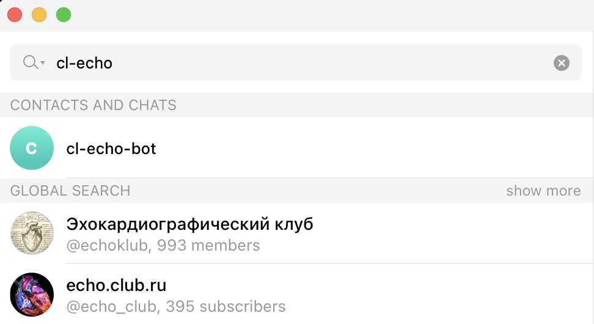

<a id="x-28CL-TELEGRAM-BOT-DOCS-2FINDEX-3A-40README-2040ANTS-DOC-2FLOCATIVES-3ASECTION-29"></a>

# cl-telegram-bot - Telegram Bot API

<a id="cl-telegram-bot-asdf-system-details"></a>

## CL-TELEGRAM-BOT ASDF System Details

* Description: Telegram Bot `API`, based on sovietspaceship's work but mostly rewritten.
* Licence: `MIT`
* Author: Alexander Artemenko <svetlyak.40wt@gmail.com>
* Homepage: [https://40ants.com/cl-telegram-bot/][6949]
* Bug tracker: [https://github.com/40ants/cl-telegram-bot/issues][5798]
* Source control: [GIT][53d1]
* Depends on: [alexandria][8236], [anaphora][c9ae], [arrows][b590], [bordeaux-threads][3dbf], [cl-ppcre][49b9], [cl-strings][2ecb], [closer-mop][61a4], [dexador][8347], [jonathan][6dd8], [kebab][5186], [log4cl][7f8b], [serapeum][c41d], [str][ef7f], [trivial-backtrace][fc0e], [yason][aba2]

[][7bb5]


<a id="x-28CL-TELEGRAM-BOT-DOCS-2FINDEX-3A-3A-40INSTALLATION-2040ANTS-DOC-2FLOCATIVES-3ASECTION-29"></a>

## Installation

You can install this library from Quicklisp, but you want to receive updates quickly, then install it from Ultralisp.org:

```
(ql-dist:install-dist "http://dist.ultralisp.org/"
                      :prompt nil)
(ql:quickload :cl-telegram-bot)
```
<a id="x-28CL-TELEGRAM-BOT-DOCS-2FINDEX-3A-3A-40V2-2040ANTS-DOC-2FLOCATIVES-3ASECTION-29"></a>

## v2

<a id="x-28CL-TELEGRAM-BOT-DOCS-2FSTATES-3A-3A-40STATES-AND-ACTIONS-2040ANTS-DOC-2FLOCATIVES-3ASECTION-29"></a>

### States and Actions

This framework makes it possible to define bot with all allowed state.

The state defines behaviour of the bot, the way it should respond to commands, updates and other events.

<a id="x-28CL-TELEGRAM-BOT-DOCS-2FSTATES-3A-3A-40STATES-2040ANTS-DOC-2FLOCATIVES-3ASECTION-29"></a>

#### States

There can be more than one handler for the event. We call these handlers "Actions".

An action should return a `NIL` or a new state. In latter case, the current bot's state will be changed to the new one and handlers for `on-activation` event will be called.

State is constructed using [`state`][03e8] function, which accepts handlers for different kinds of events. Here is simples state which greets a user when it start the chat and then reply with the same text:

```
(defun reply-with-same-text (update)
  (reply (message-text
          (update-message update)))
  (values))


(state (send-text "Hello, I'm the echo bot.")
       :on-update 'reply-with-same-text)
```
The first argument to [`state`][03e8] function is a handler for `on-activation` event. If you don't want to react on activation, you can pass `NIL` instead. The [`send-text`][5d6f] function returns an action instance. This way, we tell what bot should do, we use a declarative way to describe bot's behaviour.

The `:ON-UPDATE` argument specifies a handler for `on-update` event. This is the most generic event which occur when bot receives an update which wasn't processed by other event handlers. For this handler we are using a custom function bound to the symbol `reply-with-same-text`. The function accepts a single argument - update object. Use generic functions from `cl-telegram-bot2/api` package to work with this update object.

The reason why we only accept a special action object or a symbol but not a lambda function is because this way we'll be able to generate schemas of all states and transitions between them. Another reason is that it will be possible to redefine fbound function and use interactive approach to changing bot's behaviour.

See other support events in [`state`][03e8] function documentation.

<a id="x-28CL-TELEGRAM-BOT-DOCS-2FSTATES-3A-3A-40ACTIONS-2040ANTS-DOC-2FLOCATIVES-3ASECTION-29"></a>

#### Actions

<a id="x-28CL-TELEGRAM-BOT-DOCS-2FINDEX-3A-3A-40API-V2-2040ANTS-DOC-2FLOCATIVES-3ASECTION-29"></a>

### API

<a id="x-28CL-TELEGRAM-BOT-DOCS-2FINDEX-3A-3A-40CL-TELEGRAM-BOT2-2FACTION-3FPACKAGE-2040ANTS-DOC-2FLOCATIVES-3ASECTION-29"></a>

#### CL-TELEGRAM-BOT2/ACTION

<a id="x-28-23A-28-2823-29-20BASE-CHAR-20-2E-20-22CL-TELEGRAM-BOT2-2FACTION-22-29-20PACKAGE-29"></a>

##### [package] `cl-telegram-bot2/action`

<a id="x-28CL-TELEGRAM-BOT-DOCS-2FINDEX-3A-3A-7C-40CL-TELEGRAM-BOT2-2FACTION-3FClasses-SECTION-7C-2040ANTS-DOC-2FLOCATIVES-3ASECTION-29"></a>

##### Classes

<a id="x-28CL-TELEGRAM-BOT-DOCS-2FINDEX-3A-3A-40CL-TELEGRAM-BOT2-2FACTION-24ACTION-3FCLASS-2040ANTS-DOC-2FLOCATIVES-3ASECTION-29"></a>

###### ACTION

<a id="x-28CL-TELEGRAM-BOT2-2FACTION-3AACTION-20CLASS-29"></a>

####### [class](e150) `action` ()

<a id="x-28CL-TELEGRAM-BOT-DOCS-2FINDEX-3A-3A-7C-40CL-TELEGRAM-BOT2-2FACTION-3FFunctions-SECTION-7C-2040ANTS-DOC-2FLOCATIVES-3ASECTION-29"></a>

##### Functions

<a id="x-28CL-TELEGRAM-BOT2-2FACTION-3ACALL-IF-ACTION-20FUNCTION-29"></a>

###### [function](6dc4) `call-if-action` obj func &rest args

Useful in [`cl-telegram-bot2/generics:process`][9647] handlers in case if
state has additional handler stored in the slot and this
slot can be either state or action.

This function is recursive, because processing of an action
could return another action and we should call `FUNC` until
a new state or `NIL` will be returned.

<a id="x-28CL-TELEGRAM-BOT-DOCS-2FINDEX-3A-3A-40CL-TELEGRAM-BOT2-2FACTIONS-2FEDIT-MESSAGE-MEDIA-3FPACKAGE-2040ANTS-DOC-2FLOCATIVES-3ASECTION-29"></a>

#### CL-TELEGRAM-BOT2/ACTIONS/EDIT-MESSAGE-MEDIA

<a id="x-28-23A-28-2843-29-20BASE-CHAR-20-2E-20-22CL-TELEGRAM-BOT2-2FACTIONS-2FEDIT-MESSAGE-MEDIA-22-29-20PACKAGE-29"></a>

##### [package] `cl-telegram-bot2/actions/edit-message-media`

<a id="x-28CL-TELEGRAM-BOT-DOCS-2FINDEX-3A-3A-7C-40CL-TELEGRAM-BOT2-2FACTIONS-2FEDIT-MESSAGE-MEDIA-3FClasses-SECTION-7C-2040ANTS-DOC-2FLOCATIVES-3ASECTION-29"></a>

##### Classes

<a id="x-28CL-TELEGRAM-BOT-DOCS-2FINDEX-3A-3A-40CL-TELEGRAM-BOT2-2FACTIONS-2FEDIT-MESSAGE-MEDIA-24EDIT-MESSAGE-MEDIA-3FCLASS-2040ANTS-DOC-2FLOCATIVES-3ASECTION-29"></a>

###### EDIT-MESSAGE-MEDIA

<a id="x-28CL-TELEGRAM-BOT2-2FACTIONS-2FEDIT-MESSAGE-MEDIA-3AEDIT-MESSAGE-MEDIA-20CLASS-29"></a>

####### [class](a17a) `edit-message-media` (action)

**Readers**

<a id="x-28CL-TELEGRAM-BOT2-2FACTIONS-2FEDIT-MESSAGE-MEDIA-3A-3ACAPTION-20-2840ANTS-DOC-2FLOCATIVES-3AREADER-20CL-TELEGRAM-BOT2-2FACTIONS-2FEDIT-MESSAGE-MEDIA-3AEDIT-MESSAGE-MEDIA-29-29"></a>

####### [reader](03f8) `caption` (edit-message-media) (:caption)

<a id="x-28CL-TELEGRAM-BOT2-2FACTIONS-2FEDIT-MESSAGE-MEDIA-3A-3AINLINE-KEYBOARD-20-2840ANTS-DOC-2FLOCATIVES-3AREADER-20CL-TELEGRAM-BOT2-2FACTIONS-2FEDIT-MESSAGE-MEDIA-3AEDIT-MESSAGE-MEDIA-29-29"></a>

####### [reader](b44f) `inline-keyboard` (edit-message-media) (:inline-keyboard)

<a id="x-28CL-TELEGRAM-BOT2-2FACTIONS-2FEDIT-MESSAGE-MEDIA-3A-3AMEDIA-PATH-20-2840ANTS-DOC-2FLOCATIVES-3AREADER-20CL-TELEGRAM-BOT2-2FACTIONS-2FEDIT-MESSAGE-MEDIA-3AEDIT-MESSAGE-MEDIA-29-29"></a>

####### [reader](2f9b) `media-path` (edit-message-media) (:path)

<a id="x-28CL-TELEGRAM-BOT-DOCS-2FINDEX-3A-3A-7C-40CL-TELEGRAM-BOT2-2FACTIONS-2FEDIT-MESSAGE-MEDIA-3FFunctions-SECTION-7C-2040ANTS-DOC-2FLOCATIVES-3ASECTION-29"></a>

##### Functions

<a id="x-28CL-TELEGRAM-BOT2-2FACTIONS-2FEDIT-MESSAGE-MEDIA-3AEDIT-MESSAGE-MEDIA-20FUNCTION-29"></a>

###### [function](e73e) `edit-message-media` path-or-func-name &key caption inline-keyboard

<a id="x-28CL-TELEGRAM-BOT-DOCS-2FINDEX-3A-3A-40CL-TELEGRAM-BOT2-2FACTIONS-2FSEND-INVOICE-3FPACKAGE-2040ANTS-DOC-2FLOCATIVES-3ASECTION-29"></a>

#### CL-TELEGRAM-BOT2/ACTIONS/SEND-INVOICE

<a id="x-28-23A-28-2837-29-20BASE-CHAR-20-2E-20-22CL-TELEGRAM-BOT2-2FACTIONS-2FSEND-INVOICE-22-29-20PACKAGE-29"></a>

##### [package] `cl-telegram-bot2/actions/send-invoice`

<a id="x-28CL-TELEGRAM-BOT-DOCS-2FINDEX-3A-3A-7C-40CL-TELEGRAM-BOT2-2FACTIONS-2FSEND-INVOICE-3FClasses-SECTION-7C-2040ANTS-DOC-2FLOCATIVES-3ASECTION-29"></a>

##### Classes

<a id="x-28CL-TELEGRAM-BOT-DOCS-2FINDEX-3A-3A-40CL-TELEGRAM-BOT2-2FACTIONS-2FSEND-INVOICE-24SEND-INVOICE-3FCLASS-2040ANTS-DOC-2FLOCATIVES-3ASECTION-29"></a>

###### SEND-INVOICE

<a id="x-28CL-TELEGRAM-BOT2-2FACTIONS-2FSEND-INVOICE-3ASEND-INVOICE-20CLASS-29"></a>

####### [class](9c97) `send-invoice` (action)

**Readers**

<a id="x-28CL-TELEGRAM-BOT2-2FACTIONS-2FSEND-INVOICE-3A-3ACOMMANDS-20-2840ANTS-DOC-2FLOCATIVES-3AREADER-20CL-TELEGRAM-BOT2-2FACTIONS-2FSEND-INVOICE-3ASEND-INVOICE-29-29"></a>

####### [reader](679b) `commands` (send-invoice) (:commands = nil)

<a id="x-28CL-TELEGRAM-BOT2-2FACTIONS-2FSEND-INVOICE-3A-3ACURRENCY-20-2840ANTS-DOC-2FLOCATIVES-3AREADER-20CL-TELEGRAM-BOT2-2FACTIONS-2FSEND-INVOICE-3ASEND-INVOICE-29-29"></a>

####### [reader](ad46) `currency` (send-invoice) (:currency)

<a id="x-28CL-TELEGRAM-BOT2-2FACTIONS-2FSEND-INVOICE-3A-3ADESCRIPTION-20-2840ANTS-DOC-2FLOCATIVES-3AREADER-20CL-TELEGRAM-BOT2-2FACTIONS-2FSEND-INVOICE-3ASEND-INVOICE-29-29"></a>

####### [reader](9391) `description` (send-invoice) (:description)

<a id="x-28CL-TELEGRAM-BOT2-2FACTIONS-2FSEND-INVOICE-3A-3AON-SUCCESS-20-2840ANTS-DOC-2FLOCATIVES-3AREADER-20CL-TELEGRAM-BOT2-2FACTIONS-2FSEND-INVOICE-3ASEND-INVOICE-29-29"></a>

####### [reader](71e9) `on-success` (send-invoice) (:on-success)

<a id="x-28CL-TELEGRAM-BOT2-2FACTIONS-2FSEND-INVOICE-3A-3APAYLOAD-20-2840ANTS-DOC-2FLOCATIVES-3AREADER-20CL-TELEGRAM-BOT2-2FACTIONS-2FSEND-INVOICE-3ASEND-INVOICE-29-29"></a>

####### [reader](7b7b) `payload` (send-invoice) (:payload)

<a id="x-28CL-TELEGRAM-BOT2-2FACTIONS-2FSEND-INVOICE-3A-3APRICES-20-2840ANTS-DOC-2FLOCATIVES-3AREADER-20CL-TELEGRAM-BOT2-2FACTIONS-2FSEND-INVOICE-3ASEND-INVOICE-29-29"></a>

####### [reader](7914) `prices` (send-invoice) (:prices)

<a id="x-28CL-TELEGRAM-BOT2-2FACTIONS-2FSEND-INVOICE-3A-3APROVIDER-TOKEN-20-2840ANTS-DOC-2FLOCATIVES-3AREADER-20CL-TELEGRAM-BOT2-2FACTIONS-2FSEND-INVOICE-3ASEND-INVOICE-29-29"></a>

####### [reader](46f4) `provider-token` (send-invoice) (:provider-token)

<a id="x-28CL-TELEGRAM-BOT2-2FACTIONS-2FSEND-INVOICE-3A-3ATITLE-20-2840ANTS-DOC-2FLOCATIVES-3AREADER-20CL-TELEGRAM-BOT2-2FACTIONS-2FSEND-INVOICE-3ASEND-INVOICE-29-29"></a>

####### [reader](0b5b) `title` (send-invoice) (:title)

<a id="x-28CL-TELEGRAM-BOT-DOCS-2FINDEX-3A-3A-7C-40CL-TELEGRAM-BOT2-2FACTIONS-2FSEND-INVOICE-3FFunctions-SECTION-7C-2040ANTS-DOC-2FLOCATIVES-3ASECTION-29"></a>

##### Functions

<a id="x-28CL-TELEGRAM-BOT2-2FACTIONS-2FSEND-INVOICE-3ASEND-INVOICE-20FUNCTION-29"></a>

###### [function](e136) `send-invoice` title description payload provider-token currency prices &key on-success commands

<a id="x-28CL-TELEGRAM-BOT-DOCS-2FINDEX-3A-3A-40CL-TELEGRAM-BOT2-2FACTIONS-2FSEND-PHOTO-3FPACKAGE-2040ANTS-DOC-2FLOCATIVES-3ASECTION-29"></a>

#### CL-TELEGRAM-BOT2/ACTIONS/SEND-PHOTO

<a id="x-28-23A-28-2835-29-20BASE-CHAR-20-2E-20-22CL-TELEGRAM-BOT2-2FACTIONS-2FSEND-PHOTO-22-29-20PACKAGE-29"></a>

##### [package] `cl-telegram-bot2/actions/send-photo`

<a id="x-28CL-TELEGRAM-BOT-DOCS-2FINDEX-3A-3A-7C-40CL-TELEGRAM-BOT2-2FACTIONS-2FSEND-PHOTO-3FClasses-SECTION-7C-2040ANTS-DOC-2FLOCATIVES-3ASECTION-29"></a>

##### Classes

<a id="x-28CL-TELEGRAM-BOT-DOCS-2FINDEX-3A-3A-40CL-TELEGRAM-BOT2-2FACTIONS-2FSEND-PHOTO-24SEND-PHOTO-3FCLASS-2040ANTS-DOC-2FLOCATIVES-3ASECTION-29"></a>

###### SEND-PHOTO

<a id="x-28CL-TELEGRAM-BOT2-2FACTIONS-2FSEND-PHOTO-3ASEND-PHOTO-20CLASS-29"></a>

####### [class](8cf0) `send-photo` (action)

**Readers**

<a id="x-28CL-TELEGRAM-BOT2-2FACTIONS-2FSEND-PHOTO-3A-3ACAPTION-20-2840ANTS-DOC-2FLOCATIVES-3AREADER-20CL-TELEGRAM-BOT2-2FACTIONS-2FSEND-PHOTO-3ASEND-PHOTO-29-29"></a>

####### [reader](f28b) `caption` (send-photo) (:caption)

<a id="x-28CL-TELEGRAM-BOT2-2FACTIONS-2FSEND-PHOTO-3A-3AIMAGE-PATH-20-2840ANTS-DOC-2FLOCATIVES-3AREADER-20CL-TELEGRAM-BOT2-2FACTIONS-2FSEND-PHOTO-3ASEND-PHOTO-29-29"></a>

####### [reader](d96a) `image-path` (send-photo) (:path)

<a id="x-28CL-TELEGRAM-BOT2-2FACTIONS-2FSEND-PHOTO-3A-3AINLINE-KEYBOARD-20-2840ANTS-DOC-2FLOCATIVES-3AREADER-20CL-TELEGRAM-BOT2-2FACTIONS-2FSEND-PHOTO-3ASEND-PHOTO-29-29"></a>

####### [reader](9592) `inline-keyboard` (send-photo) (:inline-keyboard)

<a id="x-28CL-TELEGRAM-BOT-DOCS-2FINDEX-3A-3A-7C-40CL-TELEGRAM-BOT2-2FACTIONS-2FSEND-PHOTO-3FFunctions-SECTION-7C-2040ANTS-DOC-2FLOCATIVES-3ASECTION-29"></a>

##### Functions

<a id="x-28CL-TELEGRAM-BOT2-2FACTIONS-2FSEND-PHOTO-3ASEND-PHOTO-20FUNCTION-29"></a>

###### [function](758a) `send-photo` path-or-func-name &key caption inline-keyboard

<a id="x-28CL-TELEGRAM-BOT-DOCS-2FINDEX-3A-3A-40CL-TELEGRAM-BOT2-2FACTIONS-2FSEND-TEXT-3FPACKAGE-2040ANTS-DOC-2FLOCATIVES-3ASECTION-29"></a>

#### CL-TELEGRAM-BOT2/ACTIONS/SEND-TEXT

<a id="x-28-23A-28-2834-29-20BASE-CHAR-20-2E-20-22CL-TELEGRAM-BOT2-2FACTIONS-2FSEND-TEXT-22-29-20PACKAGE-29"></a>

##### [package] `cl-telegram-bot2/actions/send-text`

<a id="x-28CL-TELEGRAM-BOT-DOCS-2FINDEX-3A-3A-7C-40CL-TELEGRAM-BOT2-2FACTIONS-2FSEND-TEXT-3FClasses-SECTION-7C-2040ANTS-DOC-2FLOCATIVES-3ASECTION-29"></a>

##### Classes

<a id="x-28CL-TELEGRAM-BOT-DOCS-2FINDEX-3A-3A-40CL-TELEGRAM-BOT2-2FACTIONS-2FSEND-TEXT-24SEND-TEXT-3FCLASS-2040ANTS-DOC-2FLOCATIVES-3ASECTION-29"></a>

###### SEND-TEXT

<a id="x-28CL-TELEGRAM-BOT2-2FACTIONS-2FSEND-TEXT-3ASEND-TEXT-20CLASS-29"></a>

####### [class](7586) `send-text` (action)

**Readers**

<a id="x-28CL-TELEGRAM-BOT2-2FACTIONS-2FSEND-TEXT-3A-3APARSE-MODE-20-2840ANTS-DOC-2FLOCATIVES-3AREADER-20CL-TELEGRAM-BOT2-2FACTIONS-2FSEND-TEXT-3ASEND-TEXT-29-29"></a>

####### [reader](6b81) `parse-mode` (send-text) (:parse-mode = nil)

Supported values are: "Markdown", "Markdown`V2`" or "`HTML`". Read more about formatting options in the Telegram documentaion: https://core.telegram.org/bots/api#formatting-options

<a id="x-28CL-TELEGRAM-BOT2-2FACTIONS-2FSEND-TEXT-3A-3AREPLY-MARKUP-20-2840ANTS-DOC-2FLOCATIVES-3AREADER-20CL-TELEGRAM-BOT2-2FACTIONS-2FSEND-TEXT-3ASEND-TEXT-29-29"></a>

####### [reader](ca65) `reply-markup` (send-text) (:reply-markup = nil)

<a id="x-28CL-TELEGRAM-BOT2-2FACTIONS-2FSEND-TEXT-3A-3ATEXT-20-2840ANTS-DOC-2FLOCATIVES-3AREADER-20CL-TELEGRAM-BOT2-2FACTIONS-2FSEND-TEXT-3ASEND-TEXT-29-29"></a>

####### [reader](3ab9) `text` (send-text) (:text)

<a id="x-28CL-TELEGRAM-BOT-DOCS-2FINDEX-3A-3A-7C-40CL-TELEGRAM-BOT2-2FACTIONS-2FSEND-TEXT-3FFunctions-SECTION-7C-2040ANTS-DOC-2FLOCATIVES-3ASECTION-29"></a>

##### Functions

<a id="x-28CL-TELEGRAM-BOT2-2FACTIONS-2FSEND-TEXT-3ASEND-TEXT-20FUNCTION-29"></a>

###### [function](74dc) `send-text` text-or-func-name &key reply-markup parse-mode

<a id="x-28CL-TELEGRAM-BOT-DOCS-2FINDEX-3A-3A-40CL-TELEGRAM-BOT2-2FBOT-3FPACKAGE-2040ANTS-DOC-2FLOCATIVES-3ASECTION-29"></a>

#### CL-TELEGRAM-BOT2/BOT

<a id="x-28-23A-28-2820-29-20BASE-CHAR-20-2E-20-22CL-TELEGRAM-BOT2-2FBOT-22-29-20PACKAGE-29"></a>

##### [package] `cl-telegram-bot2/bot`

<a id="x-28CL-TELEGRAM-BOT-DOCS-2FINDEX-3A-3A-7C-40CL-TELEGRAM-BOT2-2FBOT-3FMacros-SECTION-7C-2040ANTS-DOC-2FLOCATIVES-3ASECTION-29"></a>

##### Macros

<a id="x-28CL-TELEGRAM-BOT2-2FBOT-3ADEFBOT-20-2840ANTS-DOC-2FLOCATIVES-3AMACRO-29-29"></a>

###### [macro](7d9c) `defbot` name base-classes &optional slots &rest options

Use this macro to define a class of your Telegram bot.

Each bot has a state machine inside. The simplest bot has only one state:

```
(defbot test-bot ()
  ()
  (:initial-state
   (state (send-text "Hello world!"))))
```
This bot will green each who activates it.

To learn more about bot states and actions see [`States and Actions`][8e99] section.

<a id="x-28CL-TELEGRAM-BOT-DOCS-2FINDEX-3A-3A-40CL-TELEGRAM-BOT2-2FERRORS-3FPACKAGE-2040ANTS-DOC-2FLOCATIVES-3ASECTION-29"></a>

#### CL-TELEGRAM-BOT2/ERRORS

<a id="x-28-23A-28-2823-29-20BASE-CHAR-20-2E-20-22CL-TELEGRAM-BOT2-2FERRORS-22-29-20PACKAGE-29"></a>

##### [package] `cl-telegram-bot2/errors`

<a id="x-28CL-TELEGRAM-BOT-DOCS-2FINDEX-3A-3A-7C-40CL-TELEGRAM-BOT2-2FERRORS-3FClasses-SECTION-7C-2040ANTS-DOC-2FLOCATIVES-3ASECTION-29"></a>

##### Classes

<a id="x-28CL-TELEGRAM-BOT-DOCS-2FINDEX-3A-3A-40CL-TELEGRAM-BOT2-2FERRORS-24TELEGRAM-ERROR-3FCLASS-2040ANTS-DOC-2FLOCATIVES-3ASECTION-29"></a>

###### TELEGRAM-ERROR

<a id="x-28CL-TELEGRAM-BOT2-2FERRORS-3ATELEGRAM-ERROR-20CONDITION-29"></a>

####### [condition](afac) `telegram-error` (error)

**Readers**

<a id="x-28CL-TELEGRAM-BOT2-2FERRORS-3AERROR-DESCRIPTION-20-2840ANTS-DOC-2FLOCATIVES-3AREADER-20CL-TELEGRAM-BOT2-2FERRORS-3ATELEGRAM-ERROR-29-29"></a>

####### [reader](afac) `error-description` (telegram-error) (:DESCRIPTION = '(REQUIRED-ARGUMENT
  "DESCRIPTION is required argument for TELEGRAM-ERROR class."))

<a id="x-28CL-TELEGRAM-BOT-DOCS-2FINDEX-3A-3A-40CL-TELEGRAM-BOT2-2FGENERICS-3FPACKAGE-2040ANTS-DOC-2FLOCATIVES-3ASECTION-29"></a>

#### CL-TELEGRAM-BOT2/GENERICS

<a id="x-28-23A-28-2825-29-20BASE-CHAR-20-2E-20-22CL-TELEGRAM-BOT2-2FGENERICS-22-29-20PACKAGE-29"></a>

##### [package] `cl-telegram-bot2/generics`

<a id="x-28CL-TELEGRAM-BOT-DOCS-2FINDEX-3A-3A-7C-40CL-TELEGRAM-BOT2-2FGENERICS-3FGenerics-SECTION-7C-2040ANTS-DOC-2FLOCATIVES-3ASECTION-29"></a>

##### Generics

<a id="x-28CL-TELEGRAM-BOT2-2FGENERICS-3AON-PRE-CHECKOUT-QUERY-20GENERIC-FUNCTION-29"></a>

###### [generic-function](d8e9) `on-pre-checkout-query` bot query

Pre-checkout-query object will be passed as this single arguement and
function should return a boolean. When the function return True, user
may proceed to the payment.

Pre-checkout queries are not bound the the chat, so
current-chat and current-state are not available during processing.
This is why methods of this generic function should be defined on bot class.

You can use `CL-TELEGRAM-BOT2/API:PRE-CHECKOUT-QUERY-INVOICE-PAYLOAD` function
to extract payload from the query and find associated invoice.

<a id="x-28CL-TELEGRAM-BOT2-2FGENERICS-3AON-RESULT-20GENERIC-FUNCTION-29"></a>

###### [generic-function](cd58) `on-result` state result

This method is called when some state exits and returns a result using `BACK` function.

<a id="x-28CL-TELEGRAM-BOT2-2FGENERICS-3AON-STATE-ACTIVATION-20GENERIC-FUNCTION-29"></a>

###### [generic-function](dd7c) `on-state-activation` state

This method is called when chat actor's state is changed to a given `STATE`.

Such hook can be used to send some prompt to the user.

<a id="x-28CL-TELEGRAM-BOT2-2FGENERICS-3AON-STATE-DELETION-20GENERIC-FUNCTION-29"></a>

###### [generic-function](b15b) `on-state-deletion` state

This method is called when chat actor's state is returned from a given `STATE` back to the previous state.

The method is called only when state is removed from the stack. When a new state is added to the stack,
this method will not be called for a previous state.

Such hook can be used to hide a keyboard or to delete temporary messages.

<a id="x-28CL-TELEGRAM-BOT2-2FGENERICS-3APROCESS-20GENERIC-FUNCTION-29"></a>

###### [generic-function](2115) `process` bot-or-state object

This method is called by when processing a single update.
It is called multiple times on different parts of an update.
Whole pipeline looks like that:

For each update we call:
  process(bot, update)
  process(actor-state, update)

<a id="x-28CL-TELEGRAM-BOT-DOCS-2FINDEX-3A-3A-40CL-TELEGRAM-BOT2-2FHIGH-3FPACKAGE-2040ANTS-DOC-2FLOCATIVES-3ASECTION-29"></a>

#### CL-TELEGRAM-BOT2/HIGH

<a id="x-28-23A-28-2821-29-20BASE-CHAR-20-2E-20-22CL-TELEGRAM-BOT2-2FHIGH-22-29-20PACKAGE-29"></a>

##### [package] `cl-telegram-bot2/high`

High level `API` for implementing Telegram bots.

<a id="x-28CL-TELEGRAM-BOT-DOCS-2FINDEX-3A-3A-7C-40CL-TELEGRAM-BOT2-2FHIGH-3FClasses-SECTION-7C-2040ANTS-DOC-2FLOCATIVES-3ASECTION-29"></a>

##### Classes

<a id="x-28CL-TELEGRAM-BOT-DOCS-2FINDEX-3A-3A-40CL-TELEGRAM-BOT2-2FHIGH-24CHAT-STATE-3FCLASS-2040ANTS-DOC-2FLOCATIVES-3ASECTION-29"></a>

###### CHAT-STATE

<a id="x-28CL-TELEGRAM-BOT2-2FHIGH-3ACHAT-STATE-20CLASS-29"></a>

####### [class](0c58) `chat-state` ()

<a id="x-28CL-TELEGRAM-BOT-DOCS-2FINDEX-3A-3A-7C-40CL-TELEGRAM-BOT2-2FHIGH-3FFunctions-SECTION-7C-2040ANTS-DOC-2FLOCATIVES-3ASECTION-29"></a>

##### Functions

<a id="x-28CL-TELEGRAM-BOT2-2FHIGH-3AREPLY-20FUNCTION-29"></a>

###### [function](ba8b) `reply` text &rest rest &key business-connection-id message-thread-id parse-mode entities link-preview-options disable-notification protect-content allow-paid-broadcast message-effect-id reply-parameters reply-markup

<a id="x-28CL-TELEGRAM-BOT2-2FHIGH-3AREPLY-WITH-PHOTO-20FUNCTION-29"></a>

###### [function](dec9) `reply-with-photo` photo &rest rest &key business-connection-id message-thread-id caption parse-mode caption-entities show-caption-above-media has-spoiler disable-notification protect-content allow-paid-broadcast message-effect-id reply-parameters reply-markup

<a id="x-28CL-TELEGRAM-BOT-DOCS-2FINDEX-3A-3A-7C-40CL-TELEGRAM-BOT2-2FHIGH-3FMacros-SECTION-7C-2040ANTS-DOC-2FLOCATIVES-3ASECTION-29"></a>

##### Macros

<a id="x-28CL-TELEGRAM-BOT2-2FHIGH-3ACOLLECT-SENT-MESSAGES-20-2840ANTS-DOC-2FLOCATIVES-3AMACRO-29-29"></a>

###### [macro](03c9) `collect-sent-messages` &body body

Returns as the first value a list of messages created by [`reply`][60a4] function called
during `BODY` execution. Values returned by the `BODY` code are returned as the second,
third and following arguments.

Also, messages are collected when these actions are called:

* `cl-telegram-bot2/actions/send-text:send-text` ([`1`][5d6f] [`2`][c8e7])
* `cl-telegram-bot2/actions/send-photo:send-photo` ([`1`][7c91] [`2`][e0f8])

<a id="x-28CL-TELEGRAM-BOT-DOCS-2FINDEX-3A-3A-40CL-TELEGRAM-BOT2-2FHIGH-2FKEYBOARD-3FPACKAGE-2040ANTS-DOC-2FLOCATIVES-3ASECTION-29"></a>

#### CL-TELEGRAM-BOT2/HIGH/KEYBOARD

<a id="x-28-23A-28-2830-29-20BASE-CHAR-20-2E-20-22CL-TELEGRAM-BOT2-2FHIGH-2FKEYBOARD-22-29-20PACKAGE-29"></a>

##### [package] `cl-telegram-bot2/high/keyboard`

<a id="x-28CL-TELEGRAM-BOT-DOCS-2FINDEX-3A-3A-7C-40CL-TELEGRAM-BOT2-2FHIGH-2FKEYBOARD-3FClasses-SECTION-7C-2040ANTS-DOC-2FLOCATIVES-3ASECTION-29"></a>

##### Classes

<a id="x-28CL-TELEGRAM-BOT-DOCS-2FINDEX-3A-3A-40CL-TELEGRAM-BOT2-2FHIGH-2FKEYBOARD-24CALL-CALLBACK-3FCLASS-2040ANTS-DOC-2FLOCATIVES-3ASECTION-29"></a>

###### CALL-CALLBACK

<a id="x-28CL-TELEGRAM-BOT2-2FHIGH-2FKEYBOARD-3ACALL-CALLBACK-20CLASS-29"></a>

####### [class](7302) `call-callback` (inline-keyboard-button-mixin button)

**Readers**

<a id="x-28CL-TELEGRAM-BOT2-2FHIGH-2FKEYBOARD-3A-3ACALLBACK-DATA-20-2840ANTS-DOC-2FLOCATIVES-3AREADER-20CL-TELEGRAM-BOT2-2FHIGH-2FKEYBOARD-3ACALL-CALLBACK-29-29"></a>

####### [reader](93e3) `callback-data` (call-callback) (:callback-data)

<a id="x-28CL-TELEGRAM-BOT-DOCS-2FINDEX-3A-3A-40CL-TELEGRAM-BOT2-2FHIGH-2FKEYBOARD-24COPY-TEXT-3FCLASS-2040ANTS-DOC-2FLOCATIVES-3ASECTION-29"></a>

###### COPY-TEXT

<a id="x-28CL-TELEGRAM-BOT2-2FHIGH-2FKEYBOARD-3ACOPY-TEXT-20CLASS-29"></a>

####### [class](f1c3) `copy-text` (inline-keyboard-button-mixin button)

**Readers**

<a id="x-28CL-TELEGRAM-BOT2-2FHIGH-2FKEYBOARD-3A-3ATEXT-TO-COPY-20-2840ANTS-DOC-2FLOCATIVES-3AREADER-20CL-TELEGRAM-BOT2-2FHIGH-2FKEYBOARD-3ACOPY-TEXT-29-29"></a>

####### [reader](8238) `text-to-copy` (copy-text) (:text-to-copy)

<a id="x-28CL-TELEGRAM-BOT-DOCS-2FINDEX-3A-3A-40CL-TELEGRAM-BOT2-2FHIGH-2FKEYBOARD-24OPEN-GAME-3FCLASS-2040ANTS-DOC-2FLOCATIVES-3ASECTION-29"></a>

###### OPEN-GAME

<a id="x-28CL-TELEGRAM-BOT2-2FHIGH-2FKEYBOARD-3AOPEN-GAME-20CLASS-29"></a>

####### [class](a5a3) `open-game` (inline-keyboard-button-mixin button)

<a id="x-28CL-TELEGRAM-BOT-DOCS-2FINDEX-3A-3A-40CL-TELEGRAM-BOT2-2FHIGH-2FKEYBOARD-24OPEN-LOGIN-URL-3FCLASS-2040ANTS-DOC-2FLOCATIVES-3ASECTION-29"></a>

###### OPEN-LOGIN-URL

<a id="x-28CL-TELEGRAM-BOT2-2FHIGH-2FKEYBOARD-3AOPEN-LOGIN-URL-20CLASS-29"></a>

####### [class](44ae) `open-login-url` (inline-keyboard-button-mixin button)

**Readers**

<a id="x-28CL-TELEGRAM-BOT2-2FHIGH-2FKEYBOARD-3A-3ABOT-USERNAME-20-2840ANTS-DOC-2FLOCATIVES-3AREADER-20CL-TELEGRAM-BOT2-2FHIGH-2FKEYBOARD-3AOPEN-LOGIN-URL-29-29"></a>

####### [reader](79f6) `bot-username` (open-login-url) (:bot-username = nil)

<a id="x-28CL-TELEGRAM-BOT2-2FHIGH-2FKEYBOARD-3A-3AFORWARD-TEXT-20-2840ANTS-DOC-2FLOCATIVES-3AREADER-20CL-TELEGRAM-BOT2-2FHIGH-2FKEYBOARD-3AOPEN-LOGIN-URL-29-29"></a>

####### [reader](9ac2) `forward-text` (open-login-url) (:forward-text = nil)

<a id="x-28CL-TELEGRAM-BOT2-2FHIGH-2FKEYBOARD-3A-3ALOGIN-URL-20-2840ANTS-DOC-2FLOCATIVES-3AREADER-20CL-TELEGRAM-BOT2-2FHIGH-2FKEYBOARD-3AOPEN-LOGIN-URL-29-29"></a>

####### [reader](b59f) `login-url` (open-login-url) (:login-url)

<a id="x-28CL-TELEGRAM-BOT2-2FHIGH-2FKEYBOARD-3A-3AREQUEST-WRITE-ACCESS-P-20-2840ANTS-DOC-2FLOCATIVES-3AREADER-20CL-TELEGRAM-BOT2-2FHIGH-2FKEYBOARD-3AOPEN-LOGIN-URL-29-29"></a>

####### [reader](c342) `request-write-access-p` (open-login-url) (:request-write-access = nil)

<a id="x-28CL-TELEGRAM-BOT-DOCS-2FINDEX-3A-3A-40CL-TELEGRAM-BOT2-2FHIGH-2FKEYBOARD-24OPEN-URL-3FCLASS-2040ANTS-DOC-2FLOCATIVES-3ASECTION-29"></a>

###### OPEN-URL

<a id="x-28CL-TELEGRAM-BOT2-2FHIGH-2FKEYBOARD-3AOPEN-URL-20CLASS-29"></a>

####### [class](6660) `open-url` (inline-keyboard-button-mixin button)

**Readers**

<a id="x-28CL-TELEGRAM-BOT2-2FHIGH-2FKEYBOARD-3A-3AURL-20-2840ANTS-DOC-2FLOCATIVES-3AREADER-20CL-TELEGRAM-BOT2-2FHIGH-2FKEYBOARD-3AOPEN-URL-29-29"></a>

####### [reader](3a2e) `url` (open-url) (:url)

<a id="x-28CL-TELEGRAM-BOT-DOCS-2FINDEX-3A-3A-40CL-TELEGRAM-BOT2-2FHIGH-2FKEYBOARD-24OPEN-WEB-APP-3FCLASS-2040ANTS-DOC-2FLOCATIVES-3ASECTION-29"></a>

###### OPEN-WEB-APP

<a id="x-28CL-TELEGRAM-BOT2-2FHIGH-2FKEYBOARD-3AOPEN-WEB-APP-20CLASS-29"></a>

####### [class](609b) `open-web-app` (keyboard-button-mixin inline-keyboard-button-mixin button)

**Readers**

<a id="x-28CL-TELEGRAM-BOT2-2FHIGH-2FKEYBOARD-3A-3AWEB-APP-URL-20-2840ANTS-DOC-2FLOCATIVES-3AREADER-20CL-TELEGRAM-BOT2-2FHIGH-2FKEYBOARD-3AOPEN-WEB-APP-29-29"></a>

####### [reader](4520) `web-app-url` (open-web-app) (:url)

<a id="x-28CL-TELEGRAM-BOT-DOCS-2FINDEX-3A-3A-40CL-TELEGRAM-BOT2-2FHIGH-2FKEYBOARD-24PAY-BUTTON-3FCLASS-2040ANTS-DOC-2FLOCATIVES-3ASECTION-29"></a>

###### PAY-BUTTON

<a id="x-28CL-TELEGRAM-BOT2-2FHIGH-2FKEYBOARD-3APAY-BUTTON-20CLASS-29"></a>

####### [class](2bca) `pay-button` (inline-keyboard-button-mixin button)

<a id="x-28CL-TELEGRAM-BOT-DOCS-2FINDEX-3A-3A-40CL-TELEGRAM-BOT2-2FHIGH-2FKEYBOARD-24REQUEST-CHAT-3FCLASS-2040ANTS-DOC-2FLOCATIVES-3ASECTION-29"></a>

###### REQUEST-CHAT

<a id="x-28CL-TELEGRAM-BOT2-2FHIGH-2FKEYBOARD-3AREQUEST-CHAT-20CLASS-29"></a>

####### [class](0733) `request-chat` (keyboard-button-mixin button)

**Readers**

<a id="x-28CL-TELEGRAM-BOT2-2FHIGH-2FKEYBOARD-3A-3ABOT-ADMINISTRATION-RIGHTS-20-2840ANTS-DOC-2FLOCATIVES-3AREADER-20CL-TELEGRAM-BOT2-2FHIGH-2FKEYBOARD-3AREQUEST-CHAT-29-29"></a>

####### [reader](0057) `bot-administration-rights` (request-chat) (:bot-administration-rights = nil)

<a id="x-28CL-TELEGRAM-BOT2-2FHIGH-2FKEYBOARD-3A-3ABOT-IS-MEMBER-P-20-2840ANTS-DOC-2FLOCATIVES-3AREADER-20CL-TELEGRAM-BOT2-2FHIGH-2FKEYBOARD-3AREQUEST-CHAT-29-29"></a>

####### [reader](f5f6) `bot-is-member-p` (request-chat) (:bot-is-member = nil)

<a id="x-28CL-TELEGRAM-BOT2-2FHIGH-2FKEYBOARD-3A-3ACHAT-HAS-USERNAME-P-20-2840ANTS-DOC-2FLOCATIVES-3AREADER-20CL-TELEGRAM-BOT2-2FHIGH-2FKEYBOARD-3AREQUEST-CHAT-29-29"></a>

####### [reader](d0fd) `chat-has-username-p` (request-chat) (:chat-has-username = nil)

<a id="x-28CL-TELEGRAM-BOT2-2FHIGH-2FKEYBOARD-3A-3ACHAT-IS-CHANNEL-P-20-2840ANTS-DOC-2FLOCATIVES-3AREADER-20CL-TELEGRAM-BOT2-2FHIGH-2FKEYBOARD-3AREQUEST-CHAT-29-29"></a>

####### [reader](3eb4) `chat-is-channel-p` (request-chat) (:chat-is-channel = nil)

<a id="x-28CL-TELEGRAM-BOT2-2FHIGH-2FKEYBOARD-3A-3ACHAT-IS-CREATED-P-20-2840ANTS-DOC-2FLOCATIVES-3AREADER-20CL-TELEGRAM-BOT2-2FHIGH-2FKEYBOARD-3AREQUEST-CHAT-29-29"></a>

####### [reader](4974) `chat-is-created-p` (request-chat) (:chat-is-created = nil)

<a id="x-28CL-TELEGRAM-BOT2-2FHIGH-2FKEYBOARD-3A-3ACHAT-IS-FORUM-P-20-2840ANTS-DOC-2FLOCATIVES-3AREADER-20CL-TELEGRAM-BOT2-2FHIGH-2FKEYBOARD-3AREQUEST-CHAT-29-29"></a>

####### [reader](4fd4) `chat-is-forum-p` (request-chat) (:chat-is-forum = nil)

<a id="x-28CL-TELEGRAM-BOT2-2FHIGH-2FKEYBOARD-3A-3AREQUEST-PHOTO-P-20-2840ANTS-DOC-2FLOCATIVES-3AREADER-20CL-TELEGRAM-BOT2-2FHIGH-2FKEYBOARD-3AREQUEST-CHAT-29-29"></a>

####### [reader](340d) `request-photo-p` (request-chat) (:request-photo = nil)

<a id="x-28CL-TELEGRAM-BOT2-2FHIGH-2FKEYBOARD-3A-3AREQUEST-TITLE-P-20-2840ANTS-DOC-2FLOCATIVES-3AREADER-20CL-TELEGRAM-BOT2-2FHIGH-2FKEYBOARD-3AREQUEST-CHAT-29-29"></a>

####### [reader](b6be) `request-title-p` (request-chat) (:request-title = nil)

<a id="x-28CL-TELEGRAM-BOT2-2FHIGH-2FKEYBOARD-3A-3AREQUEST-USERNAME-P-20-2840ANTS-DOC-2FLOCATIVES-3AREADER-20CL-TELEGRAM-BOT2-2FHIGH-2FKEYBOARD-3AREQUEST-CHAT-29-29"></a>

####### [reader](c35c) `request-username-p` (request-chat) (:request-username = nil)

<a id="x-28CL-TELEGRAM-BOT2-2FHIGH-2FKEYBOARD-3A-3AUSER-ADMINISTRATION-RIGHTS-20-2840ANTS-DOC-2FLOCATIVES-3AREADER-20CL-TELEGRAM-BOT2-2FHIGH-2FKEYBOARD-3AREQUEST-CHAT-29-29"></a>

####### [reader](0d8d) `user-administration-rights` (request-chat) (:user-administration-rights = nil)

<a id="x-28CL-TELEGRAM-BOT2-2FHIGH-2FKEYBOARD-3A-3AUSERS-REQUEST-ID-20-2840ANTS-DOC-2FLOCATIVES-3AREADER-20CL-TELEGRAM-BOT2-2FHIGH-2FKEYBOARD-3AREQUEST-CHAT-29-29"></a>

####### [reader](fcd2) `users-request-id` (request-chat) (:REQUEST-ID = (REQUIRED-ARGUMENT "Argument :request-id is required."))

<a id="x-28CL-TELEGRAM-BOT-DOCS-2FINDEX-3A-3A-40CL-TELEGRAM-BOT2-2FHIGH-2FKEYBOARD-24REQUEST-CONTACT-3FCLASS-2040ANTS-DOC-2FLOCATIVES-3ASECTION-29"></a>

###### REQUEST-CONTACT

<a id="x-28CL-TELEGRAM-BOT2-2FHIGH-2FKEYBOARD-3AREQUEST-CONTACT-20CLASS-29"></a>

####### [class](a565) `request-contact` (keyboard-button-mixin button)

<a id="x-28CL-TELEGRAM-BOT-DOCS-2FINDEX-3A-3A-40CL-TELEGRAM-BOT2-2FHIGH-2FKEYBOARD-24REQUEST-LOCATION-3FCLASS-2040ANTS-DOC-2FLOCATIVES-3ASECTION-29"></a>

###### REQUEST-LOCATION

<a id="x-28CL-TELEGRAM-BOT2-2FHIGH-2FKEYBOARD-3AREQUEST-LOCATION-20CLASS-29"></a>

####### [class](b61d) `request-location` (keyboard-button-mixin button)

<a id="x-28CL-TELEGRAM-BOT-DOCS-2FINDEX-3A-3A-40CL-TELEGRAM-BOT2-2FHIGH-2FKEYBOARD-24REQUEST-POLL-3FCLASS-2040ANTS-DOC-2FLOCATIVES-3ASECTION-29"></a>

###### REQUEST-POLL

<a id="x-28CL-TELEGRAM-BOT2-2FHIGH-2FKEYBOARD-3AREQUEST-POLL-20CLASS-29"></a>

####### [class](b83b) `request-poll` (keyboard-button-mixin button)

**Readers**

<a id="x-28CL-TELEGRAM-BOT2-2FHIGH-2FKEYBOARD-3A-3AREQUESTED-POLL-TYPE-20-2840ANTS-DOC-2FLOCATIVES-3AREADER-20CL-TELEGRAM-BOT2-2FHIGH-2FKEYBOARD-3AREQUEST-POLL-29-29"></a>

####### [reader](942f) `requested-poll-type` (request-poll) (:poll-type = nil)

If "quiz" is passed, the user will be allowed to create only polls in the quiz mode. If "regular" is passed, only regular polls will be allowed. Otherwise, the user will be allowed to create a poll of any type.

`API`: https://core.telegram.org/bots/api#keyboardbuttonpolltype

<a id="x-28CL-TELEGRAM-BOT-DOCS-2FINDEX-3A-3A-40CL-TELEGRAM-BOT2-2FHIGH-2FKEYBOARD-24REQUEST-USERS-3FCLASS-2040ANTS-DOC-2FLOCATIVES-3ASECTION-29"></a>

###### REQUEST-USERS

<a id="x-28CL-TELEGRAM-BOT2-2FHIGH-2FKEYBOARD-3AREQUEST-USERS-20CLASS-29"></a>

####### [class](0ba1) `request-users` (keyboard-button-mixin button)

**Readers**

<a id="x-28CL-TELEGRAM-BOT2-2FHIGH-2FKEYBOARD-3A-3AMAX-QUANTITY-20-2840ANTS-DOC-2FLOCATIVES-3AREADER-20CL-TELEGRAM-BOT2-2FHIGH-2FKEYBOARD-3AREQUEST-USERS-29-29"></a>

####### [reader](cf39) `max-quantity` (request-users) (:max-quantity = 1)

<a id="x-28CL-TELEGRAM-BOT2-2FHIGH-2FKEYBOARD-3A-3AREQUEST-NAME-P-20-2840ANTS-DOC-2FLOCATIVES-3AREADER-20CL-TELEGRAM-BOT2-2FHIGH-2FKEYBOARD-3AREQUEST-USERS-29-29"></a>

####### [reader](73f4) `request-name-p` (request-users) (:request-name = nil)

<a id="x-28CL-TELEGRAM-BOT2-2FHIGH-2FKEYBOARD-3A-3AREQUEST-PHOTO-P-20-2840ANTS-DOC-2FLOCATIVES-3AREADER-20CL-TELEGRAM-BOT2-2FHIGH-2FKEYBOARD-3AREQUEST-USERS-29-29"></a>

####### [reader](3400) `request-photo-p` (request-users) (:request-photo = nil)

<a id="x-28CL-TELEGRAM-BOT2-2FHIGH-2FKEYBOARD-3A-3AREQUEST-USERNAME-P-20-2840ANTS-DOC-2FLOCATIVES-3AREADER-20CL-TELEGRAM-BOT2-2FHIGH-2FKEYBOARD-3AREQUEST-USERS-29-29"></a>

####### [reader](6cca) `request-username-p` (request-users) (:request-username = nil)

<a id="x-28CL-TELEGRAM-BOT2-2FHIGH-2FKEYBOARD-3A-3AUSER-IS-BOT-P-20-2840ANTS-DOC-2FLOCATIVES-3AREADER-20CL-TELEGRAM-BOT2-2FHIGH-2FKEYBOARD-3AREQUEST-USERS-29-29"></a>

####### [reader](1469) `user-is-bot-p` (request-users) (:user-is-bot = nil)

<a id="x-28CL-TELEGRAM-BOT2-2FHIGH-2FKEYBOARD-3A-3AUSER-IS-PREMIUM-P-20-2840ANTS-DOC-2FLOCATIVES-3AREADER-20CL-TELEGRAM-BOT2-2FHIGH-2FKEYBOARD-3AREQUEST-USERS-29-29"></a>

####### [reader](4d07) `user-is-premium-p` (request-users) (:user-is-premium = nil)

<a id="x-28CL-TELEGRAM-BOT2-2FHIGH-2FKEYBOARD-3A-3AUSERS-REQUEST-ID-20-2840ANTS-DOC-2FLOCATIVES-3AREADER-20CL-TELEGRAM-BOT2-2FHIGH-2FKEYBOARD-3AREQUEST-USERS-29-29"></a>

####### [reader](2dcd) `users-request-id` (request-users) (:REQUEST-ID = (REQUIRED-ARGUMENT "Argument :request-id is required."))

<a id="x-28CL-TELEGRAM-BOT-DOCS-2FINDEX-3A-3A-40CL-TELEGRAM-BOT2-2FHIGH-2FKEYBOARD-24SWITCH-INLINE-QUERY-CHOOSEN-CHAT-3FCLASS-2040ANTS-DOC-2FLOCATIVES-3ASECTION-29"></a>

###### SWITCH-INLINE-QUERY-CHOOSEN-CHAT

<a id="x-28CL-TELEGRAM-BOT2-2FHIGH-2FKEYBOARD-3ASWITCH-INLINE-QUERY-CHOOSEN-CHAT-20CLASS-29"></a>

####### [class](9f1e) `switch-inline-query-choosen-chat` (inline-keyboard-button-mixin button)

**Readers**

<a id="x-28CL-TELEGRAM-BOT2-2FHIGH-2FKEYBOARD-3A-3AALLOW-BOT-CHATS-P-20-2840ANTS-DOC-2FLOCATIVES-3AREADER-20CL-TELEGRAM-BOT2-2FHIGH-2FKEYBOARD-3ASWITCH-INLINE-QUERY-CHOOSEN-CHAT-29-29"></a>

####### [reader](6b00) `allow-bot-chats-p` (switch-inline-query-choosen-chat) (:allow-bot-chats)

<a id="x-28CL-TELEGRAM-BOT2-2FHIGH-2FKEYBOARD-3A-3AALLOW-CHANNEL-CHATS-P-20-2840ANTS-DOC-2FLOCATIVES-3AREADER-20CL-TELEGRAM-BOT2-2FHIGH-2FKEYBOARD-3ASWITCH-INLINE-QUERY-CHOOSEN-CHAT-29-29"></a>

####### [reader](f3c0) `allow-channel-chats-p` (switch-inline-query-choosen-chat) (:allow-channel-chats)

<a id="x-28CL-TELEGRAM-BOT2-2FHIGH-2FKEYBOARD-3A-3AALLOW-GROUP-CHATS-P-20-2840ANTS-DOC-2FLOCATIVES-3AREADER-20CL-TELEGRAM-BOT2-2FHIGH-2FKEYBOARD-3ASWITCH-INLINE-QUERY-CHOOSEN-CHAT-29-29"></a>

####### [reader](ae78) `allow-group-chats-p` (switch-inline-query-choosen-chat) (:allow-group-chats)

<a id="x-28CL-TELEGRAM-BOT2-2FHIGH-2FKEYBOARD-3A-3AALLOW-USER-CHATS-P-20-2840ANTS-DOC-2FLOCATIVES-3AREADER-20CL-TELEGRAM-BOT2-2FHIGH-2FKEYBOARD-3ASWITCH-INLINE-QUERY-CHOOSEN-CHAT-29-29"></a>

####### [reader](5602) `allow-user-chats-p` (switch-inline-query-choosen-chat) (:allow-user-chats)

<a id="x-28CL-TELEGRAM-BOT2-2FHIGH-2FKEYBOARD-3A-3AQUERY-20-2840ANTS-DOC-2FLOCATIVES-3AREADER-20CL-TELEGRAM-BOT2-2FHIGH-2FKEYBOARD-3ASWITCH-INLINE-QUERY-CHOOSEN-CHAT-29-29"></a>

####### [reader](ffc6) `query` (switch-inline-query-choosen-chat) (:query)

<a id="x-28CL-TELEGRAM-BOT-DOCS-2FINDEX-3A-3A-40CL-TELEGRAM-BOT2-2FHIGH-2FKEYBOARD-24SWITCH-INLINE-QUERY-CURRENT-CHAT-3FCLASS-2040ANTS-DOC-2FLOCATIVES-3ASECTION-29"></a>

###### SWITCH-INLINE-QUERY-CURRENT-CHAT

<a id="x-28CL-TELEGRAM-BOT2-2FHIGH-2FKEYBOARD-3ASWITCH-INLINE-QUERY-CURRENT-CHAT-20CLASS-29"></a>

####### [class](afad) `switch-inline-query-current-chat` (inline-keyboard-button-mixin button)

**Readers**

<a id="x-28CL-TELEGRAM-BOT2-2FHIGH-2FKEYBOARD-3A-3AINLINE-QUERY-20-2840ANTS-DOC-2FLOCATIVES-3AREADER-20CL-TELEGRAM-BOT2-2FHIGH-2FKEYBOARD-3ASWITCH-INLINE-QUERY-CURRENT-CHAT-29-29"></a>

####### [reader](44cf) `inline-query` (switch-inline-query-current-chat) (:inline-query)

<a id="x-28CL-TELEGRAM-BOT-DOCS-2FINDEX-3A-3A-40CL-TELEGRAM-BOT2-2FHIGH-2FKEYBOARD-24SWITCH-INLINE-QUERY-3FCLASS-2040ANTS-DOC-2FLOCATIVES-3ASECTION-29"></a>

###### SWITCH-INLINE-QUERY

<a id="x-28CL-TELEGRAM-BOT2-2FHIGH-2FKEYBOARD-3ASWITCH-INLINE-QUERY-20CLASS-29"></a>

####### [class](b57c) `switch-inline-query` (inline-keyboard-button-mixin button)

**Readers**

<a id="x-28CL-TELEGRAM-BOT2-2FHIGH-2FKEYBOARD-3A-3AINLINE-QUERY-20-2840ANTS-DOC-2FLOCATIVES-3AREADER-20CL-TELEGRAM-BOT2-2FHIGH-2FKEYBOARD-3ASWITCH-INLINE-QUERY-29-29"></a>

####### [reader](90aa) `inline-query` (switch-inline-query) (:inline-query)

<a id="x-28CL-TELEGRAM-BOT-DOCS-2FINDEX-3A-3A-40CL-TELEGRAM-BOT2-2FHIGH-2FKEYBOARD-24TEXT-BUTTON-3FCLASS-2040ANTS-DOC-2FLOCATIVES-3ASECTION-29"></a>

###### TEXT-BUTTON

<a id="x-28CL-TELEGRAM-BOT2-2FHIGH-2FKEYBOARD-3ATEXT-BUTTON-20CLASS-29"></a>

####### [class](1a98) `text-button` (keyboard-button-mixin inline-keyboard-button-mixin button)

<a id="x-28CL-TELEGRAM-BOT-DOCS-2FINDEX-3A-3A-7C-40CL-TELEGRAM-BOT2-2FHIGH-2FKEYBOARD-3FFunctions-SECTION-7C-2040ANTS-DOC-2FLOCATIVES-3ASECTION-29"></a>

##### Functions

<a id="x-28CL-TELEGRAM-BOT2-2FHIGH-2FKEYBOARD-3ACALL-CALLBACK-20FUNCTION-29"></a>

###### [function](880a) `call-callback` title callback-data

<a id="x-28CL-TELEGRAM-BOT2-2FHIGH-2FKEYBOARD-3ACOPY-TEXT-20FUNCTION-29"></a>

###### [function](72c7) `copy-text` button-title text-to-copy

<a id="x-28CL-TELEGRAM-BOT2-2FHIGH-2FKEYBOARD-3AINLINE-KEYBOARD-20FUNCTION-29"></a>

###### [function](15be) `inline-keyboard` buttons

Returns object of `CL-TELEGRAM-BOT2/API:INLOINE-KEYBOARD-MARKUP` class.

`API` docs: https://core.telegram.org/bots/api#replykeyboardmarkup

<a id="x-28CL-TELEGRAM-BOT2-2FHIGH-2FKEYBOARD-3AKEYBOARD-20FUNCTION-29"></a>

###### [function](d55b) `keyboard` buttons &rest rest &key is-persistent resize-keyboard one-time-keyboard input-field-placeholder selective

Returns object of `CL-TELEGRAM-BOT2/API:REPLY-KEYBOARD-MARKUP` class.

`API` docs: https://core.telegram.org/bots/api#replykeyboardmarkup

<a id="x-28CL-TELEGRAM-BOT2-2FHIGH-2FKEYBOARD-3AOPEN-GAME-20FUNCTION-29"></a>

###### [function](0193) `open-game` button-title

<a id="x-28CL-TELEGRAM-BOT2-2FHIGH-2FKEYBOARD-3AOPEN-LOGIN-URL-20FUNCTION-29"></a>

###### [function](d9b7) `open-login-url` button-title login-url &rest rest &key forward-text bot-username request-write-access

<a id="x-28CL-TELEGRAM-BOT2-2FHIGH-2FKEYBOARD-3AOPEN-URL-20FUNCTION-29"></a>

###### [function](17ea) `open-url` title url

<a id="x-28CL-TELEGRAM-BOT2-2FHIGH-2FKEYBOARD-3AOPEN-WEB-APP-20FUNCTION-29"></a>

###### [function](73a1) `open-web-app` title web-app-url

<a id="x-28CL-TELEGRAM-BOT2-2FHIGH-2FKEYBOARD-3APAY-BUTTON-20FUNCTION-29"></a>

###### [function](d2b6) `pay-button` button-title

<a id="x-28CL-TELEGRAM-BOT2-2FHIGH-2FKEYBOARD-3AREMOVE-KEYBOARD-20FUNCTION-29"></a>

###### [function](ced3) `remove-keyboard` &key selective

<a id="x-28CL-TELEGRAM-BOT2-2FHIGH-2FKEYBOARD-3AREQUEST-CHAT-20FUNCTION-29"></a>

###### [function](1a15) `request-chat` title request-id &rest rest &key chat-is-channel chat-is-forum chat-has-username chat-is-created user-administration-rights bot-administration-rights bot-is-member request-title request-username request-photo

<a id="x-28CL-TELEGRAM-BOT2-2FHIGH-2FKEYBOARD-3AREQUEST-CONTACT-20FUNCTION-29"></a>

###### [function](0149) `request-contact` title

<a id="x-28CL-TELEGRAM-BOT2-2FHIGH-2FKEYBOARD-3AREQUEST-LOCATION-20FUNCTION-29"></a>

###### [function](5d5e) `request-location` title

<a id="x-28CL-TELEGRAM-BOT2-2FHIGH-2FKEYBOARD-3AREQUEST-POLL-20FUNCTION-29"></a>

###### [function](a32a) `request-poll` title &rest rest &key poll-type

<a id="x-28CL-TELEGRAM-BOT2-2FHIGH-2FKEYBOARD-3AREQUEST-USERS-20FUNCTION-29"></a>

###### [function](7cf5) `request-users` title request-id &rest rest &key user-is-bot user-is-premium max-quantity request-name request-username request-photo

<a id="x-28CL-TELEGRAM-BOT2-2FHIGH-2FKEYBOARD-3ASWITCH-INLINE-QUERY-20FUNCTION-29"></a>

###### [function](7887) `switch-inline-query` title inline-query

<a id="x-28CL-TELEGRAM-BOT2-2FHIGH-2FKEYBOARD-3ASWITCH-INLINE-QUERY-CHOOSEN-CHAT-20FUNCTION-29"></a>

###### [function](badc) `switch-inline-query-choosen-chat` title &rest rest &key query allow-user-chats allow-bot-chats allow-group-chats allow-channel-chats

<a id="x-28CL-TELEGRAM-BOT2-2FHIGH-2FKEYBOARD-3ASWITCH-INLINE-QUERY-CURRENT-CHAT-20FUNCTION-29"></a>

###### [function](f2d1) `switch-inline-query-current-chat` title inline-query

<a id="x-28CL-TELEGRAM-BOT2-2FHIGH-2FKEYBOARD-3ATEXT-BUTTON-20FUNCTION-29"></a>

###### [function](8e2d) `text-button` title

<a id="x-28CL-TELEGRAM-BOT-DOCS-2FINDEX-3A-3A-40CL-TELEGRAM-BOT2-2FSERVER-3FPACKAGE-2040ANTS-DOC-2FLOCATIVES-3ASECTION-29"></a>

#### CL-TELEGRAM-BOT2/SERVER

<a id="x-28-23A-28-2823-29-20BASE-CHAR-20-2E-20-22CL-TELEGRAM-BOT2-2FSERVER-22-29-20PACKAGE-29"></a>

##### [package] `cl-telegram-bot2/server`

<a id="x-28CL-TELEGRAM-BOT-DOCS-2FINDEX-3A-3A-7C-40CL-TELEGRAM-BOT2-2FSERVER-3FFunctions-SECTION-7C-2040ANTS-DOC-2FLOCATIVES-3ASECTION-29"></a>

##### Functions

<a id="x-28CL-TELEGRAM-BOT2-2FSERVER-3ASTART-POLLING-20FUNCTION-29"></a>

###### [function](c5ca) `start-polling` BOT &KEY DEBUG (DELAY-BETWEEN-RETRIES 10) (THREAD-NAME "telegram-bot")

Start processing new updates from the Telegram `API`.

Pass bot instance as the first argument and maybe some other optional arguments.

If `DEBUG` argument is T, then bot will ignore updates which it can't to process without errors.
Otherwise, an interactive debugger will popup.

<a id="x-28CL-TELEGRAM-BOT2-2FSERVER-3ASTOP-POLLING-20FUNCTION-29"></a>

###### [function](1637) `stop-polling` bot

<a id="x-28CL-TELEGRAM-BOT-DOCS-2FINDEX-3A-3A-40CL-TELEGRAM-BOT2-2FSPEC-3FPACKAGE-2040ANTS-DOC-2FLOCATIVES-3ASECTION-29"></a>

#### CL-TELEGRAM-BOT2/SPEC

<a id="x-28-23A-28-2821-29-20BASE-CHAR-20-2E-20-22CL-TELEGRAM-BOT2-2FSPEC-22-29-20PACKAGE-29"></a>

##### [package] `cl-telegram-bot2/spec`

<a id="x-28CL-TELEGRAM-BOT-DOCS-2FINDEX-3A-3A-7C-40CL-TELEGRAM-BOT2-2FSPEC-3FClasses-SECTION-7C-2040ANTS-DOC-2FLOCATIVES-3ASECTION-29"></a>

##### Classes

<a id="x-28CL-TELEGRAM-BOT-DOCS-2FINDEX-3A-3A-40CL-TELEGRAM-BOT2-2FSPEC-24TELEGRAM-OBJECT-3FCLASS-2040ANTS-DOC-2FLOCATIVES-3ASECTION-29"></a>

###### TELEGRAM-OBJECT

<a id="x-28CL-TELEGRAM-BOT2-2FSPEC-3ATELEGRAM-OBJECT-20CLASS-29"></a>

####### [class](54d4) `telegram-object` ()

<a id="x-28CL-TELEGRAM-BOT-DOCS-2FINDEX-3A-3A-40CL-TELEGRAM-BOT2-2FSTATE-3FPACKAGE-2040ANTS-DOC-2FLOCATIVES-3ASECTION-29"></a>

#### CL-TELEGRAM-BOT2/STATE

<a id="x-28-23A-28-2822-29-20BASE-CHAR-20-2E-20-22CL-TELEGRAM-BOT2-2FSTATE-22-29-20PACKAGE-29"></a>

##### [package] `cl-telegram-bot2/state`

<a id="x-28CL-TELEGRAM-BOT-DOCS-2FINDEX-3A-3A-7C-40CL-TELEGRAM-BOT2-2FSTATE-3FClasses-SECTION-7C-2040ANTS-DOC-2FLOCATIVES-3ASECTION-29"></a>

##### Classes

<a id="x-28CL-TELEGRAM-BOT-DOCS-2FINDEX-3A-3A-40CL-TELEGRAM-BOT2-2FSTATE-24STATE-3FCLASS-2040ANTS-DOC-2FLOCATIVES-3ASECTION-29"></a>

###### STATE

<a id="x-28CL-TELEGRAM-BOT2-2FSTATE-3ASTATE-20CLASS-29"></a>

####### [class](f8a4) `state` (state-with-commands-mixin base-state)

**Readers**

<a id="x-28CL-TELEGRAM-BOT2-2FSTATE-3A-3AON-ACTIVATION-20-2840ANTS-DOC-2FLOCATIVES-3AREADER-20CL-TELEGRAM-BOT2-2FSTATE-3ASTATE-29-29"></a>

####### [reader](7bc7) `on-activation` (state) (:on-activation = nil)

<a id="x-28CL-TELEGRAM-BOT2-2FSTATE-3A-3AON-CALLBACK-QUERY-20-2840ANTS-DOC-2FLOCATIVES-3AREADER-20CL-TELEGRAM-BOT2-2FSTATE-3ASTATE-29-29"></a>

####### [reader](4644) `on-callback-query` (state) (:on-callback-query = nil)

<a id="x-28CL-TELEGRAM-BOT2-2FSTATE-3A-3AON-RESULT-20-2840ANTS-DOC-2FLOCATIVES-3AREADER-20CL-TELEGRAM-BOT2-2FSTATE-3ASTATE-29-29"></a>

####### [reader](35e7) `on-result` (state) (:on-result = nil)

<a id="x-28CL-TELEGRAM-BOT2-2FSTATE-3A-3AON-UPDATE-20-2840ANTS-DOC-2FLOCATIVES-3AREADER-20CL-TELEGRAM-BOT2-2FSTATE-3ASTATE-29-29"></a>

####### [reader](b1ea) `on-update` (state) (:on-update = nil)

<a id="x-28CL-TELEGRAM-BOT2-2FSTATE-3A-3AON-WEB-APP-DATA-20-2840ANTS-DOC-2FLOCATIVES-3AREADER-20CL-TELEGRAM-BOT2-2FSTATE-3ASTATE-29-29"></a>

####### [reader](9536) `on-web-app-data` (state) (:on-web-app-data = nil)

<a id="x-28CL-TELEGRAM-BOT-DOCS-2FINDEX-3A-3A-7C-40CL-TELEGRAM-BOT2-2FSTATE-3FFunctions-SECTION-7C-2040ANTS-DOC-2FLOCATIVES-3ASECTION-29"></a>

##### Functions

<a id="x-28CL-TELEGRAM-BOT2-2FSTATE-3ASTATE-20FUNCTION-29"></a>

###### [function](91df) `state` on-activation &key id commands on-update on-result on-callback-query on-web-app-data

<a id="x-28CL-TELEGRAM-BOT-DOCS-2FINDEX-3A-3A-40CL-TELEGRAM-BOT2-2FSTATE-WITH-COMMANDS-3FPACKAGE-2040ANTS-DOC-2FLOCATIVES-3ASECTION-29"></a>

#### CL-TELEGRAM-BOT2/STATE-WITH-COMMANDS

<a id="x-28-23A-28-2836-29-20BASE-CHAR-20-2E-20-22CL-TELEGRAM-BOT2-2FSTATE-WITH-COMMANDS-22-29-20PACKAGE-29"></a>

##### [package] `cl-telegram-bot2/state-with-commands`

<a id="x-28CL-TELEGRAM-BOT-DOCS-2FINDEX-3A-3A-7C-40CL-TELEGRAM-BOT2-2FSTATE-WITH-COMMANDS-3FClasses-SECTION-7C-2040ANTS-DOC-2FLOCATIVES-3ASECTION-29"></a>

##### Classes

<a id="x-28CL-TELEGRAM-BOT-DOCS-2FINDEX-3A-3A-40CL-TELEGRAM-BOT2-2FSTATE-WITH-COMMANDS-24COMMAND-3FCLASS-2040ANTS-DOC-2FLOCATIVES-3ASECTION-29"></a>

###### COMMAND

<a id="x-28CL-TELEGRAM-BOT2-2FSTATE-WITH-COMMANDS-3ACOMMAND-20CLASS-29"></a>

####### [class](e52d) `command` (base-command)

This type of command is available only in the state where it is defined.

<a id="x-28CL-TELEGRAM-BOT-DOCS-2FINDEX-3A-3A-40CL-TELEGRAM-BOT2-2FSTATE-WITH-COMMANDS-24GLOBAL-COMMAND-3FCLASS-2040ANTS-DOC-2FLOCATIVES-3ASECTION-29"></a>

###### GLOBAL-COMMAND

<a id="x-28CL-TELEGRAM-BOT2-2FSTATE-WITH-COMMANDS-3AGLOBAL-COMMAND-20CLASS-29"></a>

####### [class](6783) `global-command` (command)

This command will be available during in all bot states.

<a id="x-28CL-TELEGRAM-BOT-DOCS-2FINDEX-3A-3A-40CL-TELEGRAM-BOT2-2FSTATE-WITH-COMMANDS-24STATE-WITH-COMMANDS-MIXIN-3FCLASS-2040ANTS-DOC-2FLOCATIVES-3ASECTION-29"></a>

###### STATE-WITH-COMMANDS-MIXIN

<a id="x-28CL-TELEGRAM-BOT2-2FSTATE-WITH-COMMANDS-3ASTATE-WITH-COMMANDS-MIXIN-20CLASS-29"></a>

####### [class](73cf) `state-with-commands-mixin` ()

**Readers**

<a id="x-28CL-TELEGRAM-BOT2-2FSTATE-WITH-COMMANDS-3ASTATE-COMMANDS-20-2840ANTS-DOC-2FLOCATIVES-3AREADER-20CL-TELEGRAM-BOT2-2FSTATE-WITH-COMMANDS-3ASTATE-WITH-COMMANDS-MIXIN-29-29"></a>

####### [reader](2026) `state-commands` (state-with-commands-mixin) (:commands = nil)

<a id="x-28CL-TELEGRAM-BOT-DOCS-2FINDEX-3A-3A-7C-40CL-TELEGRAM-BOT2-2FSTATE-WITH-COMMANDS-3FFunctions-SECTION-7C-2040ANTS-DOC-2FLOCATIVES-3ASECTION-29"></a>

##### Functions

<a id="x-28CL-TELEGRAM-BOT2-2FSTATE-WITH-COMMANDS-3ACOMMAND-20FUNCTION-29"></a>

###### [function](eca0) `command` name handler &key description

<a id="x-28CL-TELEGRAM-BOT2-2FSTATE-WITH-COMMANDS-3AGLOBAL-COMMAND-20FUNCTION-29"></a>

###### [function](4891) `global-command` name handler &key description

<a id="x-28CL-TELEGRAM-BOT-DOCS-2FINDEX-3A-3A-40CL-TELEGRAM-BOT2-2FSTATES-2FASK-FOR-CHOICE-3FPACKAGE-2040ANTS-DOC-2FLOCATIVES-3ASECTION-29"></a>

#### CL-TELEGRAM-BOT2/STATES/ASK-FOR-CHOICE

<a id="x-28-23A-28-2838-29-20BASE-CHAR-20-2E-20-22CL-TELEGRAM-BOT2-2FSTATES-2FASK-FOR-CHOICE-22-29-20PACKAGE-29"></a>

##### [package] `cl-telegram-bot2/states/ask-for-choice`

<a id="x-28CL-TELEGRAM-BOT-DOCS-2FINDEX-3A-3A-7C-40CL-TELEGRAM-BOT2-2FSTATES-2FASK-FOR-CHOICE-3FClasses-SECTION-7C-2040ANTS-DOC-2FLOCATIVES-3ASECTION-29"></a>

##### Classes

<a id="x-28CL-TELEGRAM-BOT-DOCS-2FINDEX-3A-3A-40CL-TELEGRAM-BOT2-2FSTATES-2FASK-FOR-CHOICE-24ASK-FOR-CHOICE-3FCLASS-2040ANTS-DOC-2FLOCATIVES-3ASECTION-29"></a>

###### ASK-FOR-CHOICE

<a id="x-28CL-TELEGRAM-BOT2-2FSTATES-2FASK-FOR-CHOICE-3AASK-FOR-CHOICE-20CLASS-29"></a>

####### [class](63b5) `ask-for-choice` (base-state)

**Readers**

<a id="x-28CL-TELEGRAM-BOT2-2FSTATES-2FASK-FOR-CHOICE-3A-3ABUTTONS-20-2840ANTS-DOC-2FLOCATIVES-3AREADER-20CL-TELEGRAM-BOT2-2FSTATES-2FASK-FOR-CHOICE-3AASK-FOR-CHOICE-29-29"></a>

####### [reader](f698) `buttons` (ask-for-choice) (:buttons = nil)

<a id="x-28CL-TELEGRAM-BOT2-2FSTATES-2FASK-FOR-CHOICE-3A-3ADELETE-MESSAGES-P-20-2840ANTS-DOC-2FLOCATIVES-3AREADER-20CL-TELEGRAM-BOT2-2FSTATES-2FASK-FOR-CHOICE-3AASK-FOR-CHOICE-29-29"></a>

####### [reader](58bf) `delete-messages-p` (ask-for-choice) (:delete-messages = t)

Delete message with the keyboard and all warning messages when the choice was made or a new state was added to the stack.

<a id="x-28CL-TELEGRAM-BOT2-2FSTATES-2FASK-FOR-CHOICE-3A-3ADELETE-WRONG-USER-MESSAGES-P-20-2840ANTS-DOC-2FLOCATIVES-3AREADER-20CL-TELEGRAM-BOT2-2FSTATES-2FASK-FOR-CHOICE-3AASK-FOR-CHOICE-29-29"></a>

####### [reader](afae) `delete-wrong-user-messages-p` (ask-for-choice) (:delete-wrong-user-messages = t)

Delete usual user messages which he might send by a mistake.

<a id="x-28CL-TELEGRAM-BOT2-2FSTATES-2FASK-FOR-CHOICE-3A-3AMESSAGE-IDS-TO-DELETE-20-2840ANTS-DOC-2FLOCATIVES-3AREADER-20CL-TELEGRAM-BOT2-2FSTATES-2FASK-FOR-CHOICE-3AASK-FOR-CHOICE-29-29"></a>

####### [reader](9736) `message-ids-to-delete` (ask-for-choice) (= nil)

<a id="x-28CL-TELEGRAM-BOT2-2FSTATES-2FASK-FOR-CHOICE-3A-3AON-SUCCESS-20-2840ANTS-DOC-2FLOCATIVES-3AREADER-20CL-TELEGRAM-BOT2-2FSTATES-2FASK-FOR-CHOICE-3AASK-FOR-CHOICE-29-29"></a>

####### [reader](92b6) `on-success` (ask-for-choice) (:on-success = nil)

<a id="x-28CL-TELEGRAM-BOT2-2FSTATES-2FASK-FOR-CHOICE-3A-3AON-WRONG-USER-MESSAGE-20-2840ANTS-DOC-2FLOCATIVES-3AREADER-20CL-TELEGRAM-BOT2-2FSTATES-2FASK-FOR-CHOICE-3AASK-FOR-CHOICE-29-29"></a>

####### [reader](5804) `on-wrong-user-message` (ask-for-choice) (:on-wrong-user-message = nil)

<a id="x-28CL-TELEGRAM-BOT2-2FSTATES-2FASK-FOR-CHOICE-3A-3APROMPT-20-2840ANTS-DOC-2FLOCATIVES-3AREADER-20CL-TELEGRAM-BOT2-2FSTATES-2FASK-FOR-CHOICE-3AASK-FOR-CHOICE-29-29"></a>

####### [reader](d1da) `prompt` (ask-for-choice) (:prompt)

<a id="x-28CL-TELEGRAM-BOT2-2FSTATES-2FASK-FOR-CHOICE-3A-3AVAR-NAME-20-2840ANTS-DOC-2FLOCATIVES-3AREADER-20CL-TELEGRAM-BOT2-2FSTATES-2FASK-FOR-CHOICE-3AASK-FOR-CHOICE-29-29"></a>

####### [reader](bd09) `var-name` (ask-for-choice) (:to = \*default-var-name\*)

**Accessors**

<a id="x-28CL-TELEGRAM-BOT2-2FSTATES-2FASK-FOR-CHOICE-3A-3AMESSAGE-IDS-TO-DELETE-20-2840ANTS-DOC-2FLOCATIVES-3AACCESSOR-20CL-TELEGRAM-BOT2-2FSTATES-2FASK-FOR-CHOICE-3AASK-FOR-CHOICE-29-29"></a>

####### [accessor](9736) `message-ids-to-delete` (ask-for-choice) (= nil)

<a id="x-28CL-TELEGRAM-BOT-DOCS-2FINDEX-3A-3A-7C-40CL-TELEGRAM-BOT2-2FSTATES-2FASK-FOR-CHOICE-3FFunctions-SECTION-7C-2040ANTS-DOC-2FLOCATIVES-3ASECTION-29"></a>

##### Functions

<a id="x-28CL-TELEGRAM-BOT2-2FSTATES-2FASK-FOR-CHOICE-3AASK-FOR-CHOICE-20FUNCTION-29"></a>

###### [function](22c5) `ask-for-choice` PROMPT BUTTONS &KEY (TO \*DEFAULT-VAR-NAME\*) (DELETE-MESSAGES T) (DELETE-WRONG-USER-MESSAGES T) ON-SUCCESS (ON-WRONG-USER-MESSAGE (SEND-TEXT "Please push one of the buttons."))

<a id="x-28CL-TELEGRAM-BOT-DOCS-2FINDEX-3A-3A-40CL-TELEGRAM-BOT2-2FSTATES-2FASK-FOR-NUMBER-3FPACKAGE-2040ANTS-DOC-2FLOCATIVES-3ASECTION-29"></a>

#### CL-TELEGRAM-BOT2/STATES/ASK-FOR-NUMBER

<a id="x-28-23A-28-2838-29-20BASE-CHAR-20-2E-20-22CL-TELEGRAM-BOT2-2FSTATES-2FASK-FOR-NUMBER-22-29-20PACKAGE-29"></a>

##### [package] `cl-telegram-bot2/states/ask-for-number`

<a id="x-28CL-TELEGRAM-BOT-DOCS-2FINDEX-3A-3A-7C-40CL-TELEGRAM-BOT2-2FSTATES-2FASK-FOR-NUMBER-3FClasses-SECTION-7C-2040ANTS-DOC-2FLOCATIVES-3ASECTION-29"></a>

##### Classes

<a id="x-28CL-TELEGRAM-BOT-DOCS-2FINDEX-3A-3A-40CL-TELEGRAM-BOT2-2FSTATES-2FASK-FOR-NUMBER-24ASK-FOR-NUMBER-3FCLASS-2040ANTS-DOC-2FLOCATIVES-3ASECTION-29"></a>

###### ASK-FOR-NUMBER

<a id="x-28CL-TELEGRAM-BOT2-2FSTATES-2FASK-FOR-NUMBER-3AASK-FOR-NUMBER-20CLASS-29"></a>

####### [class](1dfe) `ask-for-number` (base-state)

**Readers**

<a id="x-28CL-TELEGRAM-BOT2-2FSTATES-2FASK-FOR-NUMBER-3A-3AON-SUCCESS-20-2840ANTS-DOC-2FLOCATIVES-3AREADER-20CL-TELEGRAM-BOT2-2FSTATES-2FASK-FOR-NUMBER-3AASK-FOR-NUMBER-29-29"></a>

####### [reader](8efb) `on-success` (ask-for-number) (:on-success = nil)

<a id="x-28CL-TELEGRAM-BOT2-2FSTATES-2FASK-FOR-NUMBER-3A-3AON-VALIDATION-ERROR-20-2840ANTS-DOC-2FLOCATIVES-3AREADER-20CL-TELEGRAM-BOT2-2FSTATES-2FASK-FOR-NUMBER-3AASK-FOR-NUMBER-29-29"></a>

####### [reader](444a) `on-validation-error` (ask-for-number) (:on-validation-error = nil)

<a id="x-28CL-TELEGRAM-BOT2-2FSTATES-2FASK-FOR-NUMBER-3A-3APROMPT-20-2840ANTS-DOC-2FLOCATIVES-3AREADER-20CL-TELEGRAM-BOT2-2FSTATES-2FASK-FOR-NUMBER-3AASK-FOR-NUMBER-29-29"></a>

####### [reader](6c48) `prompt` (ask-for-number) (:prompt)

<a id="x-28CL-TELEGRAM-BOT2-2FSTATES-2FASK-FOR-NUMBER-3A-3AVAR-NAME-20-2840ANTS-DOC-2FLOCATIVES-3AREADER-20CL-TELEGRAM-BOT2-2FSTATES-2FASK-FOR-NUMBER-3AASK-FOR-NUMBER-29-29"></a>

####### [reader](9b24) `var-name` (ask-for-number) (:to = \*default-var-name\*)

<a id="x-28CL-TELEGRAM-BOT-DOCS-2FINDEX-3A-3A-7C-40CL-TELEGRAM-BOT2-2FSTATES-2FASK-FOR-NUMBER-3FFunctions-SECTION-7C-2040ANTS-DOC-2FLOCATIVES-3ASECTION-29"></a>

##### Functions

<a id="x-28CL-TELEGRAM-BOT2-2FSTATES-2FASK-FOR-NUMBER-3AASK-FOR-NUMBER-20FUNCTION-29"></a>

###### [function](253d) `ask-for-number` prompt &key (to \*default-var-name\*) on-success on-validation-error

<a id="x-28CL-TELEGRAM-BOT-DOCS-2FINDEX-3A-3A-40CL-TELEGRAM-BOT2-2FSTATES-2FBASE-3FPACKAGE-2040ANTS-DOC-2FLOCATIVES-3ASECTION-29"></a>

#### CL-TELEGRAM-BOT2/STATES/BASE

<a id="x-28-23A-28-2828-29-20BASE-CHAR-20-2E-20-22CL-TELEGRAM-BOT2-2FSTATES-2FBASE-22-29-20PACKAGE-29"></a>

##### [package] `cl-telegram-bot2/states/base`

<a id="x-28CL-TELEGRAM-BOT-DOCS-2FINDEX-3A-3A-7C-40CL-TELEGRAM-BOT2-2FSTATES-2FBASE-3FClasses-SECTION-7C-2040ANTS-DOC-2FLOCATIVES-3ASECTION-29"></a>

##### Classes

<a id="x-28CL-TELEGRAM-BOT-DOCS-2FINDEX-3A-3A-40CL-TELEGRAM-BOT2-2FSTATES-2FBASE-24BASE-STATE-3FCLASS-2040ANTS-DOC-2FLOCATIVES-3ASECTION-29"></a>

###### BASE-STATE

<a id="x-28CL-TELEGRAM-BOT2-2FSTATES-2FBASE-3ABASE-STATE-20CLASS-29"></a>

####### [class](473e) `base-state` (print-items-mixin)

**Readers**

<a id="x-28CL-TELEGRAM-BOT2-2FSTATES-2FBASE-3ASENT-MESSAGE-IDS-20-2840ANTS-DOC-2FLOCATIVES-3AREADER-20CL-TELEGRAM-BOT2-2FSTATES-2FBASE-3ABASE-STATE-29-29"></a>

####### [reader](71fd) `sent-message-ids` (base-state) (= nil)

<a id="x-28CL-TELEGRAM-BOT2-2FSTATES-2FBASE-3ASTATE-ID-20-2840ANTS-DOC-2FLOCATIVES-3AREADER-20CL-TELEGRAM-BOT2-2FSTATES-2FBASE-3ABASE-STATE-29-29"></a>

####### [reader](719f) `state-id` (base-state) (:id = nil)

<a id="x-28CL-TELEGRAM-BOT2-2FSTATES-2FBASE-3A-3ASTATE-VARS-20-2840ANTS-DOC-2FLOCATIVES-3AREADER-20CL-TELEGRAM-BOT2-2FSTATES-2FBASE-3ABASE-STATE-29-29"></a>

####### [reader](9a8b) `state-vars` (base-state) (= (dict))

**Accessors**

<a id="x-28CL-TELEGRAM-BOT2-2FSTATES-2FBASE-3ASENT-MESSAGE-IDS-20-2840ANTS-DOC-2FLOCATIVES-3AACCESSOR-20CL-TELEGRAM-BOT2-2FSTATES-2FBASE-3ABASE-STATE-29-29"></a>

####### [accessor](71fd) `sent-message-ids` (base-state) (= nil)

<a id="x-28CL-TELEGRAM-BOT-DOCS-2FINDEX-3A-3A-7C-40CL-TELEGRAM-BOT2-2FSTATES-2FBASE-3FGenerics-SECTION-7C-2040ANTS-DOC-2FLOCATIVES-3ASECTION-29"></a>

##### Generics

<a id="x-28CL-TELEGRAM-BOT2-2FSTATES-2FBASE-3ACLEAR-STATE-VARS-20GENERIC-FUNCTION-29"></a>

###### [generic-function](482f) `clear-state-vars` state

<a id="x-28CL-TELEGRAM-BOT2-2FSTATES-2FBASE-3ASTATE-VAR-20GENERIC-FUNCTION-29"></a>

###### [generic-function](70b8) `state-var` state var-name

<a id="x-28CL-TELEGRAM-BOT-DOCS-2FINDEX-3A-3A-7C-40CL-TELEGRAM-BOT2-2FSTATES-2FBASE-3FFunctions-SECTION-7C-2040ANTS-DOC-2FLOCATIVES-3ASECTION-29"></a>

##### Functions

<a id="x-28CL-TELEGRAM-BOT2-2FSTATES-2FBASE-3AVAR-20FUNCTION-29"></a>

###### [function](d749) `var` var-name

<a id="x-28CL-TELEGRAM-BOT-DOCS-2FINDEX-3A-3A-40CL-TELEGRAM-BOT2-2FSTATES-2FWAIT-FOR-PAYMENT-3FPACKAGE-2040ANTS-DOC-2FLOCATIVES-3ASECTION-29"></a>

#### CL-TELEGRAM-BOT2/STATES/WAIT-FOR-PAYMENT

<a id="x-28-23A-28-2840-29-20BASE-CHAR-20-2E-20-22CL-TELEGRAM-BOT2-2FSTATES-2FWAIT-FOR-PAYMENT-22-29-20PACKAGE-29"></a>

##### [package] `cl-telegram-bot2/states/wait-for-payment`

<a id="x-28CL-TELEGRAM-BOT-DOCS-2FINDEX-3A-3A-7C-40CL-TELEGRAM-BOT2-2FSTATES-2FWAIT-FOR-PAYMENT-3FClasses-SECTION-7C-2040ANTS-DOC-2FLOCATIVES-3ASECTION-29"></a>

##### Classes

<a id="x-28CL-TELEGRAM-BOT-DOCS-2FINDEX-3A-3A-40CL-TELEGRAM-BOT2-2FSTATES-2FWAIT-FOR-PAYMENT-24WAIT-FOR-PAYMENT-3FCLASS-2040ANTS-DOC-2FLOCATIVES-3ASECTION-29"></a>

###### WAIT-FOR-PAYMENT

<a id="x-28CL-TELEGRAM-BOT2-2FSTATES-2FWAIT-FOR-PAYMENT-3AWAIT-FOR-PAYMENT-20CLASS-29"></a>

####### [class](30d4) `wait-for-payment` (state-with-commands-mixin base-state)

**Readers**

<a id="x-28CL-TELEGRAM-BOT2-2FSTATES-2FWAIT-FOR-PAYMENT-3A-3AON-SUCCESS-20-2840ANTS-DOC-2FLOCATIVES-3AREADER-20CL-TELEGRAM-BOT2-2FSTATES-2FWAIT-FOR-PAYMENT-3AWAIT-FOR-PAYMENT-29-29"></a>

####### [reader](090b) `on-success` (wait-for-payment) (:on-success = nil)

<a id="x-28CL-TELEGRAM-BOT-DOCS-2FINDEX-3A-3A-7C-40CL-TELEGRAM-BOT2-2FSTATES-2FWAIT-FOR-PAYMENT-3FFunctions-SECTION-7C-2040ANTS-DOC-2FLOCATIVES-3ASECTION-29"></a>

##### Functions

<a id="x-28CL-TELEGRAM-BOT2-2FSTATES-2FWAIT-FOR-PAYMENT-3AWAIT-FOR-PAYMENT-20FUNCTION-29"></a>

###### [function](ccd3) `wait-for-payment` &key on-success commands

<a id="x-28CL-TELEGRAM-BOT-DOCS-2FINDEX-3A-3A-40CL-TELEGRAM-BOT2-2FTERM-2FBACK-3FPACKAGE-2040ANTS-DOC-2FLOCATIVES-3ASECTION-29"></a>

#### CL-TELEGRAM-BOT2/TERM/BACK

<a id="x-28-23A-28-2826-29-20BASE-CHAR-20-2E-20-22CL-TELEGRAM-BOT2-2FTERM-2FBACK-22-29-20PACKAGE-29"></a>

##### [package] `cl-telegram-bot2/term/back`

<a id="x-28CL-TELEGRAM-BOT-DOCS-2FINDEX-3A-3A-7C-40CL-TELEGRAM-BOT2-2FTERM-2FBACK-3FClasses-SECTION-7C-2040ANTS-DOC-2FLOCATIVES-3ASECTION-29"></a>

##### Classes

<a id="x-28CL-TELEGRAM-BOT-DOCS-2FINDEX-3A-3A-40CL-TELEGRAM-BOT2-2FTERM-2FBACK-24BACK-TO-ID-3FCLASS-2040ANTS-DOC-2FLOCATIVES-3ASECTION-29"></a>

###### BACK-TO-ID

<a id="x-28CL-TELEGRAM-BOT2-2FTERM-2FBACK-3ABACK-TO-ID-20CLASS-29"></a>

####### [class](544d) `back-to-id` (back)

**Readers**

<a id="x-28CL-TELEGRAM-BOT2-2FTERM-2FBACK-3APARENT-ID-20-2840ANTS-DOC-2FLOCATIVES-3AREADER-20CL-TELEGRAM-BOT2-2FTERM-2FBACK-3ABACK-TO-ID-29-29"></a>

####### [reader](d3d0) `parent-id` (back-to-id) (:ID = (REQUIRED-ARGUMENT "Parent id is required argument."))

<a id="x-28CL-TELEGRAM-BOT-DOCS-2FINDEX-3A-3A-40CL-TELEGRAM-BOT2-2FTERM-2FBACK-24BACK-TO-NTH-PARENT-3FCLASS-2040ANTS-DOC-2FLOCATIVES-3ASECTION-29"></a>

###### BACK-TO-NTH-PARENT

<a id="x-28CL-TELEGRAM-BOT2-2FTERM-2FBACK-3ABACK-TO-NTH-PARENT-20CLASS-29"></a>

####### [class](327f) `back-to-nth-parent` (back)

**Readers**

<a id="x-28CL-TELEGRAM-BOT2-2FTERM-2FBACK-3APARENT-NUMBER-20-2840ANTS-DOC-2FLOCATIVES-3AREADER-20CL-TELEGRAM-BOT2-2FTERM-2FBACK-3ABACK-TO-NTH-PARENT-29-29"></a>

####### [reader](10ad) `parent-number` (back-to-nth-parent) (:N = (REQUIRED-ARGUMENT "Parent number required argument."))

<a id="x-28CL-TELEGRAM-BOT-DOCS-2FINDEX-3A-3A-40CL-TELEGRAM-BOT2-2FTERM-2FBACK-24BACK-TO-3FCLASS-2040ANTS-DOC-2FLOCATIVES-3ASECTION-29"></a>

###### BACK-TO

<a id="x-28CL-TELEGRAM-BOT2-2FTERM-2FBACK-3ABACK-TO-20CLASS-29"></a>

####### [class](7abd) `back-to` (back)

**Readers**

<a id="x-28CL-TELEGRAM-BOT2-2FTERM-2FBACK-3ASTATE-CLASS-20-2840ANTS-DOC-2FLOCATIVES-3AREADER-20CL-TELEGRAM-BOT2-2FTERM-2FBACK-3ABACK-TO-29-29"></a>

####### [reader](0b80) `state-class` (back-to) (:STATE-CLASS = (REQUIRED-ARGUMENT "State class is required argument."))

<a id="x-28CL-TELEGRAM-BOT-DOCS-2FINDEX-3A-3A-40CL-TELEGRAM-BOT2-2FTERM-2FBACK-24BACK-3FCLASS-2040ANTS-DOC-2FLOCATIVES-3ASECTION-29"></a>

###### BACK

<a id="x-28CL-TELEGRAM-BOT2-2FTERM-2FBACK-3ABACK-20CLASS-29"></a>

####### [class](aa98) `back` ()

**Readers**

<a id="x-28CL-TELEGRAM-BOT2-2FTERM-2FBACK-3ARESULT-20-2840ANTS-DOC-2FLOCATIVES-3AREADER-20CL-TELEGRAM-BOT2-2FTERM-2FBACK-3ABACK-29-29"></a>

####### [reader](5422) `result` (back) (:result = nil)

<a id="x-28CL-TELEGRAM-BOT-DOCS-2FINDEX-3A-3A-7C-40CL-TELEGRAM-BOT2-2FTERM-2FBACK-3FFunctions-SECTION-7C-2040ANTS-DOC-2FLOCATIVES-3ASECTION-29"></a>

##### Functions

<a id="x-28CL-TELEGRAM-BOT2-2FTERM-2FBACK-3ABACK-20FUNCTION-29"></a>

###### [function](6fbc) `back` &optional result

<a id="x-28CL-TELEGRAM-BOT2-2FTERM-2FBACK-3ABACK-TO-20FUNCTION-29"></a>

###### [function](e937) `back-to` state-class &optional result

<a id="x-28CL-TELEGRAM-BOT2-2FTERM-2FBACK-3ABACK-TO-ID-20FUNCTION-29"></a>

###### [function](b0c1) `back-to-id` id &optional result

<a id="x-28CL-TELEGRAM-BOT2-2FTERM-2FBACK-3ABACK-TO-NTH-PARENT-20FUNCTION-29"></a>

###### [function](3823) `back-to-nth-parent` n &optional result

<a id="x-28CL-TELEGRAM-BOT-DOCS-2FINDEX-3A-3A-40CL-TELEGRAM-BOT2-2FUTILS-3FPACKAGE-2040ANTS-DOC-2FLOCATIVES-3ASECTION-29"></a>

#### CL-TELEGRAM-BOT2/UTILS

<a id="x-28-23A-28-2822-29-20BASE-CHAR-20-2E-20-22CL-TELEGRAM-BOT2-2FUTILS-22-29-20PACKAGE-29"></a>

##### [package] `cl-telegram-bot2/utils`

<a id="x-28CL-TELEGRAM-BOT-DOCS-2FINDEX-3A-3A-7C-40CL-TELEGRAM-BOT2-2FUTILS-3FGenerics-SECTION-7C-2040ANTS-DOC-2FLOCATIVES-3ASECTION-29"></a>

##### Generics

<a id="x-28CL-TELEGRAM-BOT2-2FUTILS-3ADEEP-COPY-20GENERIC-FUNCTION-29"></a>

###### [generic-function](3da5) `deep-copy` object

Does a general deep-copy on the given object and sub-pieces.
Returns atoms, numbers and chars. 
Runs copy-tree on lists, and copy-seq on other sequences.
Runs copy-structure on pathnames, hash tables and other structure-objects

<a id="x-28CL-TELEGRAM-BOT-DOCS-2FINDEX-3A-3A-7C-40CL-TELEGRAM-BOT2-2FUTILS-3FFunctions-SECTION-7C-2040ANTS-DOC-2FLOCATIVES-3ASECTION-29"></a>

##### Functions

<a id="x-28CL-TELEGRAM-BOT2-2FUTILS-3AARITY-20FUNCTION-29"></a>

###### [function](f4f3) `arity` funcallable

<a id="x-28CL-TELEGRAM-BOT2-2FUTILS-3ACALL-IF-NEEDED-20FUNCTION-29"></a>

###### [function](4d69) `call-if-needed` value &rest args

If value is a fbound `SYMBOL`, then calls as a function and then returns a result.

<a id="x-28CL-TELEGRAM-BOT2-2FUTILS-3AFROM-JSON-20FUNCTION-29"></a>

###### [function](6be8) `from-json` string

<a id="x-28CL-TELEGRAM-BOT2-2FUTILS-3ATO-JSON-20FUNCTION-29"></a>

###### [function](b4aa) `to-json` obj

<a id="x-28CL-TELEGRAM-BOT-DOCS-2FINDEX-3A-3A-40V1-2040ANTS-DOC-2FLOCATIVES-3ASECTION-29"></a>

## v1

<a id="x-28CL-TELEGRAM-BOT-DOCS-2FINDEX-3A-3A-40QUICKSTART-2040ANTS-DOC-2FLOCATIVES-3ASECTION-29"></a>

### Quickstart

The system uses `CLOS` to add new methods to process incoming messages.
To create a simple bot, all you need is to define `on-message` method.

If you want to match on a particular command, like `/help` or `/make-me-happy 7 times`,
then you better to define a `on-command` method.

During messages processing, function `(reply "some text")` is available, which will send
given text into the right chat. Also, there is `send-message` and other function exists
which allow your bot to post messages, images and other media into the any chat.

Here is example of a simple bot which reacts on the text message and `/echo` command:

```lisp
CL-USER> (defpackage the-bot (:use :cl :cl-telegram-bot))
#<Package "THE-BOT">
CL-USER> (in-package the-bot)
#<Package "THE-BOT">
THE-BOT> (defbot echo-bot)
MAKE-ECHO-BOT
THE-BOT> (defmethod on-message ((bot echo-bot)
                                text)
           (reply text))
#<STANDARD-METHOD ON-MESSAGE (ECHO-BOT T)>
THE-BOT> (defmethod on-command ((bot echo-bot)
                                (command (eql :help))
                                text)
           (declare (ignorable text))
           (reply "Just send me any text and I'll reply with the same text."))
#<STANDARD-METHOD ON-COMMAND (ECHO-BOT (EQL :HELP) T)>
THE-BOT> (defmethod on-command ((bot echo-bot)
                                (command (eql :start))
                                text)
           (declare (ignorable text))
           (reply "Welcome Lisper! Have a fun, playing with cl-telegram-bot!"))
#<STANDARD-METHOD ON-COMMAND (ECHO-BOT (EQL :START) T)>
```
Now, stop for the minute, open your Telegram client, and create a new bot
using the BotFather bot:


When you've got token, return to the `REPL` and start our bot:

```
THE-BOT> (start-processing (make-echo-bot "5205125**********************************")
                           :debug t)
 <INFO> [08:31:09] cl-telegram-bot core.lisp (start-processing) - Starting thread to process updates for CL-TELEGRAM-BOT/CORE::BOT: #<ECHO-BOT id=0> 
#<PROCESS telegram-bot(33) [Reset] #x30200709246D>
THE-BOT> 
```
This will start a new thread for processing incoming messages.

Now, find your bot in the Telegram client:



And start communicating with him:


<a id="x-28CL-TELEGRAM-BOT-DOCS-2FINDEX-3A-3A-40API-2040ANTS-DOC-2FLOCATIVES-3ASECTION-29"></a>

### API

<a id="x-28CL-TELEGRAM-BOT-DOCS-2FINDEX-3A-3A-40CL-TELEGRAM-BOT-2FBOT-3FPACKAGE-2040ANTS-DOC-2FLOCATIVES-3ASECTION-29"></a>

#### CL-TELEGRAM-BOT/BOT

<a id="x-28-23A-28-2819-29-20BASE-CHAR-20-2E-20-22CL-TELEGRAM-BOT-2FBOT-22-29-20PACKAGE-29"></a>

##### [package] `cl-telegram-bot/bot`

<a id="x-28CL-TELEGRAM-BOT-DOCS-2FINDEX-3A-3A-7C-40CL-TELEGRAM-BOT-2FBOT-3FClasses-SECTION-7C-2040ANTS-DOC-2FLOCATIVES-3ASECTION-29"></a>

##### Classes

<a id="x-28CL-TELEGRAM-BOT-DOCS-2FINDEX-3A-3A-40CL-TELEGRAM-BOT-2FBOT-24BOT-3FCLASS-2040ANTS-DOC-2FLOCATIVES-3ASECTION-29"></a>

###### BOT

<a id="x-28CL-TELEGRAM-BOT-2FBOT-3ABOT-20CLASS-29"></a>

####### [class](d8db) `bot` ()

**Readers**

<a id="x-28CL-TELEGRAM-BOT-2FBOT-3AAPI-URI-20-2840ANTS-DOC-2FLOCATIVES-3AREADER-20CL-TELEGRAM-BOT-2FBOT-3ABOT-29-29"></a>

####### [reader](e696) `api-uri` (bot) (:API-URI = "https://api.telegram.org/")

<a id="x-28CL-TELEGRAM-BOT-2FBOT-3ABOT-INFO-20-2840ANTS-DOC-2FLOCATIVES-3AREADER-20CL-TELEGRAM-BOT-2FBOT-3ABOT-29-29"></a>

####### [reader](120a) `bot-info` (bot) (= nil)

This slot will be filled with [`cl-telegram-bot/user:user`][81a4] object on first access using a call to [`cl-telegram-bot/user:get-me`][d037] function.

<a id="x-28CL-TELEGRAM-BOT-2FBOT-3ADEBUG-MODE-20-2840ANTS-DOC-2FLOCATIVES-3AREADER-20CL-TELEGRAM-BOT-2FBOT-3ABOT-29-29"></a>

####### [reader](eb4a) `debug-mode` (bot) (:debug-mode = nil)

When debug mode is T, then interactive debugger will be called on each error.

<a id="x-28CL-TELEGRAM-BOT-2FBOT-3AFILE-ENDPOINT-20-2840ANTS-DOC-2FLOCATIVES-3AREADER-20CL-TELEGRAM-BOT-2FBOT-3ABOT-29-29"></a>

####### [reader](a294) `file-endpoint` (bot) (:file-endpoint = nil)

`HTTPS` file-endpoint

<a id="x-28CL-TELEGRAM-BOT-2FBOT-3AGET-ENDPOINT-20-2840ANTS-DOC-2FLOCATIVES-3AREADER-20CL-TELEGRAM-BOT-2FBOT-3ABOT-29-29"></a>

####### [reader](4a04) `get-endpoint` (bot) (:endpoint)

`HTTPS` endpoint

<a id="x-28CL-TELEGRAM-BOT-2FBOT-3AGET-LAST-UPDATE-ID-20-2840ANTS-DOC-2FLOCATIVES-3AREADER-20CL-TELEGRAM-BOT-2FBOT-3ABOT-29-29"></a>

####### [reader](1453) `get-last-update-id` (bot) (= 0)

Update id

<a id="x-28CL-TELEGRAM-BOT-2FBOT-3ASENT-COMMANDS-CACHE-20-2840ANTS-DOC-2FLOCATIVES-3AREADER-20CL-TELEGRAM-BOT-2FBOT-3ABOT-29-29"></a>

####### [reader](b157) `sent-commands-cache` (bot) (= nil)

Command processing code will use this cache to update commands list on the server
when a new method for [`cl-telegram-bot/entities/command:on-command`][56c0] generic-function is defined.

This slot is for internal use.

<a id="x-28CL-TELEGRAM-BOT-2FBOT-3ATOKEN-20-2840ANTS-DOC-2FLOCATIVES-3AREADER-20CL-TELEGRAM-BOT-2FBOT-3ABOT-29-29"></a>

####### [reader](3f5d) `token` (bot) (:token = nil)

Bot token given by BotFather

**Accessors**

<a id="x-28CL-TELEGRAM-BOT-2FBOT-3AAPI-URI-20-2840ANTS-DOC-2FLOCATIVES-3AACCESSOR-20CL-TELEGRAM-BOT-2FBOT-3ABOT-29-29"></a>

####### [accessor](e696) `api-uri` (bot) (:API-URI = "https://api.telegram.org/")

<a id="x-28CL-TELEGRAM-BOT-2FBOT-3ADEBUG-MODE-20-2840ANTS-DOC-2FLOCATIVES-3AACCESSOR-20CL-TELEGRAM-BOT-2FBOT-3ABOT-29-29"></a>

####### [accessor](eb4a) `debug-mode` (bot) (:debug-mode = nil)

When debug mode is T, then interactive debugger will be called on each error.

<a id="x-28CL-TELEGRAM-BOT-2FBOT-3AFILE-ENDPOINT-20-2840ANTS-DOC-2FLOCATIVES-3AACCESSOR-20CL-TELEGRAM-BOT-2FBOT-3ABOT-29-29"></a>

####### [accessor](a294) `file-endpoint` (bot) (:file-endpoint = nil)

`HTTPS` file-endpoint

<a id="x-28CL-TELEGRAM-BOT-2FBOT-3AGET-LAST-UPDATE-ID-20-2840ANTS-DOC-2FLOCATIVES-3AACCESSOR-20CL-TELEGRAM-BOT-2FBOT-3ABOT-29-29"></a>

####### [accessor](1453) `get-last-update-id` (bot) (= 0)

Update id

<a id="x-28CL-TELEGRAM-BOT-2FBOT-3ASENT-COMMANDS-CACHE-20-2840ANTS-DOC-2FLOCATIVES-3AACCESSOR-20CL-TELEGRAM-BOT-2FBOT-3ABOT-29-29"></a>

####### [accessor](b157) `sent-commands-cache` (bot) (= nil)

Command processing code will use this cache to update commands list on the server
when a new method for [`cl-telegram-bot/entities/command:on-command`][56c0] generic-function is defined.

This slot is for internal use.

<a id="x-28CL-TELEGRAM-BOT-2FBOT-3ATOKEN-20-2840ANTS-DOC-2FLOCATIVES-3AACCESSOR-20CL-TELEGRAM-BOT-2FBOT-3ABOT-29-29"></a>

####### [accessor](3f5d) `token` (bot) (:token = nil)

Bot token given by BotFather

<a id="x-28CL-TELEGRAM-BOT-DOCS-2FINDEX-3A-3A-7C-40CL-TELEGRAM-BOT-2FBOT-3FMacros-SECTION-7C-2040ANTS-DOC-2FLOCATIVES-3ASECTION-29"></a>

##### Macros

<a id="x-28CL-TELEGRAM-BOT-2FBOT-3ADEFBOT-20-2840ANTS-DOC-2FLOCATIVES-3AMACRO-29-29"></a>

###### [macro](f7a6) `defbot` name &optional slots options

Use this macro to define a class of your Telegram bot.

<a id="x-28CL-TELEGRAM-BOT-DOCS-2FINDEX-3A-3A-40CL-TELEGRAM-BOT-2FCALLBACK-3FPACKAGE-2040ANTS-DOC-2FLOCATIVES-3ASECTION-29"></a>

#### CL-TELEGRAM-BOT/CALLBACK

<a id="x-28-23A-28-2824-29-20BASE-CHAR-20-2E-20-22CL-TELEGRAM-BOT-2FCALLBACK-22-29-20PACKAGE-29"></a>

##### [package] `cl-telegram-bot/callback`

<a id="x-28CL-TELEGRAM-BOT-DOCS-2FINDEX-3A-3A-7C-40CL-TELEGRAM-BOT-2FCALLBACK-3FClasses-SECTION-7C-2040ANTS-DOC-2FLOCATIVES-3ASECTION-29"></a>

##### Classes

<a id="x-28CL-TELEGRAM-BOT-DOCS-2FINDEX-3A-3A-40CL-TELEGRAM-BOT-2FCALLBACK-24CALLBACK-3FCLASS-2040ANTS-DOC-2FLOCATIVES-3ASECTION-29"></a>

###### CALLBACK

<a id="x-28CL-TELEGRAM-BOT-2FCALLBACK-3ACALLBACK-20CLASS-29"></a>

####### [class](3feb) `callback` ()

**Readers**

<a id="x-28CL-TELEGRAM-BOT-2FCALLBACK-3ACALLBACK-DATA-20-2840ANTS-DOC-2FLOCATIVES-3AREADER-20CL-TELEGRAM-BOT-2FCALLBACK-3ACALLBACK-29-29"></a>

####### [reader](3294) `callback-data` (callback) (:data)

<a id="x-28CL-TELEGRAM-BOT-2FCALLBACK-3ACALLBACK-ID-20-2840ANTS-DOC-2FLOCATIVES-3AREADER-20CL-TELEGRAM-BOT-2FCALLBACK-3ACALLBACK-29-29"></a>

####### [reader](d4a1) `callback-id` (callback) (:id)

<a id="x-28CL-TELEGRAM-BOT-2FCALLBACK-3ACALLBACK-MESSAGE-20-2840ANTS-DOC-2FLOCATIVES-3AREADER-20CL-TELEGRAM-BOT-2FCALLBACK-3ACALLBACK-29-29"></a>

####### [reader](eff8) `callback-message` (callback) (:message)

<a id="x-28CL-TELEGRAM-BOT-DOCS-2FINDEX-3A-3A-7C-40CL-TELEGRAM-BOT-2FCALLBACK-3FGenerics-SECTION-7C-2040ANTS-DOC-2FLOCATIVES-3ASECTION-29"></a>

##### Generics

<a id="x-28CL-TELEGRAM-BOT-2FCALLBACK-3AMAKE-CALLBACK-20GENERIC-FUNCTION-29"></a>

###### [generic-function](10bc) `make-callback` bot callback-data

Called when user clicks callback button. Should return an instance of [`callback`][6611] class.

Application may override this method to return objects of different callback classes depending on
callback-data string. This way it mab be easier to define more specific methods for
[`on-callback`][1b93] generic-function.

<a id="x-28CL-TELEGRAM-BOT-2FCALLBACK-3AON-CALLBACK-20GENERIC-FUNCTION-29"></a>

###### [generic-function](a77f) `on-callback` bot callback

Called when user clicks callback button. Second argument is an object of `CALLBACK` type.

<a id="x-28CL-TELEGRAM-BOT-DOCS-2FINDEX-3A-3A-40CL-TELEGRAM-BOT-2FCHAT-3FPACKAGE-2040ANTS-DOC-2FLOCATIVES-3ASECTION-29"></a>

#### CL-TELEGRAM-BOT/CHAT

<a id="x-28-23A-28-2820-29-20BASE-CHAR-20-2E-20-22CL-TELEGRAM-BOT-2FCHAT-22-29-20PACKAGE-29"></a>

##### [package] `cl-telegram-bot/chat`

<a id="x-28CL-TELEGRAM-BOT-DOCS-2FINDEX-3A-3A-7C-40CL-TELEGRAM-BOT-2FCHAT-3FClasses-SECTION-7C-2040ANTS-DOC-2FLOCATIVES-3ASECTION-29"></a>

##### Classes

<a id="x-28CL-TELEGRAM-BOT-DOCS-2FINDEX-3A-3A-40CL-TELEGRAM-BOT-2FCHAT-24CHANNEL-3FCLASS-2040ANTS-DOC-2FLOCATIVES-3ASECTION-29"></a>

###### CHANNEL

<a id="x-28CL-TELEGRAM-BOT-2FCHAT-3ACHANNEL-20CLASS-29"></a>

####### [class](c422) `channel` (base-group)

<a id="x-28CL-TELEGRAM-BOT-DOCS-2FINDEX-3A-3A-40CL-TELEGRAM-BOT-2FCHAT-24CHAT-3FCLASS-2040ANTS-DOC-2FLOCATIVES-3ASECTION-29"></a>

###### CHAT

<a id="x-28CL-TELEGRAM-BOT-2FCHAT-3ACHAT-20CLASS-29"></a>

####### [class](a96f) `chat` ()

**Readers**

<a id="x-28CL-TELEGRAM-BOT-2FCHAT-3AGET-CHAT-ID-20-2840ANTS-DOC-2FLOCATIVES-3AREADER-20CL-TELEGRAM-BOT-2FCHAT-3ACHAT-29-29"></a>

####### [reader](e2a6) `get-chat-id` (chat) (:id)

<a id="x-28CL-TELEGRAM-BOT-2FCHAT-3AGET-HAS-PROTECTED-CONTENT-20-2840ANTS-DOC-2FLOCATIVES-3AREADER-20CL-TELEGRAM-BOT-2FCHAT-3ACHAT-29-29"></a>

####### [reader](782e) `get-has-protected-content` (chat) (:has-protected-content)

<a id="x-28CL-TELEGRAM-BOT-2FCHAT-3AGET-MESSAGE-AUTO-DELETE-TIME-20-2840ANTS-DOC-2FLOCATIVES-3AREADER-20CL-TELEGRAM-BOT-2FCHAT-3ACHAT-29-29"></a>

####### [reader](b7fa) `get-message-auto-delete-time` (chat) (:message-auto-delete-time)

<a id="x-28CL-TELEGRAM-BOT-2FCHAT-3AGET-RAW-DATA-20-2840ANTS-DOC-2FLOCATIVES-3AREADER-20CL-TELEGRAM-BOT-2FCHAT-3ACHAT-29-29"></a>

####### [reader](9e33) `get-raw-data` (chat) (:raw-data)

<a id="x-28CL-TELEGRAM-BOT-2FCHAT-3AGET-USERNAME-20-2840ANTS-DOC-2FLOCATIVES-3AREADER-20CL-TELEGRAM-BOT-2FCHAT-3ACHAT-29-29"></a>

####### [reader](7751) `get-username` (chat) (:username)

<a id="x-28CL-TELEGRAM-BOT-DOCS-2FINDEX-3A-3A-40CL-TELEGRAM-BOT-2FCHAT-24GROUP-3FCLASS-2040ANTS-DOC-2FLOCATIVES-3ASECTION-29"></a>

###### GROUP

<a id="x-28CL-TELEGRAM-BOT-2FCHAT-3AGROUP-20CLASS-29"></a>

####### [class](c4f6) `group` (base-group)

<a id="x-28CL-TELEGRAM-BOT-DOCS-2FINDEX-3A-3A-40CL-TELEGRAM-BOT-2FCHAT-24PRIVATE-CHAT-3FCLASS-2040ANTS-DOC-2FLOCATIVES-3ASECTION-29"></a>

###### PRIVATE-CHAT

<a id="x-28CL-TELEGRAM-BOT-2FCHAT-3APRIVATE-CHAT-20CLASS-29"></a>

####### [class](8a0d) `private-chat` (chat)

**Readers**

<a id="x-28CL-TELEGRAM-BOT-2FCHAT-3AGET-BIO-20-2840ANTS-DOC-2FLOCATIVES-3AREADER-20CL-TELEGRAM-BOT-2FCHAT-3APRIVATE-CHAT-29-29"></a>

####### [reader](f80b) `get-bio` (private-chat) (:bio)

<a id="x-28CL-TELEGRAM-BOT-2FCHAT-3AGET-FIRST-NAME-20-2840ANTS-DOC-2FLOCATIVES-3AREADER-20CL-TELEGRAM-BOT-2FCHAT-3APRIVATE-CHAT-29-29"></a>

####### [reader](8f8b) `get-first-name` (private-chat) (:first-name)

<a id="x-28CL-TELEGRAM-BOT-2FCHAT-3AGET-HAS-PRIVATE-FORWARDS-20-2840ANTS-DOC-2FLOCATIVES-3AREADER-20CL-TELEGRAM-BOT-2FCHAT-3APRIVATE-CHAT-29-29"></a>

####### [reader](df6f) `get-has-private-forwards` (private-chat) (:has-private-forwards)

<a id="x-28CL-TELEGRAM-BOT-2FCHAT-3AGET-LAST-NAME-20-2840ANTS-DOC-2FLOCATIVES-3AREADER-20CL-TELEGRAM-BOT-2FCHAT-3APRIVATE-CHAT-29-29"></a>

####### [reader](2079) `get-last-name` (private-chat) (:last-name)

<a id="x-28CL-TELEGRAM-BOT-DOCS-2FINDEX-3A-3A-40CL-TELEGRAM-BOT-2FCHAT-24SUPER-GROUP-3FCLASS-2040ANTS-DOC-2FLOCATIVES-3ASECTION-29"></a>

###### SUPER-GROUP

<a id="x-28CL-TELEGRAM-BOT-2FCHAT-3ASUPER-GROUP-20CLASS-29"></a>

####### [class](8673) `super-group` (base-group)

**Readers**

<a id="x-28CL-TELEGRAM-BOT-2FCHAT-3AGET-CAN-SET-STICKER-SET-20-2840ANTS-DOC-2FLOCATIVES-3AREADER-20CL-TELEGRAM-BOT-2FCHAT-3ASUPER-GROUP-29-29"></a>

####### [reader](c36f) `get-can-set-sticker-set` (super-group) (:can-set-sticker-set)

<a id="x-28CL-TELEGRAM-BOT-2FCHAT-3AGET-JOIN-BY-REQUEST-20-2840ANTS-DOC-2FLOCATIVES-3AREADER-20CL-TELEGRAM-BOT-2FCHAT-3ASUPER-GROUP-29-29"></a>

####### [reader](0712) `get-join-by-request` (super-group) (:join-by-request)

<a id="x-28CL-TELEGRAM-BOT-2FCHAT-3AGET-JOIN-TO-SEND-MESSAGES-20-2840ANTS-DOC-2FLOCATIVES-3AREADER-20CL-TELEGRAM-BOT-2FCHAT-3ASUPER-GROUP-29-29"></a>

####### [reader](0cc7) `get-join-to-send-messages` (super-group) (:join-to-send-messages)

<a id="x-28CL-TELEGRAM-BOT-2FCHAT-3AGET-SLOW-MODE-DELAY-20-2840ANTS-DOC-2FLOCATIVES-3AREADER-20CL-TELEGRAM-BOT-2FCHAT-3ASUPER-GROUP-29-29"></a>

####### [reader](f4b9) `get-slow-mode-delay` (super-group) (:slow-mode-delay)

<a id="x-28CL-TELEGRAM-BOT-2FCHAT-3AGET-STICKER-SET-NAME-20-2840ANTS-DOC-2FLOCATIVES-3AREADER-20CL-TELEGRAM-BOT-2FCHAT-3ASUPER-GROUP-29-29"></a>

####### [reader](dfc3) `get-sticker-set-name` (super-group) (:sticker-set-name)

<a id="x-28CL-TELEGRAM-BOT-DOCS-2FINDEX-3A-3A-7C-40CL-TELEGRAM-BOT-2FCHAT-3FGenerics-SECTION-7C-2040ANTS-DOC-2FLOCATIVES-3ASECTION-29"></a>

##### Generics

<a id="x-28CL-TELEGRAM-BOT-2FCHAT-3AGET-CHAT-20GENERIC-FUNCTION-29"></a>

###### [generic-function](ee20) `get-chat` obj

Returns a chat associated with object.

Object could be a message, update, callback, etc. Should return an object of [`chat`][b692] class or `NIL`.
Some types of updates aren't bound to a chat. In this case a method should return `NIL`.

<a id="x-28CL-TELEGRAM-BOT-DOCS-2FINDEX-3A-3A-7C-40CL-TELEGRAM-BOT-2FCHAT-3FFunctions-SECTION-7C-2040ANTS-DOC-2FLOCATIVES-3ASECTION-29"></a>

##### Functions

<a id="x-28CL-TELEGRAM-BOT-2FCHAT-3ADELETE-CHAT-PHOTO-20FUNCTION-29"></a>

###### [function](86e9) `delete-chat-photo` bot-var1 chat

https://core.telegram.org/bots/api#deletechatphoto

<a id="x-28CL-TELEGRAM-BOT-2FCHAT-3AEXPORT-CHAT-INVITE-LINK-20FUNCTION-29"></a>

###### [function](3e25) `export-chat-invite-link` bot-var1 chat

https://core.telegram.org/bots/api#exportchatinvitelink

<a id="x-28CL-TELEGRAM-BOT-2FCHAT-3AGET-CHAT-ADMINISTRATORS-20FUNCTION-29"></a>

###### [function](4d22) `get-chat-administrators` bot-var1 chat

https://core.telegram.org/bots/api#getchatadministrators

<a id="x-28CL-TELEGRAM-BOT-2FCHAT-3AGET-CHAT-BY-ID-20FUNCTION-29"></a>

###### [function](7ead) `get-chat-by-id` bot-var1 chat-id

https://core.telegram.org/bots/api#getchat

<a id="x-28CL-TELEGRAM-BOT-2FCHAT-3AGET-CHAT-MEMBER-20FUNCTION-29"></a>

###### [function](f86f) `get-chat-member` bot-var1 chat user-id

https://core.telegram.org/bots/api#getchatmember

<a id="x-28CL-TELEGRAM-BOT-2FCHAT-3AGET-CHAT-MEMBERS-COUNT-20FUNCTION-29"></a>

###### [function](1765) `get-chat-members-count` bot-var1 chat

https://core.telegram.org/bots/api#getchatmemberscount

<a id="x-28CL-TELEGRAM-BOT-2FCHAT-3AKICK-CHAT-MEMBER-20FUNCTION-29"></a>

###### [function](0b76) `kick-chat-member` bot-var1 chat user-id until-date

https://core.telegram.org/bots/api#kickchatmember

<a id="x-28CL-TELEGRAM-BOT-2FCHAT-3ALEAVE-CHAT-20FUNCTION-29"></a>

###### [function](beaa) `leave-chat` bot-var1 chat

https://core.telegram.org/bots/api#leavechat

<a id="x-28CL-TELEGRAM-BOT-2FCHAT-3APIN-CHAT-MESSAGE-20FUNCTION-29"></a>

###### [function](389e) `pin-chat-message` bot-var1 chat message-id disable-notification

https://core.telegram.org/bots/api#pinchatmessage

<a id="x-28CL-TELEGRAM-BOT-2FCHAT-3APROMOTE-CHAT-MEMBER-20FUNCTION-29"></a>

###### [function](1090) `promote-chat-member` bot-var1 chat user-id can-change-info can-post-messages can-edit-messages can-delete-messages can-invite-users can-restrict-members can-pin-messages can-promote-members

https://core.telegram.org/bots/api#promotechatmember

<a id="x-28CL-TELEGRAM-BOT-2FCHAT-3ARESTRICT-CHAT-MEMBER-20FUNCTION-29"></a>

###### [function](77b3) `restrict-chat-member` bot-var1 chat user-id until-date can-send-messages can-send-media-messages can-send-other-messages can-add-web-page-previews

https://core.telegram.org/bots/api#restrictchatmember

<a id="x-28CL-TELEGRAM-BOT-2FCHAT-3ASEND-CHAT-ACTION-20FUNCTION-29"></a>

###### [function](a910) `send-chat-action` bot-var1 chat action

https://core.telegram.org/bots/api#sendchataction

<a id="x-28CL-TELEGRAM-BOT-2FCHAT-3ASET-CHAT-DESCRIPTION-20FUNCTION-29"></a>

###### [function](9ca5) `set-chat-description` bot-var1 chat description

https://core.telegram.org/bots/api#setchatdescription

<a id="x-28CL-TELEGRAM-BOT-2FCHAT-3ASET-CHAT-PHOTO-20FUNCTION-29"></a>

###### [function](7c37) `set-chat-photo` bot-var1 chat photo

https://core.telegram.org/bots/api#setchatphoto

<a id="x-28CL-TELEGRAM-BOT-2FCHAT-3ASET-CHAT-TITLE-20FUNCTION-29"></a>

###### [function](4694) `set-chat-title` bot-var1 chat title

https://core.telegram.org/bots/api#setchattitle

<a id="x-28CL-TELEGRAM-BOT-2FCHAT-3AUNBAN-CHAT-MEMBER-20FUNCTION-29"></a>

###### [function](cd88) `unban-chat-member` bot-var1 chat user-id

https://core.telegram.org/bots/api#unbanchatmember

<a id="x-28CL-TELEGRAM-BOT-2FCHAT-3AUNPIN-CHAT-MESSAGE-20FUNCTION-29"></a>

###### [function](acf0) `unpin-chat-message` bot-var1 chat

https://core.telegram.org/bots/api#unpinchatmessage

<a id="x-28CL-TELEGRAM-BOT-DOCS-2FINDEX-3A-3A-40CL-TELEGRAM-BOT-2FCORE-3FPACKAGE-2040ANTS-DOC-2FLOCATIVES-3ASECTION-29"></a>

#### CL-TELEGRAM-BOT/CORE

<a id="x-28-23A-28-2820-29-20BASE-CHAR-20-2E-20-22CL-TELEGRAM-BOT-2FCORE-22-29-20PACKAGE-29"></a>

##### [package] `cl-telegram-bot/core`

<a id="x-28CL-TELEGRAM-BOT-DOCS-2FINDEX-3A-3A-7C-40CL-TELEGRAM-BOT-2FCORE-3FClasses-SECTION-7C-2040ANTS-DOC-2FLOCATIVES-3ASECTION-29"></a>

##### Classes

<a id="x-28CL-TELEGRAM-BOT-DOCS-2FINDEX-3A-3A-40CL-TELEGRAM-BOT-2FRESPONSE-24REPLY-3FCLASS-2040ANTS-DOC-2FLOCATIVES-3ASECTION-29"></a>

###### REPLY

<a id="x-28CL-TELEGRAM-BOT-2FRESPONSE-3AREPLY-20CLASS-29"></a>

####### [class](dac4) `reply` (response-with-text)

<a id="x-28CL-TELEGRAM-BOT-DOCS-2FINDEX-3A-3A-7C-40CL-TELEGRAM-BOT-2FCORE-3FGenerics-SECTION-7C-2040ANTS-DOC-2FLOCATIVES-3ASECTION-29"></a>

##### Generics

<a id="x-28CL-TELEGRAM-BOT-2FENTITIES-2FCOMMAND-3AON-COMMAND-20GENERIC-FUNCTION-29"></a>

###### [generic-function](a849) `on-command` bot command rest-text

This method will be called for each command.
First argument is a keyword. If user input was /save_note, then
first argument will be :save-note.

By default, logs call and does nothing.

<a id="x-28CL-TELEGRAM-BOT-2FMESSAGE-3AON-MESSAGE-20GENERIC-FUNCTION-29"></a>

###### [generic-function](869c) `on-message` bot text

This method gets called with raw text from the message.
By default it does nothing.

<a id="x-28CL-TELEGRAM-BOT-DOCS-2FINDEX-3A-3A-7C-40CL-TELEGRAM-BOT-2FCORE-3FFunctions-SECTION-7C-2040ANTS-DOC-2FLOCATIVES-3ASECTION-29"></a>

##### Functions

<a id="x-28CL-TELEGRAM-BOT-2FRESPONSE-3AREPLY-20FUNCTION-29"></a>

###### [function](23cc) `reply` text &rest args &key parse-mode disable-web-page-preview disable-notification reply-to-message-id reply-markup (immediately \*reply-immediately\*)

Works like a [`send-message`][38a1], but only when an incoming message is processed.
Automatically sends reply to a chat from where current message came from.

<a id="x-28CL-TELEGRAM-BOT-2FCORE-3ASTART-PROCESSING-20FUNCTION-29"></a>

###### [function](fafd) `start-processing` BOT &KEY DEBUG (DELAY-BETWEEN-RETRIES 10) (THREAD-NAME "telegram-bot")

<a id="x-28CL-TELEGRAM-BOT-2FCORE-3ASTOP-PROCESSING-20FUNCTION-29"></a>

###### [function](efff) `stop-processing` bot

<a id="x-28CL-TELEGRAM-BOT-DOCS-2FINDEX-3A-3A-7C-40CL-TELEGRAM-BOT-2FCORE-3FMacros-SECTION-7C-2040ANTS-DOC-2FLOCATIVES-3ASECTION-29"></a>

##### Macros

<a id="x-28CL-TELEGRAM-BOT-2FBOT-3ADEFBOT-20-2840ANTS-DOC-2FLOCATIVES-3AMACRO-29-29"></a>

###### [macro](f7a6) `defbot` name &optional slots options

Use this macro to define a class of your Telegram bot.

<a id="x-28CL-TELEGRAM-BOT-DOCS-2FINDEX-3A-3A-40CL-TELEGRAM-BOT-2FENTITIES-2FCOMMAND-3FPACKAGE-2040ANTS-DOC-2FLOCATIVES-3ASECTION-29"></a>

#### CL-TELEGRAM-BOT/ENTITIES/COMMAND

<a id="x-28-23A-28-2832-29-20BASE-CHAR-20-2E-20-22CL-TELEGRAM-BOT-2FENTITIES-2FCOMMAND-22-29-20PACKAGE-29"></a>

##### [package] `cl-telegram-bot/entities/command`

<a id="x-28CL-TELEGRAM-BOT-DOCS-2FINDEX-3A-3A-7C-40CL-TELEGRAM-BOT-2FENTITIES-2FCOMMAND-3FClasses-SECTION-7C-2040ANTS-DOC-2FLOCATIVES-3ASECTION-29"></a>

##### Classes

<a id="x-28CL-TELEGRAM-BOT-DOCS-2FINDEX-3A-3A-40CL-TELEGRAM-BOT-2FENTITIES-2FCOMMAND-24BOT-COMMAND-3FCLASS-2040ANTS-DOC-2FLOCATIVES-3ASECTION-29"></a>

###### BOT-COMMAND

<a id="x-28CL-TELEGRAM-BOT-2FENTITIES-2FCOMMAND-3ABOT-COMMAND-20CLASS-29"></a>

####### [class](22bb) `bot-command` (entity)

**Readers**

<a id="x-28CL-TELEGRAM-BOT-2FENTITIES-2FCOMMAND-3ABOT-USERNAME-20-2840ANTS-DOC-2FLOCATIVES-3AREADER-20CL-TELEGRAM-BOT-2FENTITIES-2FCOMMAND-3ABOT-COMMAND-29-29"></a>

####### [reader](2fee) `bot-username` (bot-command) (:bot-username)

<a id="x-28CL-TELEGRAM-BOT-2FENTITIES-2FCOMMAND-3AGET-COMMAND-20-2840ANTS-DOC-2FLOCATIVES-3AREADER-20CL-TELEGRAM-BOT-2FENTITIES-2FCOMMAND-3ABOT-COMMAND-29-29"></a>

####### [reader](bb18) `get-command` (bot-command) (:command)

<a id="x-28CL-TELEGRAM-BOT-2FENTITIES-2FCOMMAND-3AGET-REST-TEXT-20-2840ANTS-DOC-2FLOCATIVES-3AREADER-20CL-TELEGRAM-BOT-2FENTITIES-2FCOMMAND-3ABOT-COMMAND-29-29"></a>

####### [reader](363e) `get-rest-text` (bot-command) (:rest-text)

<a id="x-28CL-TELEGRAM-BOT-DOCS-2FINDEX-3A-3A-7C-40CL-TELEGRAM-BOT-2FENTITIES-2FCOMMAND-3FGenerics-SECTION-7C-2040ANTS-DOC-2FLOCATIVES-3ASECTION-29"></a>

##### Generics

<a id="x-28CL-TELEGRAM-BOT-2FENTITIES-2FCOMMAND-3AON-COMMAND-20GENERIC-FUNCTION-29"></a>

###### [generic-function](a849) `on-command` bot command rest-text

This method will be called for each command.
First argument is a keyword. If user input was /save_note, then
first argument will be :save-note.

By default, logs call and does nothing.

<a id="x-28CL-TELEGRAM-BOT-DOCS-2FINDEX-3A-3A-40CL-TELEGRAM-BOT-2FENTITIES-2FGENERIC-3FPACKAGE-2040ANTS-DOC-2FLOCATIVES-3ASECTION-29"></a>

#### CL-TELEGRAM-BOT/ENTITIES/GENERIC

<a id="x-28-23A-28-2832-29-20BASE-CHAR-20-2E-20-22CL-TELEGRAM-BOT-2FENTITIES-2FGENERIC-22-29-20PACKAGE-29"></a>

##### [package] `cl-telegram-bot/entities/generic`

<a id="x-28CL-TELEGRAM-BOT-DOCS-2FINDEX-3A-3A-7C-40CL-TELEGRAM-BOT-2FENTITIES-2FGENERIC-3FGenerics-SECTION-7C-2040ANTS-DOC-2FLOCATIVES-3ASECTION-29"></a>

##### Generics

<a id="x-28CL-TELEGRAM-BOT-2FENTITIES-2FGENERIC-3AMAKE-ENTITY-INTERNAL-20GENERIC-FUNCTION-29"></a>

###### [generic-function](1775) `make-entity-internal` entity-type payload data

Extendable protocol to support entities of different kinds.
First argument is a keyword, denoting a type of the entity.
Payload is an object of type `message'.
And data is a plist with data, describing the entity.

<a id="x-28CL-TELEGRAM-BOT-DOCS-2FINDEX-3A-3A-7C-40CL-TELEGRAM-BOT-2FENTITIES-2FGENERIC-3FFunctions-SECTION-7C-2040ANTS-DOC-2FLOCATIVES-3ASECTION-29"></a>

##### Functions

<a id="x-28CL-TELEGRAM-BOT-2FENTITIES-2FGENERIC-3AMAKE-ENTITY-20FUNCTION-29"></a>

###### [function](16ef) `make-entity` payload data

<a id="x-28CL-TELEGRAM-BOT-DOCS-2FINDEX-3A-3A-40CL-TELEGRAM-BOT-2FENVELOPE-3FPACKAGE-2040ANTS-DOC-2FLOCATIVES-3ASECTION-29"></a>

#### CL-TELEGRAM-BOT/ENVELOPE

<a id="x-28-23A-28-2824-29-20BASE-CHAR-20-2E-20-22CL-TELEGRAM-BOT-2FENVELOPE-22-29-20PACKAGE-29"></a>

##### [package] `cl-telegram-bot/envelope`

<a id="x-28CL-TELEGRAM-BOT-DOCS-2FINDEX-3A-3A-7C-40CL-TELEGRAM-BOT-2FENVELOPE-3FClasses-SECTION-7C-2040ANTS-DOC-2FLOCATIVES-3ASECTION-29"></a>

##### Classes

<a id="x-28CL-TELEGRAM-BOT-DOCS-2FINDEX-3A-3A-40CL-TELEGRAM-BOT-2FENVELOPE-24CHANNEL-POST-3FCLASS-2040ANTS-DOC-2FLOCATIVES-3ASECTION-29"></a>

###### CHANNEL-POST

<a id="x-28CL-TELEGRAM-BOT-2FENVELOPE-3ACHANNEL-POST-20CLASS-29"></a>

####### [class](8e9a) `channel-post` (envelope)

This container wraps [`cl-telegram-bot/message:message`][7239] when somebody sends a message to a channel.

<a id="x-28CL-TELEGRAM-BOT-DOCS-2FINDEX-3A-3A-40CL-TELEGRAM-BOT-2FENVELOPE-24EDITED-CHANNEL-POST-3FCLASS-2040ANTS-DOC-2FLOCATIVES-3ASECTION-29"></a>

###### EDITED-CHANNEL-POST

<a id="x-28CL-TELEGRAM-BOT-2FENVELOPE-3AEDITED-CHANNEL-POST-20CLASS-29"></a>

####### [class](adb5) `edited-channel-post` (envelope)

This container wraps [`cl-telegram-bot/message:message`][7239] when somebody edits a message in a channel.

<a id="x-28CL-TELEGRAM-BOT-DOCS-2FINDEX-3A-3A-40CL-TELEGRAM-BOT-2FENVELOPE-24EDITED-MESSAGE-3FCLASS-2040ANTS-DOC-2FLOCATIVES-3ASECTION-29"></a>

###### EDITED-MESSAGE

<a id="x-28CL-TELEGRAM-BOT-2FENVELOPE-3AEDITED-MESSAGE-20CLASS-29"></a>

####### [class](c71a) `edited-message` (envelope)

This container wraps [`cl-telegram-bot/message:message`][7239] when user edits a message.

<a id="x-28CL-TELEGRAM-BOT-DOCS-2FINDEX-3A-3A-40CL-TELEGRAM-BOT-2FENVELOPE-24ENVELOPE-3FCLASS-2040ANTS-DOC-2FLOCATIVES-3ASECTION-29"></a>

###### ENVELOPE

<a id="x-28CL-TELEGRAM-BOT-2FENVELOPE-3AENVELOPE-20CLASS-29"></a>

####### [class](1c40) `envelope` ()

This is the container for a message. From the type of container we can understand if this message was sent to a channel or maybe edited, etc.

**Readers**

<a id="x-28CL-TELEGRAM-BOT-2FENVELOPE-3AWRAPPED-MESSAGE-20-2840ANTS-DOC-2FLOCATIVES-3AREADER-20CL-TELEGRAM-BOT-2FENVELOPE-3AENVELOPE-29-29"></a>

####### [reader](f7b4) `wrapped-message` (envelope) (:message)

<a id="x-28CL-TELEGRAM-BOT-DOCS-2FINDEX-3A-3A-7C-40CL-TELEGRAM-BOT-2FENVELOPE-3FFunctions-SECTION-7C-2040ANTS-DOC-2FLOCATIVES-3ASECTION-29"></a>

##### Functions

<a id="x-28CL-TELEGRAM-BOT-2FENVELOPE-3ACHANNEL-POST-P-20FUNCTION-29"></a>

###### [function](ae4b) `channel-post-p`

Returns T if current message was posted to a channel.

<a id="x-28CL-TELEGRAM-BOT-2FENVELOPE-3AEDITED-MESSAGE-P-20FUNCTION-29"></a>

###### [function](f843) `edited-message-p`

Returns T if current message is an update for existing message in the channel of group chat.

<a id="x-28CL-TELEGRAM-BOT-DOCS-2FINDEX-3A-3A-40CL-TELEGRAM-BOT-2FINLINE-KEYBOARD-3FPACKAGE-2040ANTS-DOC-2FLOCATIVES-3ASECTION-29"></a>

#### CL-TELEGRAM-BOT/INLINE-KEYBOARD

<a id="x-28-23A-28-2831-29-20BASE-CHAR-20-2E-20-22CL-TELEGRAM-BOT-2FINLINE-KEYBOARD-22-29-20PACKAGE-29"></a>

##### [package] `cl-telegram-bot/inline-keyboard`

<a id="x-28CL-TELEGRAM-BOT-DOCS-2FINDEX-3A-3A-7C-40CL-TELEGRAM-BOT-2FINLINE-KEYBOARD-3FClasses-SECTION-7C-2040ANTS-DOC-2FLOCATIVES-3ASECTION-29"></a>

##### Classes

<a id="x-28CL-TELEGRAM-BOT-DOCS-2FINDEX-3A-3A-40CL-TELEGRAM-BOT-2FINLINE-KEYBOARD-24CALLBACK-BUTTON-3FCLASS-2040ANTS-DOC-2FLOCATIVES-3ASECTION-29"></a>

###### CALLBACK-BUTTON

<a id="x-28CL-TELEGRAM-BOT-2FINLINE-KEYBOARD-3ACALLBACK-BUTTON-20CLASS-29"></a>

####### [class](0077) `callback-button` (inline-keyboard-button)

**Readers**

<a id="x-28CL-TELEGRAM-BOT-2FINLINE-KEYBOARD-3ACALLBACK-BUTTON-DATA-20-2840ANTS-DOC-2FLOCATIVES-3AREADER-20CL-TELEGRAM-BOT-2FINLINE-KEYBOARD-3ACALLBACK-BUTTON-29-29"></a>

####### [reader](3947) `callback-button-data` (callback-button) (:data)

<a id="x-28CL-TELEGRAM-BOT-DOCS-2FINDEX-3A-3A-40CL-TELEGRAM-BOT-2FINLINE-KEYBOARD-24INLINE-KEYBOARD-BUTTON-3FCLASS-2040ANTS-DOC-2FLOCATIVES-3ASECTION-29"></a>

###### INLINE-KEYBOARD-BUTTON

<a id="x-28CL-TELEGRAM-BOT-2FINLINE-KEYBOARD-3AINLINE-KEYBOARD-BUTTON-20CLASS-29"></a>

####### [class](594d) `inline-keyboard-button` ()

Base class for all inline keyboard buttons.

`API`: https://core.telegram.org/bots/api#inlinekeyboardbutton

**Readers**

<a id="x-28CL-TELEGRAM-BOT-2FINLINE-KEYBOARD-3ABUTTON-TEXT-20-2840ANTS-DOC-2FLOCATIVES-3AREADER-20CL-TELEGRAM-BOT-2FINLINE-KEYBOARD-3AINLINE-KEYBOARD-BUTTON-29-29"></a>

####### [reader](2007) `button-text` (inline-keyboard-button) (:text)

<a id="x-28CL-TELEGRAM-BOT-DOCS-2FINDEX-3A-3A-40CL-TELEGRAM-BOT-2FINLINE-KEYBOARD-24INLINE-KEYBOARD-3FCLASS-2040ANTS-DOC-2FLOCATIVES-3ASECTION-29"></a>

###### INLINE-KEYBOARD

<a id="x-28CL-TELEGRAM-BOT-2FINLINE-KEYBOARD-3AINLINE-KEYBOARD-20CLASS-29"></a>

####### [class](b150) `inline-keyboard` ()

Represents an inline keyboard as specified in `API` https://core.telegram.org/bots/api#inlinekeyboardmarkup.

**Readers**

<a id="x-28CL-TELEGRAM-BOT-2FINLINE-KEYBOARD-3AKEYBOARD-ROWS-20-2840ANTS-DOC-2FLOCATIVES-3AREADER-20CL-TELEGRAM-BOT-2FINLINE-KEYBOARD-3AINLINE-KEYBOARD-29-29"></a>

####### [reader](4c37) `keyboard-rows` (inline-keyboard) (:rows = nil)

<a id="x-28CL-TELEGRAM-BOT-DOCS-2FINDEX-3A-3A-40CL-TELEGRAM-BOT-2FINLINE-KEYBOARD-24URL-BUTTON-3FCLASS-2040ANTS-DOC-2FLOCATIVES-3ASECTION-29"></a>

###### URL-BUTTON

<a id="x-28CL-TELEGRAM-BOT-2FINLINE-KEYBOARD-3AURL-BUTTON-20CLASS-29"></a>

####### [class](bb4f) `url-button` (inline-keyboard-button)

**Readers**

<a id="x-28CL-TELEGRAM-BOT-2FINLINE-KEYBOARD-3ABUTTON-URL-20-2840ANTS-DOC-2FLOCATIVES-3AREADER-20CL-TELEGRAM-BOT-2FINLINE-KEYBOARD-3AURL-BUTTON-29-29"></a>

####### [reader](db00) `button-url` (url-button) (:data)

<a id="x-28CL-TELEGRAM-BOT-DOCS-2FINDEX-3A-3A-7C-40CL-TELEGRAM-BOT-2FINLINE-KEYBOARD-3FFunctions-SECTION-7C-2040ANTS-DOC-2FLOCATIVES-3ASECTION-29"></a>

##### Functions

<a id="x-28CL-TELEGRAM-BOT-2FINLINE-KEYBOARD-3AANSWER-CALLBACK-QUERY-20FUNCTION-29"></a>

###### [function](5cca) `answer-callback-query` bot callback &key text show-alert url

https://core.telegram.org/bots/api#answercallbackquery

<a id="x-28CL-TELEGRAM-BOT-2FINLINE-KEYBOARD-3ACALLBACK-BUTTON-20FUNCTION-29"></a>

###### [function](e447) `callback-button` text data

Creates a button which will call a callback.

<a id="x-28CL-TELEGRAM-BOT-2FINLINE-KEYBOARD-3AINLINE-KEYBOARD-20FUNCTION-29"></a>

###### [function](3ff4) `inline-keyboard` rows

Returns an inline keyboard which can be passed
to `cl-telegram-bot/response:reply` ([`1`][0d9a] [`2`][9ce6]) as `REPLY-MARKUP` argument.

Each row should be a list of [`inline-keyboard-button`][cc87] objects or a single
object of this class. In latter case, such row will have only one button.

<a id="x-28CL-TELEGRAM-BOT-2FINLINE-KEYBOARD-3AURL-BUTTON-20FUNCTION-29"></a>

###### [function](99ed) `url-button` text url

Creates a button which will open an url.

<a id="x-28CL-TELEGRAM-BOT-DOCS-2FINDEX-3A-3A-40CL-TELEGRAM-BOT-2FMARKUP-3FPACKAGE-2040ANTS-DOC-2FLOCATIVES-3ASECTION-29"></a>

#### CL-TELEGRAM-BOT/MARKUP

<a id="x-28-23A-28-2822-29-20BASE-CHAR-20-2E-20-22CL-TELEGRAM-BOT-2FMARKUP-22-29-20PACKAGE-29"></a>

##### [package] `cl-telegram-bot/markup`

<a id="x-28CL-TELEGRAM-BOT-DOCS-2FINDEX-3A-3A-7C-40CL-TELEGRAM-BOT-2FMARKUP-3FGenerics-SECTION-7C-2040ANTS-DOC-2FLOCATIVES-3ASECTION-29"></a>

##### Generics

<a id="x-28CL-TELEGRAM-BOT-2FMARKUP-3ATO-MARKUP-20GENERIC-FUNCTION-29"></a>

###### [generic-function](28b9) `to-markup` obj

Transforms object into markup of Telegram `API`.

Methods of this class should return a hash-table, representing `OBJ`
in terms of Telegram `API`.

<a id="x-28CL-TELEGRAM-BOT-DOCS-2FINDEX-3A-3A-40CL-TELEGRAM-BOT-2FMESSAGE-3FPACKAGE-2040ANTS-DOC-2FLOCATIVES-3ASECTION-29"></a>

#### CL-TELEGRAM-BOT/MESSAGE

<a id="x-28-23A-28-2823-29-20BASE-CHAR-20-2E-20-22CL-TELEGRAM-BOT-2FMESSAGE-22-29-20PACKAGE-29"></a>

##### [package] `cl-telegram-bot/message`

<a id="x-28CL-TELEGRAM-BOT-DOCS-2FINDEX-3A-3A-7C-40CL-TELEGRAM-BOT-2FMESSAGE-3FClasses-SECTION-7C-2040ANTS-DOC-2FLOCATIVES-3ASECTION-29"></a>

##### Classes

<a id="x-28CL-TELEGRAM-BOT-DOCS-2FINDEX-3A-3A-40CL-TELEGRAM-BOT-2FMESSAGE-24ANIMATION-MESSAGE-3FCLASS-2040ANTS-DOC-2FLOCATIVES-3ASECTION-29"></a>

###### ANIMATION-MESSAGE

<a id="x-28CL-TELEGRAM-BOT-2FMESSAGE-3AANIMATION-MESSAGE-20CLASS-29"></a>

####### [class](5e2c) `animation-message` (file-message)

<a id="x-28CL-TELEGRAM-BOT-DOCS-2FINDEX-3A-3A-40CL-TELEGRAM-BOT-2FMESSAGE-24ANIMATION-3FCLASS-2040ANTS-DOC-2FLOCATIVES-3ASECTION-29"></a>

###### ANIMATION

<a id="x-28CL-TELEGRAM-BOT-2FMESSAGE-3AANIMATION-20CLASS-29"></a>

####### [class](3477) `animation` (file temporal spatial)

<a id="x-28CL-TELEGRAM-BOT-DOCS-2FINDEX-3A-3A-40CL-TELEGRAM-BOT-2FMESSAGE-24AUDIO-MESSAGE-3FCLASS-2040ANTS-DOC-2FLOCATIVES-3ASECTION-29"></a>

###### AUDIO-MESSAGE

<a id="x-28CL-TELEGRAM-BOT-2FMESSAGE-3AAUDIO-MESSAGE-20CLASS-29"></a>

####### [class](2648) `audio-message` (file-message)

<a id="x-28CL-TELEGRAM-BOT-DOCS-2FINDEX-3A-3A-40CL-TELEGRAM-BOT-2FMESSAGE-24AUDIO-3FCLASS-2040ANTS-DOC-2FLOCATIVES-3ASECTION-29"></a>

###### AUDIO

<a id="x-28CL-TELEGRAM-BOT-2FMESSAGE-3AAUDIO-20CLASS-29"></a>

####### [class](b083) `audio` (file temporal)

**Readers**

<a id="x-28CL-TELEGRAM-BOT-2FMESSAGE-3AGET-PERFORMER-20-2840ANTS-DOC-2FLOCATIVES-3AREADER-20CL-TELEGRAM-BOT-2FMESSAGE-3AAUDIO-29-29"></a>

####### [reader](4374) `get-performer` (audio) (:performer)

Performer of the audio as defined by sender or by audio tags.

<a id="x-28CL-TELEGRAM-BOT-2FMESSAGE-3AGET-TITLE-20-2840ANTS-DOC-2FLOCATIVES-3AREADER-20CL-TELEGRAM-BOT-2FMESSAGE-3AAUDIO-29-29"></a>

####### [reader](cdae) `get-title` (audio) (:title)

Title of the audio as defined by sender or by audio tags.

<a id="x-28CL-TELEGRAM-BOT-DOCS-2FINDEX-3A-3A-40CL-TELEGRAM-BOT-2FMESSAGE-24DOCUMENT-MESSAGE-3FCLASS-2040ANTS-DOC-2FLOCATIVES-3ASECTION-29"></a>

###### DOCUMENT-MESSAGE

<a id="x-28CL-TELEGRAM-BOT-2FMESSAGE-3ADOCUMENT-MESSAGE-20CLASS-29"></a>

####### [class](8304) `document-message` (file-message)

<a id="x-28CL-TELEGRAM-BOT-DOCS-2FINDEX-3A-3A-40CL-TELEGRAM-BOT-2FMESSAGE-24DOCUMENT-3FCLASS-2040ANTS-DOC-2FLOCATIVES-3ASECTION-29"></a>

###### DOCUMENT

<a id="x-28CL-TELEGRAM-BOT-2FMESSAGE-3ADOCUMENT-20CLASS-29"></a>

####### [class](9dfc) `document` (file)

<a id="x-28CL-TELEGRAM-BOT-DOCS-2FINDEX-3A-3A-40CL-TELEGRAM-BOT-2FMESSAGE-24FILE-MESSAGE-3FCLASS-2040ANTS-DOC-2FLOCATIVES-3ASECTION-29"></a>

###### FILE-MESSAGE

<a id="x-28CL-TELEGRAM-BOT-2FMESSAGE-3AFILE-MESSAGE-20CLASS-29"></a>

####### [class](ade9) `file-message` (message)

**Readers**

<a id="x-28CL-TELEGRAM-BOT-2FMESSAGE-3AGET-FILE-20-2840ANTS-DOC-2FLOCATIVES-3AREADER-20CL-TELEGRAM-BOT-2FMESSAGE-3AFILE-MESSAGE-29-29"></a>

####### [reader](47bb) `get-file` (file-message) (:file)

<a id="x-28CL-TELEGRAM-BOT-DOCS-2FINDEX-3A-3A-40CL-TELEGRAM-BOT-2FMESSAGE-24FILE-3FCLASS-2040ANTS-DOC-2FLOCATIVES-3ASECTION-29"></a>

###### FILE

<a id="x-28CL-TELEGRAM-BOT-2FMESSAGE-3AFILE-20CLASS-29"></a>

####### [class](8bc6) `file` ()

**Readers**

<a id="x-28CL-TELEGRAM-BOT-2FMESSAGE-3AGET-FILE-ID-20-2840ANTS-DOC-2FLOCATIVES-3AREADER-20CL-TELEGRAM-BOT-2FMESSAGE-3AFILE-29-29"></a>

####### [reader](bc4a) `get-file-id` (file) (:file-id)

Identifier for this file, which can be used to download or reuse the file.

<a id="x-28CL-TELEGRAM-BOT-2FMESSAGE-3AGET-FILE-NAME-20-2840ANTS-DOC-2FLOCATIVES-3AREADER-20CL-TELEGRAM-BOT-2FMESSAGE-3AFILE-29-29"></a>

####### [reader](5d14) `get-file-name` (file) (:file-name)

Original filename as defined by sender.

<a id="x-28CL-TELEGRAM-BOT-2FMESSAGE-3AGET-FILE-SIZE-20-2840ANTS-DOC-2FLOCATIVES-3AREADER-20CL-TELEGRAM-BOT-2FMESSAGE-3AFILE-29-29"></a>

####### [reader](921d) `get-file-size` (file) (:file-size)

File size in bytes.

<a id="x-28CL-TELEGRAM-BOT-2FMESSAGE-3AGET-FILE-UNIQUE-ID-20-2840ANTS-DOC-2FLOCATIVES-3AREADER-20CL-TELEGRAM-BOT-2FMESSAGE-3AFILE-29-29"></a>

####### [reader](ee76) `get-file-unique-id` (file) (:file-unique-id)

Unique identifier for this file, which is supposed to be the same
over time and for different bots. Can't be used to download or reuse
the file.

<a id="x-28CL-TELEGRAM-BOT-2FMESSAGE-3AGET-MIME-TYPE-20-2840ANTS-DOC-2FLOCATIVES-3AREADER-20CL-TELEGRAM-BOT-2FMESSAGE-3AFILE-29-29"></a>

####### [reader](a720) `get-mime-type` (file) (:mime-type)

`MIME` type of the file as defined by sender.

<a id="x-28CL-TELEGRAM-BOT-DOCS-2FINDEX-3A-3A-40CL-TELEGRAM-BOT-2FMESSAGE-24MESSAGE-3FCLASS-2040ANTS-DOC-2FLOCATIVES-3ASECTION-29"></a>

###### MESSAGE

<a id="x-28CL-TELEGRAM-BOT-2FMESSAGE-3AMESSAGE-20CLASS-29"></a>

####### [class](6542) `message` ()

**Readers**

<a id="x-28CL-TELEGRAM-BOT-2FMESSAGE-3AGET-CAPTION-20-2840ANTS-DOC-2FLOCATIVES-3AREADER-20CL-TELEGRAM-BOT-2FMESSAGE-3AMESSAGE-29-29"></a>

####### [reader](7094) `get-caption` (message) (:caption)

Caption for the animation, audio, document, photo, video or voice.

<a id="x-28CL-TELEGRAM-BOT-2FCHAT-3AGET-CHAT-20-2840ANTS-DOC-2FLOCATIVES-3AREADER-20CL-TELEGRAM-BOT-2FMESSAGE-3AMESSAGE-29-29"></a>

####### [reader](9abc) `get-chat` (message) (:chat)

<a id="x-28CL-TELEGRAM-BOT-2FMESSAGE-3AGET-ENTITIES-20-2840ANTS-DOC-2FLOCATIVES-3AREADER-20CL-TELEGRAM-BOT-2FMESSAGE-3AMESSAGE-29-29"></a>

####### [reader](d86c) `get-entities` (message) (:entities = nil)

<a id="x-28CL-TELEGRAM-BOT-2FMESSAGE-3AGET-FORWARD-FROM-20-2840ANTS-DOC-2FLOCATIVES-3AREADER-20CL-TELEGRAM-BOT-2FMESSAGE-3AMESSAGE-29-29"></a>

####### [reader](c0b9) `get-forward-from` (message) (:forward-from)

For forwarded messages, sender of the original message.

<a id="x-28CL-TELEGRAM-BOT-2FMESSAGE-3AGET-FORWARD-FROM-CHAT-20-2840ANTS-DOC-2FLOCATIVES-3AREADER-20CL-TELEGRAM-BOT-2FMESSAGE-3AMESSAGE-29-29"></a>

####### [reader](2eb9) `get-forward-from-chat` (message) (:forward-from-chat)

For messages forwarded from channels or from anonymous
administrators, information about the original sender chat.

<a id="x-28CL-TELEGRAM-BOT-2FMESSAGE-3AGET-FORWARD-SENDER-NAME-20-2840ANTS-DOC-2FLOCATIVES-3AREADER-20CL-TELEGRAM-BOT-2FMESSAGE-3AMESSAGE-29-29"></a>

####### [reader](396f) `get-forward-sender-name` (message) (:forward-sender-name)

For forwarded messages, sender of the original message.

<a id="x-28CL-TELEGRAM-BOT-2FMESSAGE-3AGET-MESSAGE-ID-20-2840ANTS-DOC-2FLOCATIVES-3AREADER-20CL-TELEGRAM-BOT-2FMESSAGE-3AMESSAGE-29-29"></a>

####### [reader](7e80) `get-message-id` (message) (:id)

<a id="x-28CL-TELEGRAM-BOT-2FMESSAGE-3AGET-RAW-DATA-20-2840ANTS-DOC-2FLOCATIVES-3AREADER-20CL-TELEGRAM-BOT-2FMESSAGE-3AMESSAGE-29-29"></a>

####### [reader](f5c6) `get-raw-data` (message) (:raw-data)

<a id="x-28CL-TELEGRAM-BOT-2FMESSAGE-3AGET-SENDER-CHAT-20-2840ANTS-DOC-2FLOCATIVES-3AREADER-20CL-TELEGRAM-BOT-2FMESSAGE-3AMESSAGE-29-29"></a>

####### [reader](751e) `get-sender-chat` (message) (:sender-chat)

Sender of the message, sent on behalf of a chat. For example, the channel itself for channel posts, the supergroup itself for messages from anonymous group administrators, the linked channel for messages automatically forwarded to the discussion group.

<a id="x-28CL-TELEGRAM-BOT-2FMESSAGE-3AGET-TEXT-20-2840ANTS-DOC-2FLOCATIVES-3AREADER-20CL-TELEGRAM-BOT-2FMESSAGE-3AMESSAGE-29-29"></a>

####### [reader](d309) `get-text` (message) (:text)

<a id="x-28CL-TELEGRAM-BOT-DOCS-2FINDEX-3A-3A-40CL-TELEGRAM-BOT-2FMESSAGE-24PHOTO-MESSAGE-3FCLASS-2040ANTS-DOC-2FLOCATIVES-3ASECTION-29"></a>

###### PHOTO-MESSAGE

<a id="x-28CL-TELEGRAM-BOT-2FMESSAGE-3APHOTO-MESSAGE-20CLASS-29"></a>

####### [class](baf9) `photo-message` (file-message)

**Readers**

<a id="x-28CL-TELEGRAM-BOT-2FMESSAGE-3AGET-PHOTO-OPTIONS-20-2840ANTS-DOC-2FLOCATIVES-3AREADER-20CL-TELEGRAM-BOT-2FMESSAGE-3APHOTO-MESSAGE-29-29"></a>

####### [reader](ccba) `get-photo-options` (photo-message) (:photo-options)

<a id="x-28CL-TELEGRAM-BOT-DOCS-2FINDEX-3A-3A-40CL-TELEGRAM-BOT-2FMESSAGE-24PHOTO-3FCLASS-2040ANTS-DOC-2FLOCATIVES-3ASECTION-29"></a>

###### PHOTO

<a id="x-28CL-TELEGRAM-BOT-2FMESSAGE-3APHOTO-20CLASS-29"></a>

####### [class](dfac) `photo` (file spatial)

<a id="x-28CL-TELEGRAM-BOT-DOCS-2FINDEX-3A-3A-40CL-TELEGRAM-BOT-2FMESSAGE-24REPLY-3FCLASS-2040ANTS-DOC-2FLOCATIVES-3ASECTION-29"></a>

###### REPLY

<a id="x-28CL-TELEGRAM-BOT-2FMESSAGE-3AREPLY-20CLASS-29"></a>

####### [class](4c15) `reply` (message)

**Readers**

<a id="x-28CL-TELEGRAM-BOT-2FMESSAGE-3AGET-REPLY-TO-MESSAGE-20-2840ANTS-DOC-2FLOCATIVES-3AREADER-20CL-TELEGRAM-BOT-2FMESSAGE-3AREPLY-29-29"></a>

####### [reader](0d2d) `get-reply-to-message` (reply) (:reply-to-message)

<a id="x-28CL-TELEGRAM-BOT-DOCS-2FINDEX-3A-3A-40CL-TELEGRAM-BOT-2FMESSAGE-24SPATIAL-3FCLASS-2040ANTS-DOC-2FLOCATIVES-3ASECTION-29"></a>

###### SPATIAL

<a id="x-28CL-TELEGRAM-BOT-2FMESSAGE-3ASPATIAL-20CLASS-29"></a>

####### [class](86f3) `spatial` ()

**Readers**

<a id="x-28CL-TELEGRAM-BOT-2FMESSAGE-3AGET-HEIGHT-20-2840ANTS-DOC-2FLOCATIVES-3AREADER-20CL-TELEGRAM-BOT-2FMESSAGE-3ASPATIAL-29-29"></a>

####### [reader](694f) `get-height` (spatial) (:height)

File height as defined by sender.

<a id="x-28CL-TELEGRAM-BOT-2FMESSAGE-3AGET-WIDTH-20-2840ANTS-DOC-2FLOCATIVES-3AREADER-20CL-TELEGRAM-BOT-2FMESSAGE-3ASPATIAL-29-29"></a>

####### [reader](8146) `get-width` (spatial) (:width)

File width as defined by sender.

<a id="x-28CL-TELEGRAM-BOT-DOCS-2FINDEX-3A-3A-40CL-TELEGRAM-BOT-2FMESSAGE-24STICKER-MESSAGE-3FCLASS-2040ANTS-DOC-2FLOCATIVES-3ASECTION-29"></a>

###### STICKER-MESSAGE

<a id="x-28CL-TELEGRAM-BOT-2FMESSAGE-3ASTICKER-MESSAGE-20CLASS-29"></a>

####### [class](b2b0) `sticker-message` (file-message)

<a id="x-28CL-TELEGRAM-BOT-DOCS-2FINDEX-3A-3A-40CL-TELEGRAM-BOT-2FMESSAGE-24STICKER-3FCLASS-2040ANTS-DOC-2FLOCATIVES-3ASECTION-29"></a>

###### STICKER

<a id="x-28CL-TELEGRAM-BOT-2FMESSAGE-3ASTICKER-20CLASS-29"></a>

####### [class](f8e8) `sticker` (file spatial)

**Readers**

<a id="x-28CL-TELEGRAM-BOT-2FMESSAGE-3AGET-EMOJI-20-2840ANTS-DOC-2FLOCATIVES-3AREADER-20CL-TELEGRAM-BOT-2FMESSAGE-3ASTICKER-29-29"></a>

####### [reader](07a9) `get-emoji` (sticker) (:emoji)

Emoji associated with the sticker

<a id="x-28CL-TELEGRAM-BOT-2FMESSAGE-3AGET-IS-ANIMATED-20-2840ANTS-DOC-2FLOCATIVES-3AREADER-20CL-TELEGRAM-BOT-2FMESSAGE-3ASTICKER-29-29"></a>

####### [reader](7d8d) `get-is-animated` (sticker) (:is-animated)

True if the sticker is animated.

<a id="x-28CL-TELEGRAM-BOT-2FMESSAGE-3AGET-IS-VIDEO-20-2840ANTS-DOC-2FLOCATIVES-3AREADER-20CL-TELEGRAM-BOT-2FMESSAGE-3ASTICKER-29-29"></a>

####### [reader](03e87) `get-is-video` (sticker) (:is-video)

True if the sticker is a video sticker.

<a id="x-28CL-TELEGRAM-BOT-2FMESSAGE-3AGET-SET-NAME-20-2840ANTS-DOC-2FLOCATIVES-3AREADER-20CL-TELEGRAM-BOT-2FMESSAGE-3ASTICKER-29-29"></a>

####### [reader](114b) `get-set-name` (sticker) (:set-name)

Name of the sticker set to which the sticker belongs.

<a id="x-28CL-TELEGRAM-BOT-DOCS-2FINDEX-3A-3A-40CL-TELEGRAM-BOT-2FMESSAGE-24TEMPORAL-3FCLASS-2040ANTS-DOC-2FLOCATIVES-3ASECTION-29"></a>

###### TEMPORAL

<a id="x-28CL-TELEGRAM-BOT-2FMESSAGE-3ATEMPORAL-20CLASS-29"></a>

####### [class](b612) `temporal` ()

**Readers**

<a id="x-28CL-TELEGRAM-BOT-2FMESSAGE-3AGET-DURATION-20-2840ANTS-DOC-2FLOCATIVES-3AREADER-20CL-TELEGRAM-BOT-2FMESSAGE-3ATEMPORAL-29-29"></a>

####### [reader](c12e) `get-duration` (temporal) (:duration)

Duration of the file in seconds as defined by sender.

<a id="x-28CL-TELEGRAM-BOT-DOCS-2FINDEX-3A-3A-40CL-TELEGRAM-BOT-2FMESSAGE-24UNISPATIAL-3FCLASS-2040ANTS-DOC-2FLOCATIVES-3ASECTION-29"></a>

###### UNISPATIAL

<a id="x-28CL-TELEGRAM-BOT-2FMESSAGE-3AUNISPATIAL-20CLASS-29"></a>

####### [class](2423) `unispatial` ()

**Readers**

<a id="x-28CL-TELEGRAM-BOT-2FMESSAGE-3AGET-LENGTH-20-2840ANTS-DOC-2FLOCATIVES-3AREADER-20CL-TELEGRAM-BOT-2FMESSAGE-3AUNISPATIAL-29-29"></a>

####### [reader](1e45) `get-length` (unispatial) (:length)

<a id="x-28CL-TELEGRAM-BOT-DOCS-2FINDEX-3A-3A-40CL-TELEGRAM-BOT-2FMESSAGE-24VIDEO-MESSAGE-3FCLASS-2040ANTS-DOC-2FLOCATIVES-3ASECTION-29"></a>

###### VIDEO-MESSAGE

<a id="x-28CL-TELEGRAM-BOT-2FMESSAGE-3AVIDEO-MESSAGE-20CLASS-29"></a>

####### [class](04a4) `video-message` (file-message)

<a id="x-28CL-TELEGRAM-BOT-DOCS-2FINDEX-3A-3A-40CL-TELEGRAM-BOT-2FMESSAGE-24VIDEO-NOTE-MESSAGE-3FCLASS-2040ANTS-DOC-2FLOCATIVES-3ASECTION-29"></a>

###### VIDEO-NOTE-MESSAGE

<a id="x-28CL-TELEGRAM-BOT-2FMESSAGE-3AVIDEO-NOTE-MESSAGE-20CLASS-29"></a>

####### [class](474a) `video-note-message` (file-message)

<a id="x-28CL-TELEGRAM-BOT-DOCS-2FINDEX-3A-3A-40CL-TELEGRAM-BOT-2FMESSAGE-24VIDEO-NOTE-3FCLASS-2040ANTS-DOC-2FLOCATIVES-3ASECTION-29"></a>

###### VIDEO-NOTE

<a id="x-28CL-TELEGRAM-BOT-2FMESSAGE-3AVIDEO-NOTE-20CLASS-29"></a>

####### [class](698e) `video-note` (file temporal unispatial)

<a id="x-28CL-TELEGRAM-BOT-DOCS-2FINDEX-3A-3A-40CL-TELEGRAM-BOT-2FMESSAGE-24VIDEO-3FCLASS-2040ANTS-DOC-2FLOCATIVES-3ASECTION-29"></a>

###### VIDEO

<a id="x-28CL-TELEGRAM-BOT-2FMESSAGE-3AVIDEO-20CLASS-29"></a>

####### [class](71f3) `video` (file temporal spatial)

<a id="x-28CL-TELEGRAM-BOT-DOCS-2FINDEX-3A-3A-40CL-TELEGRAM-BOT-2FMESSAGE-24VOICE-MESSAGE-3FCLASS-2040ANTS-DOC-2FLOCATIVES-3ASECTION-29"></a>

###### VOICE-MESSAGE

<a id="x-28CL-TELEGRAM-BOT-2FMESSAGE-3AVOICE-MESSAGE-20CLASS-29"></a>

####### [class](3a02) `voice-message` (file-message)

<a id="x-28CL-TELEGRAM-BOT-DOCS-2FINDEX-3A-3A-40CL-TELEGRAM-BOT-2FMESSAGE-24VOICE-3FCLASS-2040ANTS-DOC-2FLOCATIVES-3ASECTION-29"></a>

###### VOICE

<a id="x-28CL-TELEGRAM-BOT-2FMESSAGE-3AVOICE-20CLASS-29"></a>

####### [class](da6f) `voice` (file temporal)

<a id="x-28CL-TELEGRAM-BOT-DOCS-2FINDEX-3A-3A-7C-40CL-TELEGRAM-BOT-2FMESSAGE-3FGenerics-SECTION-7C-2040ANTS-DOC-2FLOCATIVES-3ASECTION-29"></a>

##### Generics

<a id="x-28CL-TELEGRAM-BOT-2FMESSAGE-3AON-MESSAGE-20GENERIC-FUNCTION-29"></a>

###### [generic-function](869c) `on-message` bot text

This method gets called with raw text from the message.
By default it does nothing.

<a id="x-28CL-TELEGRAM-BOT-2FMESSAGE-3ASEND-ANIMATION-20GENERIC-FUNCTION-29"></a>

###### [generic-function](f192) `send-animation` bot chat animation &rest options &key caption parse-mode caption-entities duration width height thumb disable-notification protect-content reply-to-message-id allow-sending-without-reply reply-markup

Sends animation to a chat.

<a id="x-28CL-TELEGRAM-BOT-2FMESSAGE-3ASEND-AUDIO-20GENERIC-FUNCTION-29"></a>

###### [generic-function](0bb2) `send-audio` bot chat audio &rest options &key caption parse-mode caption-entities duration performer title thumb disable-notification protect-content reply-to-message-id allow-sending-without-reply reply-markup

<a id="x-28CL-TELEGRAM-BOT-2FMESSAGE-3ASEND-DOCUMENT-20GENERIC-FUNCTION-29"></a>

###### [generic-function](8855) `send-document` bot chat document &rest options &key caption parse-mode caption-entities disable-content-type-detection thumb disable-notification protect-content reply-to-message-id allow-sending-without-reply reply-markup

<a id="x-28CL-TELEGRAM-BOT-2FMESSAGE-3ASEND-PHOTO-20GENERIC-FUNCTION-29"></a>

###### [generic-function](4025) `send-photo` bot chat photo &rest options &key caption parse-mode caption-entities disable-notification protect-content reply-to-message-id allow-sending-without-reply reply-markup

<a id="x-28CL-TELEGRAM-BOT-2FMESSAGE-3ASEND-STICKER-20GENERIC-FUNCTION-29"></a>

###### [generic-function](2dee) `send-sticker` bot chat sticker &rest options &key disable-notification protect-content reply-to-message-id allow-sending-without-reply reply-markup

A function to send sticker.

<a id="x-28CL-TELEGRAM-BOT-2FMESSAGE-3ASEND-VIDEO-20GENERIC-FUNCTION-29"></a>

###### [generic-function](6a06) `send-video` bot chat video &rest options &key caption parse-mode caption-entities duration width height thumb disable-notification protect-content reply-to-message-id allow-sending-without-reply reply-markup

<a id="x-28CL-TELEGRAM-BOT-2FMESSAGE-3ASEND-VIDEO-NOTE-20GENERIC-FUNCTION-29"></a>

###### [generic-function](d6ea) `send-video-note` bot chat video-note &rest options &key caption parse-mode caption-entities duration length thumb disable-notification protect-content reply-to-message-id allow-sending-without-reply reply-markup

<a id="x-28CL-TELEGRAM-BOT-2FMESSAGE-3ASEND-VOICE-20GENERIC-FUNCTION-29"></a>

###### [generic-function](202f) `send-voice` bot chat voice &rest options &key caption parse-mode caption-entities duration disable-notification protect-content reply-to-message-id allow-sending-without-reply reply-markup

<a id="x-28CL-TELEGRAM-BOT-DOCS-2FINDEX-3A-3A-7C-40CL-TELEGRAM-BOT-2FMESSAGE-3FFunctions-SECTION-7C-2040ANTS-DOC-2FLOCATIVES-3ASECTION-29"></a>

##### Functions

<a id="x-28CL-TELEGRAM-BOT-2FMESSAGE-3ADELETE-MESSAGE-20FUNCTION-29"></a>

###### [function](feda) `delete-message` bot chat message

https://core.telegram.org/bots/api#deletemessage

<a id="x-28CL-TELEGRAM-BOT-2FMESSAGE-3AFORWARD-MESSAGE-20FUNCTION-29"></a>

###### [function](c33f) `forward-message` bot chat from-chat message &key disable-notification

https://core.telegram.org/bots/api#forwardmessage

<a id="x-28CL-TELEGRAM-BOT-2FMESSAGE-3AGET-CURRENT-BOT-20FUNCTION-29"></a>

###### [function](7e3d) `get-current-bot`

Returns a bot to which message was addressed.

<a id="x-28CL-TELEGRAM-BOT-2FMESSAGE-3AGET-CURRENT-CHAT-20FUNCTION-29"></a>

###### [function](ed93) `get-current-chat`

Returns a chat where currently processing message was received.

<a id="x-28CL-TELEGRAM-BOT-2FMESSAGE-3AGET-CURRENT-MESSAGE-20FUNCTION-29"></a>

###### [function](a6a2) `get-current-message`

Returns currently processed message.

<a id="x-28CL-TELEGRAM-BOT-2FMESSAGE-3AMAKE-MESSAGE-20FUNCTION-29"></a>

###### [function](10cd) `make-message` data

<a id="x-28CL-TELEGRAM-BOT-2FMESSAGE-3ASEND-MESSAGE-20FUNCTION-29"></a>

###### [function](46e5) `send-message` bot chat text &rest options &key parse-mode disable-web-page-preview disable-notification reply-to-message-id (autosplit nil) reply-markup

https://core.telegram.org/bots/api#sendmessage

<a id="x-28CL-TELEGRAM-BOT-DOCS-2FINDEX-3A-3A-40CL-TELEGRAM-BOT-2FNETWORK-3FPACKAGE-2040ANTS-DOC-2FLOCATIVES-3ASECTION-29"></a>

#### CL-TELEGRAM-BOT/NETWORK

<a id="x-28-23A-28-2823-29-20BASE-CHAR-20-2E-20-22CL-TELEGRAM-BOT-2FNETWORK-22-29-20PACKAGE-29"></a>

##### [package](16fe) `cl-telegram-bot/network`

<a id="x-28CL-TELEGRAM-BOT-DOCS-2FINDEX-3A-3A-7C-40CL-TELEGRAM-BOT-2FNETWORK-3FClasses-SECTION-7C-2040ANTS-DOC-2FLOCATIVES-3ASECTION-29"></a>

##### Classes

<a id="x-28CL-TELEGRAM-BOT-DOCS-2FINDEX-3A-3A-40CL-TELEGRAM-BOT-2FNETWORK-24REQUEST-ERROR-3FCLASS-2040ANTS-DOC-2FLOCATIVES-3ASECTION-29"></a>

###### REQUEST-ERROR

<a id="x-28CL-TELEGRAM-BOT-2FNETWORK-3AREQUEST-ERROR-20CONDITION-29"></a>

####### [condition](7cf6) `request-error` (error)

**Readers**

<a id="x-28CL-TELEGRAM-BOT-2FNETWORK-3AWHAT-20-2840ANTS-DOC-2FLOCATIVES-3AREADER-20CL-TELEGRAM-BOT-2FNETWORK-3AREQUEST-ERROR-29-29"></a>

####### [reader](7cf6) `what` (request-error) (:what)

<a id="x-28CL-TELEGRAM-BOT-DOCS-2FINDEX-3A-3A-7C-40CL-TELEGRAM-BOT-2FNETWORK-3FFunctions-SECTION-7C-2040ANTS-DOC-2FLOCATIVES-3ASECTION-29"></a>

##### Functions

<a id="x-28CL-TELEGRAM-BOT-2FNETWORK-3AMAKE-REQUEST-20FUNCTION-29"></a>

###### [function](2e02) `make-request` bot name &rest options &key (streamp nil) (timeout 3) &allow-other-keys

Perform `HTTP` request to 'name `API` method with 'options `JSON`-encoded object.

<a id="x-28CL-TELEGRAM-BOT-2FNETWORK-3ASET-PROXY-20FUNCTION-29"></a>

###### [function](01a4) `set-proxy` proxy

<a id="x-28CL-TELEGRAM-BOT-DOCS-2FINDEX-3A-3A-40CL-TELEGRAM-BOT-2FPAYMENTS-3FPACKAGE-2040ANTS-DOC-2FLOCATIVES-3ASECTION-29"></a>

#### CL-TELEGRAM-BOT/PAYMENTS

<a id="x-28-23A-28-2824-29-20BASE-CHAR-20-2E-20-22CL-TELEGRAM-BOT-2FPAYMENTS-22-29-20PACKAGE-29"></a>

##### [package] `cl-telegram-bot/payments`

<a id="x-28CL-TELEGRAM-BOT-DOCS-2FINDEX-3A-3A-7C-40CL-TELEGRAM-BOT-2FPAYMENTS-3FGenerics-SECTION-7C-2040ANTS-DOC-2FLOCATIVES-3ASECTION-29"></a>

##### Generics

<a id="x-28CL-TELEGRAM-BOT-2FPAYMENTS-3AON-PRE-CHECKOUT-QUERY-20GENERIC-FUNCTION-29"></a>

###### [generic-function](65d3) `on-pre-checkout-query` bot query

Called when user enters payment method credentials and hit "Pay" button. Second argument is an object of `PRE-CHECKOUT-QUERY` type.

A method should respond with with a call to [`answer-pre-checkout-query`][2afa] function.

<a id="x-28CL-TELEGRAM-BOT-DOCS-2FINDEX-3A-3A-7C-40CL-TELEGRAM-BOT-2FPAYMENTS-3FFunctions-SECTION-7C-2040ANTS-DOC-2FLOCATIVES-3ASECTION-29"></a>

##### Functions

<a id="x-28CL-TELEGRAM-BOT-2FPAYMENTS-3AANSWER-PRE-CHECKOUT-QUERY-20FUNCTION-29"></a>

###### [function](8f3d) `answer-pre-checkout-query` bot pre-checkout-query &key error-message

If `ERROR-MESSAGE` argument was given, then response considered is not `OK` and transaction will be cancelled.

https://core.telegram.org/bots/api#answerprecheckoutquery

<a id="x-28CL-TELEGRAM-BOT-2FPAYMENTS-3AANSWER-SHIPPING-QUERY-20FUNCTION-29"></a>

###### [function](84c8) `answer-shipping-query` b shipping-query-id ok &key shipping-options error-message

https://core.telegram.org/bots/api#answershippingquery

<a id="x-28CL-TELEGRAM-BOT-2FPAYMENTS-3ASEND-INVOICE-20FUNCTION-29"></a>

###### [function](e88e) `send-invoice` b chat-id title description payload provider-token start-parameter currency prices &key photo-url photo-size photo-width photo-height need-name need-phone-number need-email need-shipping-address is-flexible disable-notification reply-to-message-id reply-markup

https://core.telegram.org/bots/api#sendinvoice

<a id="x-28CL-TELEGRAM-BOT-DOCS-2FINDEX-3A-3A-40CL-TELEGRAM-BOT-2FPIPELINE-3FPACKAGE-2040ANTS-DOC-2FLOCATIVES-3ASECTION-29"></a>

#### CL-TELEGRAM-BOT/PIPELINE

<a id="x-28-23A-28-2824-29-20BASE-CHAR-20-2E-20-22CL-TELEGRAM-BOT-2FPIPELINE-22-29-20PACKAGE-29"></a>

##### [package](474f) `cl-telegram-bot/pipeline`

<a id="x-28CL-TELEGRAM-BOT-DOCS-2FINDEX-3A-3A-7C-40CL-TELEGRAM-BOT-2FPIPELINE-3FGenerics-SECTION-7C-2040ANTS-DOC-2FLOCATIVES-3ASECTION-29"></a>

##### Generics

<a id="x-28CL-TELEGRAM-BOT-2FPIPELINE-3APROCESS-20GENERIC-FUNCTION-29"></a>

###### [generic-function](c797) `process` bot object

This method is called by when processing a single update.
It is called multiple times on different parts of an update.
Whole pipeline looks like that:

For each update we call:
  process(update)
  process(update.payload)
  For each entity in payload:
    process(entity)

<a id="x-28CL-TELEGRAM-BOT-DOCS-2FINDEX-3A-3A-40CL-TELEGRAM-BOT-2FRESPONSE-3FPACKAGE-2040ANTS-DOC-2FLOCATIVES-3ASECTION-29"></a>

#### CL-TELEGRAM-BOT/RESPONSE

<a id="x-28-23A-28-2824-29-20BASE-CHAR-20-2E-20-22CL-TELEGRAM-BOT-2FRESPONSE-22-29-20PACKAGE-29"></a>

##### [package] `cl-telegram-bot/response`

<a id="x-28CL-TELEGRAM-BOT-DOCS-2FINDEX-3A-3A-7C-40CL-TELEGRAM-BOT-2FRESPONSE-3FClasses-SECTION-7C-2040ANTS-DOC-2FLOCATIVES-3ASECTION-29"></a>

##### Classes

<a id="x-28CL-TELEGRAM-BOT-DOCS-2FINDEX-3A-3A-40CL-TELEGRAM-BOT-2FRESPONSE-24ALERT-3FCLASS-2040ANTS-DOC-2FLOCATIVES-3ASECTION-29"></a>

###### ALERT

<a id="x-28CL-TELEGRAM-BOT-2FRESPONSE-3AALERT-20CLASS-29"></a>

####### [class](860a) `alert` (response-with-text)

<a id="x-28CL-TELEGRAM-BOT-DOCS-2FINDEX-3A-3A-40CL-TELEGRAM-BOT-2FRESPONSE-24NOTIFY-3FCLASS-2040ANTS-DOC-2FLOCATIVES-3ASECTION-29"></a>

###### NOTIFY

<a id="x-28CL-TELEGRAM-BOT-2FRESPONSE-3ANOTIFY-20CLASS-29"></a>

####### [class](720d) `notify` (response-with-text)

<a id="x-28CL-TELEGRAM-BOT-DOCS-2FINDEX-3A-3A-40CL-TELEGRAM-BOT-2FRESPONSE-24OPEN-URL-3FCLASS-2040ANTS-DOC-2FLOCATIVES-3ASECTION-29"></a>

###### OPEN-URL

<a id="x-28CL-TELEGRAM-BOT-2FRESPONSE-3AOPEN-URL-20CLASS-29"></a>

####### [class](aec9) `open-url` (response)

**Readers**

<a id="x-28CL-TELEGRAM-BOT-2FRESPONSE-3AURL-TO-OPEN-20-2840ANTS-DOC-2FLOCATIVES-3AREADER-20CL-TELEGRAM-BOT-2FRESPONSE-3AOPEN-URL-29-29"></a>

####### [reader](9cbd) `url-to-open` (open-url) (:text)

<a id="x-28CL-TELEGRAM-BOT-DOCS-2FINDEX-3A-3A-40CL-TELEGRAM-BOT-2FRESPONSE-24REPLY-3FCLASS-2040ANTS-DOC-2FLOCATIVES-3ASECTION-29"></a>

###### REPLY

<a id="x-28CL-TELEGRAM-BOT-2FRESPONSE-3AREPLY-20CLASS-29"></a>

####### [class](dac4) `reply` (response-with-text)

<a id="x-28CL-TELEGRAM-BOT-DOCS-2FINDEX-3A-3A-40CL-TELEGRAM-BOT-2FRESPONSE-24RESPONSE-WITH-TEXT-3FCLASS-2040ANTS-DOC-2FLOCATIVES-3ASECTION-29"></a>

###### RESPONSE-WITH-TEXT

<a id="x-28CL-TELEGRAM-BOT-2FRESPONSE-3ARESPONSE-WITH-TEXT-20CLASS-29"></a>

####### [class](4113) `response-with-text` (response)

**Readers**

<a id="x-28CL-TELEGRAM-BOT-2FRESPONSE-3ARESPONSE-TEXT-20-2840ANTS-DOC-2FLOCATIVES-3AREADER-20CL-TELEGRAM-BOT-2FRESPONSE-3ARESPONSE-WITH-TEXT-29-29"></a>

####### [reader](0bf1) `response-text` (response-with-text) (:text)

<a id="x-28CL-TELEGRAM-BOT-DOCS-2FINDEX-3A-3A-40CL-TELEGRAM-BOT-2FRESPONSE-24RESPONSE-3FCLASS-2040ANTS-DOC-2FLOCATIVES-3ASECTION-29"></a>

###### RESPONSE

<a id="x-28CL-TELEGRAM-BOT-2FRESPONSE-3ARESPONSE-20CLASS-29"></a>

####### [class](d800) `response` ()

**Readers**

<a id="x-28CL-TELEGRAM-BOT-2FRESPONSE-3AREST-ARGS-20-2840ANTS-DOC-2FLOCATIVES-3AREADER-20CL-TELEGRAM-BOT-2FRESPONSE-3ARESPONSE-29-29"></a>

####### [reader](ec06) `rest-args` (response) (:args)

<a id="x-28CL-TELEGRAM-BOT-DOCS-2FINDEX-3A-3A-7C-40CL-TELEGRAM-BOT-2FRESPONSE-3FFunctions-SECTION-7C-2040ANTS-DOC-2FLOCATIVES-3ASECTION-29"></a>

##### Functions

<a id="x-28CL-TELEGRAM-BOT-2FRESPONSE-3AALERT-20FUNCTION-29"></a>

###### [function](b809) `alert` text

Works like a [`send-message`][38a1], but only when an incoming message is processed.
Automatically sends reply to a chat from where current message came from.

<a id="x-28CL-TELEGRAM-BOT-2FRESPONSE-3ANOTIFY-20FUNCTION-29"></a>

###### [function](8ea2) `notify` text

Works like a [`send-message`][38a1], but only when an incoming message is processed.
Automatically sends reply to a chat from where current message came from.

<a id="x-28CL-TELEGRAM-BOT-2FRESPONSE-3AOPEN-URL-20FUNCTION-29"></a>

###### [function](31f5) `open-url` url

Works like a [`send-message`][38a1], but only when an incoming message is processed.
Automatically sends reply to a chat from where current message came from.

<a id="x-28CL-TELEGRAM-BOT-2FRESPONSE-3AREPLY-20FUNCTION-29"></a>

###### [function](23cc) `reply` text &rest args &key parse-mode disable-web-page-preview disable-notification reply-to-message-id reply-markup (immediately \*reply-immediately\*)

Works like a [`send-message`][38a1], but only when an incoming message is processed.
Automatically sends reply to a chat from where current message came from.

<a id="x-28CL-TELEGRAM-BOT-DOCS-2FINDEX-3A-3A-40CL-TELEGRAM-BOT-2FRESPONSE-PROCESSING-3FPACKAGE-2040ANTS-DOC-2FLOCATIVES-3ASECTION-29"></a>

#### CL-TELEGRAM-BOT/RESPONSE-PROCESSING

<a id="x-28-23A-28-2835-29-20BASE-CHAR-20-2E-20-22CL-TELEGRAM-BOT-2FRESPONSE-PROCESSING-22-29-20PACKAGE-29"></a>

##### [package] `cl-telegram-bot/response-processing`

<a id="x-28CL-TELEGRAM-BOT-DOCS-2FINDEX-3A-3A-7C-40CL-TELEGRAM-BOT-2FRESPONSE-PROCESSING-3FClasses-SECTION-7C-2040ANTS-DOC-2FLOCATIVES-3ASECTION-29"></a>

##### Classes

<a id="x-28CL-TELEGRAM-BOT-DOCS-2FINDEX-3A-3A-40CL-TELEGRAM-BOT-2FRESPONSE-PROCESSING-24INTERRUPT-PROCESSING-3FCLASS-2040ANTS-DOC-2FLOCATIVES-3ASECTION-29"></a>

###### INTERRUPT-PROCESSING

<a id="x-28CL-TELEGRAM-BOT-2FRESPONSE-PROCESSING-3AINTERRUPT-PROCESSING-20CONDITION-29"></a>

####### [condition](8fa7) `interrupt-processing` ()

<a id="x-28CL-TELEGRAM-BOT-DOCS-2FINDEX-3A-3A-7C-40CL-TELEGRAM-BOT-2FRESPONSE-PROCESSING-3FGenerics-SECTION-7C-2040ANTS-DOC-2FLOCATIVES-3ASECTION-29"></a>

##### Generics

<a id="x-28CL-TELEGRAM-BOT-2FRESPONSE-PROCESSING-3APROCESS-RESPONSE-20GENERIC-FUNCTION-29"></a>

###### [generic-function](1113) `process-response` bot message response

Processes immediate responses of different types.

<a id="x-28CL-TELEGRAM-BOT-DOCS-2FINDEX-3A-3A-7C-40CL-TELEGRAM-BOT-2FRESPONSE-PROCESSING-3FFunctions-SECTION-7C-2040ANTS-DOC-2FLOCATIVES-3ASECTION-29"></a>

##### Functions

<a id="x-28CL-TELEGRAM-BOT-2FRESPONSE-PROCESSING-3AINTERRUPT-PROCESSING-20FUNCTION-29"></a>

###### [function](635e) `interrupt-processing`

<a id="x-28CL-TELEGRAM-BOT-DOCS-2FINDEX-3A-3A-40CL-TELEGRAM-BOT-2FUPDATE-3FPACKAGE-2040ANTS-DOC-2FLOCATIVES-3ASECTION-29"></a>

#### CL-TELEGRAM-BOT/UPDATE

<a id="x-28-23A-28-2822-29-20BASE-CHAR-20-2E-20-22CL-TELEGRAM-BOT-2FUPDATE-22-29-20PACKAGE-29"></a>

##### [package] `cl-telegram-bot/update`

<a id="x-28CL-TELEGRAM-BOT-DOCS-2FINDEX-3A-3A-7C-40CL-TELEGRAM-BOT-2FUPDATE-3FClasses-SECTION-7C-2040ANTS-DOC-2FLOCATIVES-3ASECTION-29"></a>

##### Classes

<a id="x-28CL-TELEGRAM-BOT-DOCS-2FINDEX-3A-3A-40CL-TELEGRAM-BOT-2FUPDATE-24UPDATE-3FCLASS-2040ANTS-DOC-2FLOCATIVES-3ASECTION-29"></a>

###### UPDATE

<a id="x-28CL-TELEGRAM-BOT-2FUPDATE-3AUPDATE-20CLASS-29"></a>

####### [class](2734) `update` ()

**Readers**

<a id="x-28CL-TELEGRAM-BOT-2FUPDATE-3AGET-PAYLOAD-20-2840ANTS-DOC-2FLOCATIVES-3AREADER-20CL-TELEGRAM-BOT-2FUPDATE-3AUPDATE-29-29"></a>

####### [reader](d034) `get-payload` (update) (:payload)

<a id="x-28CL-TELEGRAM-BOT-2FUPDATE-3AGET-RAW-DATA-20-2840ANTS-DOC-2FLOCATIVES-3AREADER-20CL-TELEGRAM-BOT-2FUPDATE-3AUPDATE-29-29"></a>

####### [reader](b3f3) `get-raw-data` (update) (:raw-data)

<a id="x-28CL-TELEGRAM-BOT-2FUPDATE-3AGET-UPDATE-ID-20-2840ANTS-DOC-2FLOCATIVES-3AREADER-20CL-TELEGRAM-BOT-2FUPDATE-3AUPDATE-29-29"></a>

####### [reader](5a62) `get-update-id` (update) (:id)

<a id="x-28CL-TELEGRAM-BOT-DOCS-2FINDEX-3A-3A-7C-40CL-TELEGRAM-BOT-2FUPDATE-3FGenerics-SECTION-7C-2040ANTS-DOC-2FLOCATIVES-3ASECTION-29"></a>

##### Generics

<a id="x-28CL-TELEGRAM-BOT-2FUPDATE-3APROCESS-UPDATES-20GENERIC-FUNCTION-29"></a>

###### [generic-function](476d) `process-updates` bot

By default, this method starts an infinite loop and fetching new updates using long polling.

<a id="x-28CL-TELEGRAM-BOT-DOCS-2FINDEX-3A-3A-7C-40CL-TELEGRAM-BOT-2FUPDATE-3FFunctions-SECTION-7C-2040ANTS-DOC-2FLOCATIVES-3ASECTION-29"></a>

##### Functions

<a id="x-28CL-TELEGRAM-BOT-2FUPDATE-3AMAKE-UPDATE-20FUNCTION-29"></a>

###### [function](a3a5) `make-update` data

<a id="x-28CL-TELEGRAM-BOT-DOCS-2FINDEX-3A-3A-40CL-TELEGRAM-BOT-2FUSER-3FPACKAGE-2040ANTS-DOC-2FLOCATIVES-3ASECTION-29"></a>

#### CL-TELEGRAM-BOT/USER

<a id="x-28-23A-28-2820-29-20BASE-CHAR-20-2E-20-22CL-TELEGRAM-BOT-2FUSER-22-29-20PACKAGE-29"></a>

##### [package] `cl-telegram-bot/user`

<a id="x-28CL-TELEGRAM-BOT-DOCS-2FINDEX-3A-3A-7C-40CL-TELEGRAM-BOT-2FUSER-3FClasses-SECTION-7C-2040ANTS-DOC-2FLOCATIVES-3ASECTION-29"></a>

##### Classes

<a id="x-28CL-TELEGRAM-BOT-DOCS-2FINDEX-3A-3A-40CL-TELEGRAM-BOT-2FUSER-24USER-3FCLASS-2040ANTS-DOC-2FLOCATIVES-3ASECTION-29"></a>

###### USER

<a id="x-28CL-TELEGRAM-BOT-2FUSER-3AUSER-20CLASS-29"></a>

####### [class](0066) `user` ()

**Readers**

<a id="x-28CL-TELEGRAM-BOT-2FUSER-3ABOT-P-20-2840ANTS-DOC-2FLOCATIVES-3AREADER-20CL-TELEGRAM-BOT-2FUSER-3AUSER-29-29"></a>

####### [reader](33f4) `bot-p` (user) (:is-bot)

<a id="x-28CL-TELEGRAM-BOT-2FUSER-3ACAN-CONNECT-TO-BUSINESS-P-20-2840ANTS-DOC-2FLOCATIVES-3AREADER-20CL-TELEGRAM-BOT-2FUSER-3AUSER-29-29"></a>

####### [reader](69cf) `can-connect-to-business-p` (user) (:can-connect-to-business = nil)

<a id="x-28CL-TELEGRAM-BOT-2FUSER-3ACAN-JOIN-GROUPS-P-20-2840ANTS-DOC-2FLOCATIVES-3AREADER-20CL-TELEGRAM-BOT-2FUSER-3AUSER-29-29"></a>

####### [reader](c31e) `can-join-groups-p` (user) (:can-join-groups = nil)

<a id="x-28CL-TELEGRAM-BOT-2FUSER-3ACAN-READ-ALL-GROUP-MESSAGES-P-20-2840ANTS-DOC-2FLOCATIVES-3AREADER-20CL-TELEGRAM-BOT-2FUSER-3AUSER-29-29"></a>

####### [reader](8824) `can-read-all-group-messages-p` (user) (:can-read-all-group-messages = nil)

<a id="x-28CL-TELEGRAM-BOT-2FUSER-3AFIRST-NAME-20-2840ANTS-DOC-2FLOCATIVES-3AREADER-20CL-TELEGRAM-BOT-2FUSER-3AUSER-29-29"></a>

####### [reader](e9fe) `first-name` (user) (:first-name)

<a id="x-28CL-TELEGRAM-BOT-2FUSER-3AIS-PREMIUM-20-2840ANTS-DOC-2FLOCATIVES-3AREADER-20CL-TELEGRAM-BOT-2FUSER-3AUSER-29-29"></a>

####### [reader](b1b6) `is-premium` (user) (:is-premium = nil)

<a id="x-28CL-TELEGRAM-BOT-2FUSER-3ALANGUAGE-CODE-20-2840ANTS-DOC-2FLOCATIVES-3AREADER-20CL-TELEGRAM-BOT-2FUSER-3AUSER-29-29"></a>

####### [reader](443a) `language-code` (user) (:language-code = nil)

<a id="x-28CL-TELEGRAM-BOT-2FUSER-3ALAST-NAME-20-2840ANTS-DOC-2FLOCATIVES-3AREADER-20CL-TELEGRAM-BOT-2FUSER-3AUSER-29-29"></a>

####### [reader](c6e5) `last-name` (user) (:last-name = nil)

<a id="x-28CL-TELEGRAM-BOT-2FUSER-3ARAW-DATA-20-2840ANTS-DOC-2FLOCATIVES-3AREADER-20CL-TELEGRAM-BOT-2FUSER-3AUSER-29-29"></a>

####### [reader](528f) `raw-data` (user) (:raw-data)

<a id="x-28CL-TELEGRAM-BOT-2FUSER-3ASUPPORTS-INLINE-QUERIES-P-20-2840ANTS-DOC-2FLOCATIVES-3AREADER-20CL-TELEGRAM-BOT-2FUSER-3AUSER-29-29"></a>

####### [reader](12e5) `supports-inline-queries-p` (user) (:supports-inline-queries = nil)

<a id="x-28CL-TELEGRAM-BOT-2FUSER-3AUSER-ID-20-2840ANTS-DOC-2FLOCATIVES-3AREADER-20CL-TELEGRAM-BOT-2FUSER-3AUSER-29-29"></a>

####### [reader](70bd) `user-id` (user) (:id)

<a id="x-28CL-TELEGRAM-BOT-2FUSER-3AUSERNAME-20-2840ANTS-DOC-2FLOCATIVES-3AREADER-20CL-TELEGRAM-BOT-2FUSER-3AUSER-29-29"></a>

####### [reader](8435) `username` (user) (:username = nil)

<a id="x-28CL-TELEGRAM-BOT-DOCS-2FINDEX-3A-3A-7C-40CL-TELEGRAM-BOT-2FUSER-3FGenerics-SECTION-7C-2040ANTS-DOC-2FLOCATIVES-3ASECTION-29"></a>

##### Generics

<a id="x-28CL-TELEGRAM-BOT-2FUSER-3AGET-USER-INFO-20GENERIC-FUNCTION-29"></a>

###### [generic-function](8d83) `get-user-info` obj

Returns a [`user`][81a4] object related to the object.

If object is not bound to a user, then `NIL` should be returned.

<a id="x-28CL-TELEGRAM-BOT-DOCS-2FINDEX-3A-3A-7C-40CL-TELEGRAM-BOT-2FUSER-3FFunctions-SECTION-7C-2040ANTS-DOC-2FLOCATIVES-3ASECTION-29"></a>

##### Functions

<a id="x-28CL-TELEGRAM-BOT-2FUSER-3AGET-ME-20FUNCTION-29"></a>

###### [function](2a30) `get-me` bot

https://core.telegram.org/bots/api#getme

<a id="x-28CL-TELEGRAM-BOT-DOCS-2FINDEX-3A-3A-40CL-TELEGRAM-BOT-2FUTILS-3FPACKAGE-2040ANTS-DOC-2FLOCATIVES-3ASECTION-29"></a>

#### CL-TELEGRAM-BOT/UTILS

<a id="x-28-23A-28-2821-29-20BASE-CHAR-20-2E-20-22CL-TELEGRAM-BOT-2FUTILS-22-29-20PACKAGE-29"></a>

##### [package] `cl-telegram-bot/utils`

<a id="x-28CL-TELEGRAM-BOT-DOCS-2FINDEX-3A-3A-7C-40CL-TELEGRAM-BOT-2FUTILS-3FFunctions-SECTION-7C-2040ANTS-DOC-2FLOCATIVES-3ASECTION-29"></a>

##### Functions

<a id="x-28CL-TELEGRAM-BOT-2FUTILS-3AAPI-RESPONSE-TO-PLIST-20FUNCTION-29"></a>

###### [function](fdcd) `api-response-to-plist` plist

Transforms a plist with keys like :|foo_bar| into a plist with keys like :foo-bar.

This can be useful to pass data into `CL` object contructors.

<a id="x-28CL-TELEGRAM-BOT-2FUTILS-3AMAKE-KEYWORD-20FUNCTION-29"></a>

###### [function](e7b8) `make-keyword` text

<a id="x-28CL-TELEGRAM-BOT-2FUTILS-3AOBFUSCATE-20FUNCTION-29"></a>

###### [function](8469) `obfuscate` url

<a id="x-28CL-TELEGRAM-BOT-2FUTILS-3ASPLIT-BY-LINES-20FUNCTION-29"></a>

###### [function](7d1f) `split-by-lines` text &key (max-size 4096) (trim-whitespaces-p t)

<a id="x-28CL-TELEGRAM-BOT-DOCS-2FINDEX-3A-3A-40CREDITS-2040ANTS-DOC-2FLOCATIVES-3ASECTION-29"></a>

## Credits

* [Rei][b588]  initial version.
* [Alexander Artemenko][891d]  large refactoring, usage of `CLOS` classes, etc.


[6949]: https://40ants.com/cl-telegram-bot/
[6611]: https://40ants.com/cl-telegram-bot/#x-28CL-TELEGRAM-BOT-2FCALLBACK-3ACALLBACK-20CLASS-29
[1b93]: https://40ants.com/cl-telegram-bot/#x-28CL-TELEGRAM-BOT-2FCALLBACK-3AON-CALLBACK-20GENERIC-FUNCTION-29
[b692]: https://40ants.com/cl-telegram-bot/#x-28CL-TELEGRAM-BOT-2FCHAT-3ACHAT-20CLASS-29
[56c0]: https://40ants.com/cl-telegram-bot/#x-28CL-TELEGRAM-BOT-2FENTITIES-2FCOMMAND-3AON-COMMAND-20GENERIC-FUNCTION-29
[cc87]: https://40ants.com/cl-telegram-bot/#x-28CL-TELEGRAM-BOT-2FINLINE-KEYBOARD-3AINLINE-KEYBOARD-BUTTON-20CLASS-29
[7239]: https://40ants.com/cl-telegram-bot/#x-28CL-TELEGRAM-BOT-2FMESSAGE-3AMESSAGE-20CLASS-29
[38a1]: https://40ants.com/cl-telegram-bot/#x-28CL-TELEGRAM-BOT-2FMESSAGE-3ASEND-MESSAGE-20FUNCTION-29
[2afa]: https://40ants.com/cl-telegram-bot/#x-28CL-TELEGRAM-BOT-2FPAYMENTS-3AANSWER-PRE-CHECKOUT-QUERY-20FUNCTION-29
[9ce6]: https://40ants.com/cl-telegram-bot/#x-28CL-TELEGRAM-BOT-2FRESPONSE-3AREPLY-20CLASS-29
[0d9a]: https://40ants.com/cl-telegram-bot/#x-28CL-TELEGRAM-BOT-2FRESPONSE-3AREPLY-20FUNCTION-29
[d037]: https://40ants.com/cl-telegram-bot/#x-28CL-TELEGRAM-BOT-2FUSER-3AGET-ME-20FUNCTION-29
[81a4]: https://40ants.com/cl-telegram-bot/#x-28CL-TELEGRAM-BOT-2FUSER-3AUSER-20CLASS-29
[8e99]: https://40ants.com/cl-telegram-bot/#x-28CL-TELEGRAM-BOT-DOCS-2FSTATES-3A-3A-40STATES-AND-ACTIONS-2040ANTS-DOC-2FLOCATIVES-3ASECTION-29
[e0f8]: https://40ants.com/cl-telegram-bot/#x-28CL-TELEGRAM-BOT2-2FACTIONS-2FSEND-PHOTO-3ASEND-PHOTO-20CLASS-29
[7c91]: https://40ants.com/cl-telegram-bot/#x-28CL-TELEGRAM-BOT2-2FACTIONS-2FSEND-PHOTO-3ASEND-PHOTO-20FUNCTION-29
[c8e7]: https://40ants.com/cl-telegram-bot/#x-28CL-TELEGRAM-BOT2-2FACTIONS-2FSEND-TEXT-3ASEND-TEXT-20CLASS-29
[5d6f]: https://40ants.com/cl-telegram-bot/#x-28CL-TELEGRAM-BOT2-2FACTIONS-2FSEND-TEXT-3ASEND-TEXT-20FUNCTION-29
[9647]: https://40ants.com/cl-telegram-bot/#x-28CL-TELEGRAM-BOT2-2FGENERICS-3APROCESS-20GENERIC-FUNCTION-29
[60a4]: https://40ants.com/cl-telegram-bot/#x-28CL-TELEGRAM-BOT2-2FHIGH-3AREPLY-20FUNCTION-29
[03e8]: https://40ants.com/cl-telegram-bot/#x-28CL-TELEGRAM-BOT2-2FSTATE-3ASTATE-20FUNCTION-29
[53d1]: https://github.com/40ants/cl-telegram-bot
[7bb5]: https://github.com/40ants/cl-telegram-bot/actions
[d8db]: https://github.com/40ants/cl-telegram-bot/blob/73feeeb15fb1334bb7edfeb158381ff9256f9c37/src/bot.lisp#L19
[1453]: https://github.com/40ants/cl-telegram-bot/blob/73feeeb15fb1334bb7edfeb158381ff9256f9c37/src/bot.lisp#L20
[3f5d]: https://github.com/40ants/cl-telegram-bot/blob/73feeeb15fb1334bb7edfeb158381ff9256f9c37/src/bot.lisp#L24
[e696]: https://github.com/40ants/cl-telegram-bot/blob/73feeeb15fb1334bb7edfeb158381ff9256f9c37/src/bot.lisp#L29
[4a04]: https://github.com/40ants/cl-telegram-bot/blob/73feeeb15fb1334bb7edfeb158381ff9256f9c37/src/bot.lisp#L33
[a294]: https://github.com/40ants/cl-telegram-bot/blob/73feeeb15fb1334bb7edfeb158381ff9256f9c37/src/bot.lisp#L37
[120a]: https://github.com/40ants/cl-telegram-bot/blob/73feeeb15fb1334bb7edfeb158381ff9256f9c37/src/bot.lisp#L42
[eb4a]: https://github.com/40ants/cl-telegram-bot/blob/73feeeb15fb1334bb7edfeb158381ff9256f9c37/src/bot.lisp#L45
[b157]: https://github.com/40ants/cl-telegram-bot/blob/73feeeb15fb1334bb7edfeb158381ff9256f9c37/src/bot.lisp#L50
[f7a6]: https://github.com/40ants/cl-telegram-bot/blob/73feeeb15fb1334bb7edfeb158381ff9256f9c37/src/bot.lisp#L58
[3feb]: https://github.com/40ants/cl-telegram-bot/blob/73feeeb15fb1334bb7edfeb158381ff9256f9c37/src/callback.lisp#L26
[d4a1]: https://github.com/40ants/cl-telegram-bot/blob/73feeeb15fb1334bb7edfeb158381ff9256f9c37/src/callback.lisp#L27
[3294]: https://github.com/40ants/cl-telegram-bot/blob/73feeeb15fb1334bb7edfeb158381ff9256f9c37/src/callback.lisp#L30
[eff8]: https://github.com/40ants/cl-telegram-bot/blob/73feeeb15fb1334bb7edfeb158381ff9256f9c37/src/callback.lisp#L33
[a77f]: https://github.com/40ants/cl-telegram-bot/blob/73feeeb15fb1334bb7edfeb158381ff9256f9c37/src/callback.lisp#L38
[10bc]: https://github.com/40ants/cl-telegram-bot/blob/73feeeb15fb1334bb7edfeb158381ff9256f9c37/src/callback.lisp#L45
[c4f6]: https://github.com/40ants/cl-telegram-bot/blob/73feeeb15fb1334bb7edfeb158381ff9256f9c37/src/chat.lisp#L112
[8673]: https://github.com/40ants/cl-telegram-bot/blob/73feeeb15fb1334bb7edfeb158381ff9256f9c37/src/chat.lisp#L116
[0cc7]: https://github.com/40ants/cl-telegram-bot/blob/73feeeb15fb1334bb7edfeb158381ff9256f9c37/src/chat.lisp#L117
[0712]: https://github.com/40ants/cl-telegram-bot/blob/73feeeb15fb1334bb7edfeb158381ff9256f9c37/src/chat.lisp#L119
[f4b9]: https://github.com/40ants/cl-telegram-bot/blob/73feeeb15fb1334bb7edfeb158381ff9256f9c37/src/chat.lisp#L121
[dfc3]: https://github.com/40ants/cl-telegram-bot/blob/73feeeb15fb1334bb7edfeb158381ff9256f9c37/src/chat.lisp#L123
[c36f]: https://github.com/40ants/cl-telegram-bot/blob/73feeeb15fb1334bb7edfeb158381ff9256f9c37/src/chat.lisp#L125
[c422]: https://github.com/40ants/cl-telegram-bot/blob/73feeeb15fb1334bb7edfeb158381ff9256f9c37/src/chat.lisp#L128
[7ead]: https://github.com/40ants/cl-telegram-bot/blob/73feeeb15fb1334bb7edfeb158381ff9256f9c37/src/chat.lisp#L158
[0b76]: https://github.com/40ants/cl-telegram-bot/blob/73feeeb15fb1334bb7edfeb158381ff9256f9c37/src/chat.lisp#L164
[cd88]: https://github.com/40ants/cl-telegram-bot/blob/73feeeb15fb1334bb7edfeb158381ff9256f9c37/src/chat.lisp#L168
[77b3]: https://github.com/40ants/cl-telegram-bot/blob/73feeeb15fb1334bb7edfeb158381ff9256f9c37/src/chat.lisp#L172
[1090]: https://github.com/40ants/cl-telegram-bot/blob/73feeeb15fb1334bb7edfeb158381ff9256f9c37/src/chat.lisp#L182
[3e25]: https://github.com/40ants/cl-telegram-bot/blob/73feeeb15fb1334bb7edfeb158381ff9256f9c37/src/chat.lisp#L195
[7c37]: https://github.com/40ants/cl-telegram-bot/blob/73feeeb15fb1334bb7edfeb158381ff9256f9c37/src/chat.lisp#L199
[86e9]: https://github.com/40ants/cl-telegram-bot/blob/73feeeb15fb1334bb7edfeb158381ff9256f9c37/src/chat.lisp#L203
[4694]: https://github.com/40ants/cl-telegram-bot/blob/73feeeb15fb1334bb7edfeb158381ff9256f9c37/src/chat.lisp#L207
[9ca5]: https://github.com/40ants/cl-telegram-bot/blob/73feeeb15fb1334bb7edfeb158381ff9256f9c37/src/chat.lisp#L211
[389e]: https://github.com/40ants/cl-telegram-bot/blob/73feeeb15fb1334bb7edfeb158381ff9256f9c37/src/chat.lisp#L215
[acf0]: https://github.com/40ants/cl-telegram-bot/blob/73feeeb15fb1334bb7edfeb158381ff9256f9c37/src/chat.lisp#L219
[beaa]: https://github.com/40ants/cl-telegram-bot/blob/73feeeb15fb1334bb7edfeb158381ff9256f9c37/src/chat.lisp#L223
[4d22]: https://github.com/40ants/cl-telegram-bot/blob/73feeeb15fb1334bb7edfeb158381ff9256f9c37/src/chat.lisp#L227
[1765]: https://github.com/40ants/cl-telegram-bot/blob/73feeeb15fb1334bb7edfeb158381ff9256f9c37/src/chat.lisp#L231
[f86f]: https://github.com/40ants/cl-telegram-bot/blob/73feeeb15fb1334bb7edfeb158381ff9256f9c37/src/chat.lisp#L235
[a910]: https://github.com/40ants/cl-telegram-bot/blob/73feeeb15fb1334bb7edfeb158381ff9256f9c37/src/chat.lisp#L239
[ee20]: https://github.com/40ants/cl-telegram-bot/blob/73feeeb15fb1334bb7edfeb158381ff9256f9c37/src/chat.lisp#L244
[a96f]: https://github.com/40ants/cl-telegram-bot/blob/73feeeb15fb1334bb7edfeb158381ff9256f9c37/src/chat.lisp#L55
[e2a6]: https://github.com/40ants/cl-telegram-bot/blob/73feeeb15fb1334bb7edfeb158381ff9256f9c37/src/chat.lisp#L56
[7751]: https://github.com/40ants/cl-telegram-bot/blob/73feeeb15fb1334bb7edfeb158381ff9256f9c37/src/chat.lisp#L58
[782e]: https://github.com/40ants/cl-telegram-bot/blob/73feeeb15fb1334bb7edfeb158381ff9256f9c37/src/chat.lisp#L60
[b7fa]: https://github.com/40ants/cl-telegram-bot/blob/73feeeb15fb1334bb7edfeb158381ff9256f9c37/src/chat.lisp#L62
[9e33]: https://github.com/40ants/cl-telegram-bot/blob/73feeeb15fb1334bb7edfeb158381ff9256f9c37/src/chat.lisp#L64
[8a0d]: https://github.com/40ants/cl-telegram-bot/blob/73feeeb15fb1334bb7edfeb158381ff9256f9c37/src/chat.lisp#L84
[8f8b]: https://github.com/40ants/cl-telegram-bot/blob/73feeeb15fb1334bb7edfeb158381ff9256f9c37/src/chat.lisp#L85
[2079]: https://github.com/40ants/cl-telegram-bot/blob/73feeeb15fb1334bb7edfeb158381ff9256f9c37/src/chat.lisp#L87
[f80b]: https://github.com/40ants/cl-telegram-bot/blob/73feeeb15fb1334bb7edfeb158381ff9256f9c37/src/chat.lisp#L89
[df6f]: https://github.com/40ants/cl-telegram-bot/blob/73feeeb15fb1334bb7edfeb158381ff9256f9c37/src/chat.lisp#L91
[fafd]: https://github.com/40ants/cl-telegram-bot/blob/73feeeb15fb1334bb7edfeb158381ff9256f9c37/src/core.lisp#L37
[efff]: https://github.com/40ants/cl-telegram-bot/blob/73feeeb15fb1334bb7edfeb158381ff9256f9c37/src/core.lisp#L72
[22bb]: https://github.com/40ants/cl-telegram-bot/blob/73feeeb15fb1334bb7edfeb158381ff9256f9c37/src/entities/command.lisp#L41
[bb18]: https://github.com/40ants/cl-telegram-bot/blob/73feeeb15fb1334bb7edfeb158381ff9256f9c37/src/entities/command.lisp#L42
[2fee]: https://github.com/40ants/cl-telegram-bot/blob/73feeeb15fb1334bb7edfeb158381ff9256f9c37/src/entities/command.lisp#L45
[363e]: https://github.com/40ants/cl-telegram-bot/blob/73feeeb15fb1334bb7edfeb158381ff9256f9c37/src/entities/command.lisp#L48
[a849]: https://github.com/40ants/cl-telegram-bot/blob/73feeeb15fb1334bb7edfeb158381ff9256f9c37/src/entities/command.lisp#L78
[1775]: https://github.com/40ants/cl-telegram-bot/blob/73feeeb15fb1334bb7edfeb158381ff9256f9c37/src/entities/generic.lisp#L12
[16ef]: https://github.com/40ants/cl-telegram-bot/blob/73feeeb15fb1334bb7edfeb158381ff9256f9c37/src/entities/generic.lisp#L19
[1c40]: https://github.com/40ants/cl-telegram-bot/blob/73feeeb15fb1334bb7edfeb158381ff9256f9c37/src/envelope.lisp#L19
[f7b4]: https://github.com/40ants/cl-telegram-bot/blob/73feeeb15fb1334bb7edfeb158381ff9256f9c37/src/envelope.lisp#L20
[c71a]: https://github.com/40ants/cl-telegram-bot/blob/73feeeb15fb1334bb7edfeb158381ff9256f9c37/src/envelope.lisp#L25
[8e9a]: https://github.com/40ants/cl-telegram-bot/blob/73feeeb15fb1334bb7edfeb158381ff9256f9c37/src/envelope.lisp#L30
[adb5]: https://github.com/40ants/cl-telegram-bot/blob/73feeeb15fb1334bb7edfeb158381ff9256f9c37/src/envelope.lisp#L35
[ae4b]: https://github.com/40ants/cl-telegram-bot/blob/73feeeb15fb1334bb7edfeb158381ff9256f9c37/src/envelope.lisp#L51
[f843]: https://github.com/40ants/cl-telegram-bot/blob/73feeeb15fb1334bb7edfeb158381ff9256f9c37/src/envelope.lisp#L61
[b150]: https://github.com/40ants/cl-telegram-bot/blob/73feeeb15fb1334bb7edfeb158381ff9256f9c37/src/inline-keyboard.lisp#L23
[4c37]: https://github.com/40ants/cl-telegram-bot/blob/73feeeb15fb1334bb7edfeb158381ff9256f9c37/src/inline-keyboard.lisp#L24
[594d]: https://github.com/40ants/cl-telegram-bot/blob/73feeeb15fb1334bb7edfeb158381ff9256f9c37/src/inline-keyboard.lisp#L36
[2007]: https://github.com/40ants/cl-telegram-bot/blob/73feeeb15fb1334bb7edfeb158381ff9256f9c37/src/inline-keyboard.lisp#L37
[0077]: https://github.com/40ants/cl-telegram-bot/blob/73feeeb15fb1334bb7edfeb158381ff9256f9c37/src/inline-keyboard.lisp#L50
[3947]: https://github.com/40ants/cl-telegram-bot/blob/73feeeb15fb1334bb7edfeb158381ff9256f9c37/src/inline-keyboard.lisp#L51
[bb4f]: https://github.com/40ants/cl-telegram-bot/blob/73feeeb15fb1334bb7edfeb158381ff9256f9c37/src/inline-keyboard.lisp#L56
[db00]: https://github.com/40ants/cl-telegram-bot/blob/73feeeb15fb1334bb7edfeb158381ff9256f9c37/src/inline-keyboard.lisp#L57
[3ff4]: https://github.com/40ants/cl-telegram-bot/blob/73feeeb15fb1334bb7edfeb158381ff9256f9c37/src/inline-keyboard.lisp#L62
[e447]: https://github.com/40ants/cl-telegram-bot/blob/73feeeb15fb1334bb7edfeb158381ff9256f9c37/src/inline-keyboard.lisp#L72
[99ed]: https://github.com/40ants/cl-telegram-bot/blob/73feeeb15fb1334bb7edfeb158381ff9256f9c37/src/inline-keyboard.lisp#L77
[5cca]: https://github.com/40ants/cl-telegram-bot/blob/73feeeb15fb1334bb7edfeb158381ff9256f9c37/src/inline-keyboard.lisp#L83
[28b9]: https://github.com/40ants/cl-telegram-bot/blob/73feeeb15fb1334bb7edfeb158381ff9256f9c37/src/markup.lisp#L7
[6542]: https://github.com/40ants/cl-telegram-bot/blob/73feeeb15fb1334bb7edfeb158381ff9256f9c37/src/message.lisp#L103
[7e80]: https://github.com/40ants/cl-telegram-bot/blob/73feeeb15fb1334bb7edfeb158381ff9256f9c37/src/message.lisp#L104
[d309]: https://github.com/40ants/cl-telegram-bot/blob/73feeeb15fb1334bb7edfeb158381ff9256f9c37/src/message.lisp#L106
[7094]: https://github.com/40ants/cl-telegram-bot/blob/73feeeb15fb1334bb7edfeb158381ff9256f9c37/src/message.lisp#L110
[9abc]: https://github.com/40ants/cl-telegram-bot/blob/73feeeb15fb1334bb7edfeb158381ff9256f9c37/src/message.lisp#L114
[d86c]: https://github.com/40ants/cl-telegram-bot/blob/73feeeb15fb1334bb7edfeb158381ff9256f9c37/src/message.lisp#L117
[f5c6]: https://github.com/40ants/cl-telegram-bot/blob/73feeeb15fb1334bb7edfeb158381ff9256f9c37/src/message.lisp#L121
[751e]: https://github.com/40ants/cl-telegram-bot/blob/73feeeb15fb1334bb7edfeb158381ff9256f9c37/src/message.lisp#L123
[c0b9]: https://github.com/40ants/cl-telegram-bot/blob/73feeeb15fb1334bb7edfeb158381ff9256f9c37/src/message.lisp#L127
[396f]: https://github.com/40ants/cl-telegram-bot/blob/73feeeb15fb1334bb7edfeb158381ff9256f9c37/src/message.lisp#L131
[2eb9]: https://github.com/40ants/cl-telegram-bot/blob/73feeeb15fb1334bb7edfeb158381ff9256f9c37/src/message.lisp#L135
[b612]: https://github.com/40ants/cl-telegram-bot/blob/73feeeb15fb1334bb7edfeb158381ff9256f9c37/src/message.lisp#L159
[c12e]: https://github.com/40ants/cl-telegram-bot/blob/73feeeb15fb1334bb7edfeb158381ff9256f9c37/src/message.lisp#L160
[86f3]: https://github.com/40ants/cl-telegram-bot/blob/73feeeb15fb1334bb7edfeb158381ff9256f9c37/src/message.lisp#L166
[694f]: https://github.com/40ants/cl-telegram-bot/blob/73feeeb15fb1334bb7edfeb158381ff9256f9c37/src/message.lisp#L167
[8146]: https://github.com/40ants/cl-telegram-bot/blob/73feeeb15fb1334bb7edfeb158381ff9256f9c37/src/message.lisp#L172
[2423]: https://github.com/40ants/cl-telegram-bot/blob/73feeeb15fb1334bb7edfeb158381ff9256f9c37/src/message.lisp#L178
[1e45]: https://github.com/40ants/cl-telegram-bot/blob/73feeeb15fb1334bb7edfeb158381ff9256f9c37/src/message.lisp#L179
[8bc6]: https://github.com/40ants/cl-telegram-bot/blob/73feeeb15fb1334bb7edfeb158381ff9256f9c37/src/message.lisp#L184
[bc4a]: https://github.com/40ants/cl-telegram-bot/blob/73feeeb15fb1334bb7edfeb158381ff9256f9c37/src/message.lisp#L185
[ee76]: https://github.com/40ants/cl-telegram-bot/blob/73feeeb15fb1334bb7edfeb158381ff9256f9c37/src/message.lisp#L190
[5d14]: https://github.com/40ants/cl-telegram-bot/blob/73feeeb15fb1334bb7edfeb158381ff9256f9c37/src/message.lisp#L197
[921d]: https://github.com/40ants/cl-telegram-bot/blob/73feeeb15fb1334bb7edfeb158381ff9256f9c37/src/message.lisp#L202
[a720]: https://github.com/40ants/cl-telegram-bot/blob/73feeeb15fb1334bb7edfeb158381ff9256f9c37/src/message.lisp#L207
[dfac]: https://github.com/40ants/cl-telegram-bot/blob/73feeeb15fb1334bb7edfeb158381ff9256f9c37/src/message.lisp#L213
[b083]: https://github.com/40ants/cl-telegram-bot/blob/73feeeb15fb1334bb7edfeb158381ff9256f9c37/src/message.lisp#L215
[4374]: https://github.com/40ants/cl-telegram-bot/blob/73feeeb15fb1334bb7edfeb158381ff9256f9c37/src/message.lisp#L216
[cdae]: https://github.com/40ants/cl-telegram-bot/blob/73feeeb15fb1334bb7edfeb158381ff9256f9c37/src/message.lisp#L221
[3477]: https://github.com/40ants/cl-telegram-bot/blob/73feeeb15fb1334bb7edfeb158381ff9256f9c37/src/message.lisp#L227
[9dfc]: https://github.com/40ants/cl-telegram-bot/blob/73feeeb15fb1334bb7edfeb158381ff9256f9c37/src/message.lisp#L229
[71f3]: https://github.com/40ants/cl-telegram-bot/blob/73feeeb15fb1334bb7edfeb158381ff9256f9c37/src/message.lisp#L231
[698e]: https://github.com/40ants/cl-telegram-bot/blob/73feeeb15fb1334bb7edfeb158381ff9256f9c37/src/message.lisp#L233
[da6f]: https://github.com/40ants/cl-telegram-bot/blob/73feeeb15fb1334bb7edfeb158381ff9256f9c37/src/message.lisp#L235
[f8e8]: https://github.com/40ants/cl-telegram-bot/blob/73feeeb15fb1334bb7edfeb158381ff9256f9c37/src/message.lisp#L238
[7d8d]: https://github.com/40ants/cl-telegram-bot/blob/73feeeb15fb1334bb7edfeb158381ff9256f9c37/src/message.lisp#L239
[03e87]: https://github.com/40ants/cl-telegram-bot/blob/73feeeb15fb1334bb7edfeb158381ff9256f9c37/src/message.lisp#L243
[07a9]: https://github.com/40ants/cl-telegram-bot/blob/73feeeb15fb1334bb7edfeb158381ff9256f9c37/src/message.lisp#L247
[114b]: https://github.com/40ants/cl-telegram-bot/blob/73feeeb15fb1334bb7edfeb158381ff9256f9c37/src/message.lisp#L251
[ade9]: https://github.com/40ants/cl-telegram-bot/blob/73feeeb15fb1334bb7edfeb158381ff9256f9c37/src/message.lisp#L268
[47bb]: https://github.com/40ants/cl-telegram-bot/blob/73feeeb15fb1334bb7edfeb158381ff9256f9c37/src/message.lisp#L269
[2648]: https://github.com/40ants/cl-telegram-bot/blob/73feeeb15fb1334bb7edfeb158381ff9256f9c37/src/message.lisp#L281
[8304]: https://github.com/40ants/cl-telegram-bot/blob/73feeeb15fb1334bb7edfeb158381ff9256f9c37/src/message.lisp#L283
[5e2c]: https://github.com/40ants/cl-telegram-bot/blob/73feeeb15fb1334bb7edfeb158381ff9256f9c37/src/message.lisp#L285
[baf9]: https://github.com/40ants/cl-telegram-bot/blob/73feeeb15fb1334bb7edfeb158381ff9256f9c37/src/message.lisp#L287
[ccba]: https://github.com/40ants/cl-telegram-bot/blob/73feeeb15fb1334bb7edfeb158381ff9256f9c37/src/message.lisp#L288
[b2b0]: https://github.com/40ants/cl-telegram-bot/blob/73feeeb15fb1334bb7edfeb158381ff9256f9c37/src/message.lisp#L298
[04a4]: https://github.com/40ants/cl-telegram-bot/blob/73feeeb15fb1334bb7edfeb158381ff9256f9c37/src/message.lisp#L300
[474a]: https://github.com/40ants/cl-telegram-bot/blob/73feeeb15fb1334bb7edfeb158381ff9256f9c37/src/message.lisp#L302
[3a02]: https://github.com/40ants/cl-telegram-bot/blob/73feeeb15fb1334bb7edfeb158381ff9256f9c37/src/message.lisp#L304
[4c15]: https://github.com/40ants/cl-telegram-bot/blob/73feeeb15fb1334bb7edfeb158381ff9256f9c37/src/message.lisp#L307
[0d2d]: https://github.com/40ants/cl-telegram-bot/blob/73feeeb15fb1334bb7edfeb158381ff9256f9c37/src/message.lisp#L308
[10cd]: https://github.com/40ants/cl-telegram-bot/blob/73feeeb15fb1334bb7edfeb158381ff9256f9c37/src/message.lisp#L318
[46e5]: https://github.com/40ants/cl-telegram-bot/blob/73feeeb15fb1334bb7edfeb158381ff9256f9c37/src/message.lisp#L347
[4025]: https://github.com/40ants/cl-telegram-bot/blob/73feeeb15fb1334bb7edfeb158381ff9256f9c37/src/message.lisp#L379
[0bb2]: https://github.com/40ants/cl-telegram-bot/blob/73feeeb15fb1334bb7edfeb158381ff9256f9c37/src/message.lisp#L439
[8855]: https://github.com/40ants/cl-telegram-bot/blob/73feeeb15fb1334bb7edfeb158381ff9256f9c37/src/message.lisp#L482
[6a06]: https://github.com/40ants/cl-telegram-bot/blob/73feeeb15fb1334bb7edfeb158381ff9256f9c37/src/message.lisp#L525
[f192]: https://github.com/40ants/cl-telegram-bot/blob/73feeeb15fb1334bb7edfeb158381ff9256f9c37/src/message.lisp#L568
[d6ea]: https://github.com/40ants/cl-telegram-bot/blob/73feeeb15fb1334bb7edfeb158381ff9256f9c37/src/message.lisp#L591
[202f]: https://github.com/40ants/cl-telegram-bot/blob/73feeeb15fb1334bb7edfeb158381ff9256f9c37/src/message.lisp#L634
[2dee]: https://github.com/40ants/cl-telegram-bot/blob/73feeeb15fb1334bb7edfeb158381ff9256f9c37/src/message.lisp#L677
[c33f]: https://github.com/40ants/cl-telegram-bot/blob/73feeeb15fb1334bb7edfeb158381ff9256f9c37/src/message.lisp#L735
[feda]: https://github.com/40ants/cl-telegram-bot/blob/73feeeb15fb1334bb7edfeb158381ff9256f9c37/src/message.lisp#L779
[869c]: https://github.com/40ants/cl-telegram-bot/blob/73feeeb15fb1334bb7edfeb158381ff9256f9c37/src/message.lisp#L786
[7e3d]: https://github.com/40ants/cl-telegram-bot/blob/73feeeb15fb1334bb7edfeb158381ff9256f9c37/src/message.lisp#L822
[a6a2]: https://github.com/40ants/cl-telegram-bot/blob/73feeeb15fb1334bb7edfeb158381ff9256f9c37/src/message.lisp#L829
[ed93]: https://github.com/40ants/cl-telegram-bot/blob/73feeeb15fb1334bb7edfeb158381ff9256f9c37/src/message.lisp#L836
[16fe]: https://github.com/40ants/cl-telegram-bot/blob/73feeeb15fb1334bb7edfeb158381ff9256f9c37/src/network.lisp#L1
[01a4]: https://github.com/40ants/cl-telegram-bot/blob/73feeeb15fb1334bb7edfeb158381ff9256f9c37/src/network.lisp#L20
[7cf6]: https://github.com/40ants/cl-telegram-bot/blob/73feeeb15fb1334bb7edfeb158381ff9256f9c37/src/network.lisp#L23
[2e02]: https://github.com/40ants/cl-telegram-bot/blob/73feeeb15fb1334bb7edfeb158381ff9256f9c37/src/network.lisp#L30
[84c8]: https://github.com/40ants/cl-telegram-bot/blob/73feeeb15fb1334bb7edfeb158381ff9256f9c37/src/payments.lisp#L113
[8f3d]: https://github.com/40ants/cl-telegram-bot/blob/73feeeb15fb1334bb7edfeb158381ff9256f9c37/src/payments.lisp#L129
[65d3]: https://github.com/40ants/cl-telegram-bot/blob/73feeeb15fb1334bb7edfeb158381ff9256f9c37/src/payments.lisp#L197
[e88e]: https://github.com/40ants/cl-telegram-bot/blob/73feeeb15fb1334bb7edfeb158381ff9256f9c37/src/payments.lisp#L73
[474f]: https://github.com/40ants/cl-telegram-bot/blob/73feeeb15fb1334bb7edfeb158381ff9256f9c37/src/pipeline.lisp#L1
[c797]: https://github.com/40ants/cl-telegram-bot/blob/73feeeb15fb1334bb7edfeb158381ff9256f9c37/src/pipeline.lisp#L8
[1113]: https://github.com/40ants/cl-telegram-bot/blob/73feeeb15fb1334bb7edfeb158381ff9256f9c37/src/response-processing.lisp#L12
[635e]: https://github.com/40ants/cl-telegram-bot/blob/73feeeb15fb1334bb7edfeb158381ff9256f9c37/src/response-processing.lisp#L16
[8fa7]: https://github.com/40ants/cl-telegram-bot/blob/73feeeb15fb1334bb7edfeb158381ff9256f9c37/src/response-processing.lisp#L8
[8ea2]: https://github.com/40ants/cl-telegram-bot/blob/73feeeb15fb1334bb7edfeb158381ff9256f9c37/src/response.lisp#L104
[b809]: https://github.com/40ants/cl-telegram-bot/blob/73feeeb15fb1334bb7edfeb158381ff9256f9c37/src/response.lisp#L118
[31f5]: https://github.com/40ants/cl-telegram-bot/blob/73feeeb15fb1334bb7edfeb158381ff9256f9c37/src/response.lisp#L132
[d800]: https://github.com/40ants/cl-telegram-bot/blob/73feeeb15fb1334bb7edfeb158381ff9256f9c37/src/response.lisp#L34
[ec06]: https://github.com/40ants/cl-telegram-bot/blob/73feeeb15fb1334bb7edfeb158381ff9256f9c37/src/response.lisp#L35
[4113]: https://github.com/40ants/cl-telegram-bot/blob/73feeeb15fb1334bb7edfeb158381ff9256f9c37/src/response.lisp#L40
[0bf1]: https://github.com/40ants/cl-telegram-bot/blob/73feeeb15fb1334bb7edfeb158381ff9256f9c37/src/response.lisp#L41
[dac4]: https://github.com/40ants/cl-telegram-bot/blob/73feeeb15fb1334bb7edfeb158381ff9256f9c37/src/response.lisp#L45
[720d]: https://github.com/40ants/cl-telegram-bot/blob/73feeeb15fb1334bb7edfeb158381ff9256f9c37/src/response.lisp#L49
[860a]: https://github.com/40ants/cl-telegram-bot/blob/73feeeb15fb1334bb7edfeb158381ff9256f9c37/src/response.lisp#L53
[aec9]: https://github.com/40ants/cl-telegram-bot/blob/73feeeb15fb1334bb7edfeb158381ff9256f9c37/src/response.lisp#L57
[9cbd]: https://github.com/40ants/cl-telegram-bot/blob/73feeeb15fb1334bb7edfeb158381ff9256f9c37/src/response.lisp#L58
[23cc]: https://github.com/40ants/cl-telegram-bot/blob/73feeeb15fb1334bb7edfeb158381ff9256f9c37/src/response.lisp#L67
[476d]: https://github.com/40ants/cl-telegram-bot/blob/73feeeb15fb1334bb7edfeb158381ff9256f9c37/src/update.lisp#L112
[2734]: https://github.com/40ants/cl-telegram-bot/blob/73feeeb15fb1334bb7edfeb158381ff9256f9c37/src/update.lisp#L39
[5a62]: https://github.com/40ants/cl-telegram-bot/blob/73feeeb15fb1334bb7edfeb158381ff9256f9c37/src/update.lisp#L40
[d034]: https://github.com/40ants/cl-telegram-bot/blob/73feeeb15fb1334bb7edfeb158381ff9256f9c37/src/update.lisp#L42
[b3f3]: https://github.com/40ants/cl-telegram-bot/blob/73feeeb15fb1334bb7edfeb158381ff9256f9c37/src/update.lisp#L44
[a3a5]: https://github.com/40ants/cl-telegram-bot/blob/73feeeb15fb1334bb7edfeb158381ff9256f9c37/src/update.lisp#L48
[8d83]: https://github.com/40ants/cl-telegram-bot/blob/73feeeb15fb1334bb7edfeb158381ff9256f9c37/src/user.lisp#L108
[0066]: https://github.com/40ants/cl-telegram-bot/blob/73feeeb15fb1334bb7edfeb158381ff9256f9c37/src/user.lisp#L30
[70bd]: https://github.com/40ants/cl-telegram-bot/blob/73feeeb15fb1334bb7edfeb158381ff9256f9c37/src/user.lisp#L31
[8435]: https://github.com/40ants/cl-telegram-bot/blob/73feeeb15fb1334bb7edfeb158381ff9256f9c37/src/user.lisp#L34
[e9fe]: https://github.com/40ants/cl-telegram-bot/blob/73feeeb15fb1334bb7edfeb158381ff9256f9c37/src/user.lisp#L38
[c6e5]: https://github.com/40ants/cl-telegram-bot/blob/73feeeb15fb1334bb7edfeb158381ff9256f9c37/src/user.lisp#L41
[443a]: https://github.com/40ants/cl-telegram-bot/blob/73feeeb15fb1334bb7edfeb158381ff9256f9c37/src/user.lisp#L45
[b1b6]: https://github.com/40ants/cl-telegram-bot/blob/73feeeb15fb1334bb7edfeb158381ff9256f9c37/src/user.lisp#L49
[33f4]: https://github.com/40ants/cl-telegram-bot/blob/73feeeb15fb1334bb7edfeb158381ff9256f9c37/src/user.lisp#L53
[69cf]: https://github.com/40ants/cl-telegram-bot/blob/73feeeb15fb1334bb7edfeb158381ff9256f9c37/src/user.lisp#L56
[12e5]: https://github.com/40ants/cl-telegram-bot/blob/73feeeb15fb1334bb7edfeb158381ff9256f9c37/src/user.lisp#L60
[8824]: https://github.com/40ants/cl-telegram-bot/blob/73feeeb15fb1334bb7edfeb158381ff9256f9c37/src/user.lisp#L64
[c31e]: https://github.com/40ants/cl-telegram-bot/blob/73feeeb15fb1334bb7edfeb158381ff9256f9c37/src/user.lisp#L68
[528f]: https://github.com/40ants/cl-telegram-bot/blob/73feeeb15fb1334bb7edfeb158381ff9256f9c37/src/user.lisp#L72
[2a30]: https://github.com/40ants/cl-telegram-bot/blob/73feeeb15fb1334bb7edfeb158381ff9256f9c37/src/user.lisp#L94
[e7b8]: https://github.com/40ants/cl-telegram-bot/blob/73feeeb15fb1334bb7edfeb158381ff9256f9c37/src/utils.lisp#L26
[8469]: https://github.com/40ants/cl-telegram-bot/blob/73feeeb15fb1334bb7edfeb158381ff9256f9c37/src/utils.lisp#L33
[fdcd]: https://github.com/40ants/cl-telegram-bot/blob/73feeeb15fb1334bb7edfeb158381ff9256f9c37/src/utils.lisp#L50
[7d1f]: https://github.com/40ants/cl-telegram-bot/blob/73feeeb15fb1334bb7edfeb158381ff9256f9c37/src/utils.lisp#L65
[6dc4]: https://github.com/40ants/cl-telegram-bot/blob/73feeeb15fb1334bb7edfeb158381ff9256f9c37/v2/action.lisp#L13
[e150]: https://github.com/40ants/cl-telegram-bot/blob/73feeeb15fb1334bb7edfeb158381ff9256f9c37/v2/action.lisp#L8
[a17a]: https://github.com/40ants/cl-telegram-bot/blob/73feeeb15fb1334bb7edfeb158381ff9256f9c37/v2/actions/edit-message-media.lisp#L31
[2f9b]: https://github.com/40ants/cl-telegram-bot/blob/73feeeb15fb1334bb7edfeb158381ff9256f9c37/v2/actions/edit-message-media.lisp#L32
[03f8]: https://github.com/40ants/cl-telegram-bot/blob/73feeeb15fb1334bb7edfeb158381ff9256f9c37/v2/actions/edit-message-media.lisp#L37
[b44f]: https://github.com/40ants/cl-telegram-bot/blob/73feeeb15fb1334bb7edfeb158381ff9256f9c37/v2/actions/edit-message-media.lisp#L40
[e73e]: https://github.com/40ants/cl-telegram-bot/blob/73feeeb15fb1334bb7edfeb158381ff9256f9c37/v2/actions/edit-message-media.lisp#L52
[9c97]: https://github.com/40ants/cl-telegram-bot/blob/73feeeb15fb1334bb7edfeb158381ff9256f9c37/v2/actions/send-invoice.lisp#L31
[0b5b]: https://github.com/40ants/cl-telegram-bot/blob/73feeeb15fb1334bb7edfeb158381ff9256f9c37/v2/actions/send-invoice.lisp#L32
[9391]: https://github.com/40ants/cl-telegram-bot/blob/73feeeb15fb1334bb7edfeb158381ff9256f9c37/v2/actions/send-invoice.lisp#L36
[7b7b]: https://github.com/40ants/cl-telegram-bot/blob/73feeeb15fb1334bb7edfeb158381ff9256f9c37/v2/actions/send-invoice.lisp#L40
[46f4]: https://github.com/40ants/cl-telegram-bot/blob/73feeeb15fb1334bb7edfeb158381ff9256f9c37/v2/actions/send-invoice.lisp#L44
[ad46]: https://github.com/40ants/cl-telegram-bot/blob/73feeeb15fb1334bb7edfeb158381ff9256f9c37/v2/actions/send-invoice.lisp#L48
[7914]: https://github.com/40ants/cl-telegram-bot/blob/73feeeb15fb1334bb7edfeb158381ff9256f9c37/v2/actions/send-invoice.lisp#L52
[71e9]: https://github.com/40ants/cl-telegram-bot/blob/73feeeb15fb1334bb7edfeb158381ff9256f9c37/v2/actions/send-invoice.lisp#L56
[679b]: https://github.com/40ants/cl-telegram-bot/blob/73feeeb15fb1334bb7edfeb158381ff9256f9c37/v2/actions/send-invoice.lisp#L61
[e136]: https://github.com/40ants/cl-telegram-bot/blob/73feeeb15fb1334bb7edfeb158381ff9256f9c37/v2/actions/send-invoice.lisp#L80
[8cf0]: https://github.com/40ants/cl-telegram-bot/blob/73feeeb15fb1334bb7edfeb158381ff9256f9c37/v2/actions/send-photo.lisp#L28
[d96a]: https://github.com/40ants/cl-telegram-bot/blob/73feeeb15fb1334bb7edfeb158381ff9256f9c37/v2/actions/send-photo.lisp#L29
[f28b]: https://github.com/40ants/cl-telegram-bot/blob/73feeeb15fb1334bb7edfeb158381ff9256f9c37/v2/actions/send-photo.lisp#L34
[9592]: https://github.com/40ants/cl-telegram-bot/blob/73feeeb15fb1334bb7edfeb158381ff9256f9c37/v2/actions/send-photo.lisp#L37
[758a]: https://github.com/40ants/cl-telegram-bot/blob/73feeeb15fb1334bb7edfeb158381ff9256f9c37/v2/actions/send-photo.lisp#L48
[7586]: https://github.com/40ants/cl-telegram-bot/blob/73feeeb15fb1334bb7edfeb158381ff9256f9c37/v2/actions/send-text.lisp#L23
[3ab9]: https://github.com/40ants/cl-telegram-bot/blob/73feeeb15fb1334bb7edfeb158381ff9256f9c37/v2/actions/send-text.lisp#L24
[ca65]: https://github.com/40ants/cl-telegram-bot/blob/73feeeb15fb1334bb7edfeb158381ff9256f9c37/v2/actions/send-text.lisp#L28
[6b81]: https://github.com/40ants/cl-telegram-bot/blob/73feeeb15fb1334bb7edfeb158381ff9256f9c37/v2/actions/send-text.lisp#L34
[74dc]: https://github.com/40ants/cl-telegram-bot/blob/73feeeb15fb1334bb7edfeb158381ff9256f9c37/v2/actions/send-text.lisp#L50
[7d9c]: https://github.com/40ants/cl-telegram-bot/blob/73feeeb15fb1334bb7edfeb158381ff9256f9c37/v2/bot.lisp#L66
[afac]: https://github.com/40ants/cl-telegram-bot/blob/73feeeb15fb1334bb7edfeb158381ff9256f9c37/v2/errors.lisp#L10
[2115]: https://github.com/40ants/cl-telegram-bot/blob/73feeeb15fb1334bb7edfeb158381ff9256f9c37/v2/generics.lisp#L15
[dd7c]: https://github.com/40ants/cl-telegram-bot/blob/73feeeb15fb1334bb7edfeb158381ff9256f9c37/v2/generics.lisp#L44
[b15b]: https://github.com/40ants/cl-telegram-bot/blob/73feeeb15fb1334bb7edfeb158381ff9256f9c37/v2/generics.lisp#L60
[cd58]: https://github.com/40ants/cl-telegram-bot/blob/73feeeb15fb1334bb7edfeb158381ff9256f9c37/v2/generics.lisp#L79
[d8e9]: https://github.com/40ants/cl-telegram-bot/blob/73feeeb15fb1334bb7edfeb158381ff9256f9c37/v2/generics.lisp#L93
[0c58]: https://github.com/40ants/cl-telegram-bot/blob/73feeeb15fb1334bb7edfeb158381ff9256f9c37/v2/high.lisp#L25
[03c9]: https://github.com/40ants/cl-telegram-bot/blob/73feeeb15fb1334bb7edfeb158381ff9256f9c37/v2/high.lisp#L32
[ba8b]: https://github.com/40ants/cl-telegram-bot/blob/73feeeb15fb1334bb7edfeb158381ff9256f9c37/v2/high.lisp#L62
[dec9]: https://github.com/40ants/cl-telegram-bot/blob/73feeeb15fb1334bb7edfeb158381ff9256f9c37/v2/high.lisp#L74
[0ba1]: https://github.com/40ants/cl-telegram-bot/blob/73feeeb15fb1334bb7edfeb158381ff9256f9c37/v2/high/keyboard.lisp#L118
[2dcd]: https://github.com/40ants/cl-telegram-bot/blob/73feeeb15fb1334bb7edfeb158381ff9256f9c37/v2/high/keyboard.lisp#L119
[1469]: https://github.com/40ants/cl-telegram-bot/blob/73feeeb15fb1334bb7edfeb158381ff9256f9c37/v2/high/keyboard.lisp#L123
[4d07]: https://github.com/40ants/cl-telegram-bot/blob/73feeeb15fb1334bb7edfeb158381ff9256f9c37/v2/high/keyboard.lisp#L127
[cf39]: https://github.com/40ants/cl-telegram-bot/blob/73feeeb15fb1334bb7edfeb158381ff9256f9c37/v2/high/keyboard.lisp#L131
[73f4]: https://github.com/40ants/cl-telegram-bot/blob/73feeeb15fb1334bb7edfeb158381ff9256f9c37/v2/high/keyboard.lisp#L135
[6cca]: https://github.com/40ants/cl-telegram-bot/blob/73feeeb15fb1334bb7edfeb158381ff9256f9c37/v2/high/keyboard.lisp#L139
[3400]: https://github.com/40ants/cl-telegram-bot/blob/73feeeb15fb1334bb7edfeb158381ff9256f9c37/v2/high/keyboard.lisp#L143
[7cf5]: https://github.com/40ants/cl-telegram-bot/blob/73feeeb15fb1334bb7edfeb158381ff9256f9c37/v2/high/keyboard.lisp#L160
[0733]: https://github.com/40ants/cl-telegram-bot/blob/73feeeb15fb1334bb7edfeb158381ff9256f9c37/v2/high/keyboard.lisp#L194
[fcd2]: https://github.com/40ants/cl-telegram-bot/blob/73feeeb15fb1334bb7edfeb158381ff9256f9c37/v2/high/keyboard.lisp#L195
[3eb4]: https://github.com/40ants/cl-telegram-bot/blob/73feeeb15fb1334bb7edfeb158381ff9256f9c37/v2/high/keyboard.lisp#L199
[4fd4]: https://github.com/40ants/cl-telegram-bot/blob/73feeeb15fb1334bb7edfeb158381ff9256f9c37/v2/high/keyboard.lisp#L203
[d0fd]: https://github.com/40ants/cl-telegram-bot/blob/73feeeb15fb1334bb7edfeb158381ff9256f9c37/v2/high/keyboard.lisp#L207
[4974]: https://github.com/40ants/cl-telegram-bot/blob/73feeeb15fb1334bb7edfeb158381ff9256f9c37/v2/high/keyboard.lisp#L211
[0d8d]: https://github.com/40ants/cl-telegram-bot/blob/73feeeb15fb1334bb7edfeb158381ff9256f9c37/v2/high/keyboard.lisp#L215
[0057]: https://github.com/40ants/cl-telegram-bot/blob/73feeeb15fb1334bb7edfeb158381ff9256f9c37/v2/high/keyboard.lisp#L219
[f5f6]: https://github.com/40ants/cl-telegram-bot/blob/73feeeb15fb1334bb7edfeb158381ff9256f9c37/v2/high/keyboard.lisp#L223
[b6be]: https://github.com/40ants/cl-telegram-bot/blob/73feeeb15fb1334bb7edfeb158381ff9256f9c37/v2/high/keyboard.lisp#L227
[c35c]: https://github.com/40ants/cl-telegram-bot/blob/73feeeb15fb1334bb7edfeb158381ff9256f9c37/v2/high/keyboard.lisp#L231
[340d]: https://github.com/40ants/cl-telegram-bot/blob/73feeeb15fb1334bb7edfeb158381ff9256f9c37/v2/high/keyboard.lisp#L235
[1a15]: https://github.com/40ants/cl-telegram-bot/blob/73feeeb15fb1334bb7edfeb158381ff9256f9c37/v2/high/keyboard.lisp#L256
[a565]: https://github.com/40ants/cl-telegram-bot/blob/73feeeb15fb1334bb7edfeb158381ff9256f9c37/v2/high/keyboard.lisp#L305
[0149]: https://github.com/40ants/cl-telegram-bot/blob/73feeeb15fb1334bb7edfeb158381ff9256f9c37/v2/high/keyboard.lisp#L313
[b61d]: https://github.com/40ants/cl-telegram-bot/blob/73feeeb15fb1334bb7edfeb158381ff9256f9c37/v2/high/keyboard.lisp#L324
[5d5e]: https://github.com/40ants/cl-telegram-bot/blob/73feeeb15fb1334bb7edfeb158381ff9256f9c37/v2/high/keyboard.lisp#L332
[b83b]: https://github.com/40ants/cl-telegram-bot/blob/73feeeb15fb1334bb7edfeb158381ff9256f9c37/v2/high/keyboard.lisp#L343
[942f]: https://github.com/40ants/cl-telegram-bot/blob/73feeeb15fb1334bb7edfeb158381ff9256f9c37/v2/high/keyboard.lisp#L344
[a32a]: https://github.com/40ants/cl-telegram-bot/blob/73feeeb15fb1334bb7edfeb158381ff9256f9c37/v2/high/keyboard.lisp#L357
[6660]: https://github.com/40ants/cl-telegram-bot/blob/73feeeb15fb1334bb7edfeb158381ff9256f9c37/v2/high/keyboard.lisp#L375
[3a2e]: https://github.com/40ants/cl-telegram-bot/blob/73feeeb15fb1334bb7edfeb158381ff9256f9c37/v2/high/keyboard.lisp#L376
[17ea]: https://github.com/40ants/cl-telegram-bot/blob/73feeeb15fb1334bb7edfeb158381ff9256f9c37/v2/high/keyboard.lisp#L385
[7302]: https://github.com/40ants/cl-telegram-bot/blob/73feeeb15fb1334bb7edfeb158381ff9256f9c37/v2/high/keyboard.lisp#L397
[93e3]: https://github.com/40ants/cl-telegram-bot/blob/73feeeb15fb1334bb7edfeb158381ff9256f9c37/v2/high/keyboard.lisp#L398
[880a]: https://github.com/40ants/cl-telegram-bot/blob/73feeeb15fb1334bb7edfeb158381ff9256f9c37/v2/high/keyboard.lisp#L407
[44ae]: https://github.com/40ants/cl-telegram-bot/blob/73feeeb15fb1334bb7edfeb158381ff9256f9c37/v2/high/keyboard.lisp#L419
[b59f]: https://github.com/40ants/cl-telegram-bot/blob/73feeeb15fb1334bb7edfeb158381ff9256f9c37/v2/high/keyboard.lisp#L420
[9ac2]: https://github.com/40ants/cl-telegram-bot/blob/73feeeb15fb1334bb7edfeb158381ff9256f9c37/v2/high/keyboard.lisp#L423
[79f6]: https://github.com/40ants/cl-telegram-bot/blob/73feeeb15fb1334bb7edfeb158381ff9256f9c37/v2/high/keyboard.lisp#L427
[c342]: https://github.com/40ants/cl-telegram-bot/blob/73feeeb15fb1334bb7edfeb158381ff9256f9c37/v2/high/keyboard.lisp#L431
[d9b7]: https://github.com/40ants/cl-telegram-bot/blob/73feeeb15fb1334bb7edfeb158381ff9256f9c37/v2/high/keyboard.lisp#L445
[b57c]: https://github.com/40ants/cl-telegram-bot/blob/73feeeb15fb1334bb7edfeb158381ff9256f9c37/v2/high/keyboard.lisp#L469
[90aa]: https://github.com/40ants/cl-telegram-bot/blob/73feeeb15fb1334bb7edfeb158381ff9256f9c37/v2/high/keyboard.lisp#L470
[7887]: https://github.com/40ants/cl-telegram-bot/blob/73feeeb15fb1334bb7edfeb158381ff9256f9c37/v2/high/keyboard.lisp#L479
[afad]: https://github.com/40ants/cl-telegram-bot/blob/73feeeb15fb1334bb7edfeb158381ff9256f9c37/v2/high/keyboard.lisp#L491
[44cf]: https://github.com/40ants/cl-telegram-bot/blob/73feeeb15fb1334bb7edfeb158381ff9256f9c37/v2/high/keyboard.lisp#L492
[f2d1]: https://github.com/40ants/cl-telegram-bot/blob/73feeeb15fb1334bb7edfeb158381ff9256f9c37/v2/high/keyboard.lisp#L501
[9f1e]: https://github.com/40ants/cl-telegram-bot/blob/73feeeb15fb1334bb7edfeb158381ff9256f9c37/v2/high/keyboard.lisp#L513
[ffc6]: https://github.com/40ants/cl-telegram-bot/blob/73feeeb15fb1334bb7edfeb158381ff9256f9c37/v2/high/keyboard.lisp#L514
[5602]: https://github.com/40ants/cl-telegram-bot/blob/73feeeb15fb1334bb7edfeb158381ff9256f9c37/v2/high/keyboard.lisp#L517
[6b00]: https://github.com/40ants/cl-telegram-bot/blob/73feeeb15fb1334bb7edfeb158381ff9256f9c37/v2/high/keyboard.lisp#L520
[ae78]: https://github.com/40ants/cl-telegram-bot/blob/73feeeb15fb1334bb7edfeb158381ff9256f9c37/v2/high/keyboard.lisp#L523
[f3c0]: https://github.com/40ants/cl-telegram-bot/blob/73feeeb15fb1334bb7edfeb158381ff9256f9c37/v2/high/keyboard.lisp#L526
[badc]: https://github.com/40ants/cl-telegram-bot/blob/73feeeb15fb1334bb7edfeb158381ff9256f9c37/v2/high/keyboard.lisp#L541
[f1c3]: https://github.com/40ants/cl-telegram-bot/blob/73feeeb15fb1334bb7edfeb158381ff9256f9c37/v2/high/keyboard.lisp#L572
[8238]: https://github.com/40ants/cl-telegram-bot/blob/73feeeb15fb1334bb7edfeb158381ff9256f9c37/v2/high/keyboard.lisp#L573
[72c7]: https://github.com/40ants/cl-telegram-bot/blob/73feeeb15fb1334bb7edfeb158381ff9256f9c37/v2/high/keyboard.lisp#L582
[a5a3]: https://github.com/40ants/cl-telegram-bot/blob/73feeeb15fb1334bb7edfeb158381ff9256f9c37/v2/high/keyboard.lisp#L596
[0193]: https://github.com/40ants/cl-telegram-bot/blob/73feeeb15fb1334bb7edfeb158381ff9256f9c37/v2/high/keyboard.lisp#L604
[2bca]: https://github.com/40ants/cl-telegram-bot/blob/73feeeb15fb1334bb7edfeb158381ff9256f9c37/v2/high/keyboard.lisp#L616
[d2b6]: https://github.com/40ants/cl-telegram-bot/blob/73feeeb15fb1334bb7edfeb158381ff9256f9c37/v2/high/keyboard.lisp#L624
[1a98]: https://github.com/40ants/cl-telegram-bot/blob/73feeeb15fb1334bb7edfeb158381ff9256f9c37/v2/high/keyboard.lisp#L64
[d55b]: https://github.com/40ants/cl-telegram-bot/blob/73feeeb15fb1334bb7edfeb158381ff9256f9c37/v2/high/keyboard.lisp#L694
[8e2d]: https://github.com/40ants/cl-telegram-bot/blob/73feeeb15fb1334bb7edfeb158381ff9256f9c37/v2/high/keyboard.lisp#L71
[15be]: https://github.com/40ants/cl-telegram-bot/blob/73feeeb15fb1334bb7edfeb158381ff9256f9c37/v2/high/keyboard.lisp#L744
[ced3]: https://github.com/40ants/cl-telegram-bot/blob/73feeeb15fb1334bb7edfeb158381ff9256f9c37/v2/high/keyboard.lisp#L761
[609b]: https://github.com/40ants/cl-telegram-bot/blob/73feeeb15fb1334bb7edfeb158381ff9256f9c37/v2/high/keyboard.lisp#L86
[4520]: https://github.com/40ants/cl-telegram-bot/blob/73feeeb15fb1334bb7edfeb158381ff9256f9c37/v2/high/keyboard.lisp#L87
[73a1]: https://github.com/40ants/cl-telegram-bot/blob/73feeeb15fb1334bb7edfeb158381ff9256f9c37/v2/high/keyboard.lisp#L96
[c5ca]: https://github.com/40ants/cl-telegram-bot/blob/73feeeb15fb1334bb7edfeb158381ff9256f9c37/v2/server.lisp#L23
[1637]: https://github.com/40ants/cl-telegram-bot/blob/73feeeb15fb1334bb7edfeb158381ff9256f9c37/v2/server.lisp#L66
[54d4]: https://github.com/40ants/cl-telegram-bot/blob/73feeeb15fb1334bb7edfeb158381ff9256f9c37/v2/spec.lisp#L147
[4891]: https://github.com/40ants/cl-telegram-bot/blob/73feeeb15fb1334bb7edfeb158381ff9256f9c37/v2/state-with-commands.lisp#L100
[73cf]: https://github.com/40ants/cl-telegram-bot/blob/73feeeb15fb1334bb7edfeb158381ff9256f9c37/v2/state-with-commands.lisp#L107
[2026]: https://github.com/40ants/cl-telegram-bot/blob/73feeeb15fb1334bb7edfeb158381ff9256f9c37/v2/state-with-commands.lisp#L108
[e52d]: https://github.com/40ants/cl-telegram-bot/blob/73feeeb15fb1334bb7edfeb158381ff9256f9c37/v2/state-with-commands.lisp#L76
[6783]: https://github.com/40ants/cl-telegram-bot/blob/73feeeb15fb1334bb7edfeb158381ff9256f9c37/v2/state-with-commands.lisp#L81
[eca0]: https://github.com/40ants/cl-telegram-bot/blob/73feeeb15fb1334bb7edfeb158381ff9256f9c37/v2/state-with-commands.lisp#L90
[f8a4]: https://github.com/40ants/cl-telegram-bot/blob/73feeeb15fb1334bb7edfeb158381ff9256f9c37/v2/state.lisp#L41
[7bc7]: https://github.com/40ants/cl-telegram-bot/blob/73feeeb15fb1334bb7edfeb158381ff9256f9c37/v2/state.lisp#L42
[b1ea]: https://github.com/40ants/cl-telegram-bot/blob/73feeeb15fb1334bb7edfeb158381ff9256f9c37/v2/state.lisp#L46
[35e7]: https://github.com/40ants/cl-telegram-bot/blob/73feeeb15fb1334bb7edfeb158381ff9256f9c37/v2/state.lisp#L50
[4644]: https://github.com/40ants/cl-telegram-bot/blob/73feeeb15fb1334bb7edfeb158381ff9256f9c37/v2/state.lisp#L54
[9536]: https://github.com/40ants/cl-telegram-bot/blob/73feeeb15fb1334bb7edfeb158381ff9256f9c37/v2/state.lisp#L58
[91df]: https://github.com/40ants/cl-telegram-bot/blob/73feeeb15fb1334bb7edfeb158381ff9256f9c37/v2/state.lisp#L95
[63b5]: https://github.com/40ants/cl-telegram-bot/blob/73feeeb15fb1334bb7edfeb158381ff9256f9c37/v2/states/ask-for-choice.lisp#L49
[d1da]: https://github.com/40ants/cl-telegram-bot/blob/73feeeb15fb1334bb7edfeb158381ff9256f9c37/v2/states/ask-for-choice.lisp#L50
[bd09]: https://github.com/40ants/cl-telegram-bot/blob/73feeeb15fb1334bb7edfeb158381ff9256f9c37/v2/states/ask-for-choice.lisp#L53
[f698]: https://github.com/40ants/cl-telegram-bot/blob/73feeeb15fb1334bb7edfeb158381ff9256f9c37/v2/states/ask-for-choice.lisp#L57
[92b6]: https://github.com/40ants/cl-telegram-bot/blob/73feeeb15fb1334bb7edfeb158381ff9256f9c37/v2/states/ask-for-choice.lisp#L61
[5804]: https://github.com/40ants/cl-telegram-bot/blob/73feeeb15fb1334bb7edfeb158381ff9256f9c37/v2/states/ask-for-choice.lisp#L65
[58bf]: https://github.com/40ants/cl-telegram-bot/blob/73feeeb15fb1334bb7edfeb158381ff9256f9c37/v2/states/ask-for-choice.lisp#L69
[afae]: https://github.com/40ants/cl-telegram-bot/blob/73feeeb15fb1334bb7edfeb158381ff9256f9c37/v2/states/ask-for-choice.lisp#L74
[9736]: https://github.com/40ants/cl-telegram-bot/blob/73feeeb15fb1334bb7edfeb158381ff9256f9c37/v2/states/ask-for-choice.lisp#L79
[22c5]: https://github.com/40ants/cl-telegram-bot/blob/73feeeb15fb1334bb7edfeb158381ff9256f9c37/v2/states/ask-for-choice.lisp#L95
[1dfe]: https://github.com/40ants/cl-telegram-bot/blob/73feeeb15fb1334bb7edfeb158381ff9256f9c37/v2/states/ask-for-number.lisp#L30
[6c48]: https://github.com/40ants/cl-telegram-bot/blob/73feeeb15fb1334bb7edfeb158381ff9256f9c37/v2/states/ask-for-number.lisp#L31
[9b24]: https://github.com/40ants/cl-telegram-bot/blob/73feeeb15fb1334bb7edfeb158381ff9256f9c37/v2/states/ask-for-number.lisp#L34
[8efb]: https://github.com/40ants/cl-telegram-bot/blob/73feeeb15fb1334bb7edfeb158381ff9256f9c37/v2/states/ask-for-number.lisp#L38
[444a]: https://github.com/40ants/cl-telegram-bot/blob/73feeeb15fb1334bb7edfeb158381ff9256f9c37/v2/states/ask-for-number.lisp#L45
[253d]: https://github.com/40ants/cl-telegram-bot/blob/73feeeb15fb1334bb7edfeb158381ff9256f9c37/v2/states/ask-for-number.lisp#L54
[473e]: https://github.com/40ants/cl-telegram-bot/blob/73feeeb15fb1334bb7edfeb158381ff9256f9c37/v2/states/base.lisp#L28
[719f]: https://github.com/40ants/cl-telegram-bot/blob/73feeeb15fb1334bb7edfeb158381ff9256f9c37/v2/states/base.lisp#L29
[9a8b]: https://github.com/40ants/cl-telegram-bot/blob/73feeeb15fb1334bb7edfeb158381ff9256f9c37/v2/states/base.lisp#L33
[71fd]: https://github.com/40ants/cl-telegram-bot/blob/73feeeb15fb1334bb7edfeb158381ff9256f9c37/v2/states/base.lisp#L35
[70b8]: https://github.com/40ants/cl-telegram-bot/blob/73feeeb15fb1334bb7edfeb158381ff9256f9c37/v2/states/base.lisp#L56
[482f]: https://github.com/40ants/cl-telegram-bot/blob/73feeeb15fb1334bb7edfeb158381ff9256f9c37/v2/states/base.lisp#L61
[d749]: https://github.com/40ants/cl-telegram-bot/blob/73feeeb15fb1334bb7edfeb158381ff9256f9c37/v2/states/base.lisp#L72
[30d4]: https://github.com/40ants/cl-telegram-bot/blob/73feeeb15fb1334bb7edfeb158381ff9256f9c37/v2/states/wait-for-payment.lisp#L40
[090b]: https://github.com/40ants/cl-telegram-bot/blob/73feeeb15fb1334bb7edfeb158381ff9256f9c37/v2/states/wait-for-payment.lisp#L41
[ccd3]: https://github.com/40ants/cl-telegram-bot/blob/73feeeb15fb1334bb7edfeb158381ff9256f9c37/v2/states/wait-for-payment.lisp#L47
[aa98]: https://github.com/40ants/cl-telegram-bot/blob/73feeeb15fb1334bb7edfeb158381ff9256f9c37/v2/term/back.lisp#L21
[5422]: https://github.com/40ants/cl-telegram-bot/blob/73feeeb15fb1334bb7edfeb158381ff9256f9c37/v2/term/back.lisp#L22
[6fbc]: https://github.com/40ants/cl-telegram-bot/blob/73feeeb15fb1334bb7edfeb158381ff9256f9c37/v2/term/back.lisp#L30
[7abd]: https://github.com/40ants/cl-telegram-bot/blob/73feeeb15fb1334bb7edfeb158381ff9256f9c37/v2/term/back.lisp#L35
[0b80]: https://github.com/40ants/cl-telegram-bot/blob/73feeeb15fb1334bb7edfeb158381ff9256f9c37/v2/term/back.lisp#L36
[e937]: https://github.com/40ants/cl-telegram-bot/blob/73feeeb15fb1334bb7edfeb158381ff9256f9c37/v2/term/back.lisp#L44
[327f]: https://github.com/40ants/cl-telegram-bot/blob/73feeeb15fb1334bb7edfeb158381ff9256f9c37/v2/term/back.lisp#L50
[10ad]: https://github.com/40ants/cl-telegram-bot/blob/73feeeb15fb1334bb7edfeb158381ff9256f9c37/v2/term/back.lisp#L51
[3823]: https://github.com/40ants/cl-telegram-bot/blob/73feeeb15fb1334bb7edfeb158381ff9256f9c37/v2/term/back.lisp#L60
[544d]: https://github.com/40ants/cl-telegram-bot/blob/73feeeb15fb1334bb7edfeb158381ff9256f9c37/v2/term/back.lisp#L66
[d3d0]: https://github.com/40ants/cl-telegram-bot/blob/73feeeb15fb1334bb7edfeb158381ff9256f9c37/v2/term/back.lisp#L67
[b0c1]: https://github.com/40ants/cl-telegram-bot/blob/73feeeb15fb1334bb7edfeb158381ff9256f9c37/v2/term/back.lisp#L76
[4d69]: https://github.com/40ants/cl-telegram-bot/blob/73feeeb15fb1334bb7edfeb158381ff9256f9c37/v2/utils.lisp#L22
[f4f3]: https://github.com/40ants/cl-telegram-bot/blob/73feeeb15fb1334bb7edfeb158381ff9256f9c37/v2/utils.lisp#L37
[b4aa]: https://github.com/40ants/cl-telegram-bot/blob/73feeeb15fb1334bb7edfeb158381ff9256f9c37/v2/utils.lisp#L46
[6be8]: https://github.com/40ants/cl-telegram-bot/blob/73feeeb15fb1334bb7edfeb158381ff9256f9c37/v2/utils.lisp#L54
[3da5]: https://github.com/40ants/cl-telegram-bot/blob/73feeeb15fb1334bb7edfeb158381ff9256f9c37/v2/utils.lisp#L65
[5798]: https://github.com/40ants/cl-telegram-bot/issues
[b588]: https://github.com/sovietspaceship
[891d]: https://github.com/svetlyak40wt
[8236]: https://quickdocs.org/alexandria
[c9ae]: https://quickdocs.org/anaphora
[b590]: https://quickdocs.org/arrows
[3dbf]: https://quickdocs.org/bordeaux-threads
[49b9]: https://quickdocs.org/cl-ppcre
[2ecb]: https://quickdocs.org/cl-strings
[61a4]: https://quickdocs.org/closer-mop
[8347]: https://quickdocs.org/dexador
[6dd8]: https://quickdocs.org/jonathan
[5186]: https://quickdocs.org/kebab
[7f8b]: https://quickdocs.org/log4cl
[c41d]: https://quickdocs.org/serapeum
[ef7f]: https://quickdocs.org/str
[fc0e]: https://quickdocs.org/trivial-backtrace
[aba2]: https://quickdocs.org/yason

* * *
###### [generated by [40ANTS-DOC](https://40ants.com/doc/)]
